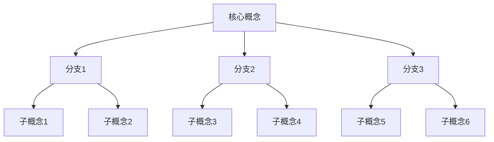

# 🗺️ {{title}} MOC

> 这是关于{{title}}主题的内容地图（Map of Content），用于组织和导航相关知识。

## 📌 概述

### 主题说明
{{description}}

### 为什么重要？

### 核心问题
1. 
2. 
3. 

## 🏗️ 知识结构

### 基础概念
- [[概念1]] - 简要说明
- [[概念2]] - 简要说明
- [[概念3]] - 简要说明
- [[概念4]] - 简要说明

### 核心理论
- [[理论1]] - 关键点说明
- [[理论2]] - 关键点说明
- [[理论3]] - 关键点说明

### 重要人物
- [[人物1]] - 主要贡献
- [[人物2]] - 主要贡献
- [[人物3]] - 主要贡献

## 📚 学习路径

### 🌱 入门级
1. [[入门资源1]] - 推荐理由
2. [[入门资源2]] - 推荐理由
3. [[入门资源3]] - 推荐理由

### 🌿 进阶级
1. [[进阶资源1]] - 关键内容
2. [[进阶资源2]] - 关键内容
3. [[进阶资源3]] - 关键内容

### 🌳 高级
1. [[高级资源1]] - 深度内容
2. [[高级资源2]] - 深度内容
3. [[高级资源3]] - 深度内容

## 🔗 相关主题

### 上位概念
- [[更广泛的主题1]]
- [[更广泛的主题2]]

### 平行概念
- [[相关主题1]] - 关联说明
- [[相关主题2]] - 关联说明
- [[相关主题3]] - 关联说明

### 下位概念
- [[子主题1]] - 具体应用
- [[子主题2]] - 具体应用
- [[子主题3]] - 具体应用

## 💡 关键见解

### 核心原则
1. **原则1**：
   - 解释：
   - 应用：

2. **原则2**：
   - 解释：
   - 应用：

3. **原则3**：
   - 解释：
   - 应用：

### 常见误区
- **误区1**：正确理解应该是...
- **误区2**：正确理解应该是...
- **误区3**：正确理解应该是...

## 📊 思维模型

## 🎯 实践应用

### 应用场景
1. **场景1**：
   - 具体应用：
   - 相关笔记：[[实践案例1]]

2. **场景2**：
   - 具体应用：
   - 相关笔记：[[实践案例2]]

### 工具与方法
- [[工具1]] - 使用场景
- [[方法1]] - 适用情况
- [[框架1]] - 应用范围

## 📝 个人笔记

### 学习历程
- [[学习笔记1]] - {{date}}
- [[学习笔记2]] - {{date}}
- [[学习笔记3]] - {{date}}

### 项目实践
- [[项目1]] - 应用情况
- [[项目2]] - 应用情况

### 反思总结
- [[阶段总结1]]
- [[阶段总结2]]

## 🔍 待探索

### 未解决的问题
1. 
2. 
3. 

### 计划学习
- [ ] 主题1
- [ ] 主题2
- [ ] 主题3

### 相关资源
- 书籍：
- 课程：
- 网站：
- 工具：

## 📈 更新日志

### {{date:YYYY-MM-DD}}
- 添加了...
- 更新了...
- 调整了...

---
**标签**：#MOC #{{title}} #index
**相关MOC**：[[主MOC]] | [[相关MOC1]] | [[相关MOC2]]
**创建日期**：{{date:YYYY-MM-DD}}
**最后更新**：{{date:YYYY-MM-DD}}
