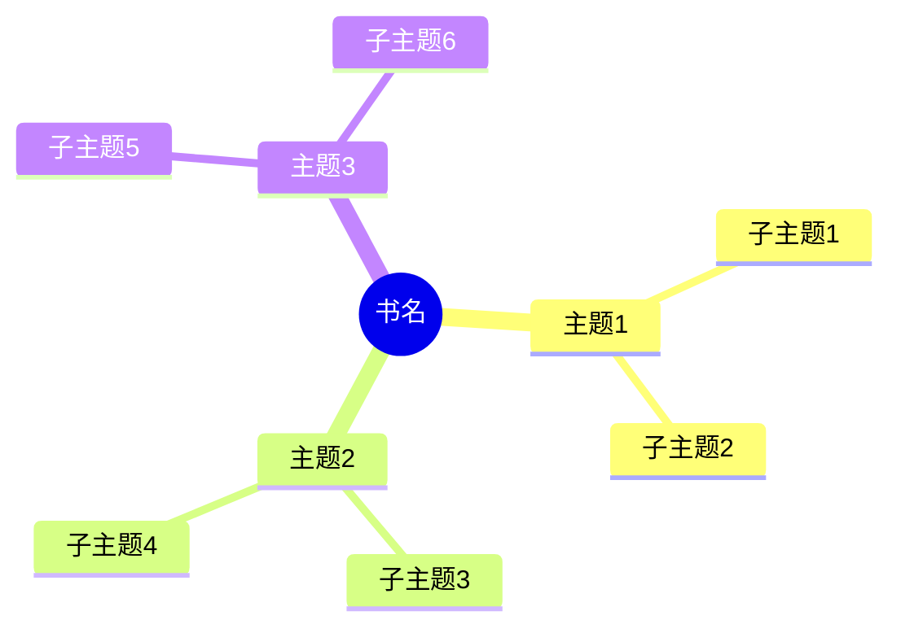

# 📚 {{title}}

## 📖 图书信息

### 基本信息
- **作者**：{{author}}
- **译者**：
- **出版社**：
- **出版年份**：
- **ISBN**：
- **页数**：
- **分类**：#book/{{category}} （如：技术/管理/心理/哲学/文学）

### 阅读信息
- **阅读状态**：#reading/planning （planning/reading/completed）
- **开始日期**：{{date:YYYY-MM-DD}}
- **完成日期**：
- **阅读次数**：第1次
- **推荐指数**：⭐⭐⭐⭐⭐

### 为什么读这本书？

## 🎯 核心内容

### 一句话总结
> 

### 核心观点
1. **观点一**：
   - 论述：
   - 例证：

2. **观点二**：
   - 论述：
   - 例证：

3. **观点三**：
   - 论述：
   - 例证：

### 关键概念
- **概念1**：定义和解释
- **概念2**：定义和解释
- **概念3**：定义和解释

### 重要数据/研究
- 

## 💭 思考与联系

### 与已有知识的联系
- 与[[相关笔记1]]的关系：
- 与[[相关笔记2]]的关系：
- 与[[相关笔记3]]的关系：

### 引发的思考
1. **问题1**：
   - 我的思考：

2. **问题2**：
   - 我的思考：

### 可能的应用场景
- **场景1**：
- **场景2**：
- **场景3**：

## 📝 金句摘录

> 第一条引用内容。
> —— 第X页

> 第二条引用内容。
> —— 第X页

> 第三条引用内容。
> —— 第X页

## 📋 章节笔记

### 第一章：章节标题
**主要内容**：

**关键要点**：
- 
- 

**个人理解**：

### 第二章：章节标题
**主要内容**：

**关键要点**：
- 
- 

**个人理解**：

## 🔍 批判性思考

### 作者的局限性
- 

### 值得质疑的观点
- 

### 不同的视角
- 

## 📊 知识结构图

## 🎬 行动计划

### 可以立即实践的
1. 
2. 
3. 

### 需要进一步学习的
- 
- 

### 想要深入研究的主题
- 
- 

## 🔗 延伸阅读

### 作者的其他作品
- 

### 相关主题书籍
- 

### 引用的重要文献
- 

## 💡 个人感悟

### 最大的收获

### 改变了我什么认知

### 一年后想要回顾的内容

---
**标签**：#book #reading #{{author}} #{{category}}
**相关笔记**：[[读书清单]] | [[主题MOC]]
**创建时间**：{{date:YYYY-MM-DD HH:mm}}
**最后更新**：{{date:YYYY-MM-DD HH:mm}}
