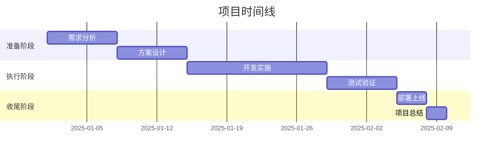

# 项目：{{title}}

## 📋 项目概览

### 基本信息
- **项目状态**：#project/planning （planning/active/on-hold/completed）
- **优先级**：🔥🔥🔥（高/中/低）
- **开始日期**：{{date:YYYY-MM-DD}}
- **预计完成**：
- **实际完成**：
- **项目负责人**：
- **相关人员**：

### 项目背景
**为什么要做这个项目？**


**项目的价值和意义：**


## 🎯 目标与成果

### 项目目标
1. **主要目标**：
2. **次要目标**：
3. **延伸目标**：

### 成功标准
- [ ] 标准1：
- [ ] 标准2：
- [ ] 标准3：

### 预期成果
1. 
2. 
3. 

## 📊 范围与约束

### 项目范围
**包含内容**：
- 
- 

**不包含内容**：
- 
- 

### 约束条件
- **时间约束**：
- **预算约束**：
- **资源约束**：
- **技术约束**：

## 🗓️ 里程碑计划

### 阶段划分


### 关键里程碑
- [ ] **里程碑1**：（日期）
- [ ] **里程碑2**：（日期）
- [ ] **里程碑3**：（日期）
- [ ] **里程碑4**：（日期）

## ✅ 任务分解

### 准备阶段
- [ ] 任务1
- [ ] 任务2
- [ ] 任务3

### 执行阶段
- [ ] 任务1
- [ ] 任务2
- [ ] 任务3

### 收尾阶段
- [ ] 任务1
- [ ] 任务2
- [ ] 任务3

## 🔗 相关资源

### 文档资料
- [[需求文档]]
- [[设计方案]]
- [[技术文档]]

### 会议记录
- [[项目启动会]]
- [[周例会记录]]

### 参考资料
- 
- 

## 💬 沟通记录

### 重要决策
| 日期 | 决策内容 | 参与人 | 结果 |
|------|---------|--------|------|
|      |         |        |      |

### 问题与风险
| 类型 | 描述 | 影响 | 应对措施 | 状态 |
|------|------|------|---------|------|
| 风险 |      |      |         |      |
| 问题 |      |      |         |      |

## 📈 进度追踪

### 整体进度：[▓▓▓▓▓▓░░░░] 60%

### 每周更新
```dataview
TABLE 
  date as "日期",
  progress as "进度",
  summary as "本周总结"
FROM #project/{{title}}
WHERE type = "weekly-update"
SORT date DESC
```

## 📝 项目日志

### {{date:YYYY-MM-DD}}
**今日进展**：

**遇到问题**：

**明日计划**：

---

## 🎉 项目总结

### 项目成果

### 经验教训

### 后续计划

---
**标签**：#project #{{title}} #status/planning
**相关链接**：[[项目清单]] | [[项目模板]]
