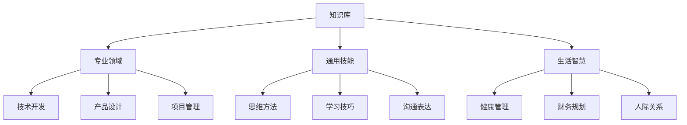

# 🏠 知识库主页

> 欢迎来到我的数字花园！这里是所有知识的起点和导航中心。

## 🧭 快速导航

### 📅 时间线
- [[2025年6月]] - 当前月份
- [[第25周回顾]] - 本周回顾
- 今日：{{date:YYYY-MM-DD}}

### 🎯 当前聚焦
- [ ] 重点项目1
- [ ] 重点项目2
- [ ] 重点项目3

### ⚡ 快速入口
- [[使用指南]] - 系统使用说明
- [[01-Inbox]] - 收集箱
- [[任务看板]] - 所有任务总览
- [[项目清单]] - 活跃项目列表

## 🗺️ 知识地图

### 📚 主题索引
- [[技术学习 MOC]] - 编程、工具、框架
- [[个人成长 MOC]] - 自我提升、习惯养成
- [[工作项目 MOC]] - 职业发展、项目管理
- [[阅读笔记 MOC]] - 书籍、文章、课程
- [[生活记录 MOC]] - 日常、旅行、感悟

### 🏛️ 知识体系


## 📊 仪表盘

### 笔记统计
```dataview
TABLE 
  length(rows) as 数量
FROM ""
GROUP BY folder
SORT length(rows) DESC
```

### 最近更新
```dataview
TABLE 
  file.mtime as "更新时间"
FROM ""
WHERE file.mtime >= date(today) - dur(7 days)
SORT file.mtime DESC
LIMIT 10
```

### 待办事项
```dataview
TASK
WHERE !completed AND text != ""
LIMIT 10
SORT priority DESC
```

## 🌱 成长追踪

### 本月目标进度
- [ ] 目标1：进度 [▓▓▓▓▓░░░░░] 50%
- [ ] 目标2：进度 [▓▓▓▓▓▓▓░░░] 70%
- [ ] 目标3：进度 [▓▓░░░░░░░░] 20%

### 习惯打卡（本周）
| 习惯 | 一 | 二 | 三 | 四 | 五 | 六 | 日 |
|------|----|----|----|----|----|----|----|
| 早起 | ✅ | ✅ | ✅ | ⬜ | ⬜ | ⬜ | ⬜ |
| 运动 | ✅ | ❌ | ✅ | ⬜ | ⬜ | ⬜ | ⬜ |
| 阅读 | ✅ | ✅ | ❌ | ⬜ | ⬜ | ⬜ | ⬜ |
| 写作 | ✅ | ✅ | ✅ | ⬜ | ⬜ | ⬜ | ⬜ |

## 💎 精华内容

### 🌟 星标笔记
- [[重要笔记1]] - 核心观点
- [[重要笔记2]] - 关键发现
- [[重要笔记3]] - 深度思考

### 💡 最近的灵感
- 想法1：...
- 想法2：...
- 想法3：...

### 📖 在读书籍
1. 《书名1》 - 进度 60%
2. 《书名2》 - 进度 30%
3. 《书名3》 - 刚开始

## 🔍 探索

### 问题思考
- [ ] 问题1：如何...？
- [ ] 问题2：为什么...？
- [ ] 问题3：什么是...？

### 学习计划
- [ ] 本周：完成 XX 课程第 3 章
- [ ] 本月：读完《XX》并整理笔记
- [ ] 本季：掌握 XX 技能

### 项目想法
- 💡 项目创意1
- 💡 项目创意2
- 💡 项目创意3

## 🔧 系统优化

### 工作流改进
- [ ] 优化每日笔记模板
- [ ] 完善项目管理流程
- [ ] 建立知识回顾机制

### 待建立的 MOC
- [ ] 具体主题 MOC
- [ ] 时间段 MOC
- [ ] 项目类 MOC

## 📝 备忘

### 重要日期
- 📅 事件1：2025-06-20
- 📅 事件2：2025-06-25
- 📅 事件3：2025-07-01

### 常用链接
- 🔗 [工具网站1](https://example.com)
- 🔗 [资源网站2](https://example.com)
- 🔗 [参考网站3](https://example.com)

---

> "花园不是一天建成的，但每天的浇灌都很重要。" 

**最后更新**：{{date:YYYY-MM-DD HH:mm}}
