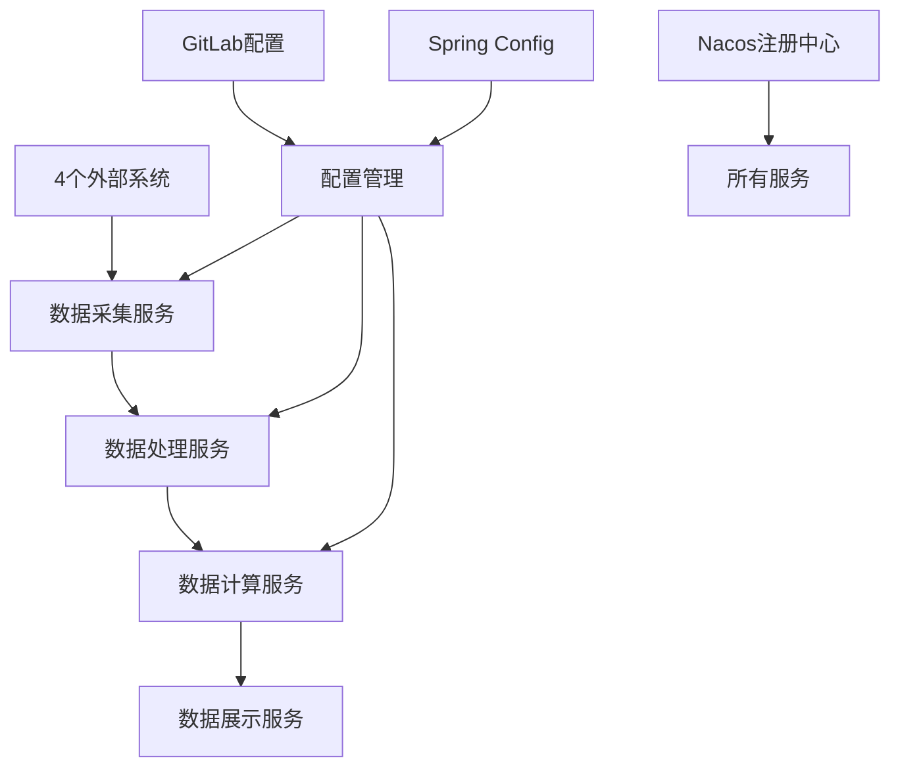
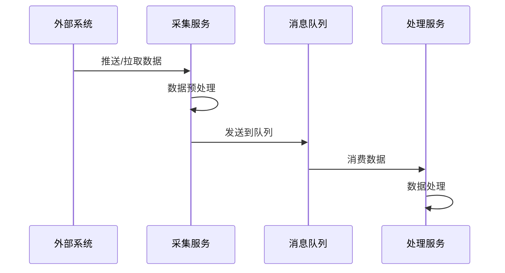
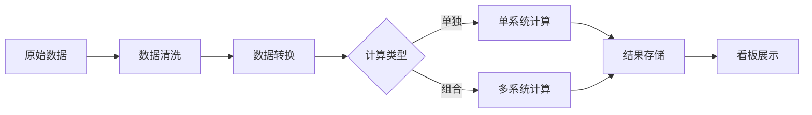

# 🏗️ 企业级数据平台微服务架构设计

## 📋 架构概述

基于Spring Cloud + Nacos + 数据采集处理的企业级微服务架构，支持多系统数据采集、实时处理、智能计算和可视化展示。

## 🎯 业务场景分析

### 核心业务流程


### 数据处理模式
- **全量采集**: 完整数据同步
- **增量采集**: 基于时间戳/版本号的增量更新
- **版本控制**: 支持小版本选择性采集
- **独立计算**: 单系统数据独立处理
- **组合计算**: 多系统数据联合分析
- **部分更新**: 支持局部数据重新计算

## 🏗️ 3级微服务架构设计

### 第1级：平台级 (platform-*)
```
platform-parent (父POM)
├── platform-common (公共模块)
├── platform-security (安全模块)  
├── platform-gateway (网关模块)
├── platform-infrastructure (基础设施)
├── platform-business (业务模块)
├── platform-starters (启动器)
└── platform-ops (运维监控)
```

### 第2级：功能域级 (各类公共模块)
```
platform-common/
├── platform-common-core (核心工具)
├── platform-common-web (Web公共)
├── platform-common-database (数据库公共)
├── platform-common-redis (Redis公共)
├── platform-common-mq (消息队列公共)
└── platform-common-log (日志公共)

platform-business/
├── platform-business-collect (采集域)
├── platform-business-process (处理域)
├── platform-business-compute (计算域)
├── platform-business-display (展示域)
└── platform-business-config (配置域)
```

### 第3级：具体业务模块
```
platform-business-collect/
├── collect-system-a (系统A采集)
├── collect-system-b (系统B采集)
├── collect-system-c (系统C采集)
├── collect-system-d (系统D采集)
└── collect-gateway (采集网关)

platform-business-process/
├── process-clean (数据清洗)
├── process-transform (数据转换)
├── process-validate (数据校验)
└── process-store (数据存储)

platform-business-compute/
├── compute-single (单独计算)
├── compute-combine (组合计算)
├── compute-realtime (实时计算)
└── compute-batch (批量计算)

platform-business-display/
├── display-dashboard (看板展示)
├── display-report (报表服务)
├── display-api (展示API)
└── display-export (数据导出)
```

## 🚀 服务部署策略建议

### 方案A：一服务一应用 (推荐)
```yaml
# 每个三级模块独立部署
collect-system-a: 独立Pod/容器
collect-system-b: 独立Pod/容器
process-clean: 独立Pod/容器
compute-single: 独立Pod/容器
```

**优势**:
- ✅ 独立扩缩容
- ✅ 故障隔离
- ✅ 技术栈灵活
- ✅ 部署灵活

**适用场景**: 数据量大、并发高、需要独立扩展

### 方案B：聚合部署
```yaml
# 按业务域聚合
collect-services: [system-a, system-b, system-c, system-d]
process-services: [clean, transform, validate, store]
compute-services: [single, combine, realtime, batch]  
display-services: [dashboard, report, api, export]
```

**优势**:
- ✅ 资源节约
- ✅ 部署简单
- ✅ 内部调用高效

**适用场景**: 数据量适中、资源有限、业务耦合度高

## 🛠️ 技术架构栈

### 核心框架
- **Spring Boot 3.2.x** + **JDK 21**
- **Spring Cloud 2023.x** (Gateway, Config, LoadBalancer)
- **Spring Cloud Alibaba** (Nacos)

### 注册与配置
- **Nacos 2.x**: 服务注册发现 + 配置管理
- **Spring Cloud Config**: 配置服务
- **GitLab**: 配置仓库

### 数据存储
- **MySQL 8.0**: 主业务数据
- **MongoDB 7.x**: 文档数据、日志
- **Redis 7.x**: 缓存、会话
- **InfluxDB**: 时序数据(可选)

### 消息队列
- **RabbitMQ**: 业务消息
- **Kafka**: 大数据流处理
- **RocketMQ**: 事务消息(可选)

### 监控运维
- **Prometheus + Grafana**: 监控告警
- **ELK Stack**: 日志收集分析
- **SkyWalking**: 链路追踪
- **Spring Boot Admin**: 应用监控

## 📦 Docker & K8s 部署

### 容器化策略
```dockerfile
# 基础镜像：每个服务独立镜像
FROM openjdk:21-jdk-alpine
COPY target/*.jar app.jar
EXPOSE 8080
ENTRYPOINT ["java", "-jar", "/app.jar"]
```

### K8s 部署清单
```yaml
# 每个微服务的部署配置
apiVersion: apps/v1
kind: Deployment
metadata:
  name: collect-system-a
spec:
  replicas: 2
  selector:
    matchLabels:
      app: collect-system-a
  template:
    metadata:
      labels:
        app: collect-system-a
    spec:
      containers:
      - name: collect-system-a
        image: platform/collect-system-a:latest
        ports:
        - containerPort: 8080
        env:
        - name: SPRING_PROFILES_ACTIVE
          value: "k8s"
        - name: NACOS_SERVER_ADDR
          value: "nacos:8848"
```

## 🔧 配置管理策略

### 配置层级设计
```
GitLab配置仓库/
├── application.yml (全局配置)
├── application-dev.yml (开发环境)
├── application-test.yml (测试环境) 
├── application-prod.yml (生产环境)
├── gateway.yml (网关配置)
├── collect-system-a.yml (系统A采集配置)
├── collect-system-b.yml (系统B采集配置)
├── process-clean.yml (数据清洗配置)
└── compute-single.yml (单独计算配置)
```

### 动态配置热更新
```yaml
# Nacos配置示例
spring:
  cloud:
    nacos:
      config:
        server-addr: ${nacos.server.addr}
        file-extension: yml
        group: ${spring.profiles.active}
        refresh-enabled: true
```

## 🔄 数据流转架构

### 采集层数据流


### 计算层数据流


## 🎮 启动器设计

### 通用启动器
```java
@SpringBootApplication
@EnableEurekaClient
@EnableConfigurationProperties
public class PlatformApplication {
    public static void main(String[] args) {
        // 通用启动逻辑
        new SpringApplicationBuilder(PlatformApplication.class)
            .banner(new PlatformBanner())
            .run(args);
    }
}
```

### 组件自动配置
```java
@Configuration
@ConditionalOnProperty(name = "platform.redis.enabled", havingValue = "true")
public class RedisAutoConfiguration {
    // Redis配置
}

@Configuration  
@ConditionalOnProperty(name = "platform.mq.type", havingValue = "rabbitmq")
public class RabbitMQAutoConfiguration {
    // RabbitMQ配置
}
```

## 📊 监控告警体系

### 业务监控指标
- **采集指标**: 采集成功率、数据量、延迟
- **处理指标**: 处理速度、错误率、积压量
- **计算指标**: 计算耗时、资源使用、准确率
- **展示指标**: 访问量、响应时间、并发数

### 告警规则
```yaml
# Prometheus告警规则
groups:
- name: platform-alerts
  rules:
  - alert: CollectServiceDown
    expr: up{job="collect-service"} == 0
    for: 1m
    annotations:
      summary: "采集服务不可用"
      
  - alert: ProcessQueueHigh
    expr: rabbitmq_queue_messages > 1000
    for: 5m
    annotations:
      summary: "处理队列积压过多"
```

## 🚀 部署建议

### 开发环境
```bash
# 启动基础设施
docker-compose up -d mysql redis rabbitmq nacos

# 启动网关
cd platform-gateway && mvn spring-boot:run

# 启动业务服务
cd platform-business-collect && mvn spring-boot:run
cd platform-business-process && mvn spring-boot:run
```

### 生产环境
```bash
# K8s部署
kubectl apply -f k8s/infrastructure/
kubectl apply -f k8s/services/
kubectl apply -f k8s/monitoring/
```

这个架构支持您提到的所有需求：多系统采集、版本控制、数据处理、智能计算和看板展示，同时具备企业级的可扩展性和可维护性。 