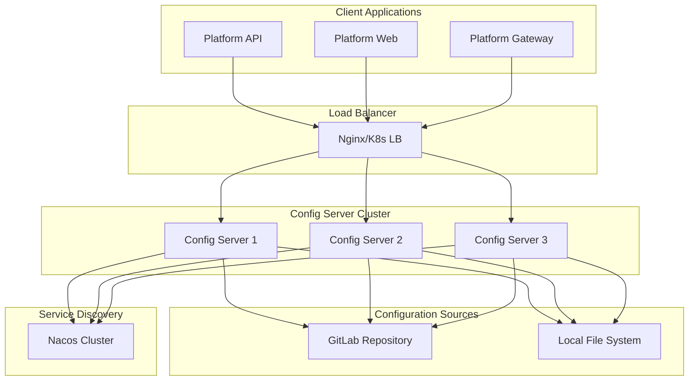

# Platform Config Server 架构文档

## 项目概述

Platform Config Server 是一个企业级分布式配置中心服务，基于Spring Cloud Config构建，支持GitLab集成、本地fallback和多环境部署。

### 核心特性

- ✅ **多配置源支持**: GitLab + 本地文件 fallback
- ✅ **环境隔离**: dev、test、pub 三环境配置管理
- ✅ **配置加密**: 敏感信息自动加密存储
- ✅ **动态刷新**: 运行时配置热更新
- ✅ **版本管理**: 基于Git的配置版本控制
- ✅ **集群部署**: 支持Docker单机、集群和Kubernetes部署
- ✅ **自动备份**: 配置文件自动备份和恢复机制
- ✅ **安全认证**: Basic Auth + JWT双重保护

## 架构设计

### 系统架构图



### 配置文件层次结构

```
config-repository/
├── common/                     # 公共配置层
│   ├── common/                 # 全环境公共配置
│   │   └── application.yml     # 基础配置(数据源、Redis、日志等)
│   ├── dev/                    # 开发环境公共配置
│   │   └── application-dev.yml # 开发环境特定配置
│   ├── test/                   # 测试环境公共配置
│   │   └── application-test.yml# 测试环境特定配置
│   └── pub/                    # 生产环境公共配置
│       └── application-pub.yml # 生产环境特定配置
├── platform-api/              # API服务配置
│   ├── common/                 # API服务通用配置
│   │   └── application.yml     # API服务基础配置
│   ├── dev/                    # API服务开发环境
│   │   └── application-dev.yml # API开发环境配置
│   ├── test/                   # API服务测试环境
│   │   └── application-test.yml# API测试环境配置
│   └── pub/                    # API服务生产环境
│       └── application-pub.yml # API生产环境配置
└── platform-gateway/          # 网关服务配置
    ├── common/
    ├── dev/
    ├── test/
    └── pub/
```

### 配置优先级

1. `{application}/{profile}/application-{profile}.yml` (最高优先级)
2. `{application}/common/application.yml`
3. `common/{profile}/application-{profile}.yml`
4. `common/common/application.yml` (最低优先级)

## 部署架构

### 1. Docker 单机部署

**适用场景**: 开发环境、小型项目

```yaml
# docker-compose.yml
version: '3.8'
services:
  config-server:
    image: platform/config-server:latest
    ports:
      - "8888:8888"
    environment:
      - CONFIG_GIT_URI=https://gitlab.example.com/config/platform-config.git
      - NACOS_SERVER_ADDR=nacos:8848
    volumes:
      - ./config-repository:/app/config:ro
    depends_on:
      - nacos
      - mysql
```

**特点**:
- 单实例部署
- 本地存储
- 快速启动
- 资源占用少

### 2. Docker 集群部署 (Swarm)

**适用场景**: 测试环境、中型项目

```yaml
# docker-stack.yml
version: '3.8'
services:
  config-server:
    image: platform/config-server:latest
    deploy:
      replicas: 3
      restart_policy:
        condition: on-failure
    environment:
      - CONFIG_GIT_URI=https://gitlab.example.com/config/platform-config.git
    secrets:
      - config-git-username
      - config-git-password
```

**特点**:
- 多实例高可用
- 自动故障转移
- 负载均衡
- 滚动更新

### 3. Kubernetes 部署

**适用场景**: 生产环境、大型项目

```yaml
# k8s deployment
apiVersion: apps/v1
kind: Deployment
metadata:
  name: platform-config-server
spec:
  replicas: 3
  selector:
    matchLabels:
      app: config-server
  template:
    spec:
      containers:
      - name: config-server
        image: platform/config-server:latest
        resources:
          requests:
            memory: "512Mi"
            cpu: "250m"
          limits:
            memory: "1Gi"
            cpu: "500m"
```

**特点**:
- 容器编排
- 自动扩缩容
- 健康检查
- 服务发现
- 持久化存储

## 环境配置

### 开发环境 (dev)

**特点**:
- 调试模式开启
- 详细日志输出
- 数据库DDL自动更新
- 热重载支持

**配置示例**:
```yaml
platform:
  env: dev
  debug: true
  database:
    show-sql: true
    format-sql: true
logging:
  level:
    com.platform: DEBUG
    org.springframework.web: DEBUG
```

### 测试环境 (test)

**特点**:
- 性能测试模式
- 模拟数据支持
- 集群模式部署
- 自动化测试集成

**配置示例**:
```yaml
platform:
  env: test
  debug: false
  test:
    mock-enabled: true
    data-reset-enabled: true
    performance-test: true
redis:
  cluster:
    nodes: redis-cluster-1:6379,redis-cluster-2:6379,redis-cluster-3:6379
```

### 生产环境 (pub)

**特点**:
- 安全加固模式
- 配置加密存储
- 集群高可用
- 监控告警完备

**配置示例**:
```yaml
platform:
  env: prod
  debug: false
  security:
    encryption-enabled: true
    audit-enabled: true
    rate-limit-enabled: true
  monitoring:
    metrics-enabled: true
    tracing-enabled: true
    alerting-enabled: true
```

## 技术栈

### 核心框架
- **Spring Boot 3.2.1**: 应用框架
- **Spring Cloud Config**: 配置中心核心
- **Spring Security**: 安全认证
- **Spring Boot Actuator**: 监控管理

### 配置存储
- **GitLab**: 主配置源
- **Local File System**: Fallback配置源
- **Spring Cloud Config Encryption**: 配置加密

### 服务发现
- **Nacos**: 服务注册与发现
- **Spring Cloud LoadBalancer**: 客户端负载均衡

### 容器化
- **Docker**: 容器化部署
- **Docker Swarm**: 集群编排
- **Kubernetes**: 云原生部署

### 监控工具
- **Micrometer**: 指标收集
- **Prometheus**: 指标存储
- **Grafana**: 可视化监控

## API 接口设计

### 标准配置获取API

```http
# 获取应用配置
GET /config/{application}/{profile}[/{label}]

# 示例
GET /config/platform-api/dev/main
GET /config/platform-gateway/test/v1.0
```

### 管理API

```http
# 配置管理
POST /config/management/refresh/{application}      # 刷新配置
POST /config/management/switch-source?source=native # 切换配置源
GET  /config/management/status                     # 获取状态
POST /config/management/sync-to-gitlab            # 同步到GitLab
POST /config/management/backup                    # 备份配置

# 配置加密
POST /config/encrypt                              # 加密数据
POST /config/decrypt                              # 解密数据
```

### 监控API

```http
# 健康检查
GET /config/actuator/health

# 性能指标
GET /config/actuator/metrics
GET /config/actuator/prometheus

# 配置信息
GET /config/actuator/configprops
GET /config/actuator/env
```

## 安全策略

### 认证机制
1. **Basic Authentication**: 基础HTTP认证
2. **Token验证**: JWT token支持
3. **IP白名单**: 访问源IP限制

### 配置加密
```yaml
# 加密敏感配置
spring:
  datasource:
    password: '{cipher}AQBFrz8w7QczLJ5Lj9CK8DH6...'
  redis:
    password: '{cipher}AQCTxK9L2mJ8Hd3Nf5Pg7R1s...'
```

### 网络安全
- HTTPS传输加密
- 防火墙规则配置
- VPN网络隔离
- 访问日志审计

## 监控告警

### 核心指标

**应用指标**:
- JVM内存使用率
- GC频率和耗时
- 线程池状态
- HTTP请求统计

**业务指标**:
- 配置获取请求数
- 配置刷新成功率
- GitLab连接状态
- 配置加载耗时

**基础设施指标**:
- CPU使用率
- 内存使用率
- 磁盘IO
- 网络带宽

### 告警规则

```yaml
# Prometheus告警规则
groups:
- name: config-server
  rules:
  - alert: ConfigServerDown
    expr: up{job="config-server"} == 0
    for: 1m
    labels:
      severity: critical
    annotations:
      summary: "Config Server is down"
      
  - alert: HighMemoryUsage
    expr: jvm_memory_used_bytes{area="heap"} / jvm_memory_max_bytes{area="heap"} > 0.9
    for: 5m
    labels:
      severity: warning
    annotations:
      summary: "High memory usage detected"
```

## 运维管理

### 部署流程

1. **构建阶段**
   ```bash
   # 编译打包
   mvn clean package -DskipTests
   
   # 构建镜像
   docker build -t platform/config-server:v1.0.0 .
   ```

2. **部署阶段**
   ```bash
   # Docker单机
   ./scripts/deploy.sh docker-single -e dev
   
   # Docker集群
   ./scripts/deploy.sh docker-cluster -e test
   
   # Kubernetes
   ./scripts/deploy.sh k8s -e pub -n production
   ```

3. **验证阶段**
   ```bash
   # 健康检查
   curl http://config-server:8888/config/actuator/health
   
   # 配置获取测试
   curl http://config-server:8888/config/platform-api/dev
   ```

### 故障处理

**常见故障及解决方案**:

1. **GitLab连接失败**
   - 检查网络连通性
   - 验证认证信息
   - 切换到本地配置源

2. **配置获取超时**
   - 检查服务实例状态
   - 验证配置文件格式
   - 增加超时时间配置

3. **内存溢出**
   - 调整JVM堆内存大小
   - 检查配置文件大小
   - 优化配置缓存策略

### 备份恢复

**自动备份**:
```yaml
# 定时备份配置
platform:
  config:
    backup:
      enabled: true
      schedule: "0 0 2 * * ?"  # 每天凌晨2点
      retention: 30            # 保留30天
```

**手动备份**:
```bash
# 备份配置
curl -X POST http://config-server:8888/config/management/backup \
  -u config-admin:config-admin-2024

# 恢复配置
cp -r /backup/config-20241201/* /app/config/
curl -X POST http://config-server:8888/config/management/refresh/platform-api
```

## 性能优化

### JVM调优
```bash
# 生产环境JVM参数
JAVA_OPTS="-Xms1g -Xmx2g \
           -XX:NewRatio=1 \
           -XX:MaxMetaspaceSize=256m \
           -XX:+UseG1GC \
           -XX:+PrintGCDetails \
           -XX:+PrintGCTimeStamps"
```

### 连接池优化
```yaml
spring:
  datasource:
    hikari:
      maximum-pool-size: 20
      minimum-idle: 5
      connection-timeout: 30000
      idle-timeout: 600000
      max-lifetime: 1800000
```

### 缓存策略
```yaml
spring:
  cloud:
    config:
      server:
        git:
          clone-on-start: true
          force-pull: true
          timeout: 30
          cache-size: 50
```

## 扩展性设计

### 水平扩展
- 无状态服务设计
- 支持动态扩缩容
- 负载均衡支持
- 配置共享存储

### 插件化架构
- 自定义配置源
- 扩展加密算法
- 自定义刷新策略
- 第三方集成支持

## 版本规划

### v1.0.0 (当前版本)
- ✅ 基础配置服务
- ✅ GitLab集成
- ✅ 多环境支持
- ✅ Docker部署

### v1.1.0 (规划中)
- 🔄 配置变更通知
- 🔄 配置审批流程
- 🔄 可视化配置管理
- 🔄 配置diff工具

### v2.0.0 (未来)
- 📋 多租户支持
- 📋 配置模板系统
- 📋 AI配置推荐
- 📋 多云部署支持

## 快速开始

### 1. 克隆项目
```bash
git clone https://github.com/platform/config-server.git
cd platform-config
```

### 2. 本地开发
```bash
# 启动依赖服务
docker-compose -f docker-compose-deps.yml up -d

# 启动配置服务
mvn spring-boot:run -Dspring-boot.run.profiles=dev
```

### 3. 配置客户端
```yaml
# bootstrap.yml
spring:
  application:
    name: platform-api
  cloud:
    config:
      uri: http://localhost:8888/config
      username: config-admin
      password: config-admin-2024
      profile: dev
```

### 4. 访问服务
- **管理界面**: http://localhost:8888/config/swagger-ui.html
- **健康检查**: http://localhost:8888/config/actuator/health
- **配置获取**: http://localhost:8888/config/platform-api/dev

## 总结

Platform Config Server 提供了完整的企业级配置管理解决方案，支持：

1. **多配置源**: GitLab主配置 + 本地文件fallback
2. **多环境**: dev/test/pub环境完全隔离
3. **多部署**: Docker单机/集群/Kubernetes全覆盖
4. **高可用**: 集群部署、自动故障转移
5. **安全性**: 配置加密、访问认证、审计日志
6. **运维友好**: 自动备份、监控告警、故障恢复

通过统一的配置管理，大大简化了微服务架构下的配置复杂性，提高了系统的可维护性和可靠性。 