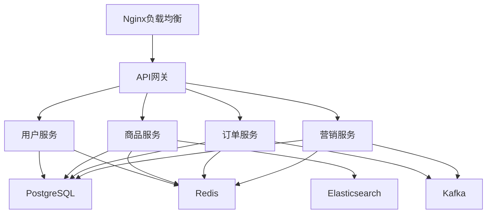

# 🚀 E-Commerce Platform

## 📋 项目概述

### 背景
> 为什么要做这个项目？

公司决定构建新一代电商平台，替代现有的单体应用。旧系统存在性能瓶颈、扩展困难、维护成本高等问题。

### 目标
> 项目要达成什么目标？

1. 构建高性能、可扩展的微服务架构电商平台
2. 支持日订单量100万+，并发用户10万+
3. 实现99.9%的系统可用性
4. 降低运维成本30%

### 范围
> 包含什么，不包含什么

**包含：**
- 用户服务（注册、登录、个人中心）
- 商品服务（商品管理、库存、搜索）
- 订单服务（下单、支付、物流）
- 营销服务（优惠券、活动）

**不包含：**
- 第三方商家入驻系统（Phase 2）
- 海外业务支持（Phase 2）
- 区块链积分系统（待定）

## 🛠 技术栈

### 前端
- 框架：Vue 3 + TypeScript
- UI库：Element Plus
- 状态管理：Pinia
- 构建工具：Vite

### 后端
- 语言：Go 1.21
- 框架：Gin + gRPC
- 数据库：PostgreSQL + Redis
- 消息队列：Kafka
- 搜索引擎：Elasticsearch

### 基础设施
- 容器化：Docker + Kubernetes
- 服务网格：Istio
- 监控：Prometheus + Grafana
- 日志：ELK Stack
- CI/CD：GitLab CI + ArgoCD

## 🏗 架构设计

### 系统架构


### 数据模型
```sql
-- 用户表
CREATE TABLE users (
    id UUID PRIMARY KEY,
    username VARCHAR(50) UNIQUE NOT NULL,
    email VARCHAR(100) UNIQUE NOT NULL,
    password_hash VARCHAR(255) NOT NULL,
    created_at TIMESTAMP DEFAULT CURRENT_TIMESTAMP,
    updated_at TIMESTAMP DEFAULT CURRENT_TIMESTAMP
);

-- 商品表
CREATE TABLE products (
    id UUID PRIMARY KEY,
    name VARCHAR(200) NOT NULL,
    description TEXT,
    price DECIMAL(10, 2) NOT NULL,
    stock INTEGER NOT NULL,
    category_id UUID,
    created_at TIMESTAMP DEFAULT CURRENT_TIMESTAMP
);
```

### API设计
| 端点 | 方法 | 描述 | 状态 |
|------|------|------|------|
| /api/v1/auth/register | POST | 用户注册 | ✅ |
| /api/v1/auth/login | POST | 用户登录 | ✅ |
| /api/v1/products | GET | 获取商品列表 | 🚧 |
| /api/v1/orders | POST | 创建订单 | ⏳ |

## 📊 进度管理

### 里程碑
- [x] M1: 需求分析完成 - 2024-11-15
- [x] M2: 架构设计完成 - 2024-11-30
- [x] M3: 用户服务MVP - 2024-12-15
- [ ] M4: 商品服务完成 - 2024-12-31
- [ ] M5: 订单服务完成 - 2025-01-15
- [ ] M6: 系统集成测试 - 2025-01-25
- [ ] M7: 上线发布 - 2025-01-31

### 任务分解
> 使用 #e-commerce-task 标签关联任务

#### Phase 1: 基础架构（已完成）
- [x] 搭建K8s集群 [[TASK-20241101-001]]
- [x] 配置CI/CD流水线 [[TASK-20241105-001]]
- [x] 搭建监控系统 [[TASK-20241108-001]]

#### Phase 2: 核心服务开发（进行中）
- [x] 用户服务
  - [x] 用户注册/登录 [[TASK-20241115-001]]
  - [x] JWT认证 [[TASK-20241120-001]]
  - [ ] 用户信息管理 [[TASK-20241218-001]]
- [ ] 商品服务
  - [x] 商品CRUD [[TASK-20241201-001]]
  - [ ] 商品搜索 [[TASK-20241220-001]]
  - [ ] 库存管理 [[TASK-20241222-001]]

#### Phase 3: 业务功能（待开始）
- [ ] 订单服务
- [ ] 支付集成
- [ ] 营销服务

## 📝 开发日志

### 2024-12-17 - JWT认证完成
- 完成了JWT token的生成和验证
- 添加了认证中间件
- 解决了token刷新的问题

### 2024-12-10 - 性能优化
- 优化了数据库查询，使用索引提升了50%的查询速度
- 引入Redis缓存热点数据
- 压测结果：单机QPS达到5000+

### 2024-12-01 - 商品服务启动
- 完成商品表设计
- 实现基础CRUD接口
- 集成Elasticsearch准备

## 🐛 问题追踪

### 已解决
| 日期 | 问题 | 解决方案 | 耗时 |
|------|------|----------|------|
| 12-15 | Redis缓存雪崩 | 添加缓存预热+随机过期时间 | 2h |
| 12-10 | gRPC连接超时 | 调整超时参数+连接池 | 3h |

### 待解决
- [ ] Elasticsearch中文分词效果不理想 [[ISSUE-001]]
- [ ] K8s Pod偶尔出现OOM [[ISSUE-002]]

## 📚 相关文档

### 项目文档
- [[E-Commerce-API-Doc]] - 接口文档
- [[E-Commerce-Deploy-Guide]] - 部署指南
- [[E-Commerce-Test-Plan]] - 测试计划

### 参考资料
- [微服务架构设计模式](https://microservices.io/patterns/)
- [Go微服务实战](https://example.com)
- [Kubernetes最佳实践](https://kubernetes.io/docs/concepts/)

### 代码仓库
- GitHub: https://github.com/company/e-commerce-platform
- 内部GitLab: https://gitlab.company.com/e-commerce

## 💡 经验总结

### 技术收获
- gRPC在微服务间通信的优势明显，但需要注意版本兼容
- Istio的流量管理功能强大，但学习曲线陡峭
- Go的并发模型非常适合高并发场景

### 踩坑记录
- PostgreSQL的UUID性能问题：使用uuid-ossp扩展
- Kafka消息重复消费：实现幂等性处理
- K8s资源限制设置不当导致频繁重启

### 最佳实践
- 使用OpenAPI规范先定义接口
- 每个服务独立的数据库，避免耦合
- 完善的监控和日志是必须的

## 📊 项目统计

### 代码统计
- 总代码行数：45,000+
- 测试覆盖率：78%
- 技术债务：中等

### 时间投入
- 预估时间：3个月
- 实际时间：进行中（1.5个月）
- 效率分析：整体进度符合预期

## 🎯 后续计划
- 引入服务熔断和限流
- 实现分布式事务解决方案
- 性能优化，目标QPS 10000+
- 准备容灾演练

---

## 快速链接
- [[Projects-Dashboard|返回项目看板]]
- [[E-Commerce-Meetings|会议记录]]
- [[E-Commerce-Weekly|项目周报]]

*最后更新: 2024-12-17 18:00*