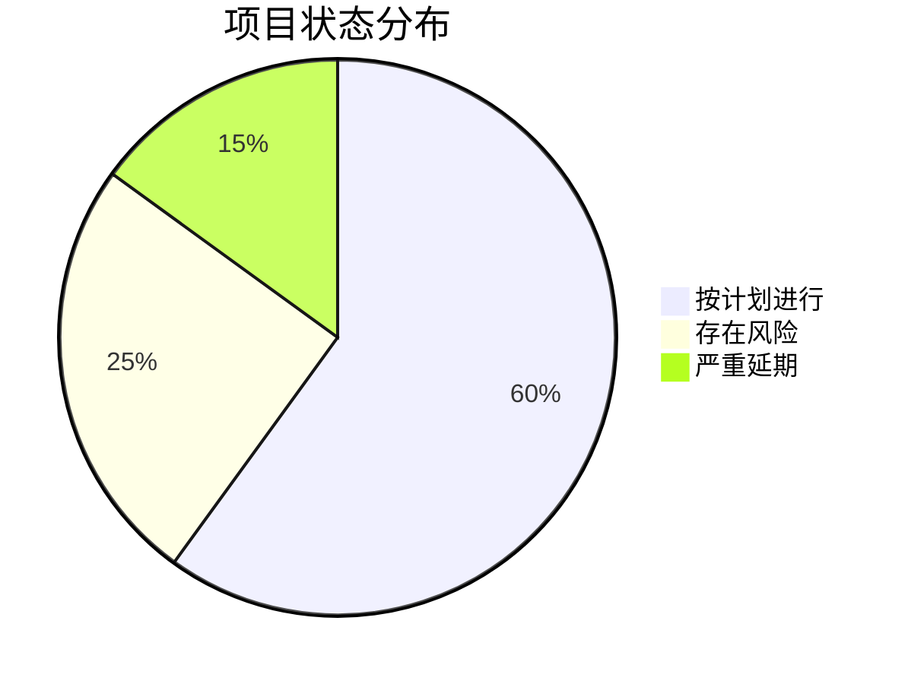
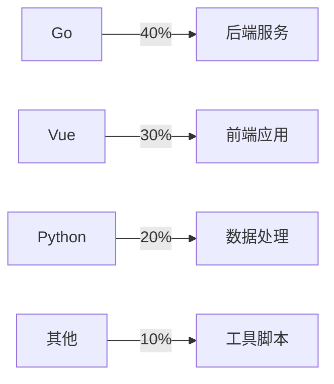

# 🎯 项目看板

## 📊 项目概览

### 🔥 进行中的项目
```dataview
TABLE 
  status as "状态",
  priority as "优先级",
  start-date as "开始",
  due-date as "截止",
  choice(status = "active", "🟢", choice(status = "on-hold", "🟡", "🔴")) as ""
FROM "02-Projects/Active"
WHERE type = "project"
SORT priority DESC, due-date ASC
```

### 💡 项目想法
```dataview
LIST
FROM "02-Projects/Ideas"
SORT file.ctime DESC
LIMIT 5
```

### 📦 已归档项目
```dataview
TABLE 
  completed as "完成日期",
  duration as "耗时"
FROM "02-Projects/Archive"
WHERE type = "project"
SORT completed DESC
LIMIT 10
```

## 📈 关键指标

### 本月统计
- **活跃项目数**: 3
- **完成项目数**: 2
- **平均完成时间**: 45天
- **按时完成率**: 85%

### 项目健康度


## ⚡ 快速访问

### 重点项目
- 🚀 [[E-Commerce-Platform]] - 电商平台重构
- 🔧 [[DevOps-Migration]] - DevOps工具链迁移
- 📱 [[Mobile-App-V2]] - 移动应用2.0

### 项目模板
- [[project-template|创建新项目]]
- [[project-checklist|项目检查清单]]

### 相关文档
- [[Project-Management-Guide|项目管理指南]]
- [[Tech-Stack-Standards|技术栈标准]]
- [[Code-Review-Guidelines|代码审查指南]]

## 🔄 最近更新

### 最近创建的任务
```dataview
TABLE 
  project as "所属项目",
  priority as "优先级",
  status as "状态"
FROM "02-Projects" or "04-Tasks"
WHERE contains(tags, "task")
SORT file.ctime DESC
LIMIT 10
```

### 最近完成的任务
```dataview
TABLE 
  project as "所属项目",
  completed as "完成时间"
FROM "02-Projects" or "04-Tasks"
WHERE status = "done"
SORT completed DESC
LIMIT 10
```

## 🎯 里程碑追踪

### Q4 2024 里程碑
- [x] 电商平台 - 用户服务上线
- [x] DevOps - CI/CD流水线搭建
- [ ] 移动应用 - Beta版本发布
- [ ] 数据平台 - 实时分析功能

### 即将到来的截止日期
```dataview
TABLE 
  due-date as "截止日期",
  priority as "优先级"
FROM "02-Projects" or "04-Tasks"
WHERE due-date != null AND due-date >= date(today) AND due-date <= date(today) + dur(14 days)
SORT due-date ASC
```

## 📊 资源分配

### 团队工作负载
| 成员 | 当前任务数 | 本周完成 | 负载状态 |
|------|------------|----------|----------|
| Alice | 5 | 3 | 🟡 正常 |
| Bob | 8 | 2 | 🔴 过载 |
| Carol | 4 | 4 | 🟢 良好 |

### 技术栈使用统计


## 🚨 风险和问题

### 高优先级问题
- 🔴 [[ISSUE-001]] - Elasticsearch性能问题
- 🟡 [[ISSUE-002]] - K8s资源不足
- 🟡 [[ISSUE-003]] - 第三方API限流

### 风险清单
| 风险 | 影响项目 | 可能性 | 影响度 | 缓解措施 |
|------|----------|--------|--------|----------|
| 核心开发人员离职 | All | 低 | 高 | 知识文档化 |
| 供应商API变更 | E-Commerce | 中 | 中 | 添加适配层 |

## 📅 会议和评审

### 本周会议安排
- 周一 10:00 - 项目周会
- 周三 14:00 - 技术评审会
- 周五 16:00 - Sprint回顾

### 待评审项目
```dataview
LIST
FROM "02-Projects"
WHERE contains(tags, "needs-review")
```

## 💡 改进建议
基于最近的项目执行情况，以下是一些改进建议：

1. **加强需求评审**：减少需求变更带来的返工
2. **引入自动化测试**：提高交付质量
3. **优化会议效率**：减少不必要的会议时间
4. **改进文档管理**：确保知识传承

---

## 🔗 快速链接
- [[daily-note|今日笔记]]
- [[weekly-review|周总结]]
- [[tech-notes|技术笔记]]

---
*看板更新时间：2024-12-17 18:00*
*下次更新：2024-12-18 09:00*