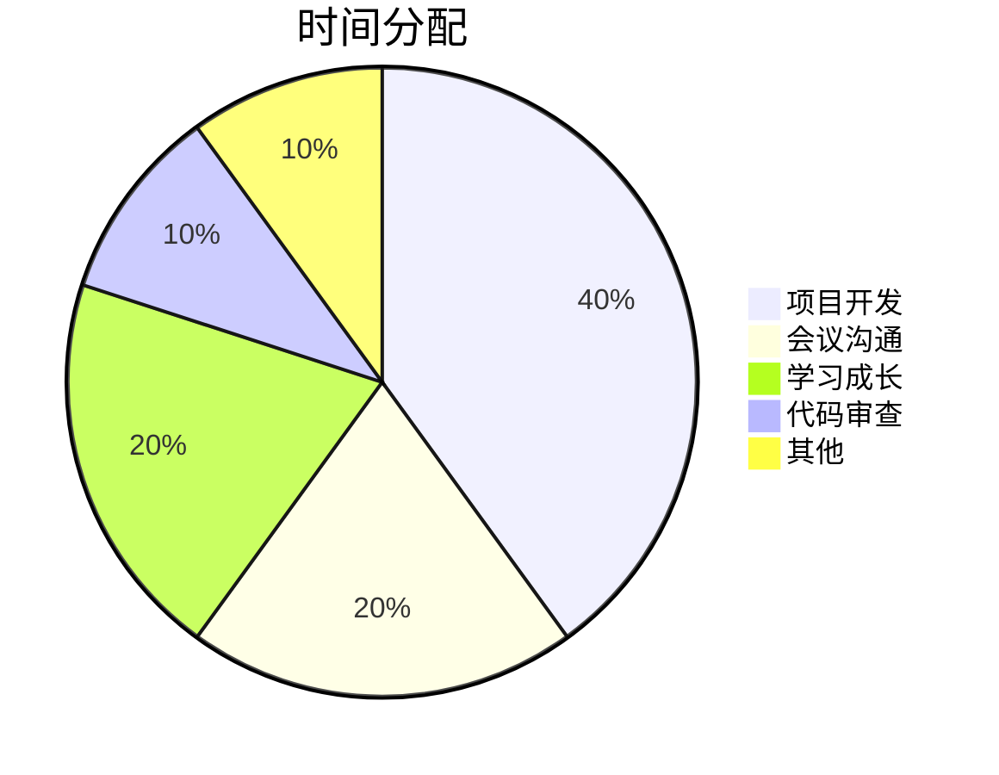

# 📅 {{date:YYYY年MM月}} 月度回顾

## 🎯 月度目标达成

### OKR完成情况
| Objective | Key Results | 完成度 | 说明 |
|-----------|-------------|--------|------|
| O1: {{objective}} | KR1: {{kr}} | {{percent}}% |  |
|  | KR2: {{kr}} | {{percent}}% |  |
|  | KR3: {{kr}} | {{percent}}% |  |

### 重点项目进展
```dataview
TABLE 
  status as "状态",
  start-date as "开始",
  due-date as "截止",
  choice(status = "completed", "✅", choice(status = "active", "🔄", "⏸️")) as "进度"
FROM "02-Projects"
WHERE file.ctime >= date("{{date:YYYY-MM}}-01")
SORT priority DESC
```

## 📊 月度数据分析

### 任务完成统计
| 类型 | 计划 | 完成 | 完成率 | 环比 |
|------|------|------|--------|------|
| 功能开发 |  |  | % | ↑% |
| Bug修复 |  |  | % | ↓% |
| 学习任务 |  |  | % | →% |
| 其他 |  |  | % | ↑% |

### 时间投入分析


### 效率指标
- **平均每日深度工作时间**：{{hours}}小时
- **任务平均完成时间**：{{days}}天
- **返工率**：{{percent}}%
- **代码提交频率**：{{commits}}/天

## 🏆 月度成就

### 🌟 重大成果
1. **成果1**
   - 描述：
   - 影响：
   - 学到了什么：

2. **成果2**
   - 描述：
   - 影响：
   - 学到了什么：

### 🛠 技术突破
- **掌握的新技术**：
- **解决的难题**：
- **优化的方案**：

### 📚 知识积累
- **完成的课程**：
- **阅读的书籍**：
- **写作的文章**：

## 💭 深度反思

### 本月做得最好的三件事
1. **事件**：
   - 为什么做得好：
   - 可以如何保持：

2. **事件**：
   - 为什么做得好：
   - 可以如何保持：

3. **事件**：
   - 为什么做得好：
   - 可以如何保持：

### 本月最大的三个教训
1. **教训**：
   - 根本原因：
   - 改进方案：
   - 预防措施：

2. **教训**：
   - 根本原因：
   - 改进方案：
   - 预防措施：

### 习惯养成情况
| 习惯 | 目标天数 | 实际天数 | 达成率 | 下月调整 |
|------|----------|----------|--------|----------|
| 早起 | 30 |  | % |  |
| 运动 | 20 |  | % |  |
| 阅读 | 30 |  | % |  |
| 冥想 | 20 |  | % |  |

## 🎯 下月规划

### 月度主题
> {{theme}} - {{description}}

### OKR设定
**Objective 1**: {{objective}}
- KR1: {{kr}} (目标值：{{target}})
- KR2: {{kr}} (目标值：{{target}})
- KR3: {{kr}} (目标值：{{target}})

### 重点项目
1. **项目名称**
   - 目标：
   - 里程碑：
   - 资源需求：

2. **项目名称**
   - 目标：
   - 里程碑：
   - 资源需求：

### 学习计划
- [ ] 技术1：{{tech}} - 目标：{{goal}}
- [ ] 技术2：{{tech}} - 目标：{{goal}}
- [ ] 软技能：{{skill}} - 目标：{{goal}}

### 风险预警
| 风险 | 可能性 | 影响度 | 应对措施 |
|------|--------|--------|----------|
|  | 高/中/低 | 高/中/低 |  |

## 📈 成长轨迹

### 技能雷达图
```
技术深度：████████░░ 80%
架构能力：███████░░░ 70%
项目管理：██████░░░░ 60%
团队协作：█████████░ 90%
创新思维：███████░░░ 70%
```

### 职业发展
- **当前级别**：
- **目标级别**：
- **差距分析**：
- **提升计划**：

## 💰 财务回顾（可选）
- **收入情况**：
- **支出分析**：
- **储蓄率**：
- **投资收益**：

## 🌟 月度感悟
> 这个月最深刻的领悟


## 📷 月度时刻
> 值得记住的瞬间
- 照片/截图
- 描述

## 🔗 相关链接
- [[{{last-month}}|上月回顾]]
- [[{{date:YYYY}}|年度计划]]
- 本月周报：
  - [[{{date:YYYY-[W]ww}}|第一周]]
  - [[{{date:YYYY-[W]ww}}|第二周]]
  - [[{{date:YYYY-[W]ww}}|第三周]]
  - [[{{date:YYYY-[W]ww}}|第四周]]

---

## 📝 自由记录
> 其他想要记录的内容


---
*回顾时间：{{date}} {{time}}*
*下次回顾：{{next-month}}*
