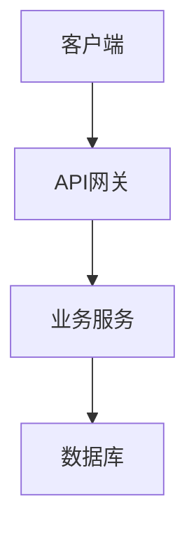

# 🚀 {{title}}

## 📋 项目概述

### 背景
> 为什么要做这个项目？

### 目标
> 项目要达成什么目标？

1. 
2. 

### 范围
> 包含什么，不包含什么

**包含：**
- 

**不包含：**
- 

## 🛠 技术栈

### 前端
- 框架：
- UI库：
- 状态管理：

### 后端
- 语言：
- 框架：
- 数据库：

### 工具链
- 构建工具：
- 版本控制：
- CI/CD：

## 🏗 架构设计

### 系统架构


### 数据模型
```sql
-- 核心数据结构
```

### API设计
| 端点 | 方法 | 描述 | 状态 |
|------|------|------|------|
| /api/v1/resource | GET | 获取资源列表 | ⏳ |

## 📊 进度管理

### 里程碑
- [ ] M1: 需求分析完成 - {{date}}
- [ ] M2: 原型设计完成 - {{date}}
- [ ] M3: MVP开发完成 - {{date}}
- [ ] M4: 测试上线 - {{date}}

### 任务分解
> 使用 #{{project-name}}-task 标签关联任务

#### Phase 1: 设计阶段
- [ ] 需求文档 [[requirement-doc]]
- [ ] 技术方案 [[tech-spec]]
- [ ] UI设计稿 [[ui-design]]

#### Phase 2: 开发阶段
- [ ] 环境搭建
- [ ] 基础框架
- [ ] 功能模块
  - [ ] 模块1
  - [ ] 模块2

#### Phase 3: 测试阶段
- [ ] 单元测试
- [ ] 集成测试
- [ ] 用户测试

## 📝 开发日志

### {{date}} - 项目启动
- 完成项目初始化
- 确定技术选型

### {{date}} - 
- 

## 🐛 问题追踪

### 已解决
| 日期 | 问题 | 解决方案 | 耗时 |
|------|------|----------|------|
|  |  |  |  |

### 待解决
- [ ] 问题描述

## 📚 相关文档

### 项目文档
- [[README]] - 项目说明
- [[API-Doc]] - 接口文档
- [[Deploy-Guide]] - 部署指南

### 参考资料
- [官方文档]()
- [相关教程]()

### 代码仓库
- GitHub: 
- 内部GitLab: 

## 💡 经验总结

### 技术收获
- 

### 踩坑记录
- 

### 最佳实践
- 

## 📊 项目统计

### 代码统计
- 总代码行数：
- 测试覆盖率：
- 技术债务：

### 时间投入
- 预估时间：
- 实际时间：
- 效率分析：

## 🎯 后续计划
- 

---

## 快速链接
- [[Projects-Dashboard|返回项目看板]]
- [[{{project-name}}-meetings|会议记录]]
- [[{{project-name}}-daily|项目日报]]

*最后更新: {{date}} {{time}}*
