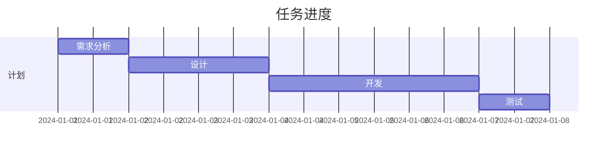

# 📌 {{title}}

## 📋 任务信息
- **ID**: `{{task-id}}`
- **类型**: {{type}}
- **优先级**: {{priority}}
- **状态**: {{status}}
- **预估时间**: {{estimated-hours}}h
- **实际用时**: {{actual-hours}}h
- **截止日期**: {{due}}

## 📝 任务描述
### 背景
> 为什么需要做这个任务


### 具体需求
> 详细描述要做什么


### 验收标准
- [ ] 标准1：
- [ ] 标准2：
- [ ] 标准3：

## 🎯 目标与价值
- **业务价值**：
- **技术价值**：
- **用户价值**：

## 💭 分析与设计

### 技术方案
```markdown
1. 方案概述

2. 实现步骤

3. 技术选型
```

### 潜在风险
| 风险 | 可能性 | 影响 | 应对措施 |
|------|--------|------|----------|
|  | 高/中/低 | 高/中/低 |  |

### 依赖关系
- [ ] 依赖1：
- [ ] 依赖2：

## 📊 进度追踪

### 时间线


### 状态变更记录
| 日期 | 状态变更 | 说明 | 操作人 |
|------|----------|------|--------|
| {{date}} | draft → todo | 任务创建 |  |
|  |  |  |  |

### 工作日志
#### {{date}} - {{status}}
- 完成内容：
- 遇到问题：
- 明日计划：

## 🔧 实施记录

### 代码变更
- [ ] 分支：`feature/{{task-id}}`
- [ ] PR/MR：[#{{number}}]()
- [ ] 代码审查：[[reviewer]]

### 相关代码
```language
// 关键代码片段
```

### 测试情况
- [ ] 单元测试
- [ ] 集成测试
- [ ] 回归测试
- [ ] 用户测试

## 📎 相关资源

### 文档
- [[设计文档]]
- [[API文档]]
- [[测试用例]]

### 链接
- [Issue链接]()
- [设计稿]()
- [讨论记录]()

### 参考资料
- 

## 🗣️ 沟通记录

### {{date}} - {{person}}
> 讨论内容摘要


### 会议记录
- [[meeting-note]]

## ✅ 子任务
- [ ] [[TASK-{{id}}-01]] - 子任务1
- [ ] [[TASK-{{id}}-02]] - 子任务2
- [ ] [[TASK-{{id}}-03]] - 子任务3

## 📝 总结

### 完成情况
- **完成度**：{{percent}}%
- **质量评估**：
- **时间评估**：预估{{estimated}}h，实际{{actual}}h

### 经验教训
- **做得好的**：
- **可以改进**：
- **经验总结**：

### 后续计划
- [ ] 后续优化：
- [ ] 相关任务：[[]]

## 🏷️ 标签
`#task` `#{{project}}` `#{{type}}` `#{{priority}}`

---

## 快速操作
- [ ] 标记完成：修改status为done
- [ ] 创建子任务：使用任务模板
- [ ] 归档：移动到Archive并更新状态

---
*最后更新：{{date}} {{time}}*
