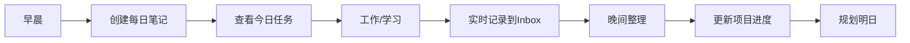
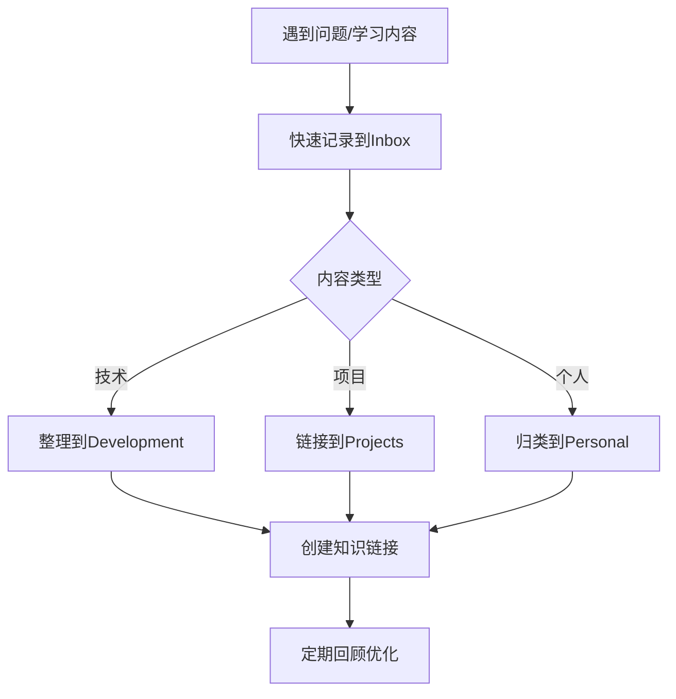

# ObsidianDevKit - 程序开发者知识管理系统

> 🚀 一个为程序开发者和设计师量身定制的Obsidian知识管理系统

## 📋 目录

- [系统特点](#系统特点)
- [文件夹结构](#文件夹结构)
- [快速开始](#快速开始)
- [核心功能](#核心功能)
- [模板说明](#模板说明)
- [工作流程](#工作流程)
- [插件推荐](#插件推荐)
- [最佳实践](#最佳实践)

## 🌟 系统特点

- **📁 清晰的层级结构**：工作、学习、生活完美分离
- **🔐 安全分级管理**：公开、内部、私密内容分层存储
- **📊 项目生命周期**：从想法到归档的完整管理
- **🤖 自动化工作流**：模板驱动，效率倍增
- **📈 数据驱动复盘**：可视化进度和成长轨迹

## 📁 文件夹结构

```
ObsidianDevKit/
├── 00-Inbox/              # 收集箱 - 临时笔记和待整理内容
├── 01-Daily/              # 日志系统
│   ├── 2024/              # 按年份组织
│   │   ├── 01-January/    # 按月份组织
│   │   └── ...
│   ├── Weekly/            # 周总结
│   └── Monthly/           # 月度回顾
├── 02-Projects/           # 项目管理
│   ├── Active/            # 进行中的项目
│   ├── Ideas/             # 项目想法
│   └── Archive/           # 已归档项目
├── 03-Development/        # 开发知识库
│   ├── Languages/         # 编程语言
│   ├── Frameworks/        # 框架和库
│   ├── Architecture/      # 架构设计
│   ├── DevOps/           # 运维相关
│   └── Best-Practices/    # 最佳实践
├── 04-Learning/           # 学习管理
│   ├── Courses/           # 课程笔记
│   ├── Books/             # 读书笔记
│   ├── Tutorials/         # 教程收集
│   └── Certificates/      # 证书记录
├── 05-Work/               # 工作相关
│   ├── Company/           # 公司相关
│   ├── Meetings/          # 会议记录
│   ├── Performance/       # 绩效相关
│   └── Career/            # 职业规划
├── 06-Personal/           # 个人生活
│   ├── Health/            # 健康管理
│   ├── Finance/           # 财务管理
│   ├── Habits/            # 习惯追踪
│   └── Ideas/             # 个人想法
├── 07-Resources/          # 资源库
│   ├── Tools/             # 工具收集
│   ├── Snippets/          # 代码片段
│   ├── Cheatsheets/       # 速查表
│   └── Links/             # 链接收藏
├── 08-Public/             # 公开分享
│   ├── Blog-Drafts/       # 博客草稿
│   ├── Talks/             # 演讲资料
│   └── Open-Source/       # 开源项目
├── 09-Security/           # 安全信息（建议加密）
│   ├── Passwords/         # 密码提示
│   ├── Licenses/          # 许可证
│   └── Sensitive/         # 敏感信息
├── 10-Templates/          # 模板库
└── 99-Archive/            # 总归档
```

## 🚀 快速开始

### 1. 下载本系统
```bash
git clone https://github.com/yourusername/ObsidianDevKit.git
cd ObsidianDevKit
```

### 2. 在Obsidian中打开
- 打开Obsidian
- 选择"打开文件夹作为仓库"
- 选择ObsidianDevKit文件夹

### 3. 安装推荐插件
查看[插件推荐](#插件推荐)部分，安装必要的插件

### 4. 开始使用
- 创建今日笔记：使用 `10-Templates/daily-note.md` 模板
- 新建项目：使用 `10-Templates/project-template.md` 模板
- 记录想法：直接在 `00-Inbox` 创建笔记

## 📋 核心功能

### 1. 项目管理
- **项目看板**：可视化项目进度
- **任务追踪**：从创建到归档的完整生命周期
- **里程碑管理**：关键节点跟踪
- **资源链接**：相关文档、代码、设计稿集中管理

### 2. 知识体系
- **技术栈管理**：按语言、框架、工具分类
- **问题解决记录**：调试经验积累
- **最佳实践**：团队规范和个人经验
- **学习路径**：技能树和成长记录

### 3. 日程与回顾
- **每日笔记**：工作日志和任务管理
- **周/月回顾**：定期复盘和改进
- **年度总结**：长期目标追踪

### 4. 安全管理
- **分级存储**：公开、内部、私密内容分离
- **密码管理**：安全提示记录（推荐配合密码管理器）
- **敏感信息**：支持加密存储

## 📝 模板说明

### 每日笔记模板
- 位置：`10-Templates/daily-note.md`
- 功能：日程管理、任务追踪、学习记录、想法收集
- 使用：每天早上创建，晚上回顾

### 项目模板
- 位置：`10-Templates/project-template.md`
- 功能：项目信息、技术栈、进度追踪、问题记录
- 使用：新项目启动时创建

### 技术笔记模板
- 位置：`10-Templates/tech-note.md`
- 功能：概念解释、代码示例、使用场景、相关链接
- 使用：学习新技术时使用

### 会议记录模板
- 位置：`10-Templates/meeting-note.md`
- 功能：议题、决议、行动项、责任人
- 使用：参加会议时实时记录

### 代码片段模板
- 位置：`10-Templates/code-snippet.md`
- 功能：代码保存、使用说明、标签分类
- 使用：保存常用代码片段

## 🔄 工作流程

### 日常工作流


### 知识管理流


## 🔌 插件推荐

### 必装插件
1. **Calendar** - 日历视图管理每日笔记
2. **Dataview** - 动态查询和数据展示
3. **Templater** - 高级模板功能
4. **Tasks** - 任务管理和提醒

### 效率插件
1. **Quick Switcher** - 快速文件切换
2. **Tag Wrangler** - 标签管理
3. **Kanban** - 看板视图
4. **Excalidraw** - 绘图工具

### 开发相关
1. **Code Block Enhancer** - 代码高亮增强
2. **Execute Code** - 运行代码片段
3. **Git** - 版本控制
4. **Mermaid** - 流程图支持

### 安全插件
1. **Obsidian Cryptography** - 笔记加密
2. **Local Backup** - 本地备份

## 💡 最佳实践

### 1. 标签系统
```yaml
# 项目状态
#active #completed #archived #on-hold

# 技术栈
#java #python #javascript #go #docker

# 内容类型
#bug-fix #feature #learning #meeting #idea

# 优先级
#urgent #high #medium #low

# 可见性
#public #internal #private
```

### 2. 链接策略
- 使用 `[[]]` 创建知识网络
- 为重要概念创建专门页面
- 定期查看孤立页面并建立连接

### 3. 命名规范
- 日期格式：`YYYY-MM-DD`
- 项目命名：`project-name-brief-description`
- 会议记录：`YYYY-MM-DD-meeting-topic`

### 4. 备份策略
- Git 每日提交
- 重要内容多地备份
- 敏感信息加密后备份

## 🎯 快捷键配置

建议设置以下快捷键提升效率：

- `Ctrl+D` - 创建每日笔记
- `Ctrl+T` - 从模板创建笔记
- `Ctrl+P` - 快速切换文件
- `Ctrl+Shift+F` - 全局搜索
- `Alt+E` - 插入代码块
- `Alt+T` - 插入任务

## 📊 示例查询

### Dataview 查询示例

#### 本周任务统计
```dataview
table status, due, priority
from "02-Projects"
where contains(tags, "task") and due >= date(today) - dur(7 days)
sort priority desc, due asc
```

#### 最近学习的技术
```dataview
list
from "03-Development"
where file.ctime >= date(today) - dur(30 days)
sort file.ctime desc
limit 10
```

## 🤝 贡献指南

欢迎贡献模板、工作流程优化建议！

1. Fork 本仓库
2. 创建特性分支
3. 提交改进
4. 发起 Pull Request

## 📄 许可证

MIT License - 详见 [LICENSE](LICENSE) 文件

---

💡 **提示**：这个系统会随着你的使用不断进化，根据自己的需求调整结构和模板，让它真正成为你的"第二大脑"！

🚀 **开始使用**：现在就创建你的第一个每日笔记，开启高效的知识管理之旅吧！
