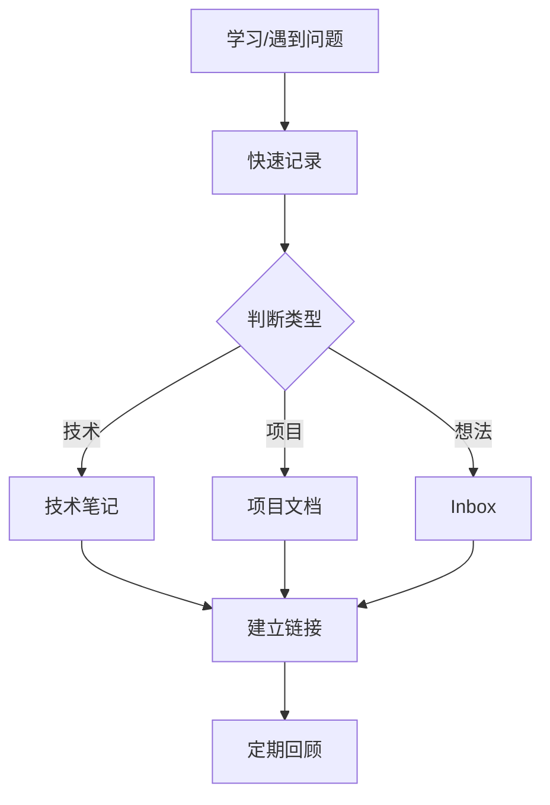

# 🏗️ ObsidianDevKit 系统概览

## 📁 系统文件结构

```
ObsidianDevKit/
├── 📄 README.md                    # 主文档，系统介绍
├── 📄 SETUP-GUIDE.md              # 快速设置指南
├── 📄 SYSTEM-OVERVIEW.md          # 本文件，系统概览
├── 📄 .gitignore                  # Git忽略配置
│
├── 📁 00-Inbox/                   # 收集箱
│   └── (临时笔记存放处)
│
├── 📁 01-Daily/                   # 日志系统
│   ├── 📁 2024/
│   │   └── 📁 12-December/
│   │       └── 📄 2024-12-17.md   # 每日笔记示例
│   ├── 📁 Weekly/
│   │   └── 📄 2024-W51.md         # 周回顾示例
│   └── 📁 Monthly/
│       └── (月度回顾)
│
├── 📁 02-Projects/                # 项目管理
│   ├── 📁 Active/
│   │   └── 📁 E-Commerce-Platform/
│   │       └── 📄 README.md       # 项目示例
│   ├── 📁 Ideas/
│   ├── 📁 Archive/
│   └── 📄 Projects-Dashboard.md   # 项目看板
│
├── 📁 03-Development/             # 开发知识库
│   └── 📁 Languages/
│       └── 📁 Go/
│           └── 📄 Go-Concurrency-Patterns.md  # 技术笔记示例
│
├── 📁 04-Learning/                # 学习管理
│   └── 📁 Roadmaps/
│       └── 📄 Backend-Developer-2024.md  # 学习路线图示例
│
├── 📁 05-Work/                    # 工作相关
├── 📁 06-Personal/                # 个人生活
│
├── 📁 07-Resources/               # 资源库
│   ├── 📁 Snippets/
│   │   └── 📄 jwt-authentication-go.md  # 代码片段示例
│   └── 📁 Cheatsheets/
│       └── 📄 git-commands.md     # 速查表示例
│
├── 📁 08-Public/                  # 公开分享
│   └── 📁 Blog-Drafts/
│       └── 📄 mastering-go-concurrency.md  # 博客草稿示例
│
├── 📁 09-Security/                # 安全信息
│   └── 📁 Passwords/
│       ├── 📄 password-management-guide.md  # 密码管理指南
│       └── 📄 example-github-account.md     # 账户信息示例
│
├── 📁 10-Templates/               # 模板库
│   ├── 📄 daily-note.md           # 每日笔记模板
│   ├── 📄 project-template.md     # 项目模板
│   ├── 📄 tech-note.md            # 技术笔记模板
│   ├── 📄 meeting-note.md         # 会议记录模板
│   ├── 📄 code-snippet.md         # 代码片段模板
│   ├── 📄 weekly-review.md        # 周回顾模板
│   ├── 📄 monthly-review.md       # 月度回顾模板
│   └── 📄 task-template.md        # 任务模板
│
└── 📁 99-Archive/                 # 总归档
```

## 🎯 核心功能模块

### 1. 📝 日志系统
- **每日笔记**：记录日常工作、学习、想法
- **周回顾**：总结本周成果，制定下周计划
- **月度复盘**：长期目标追踪，深度反思

### 2. 📊 项目管理
- **项目看板**：可视化所有项目状态
- **任务追踪**：从创建到归档的完整生命周期
- **进度管理**：里程碑、任务分解、时间统计

### 3. 🧠 知识管理
- **技术笔记**：结构化的技术知识沉淀
- **代码片段**：可复用的代码库
- **学习路径**：系统化的学习规划

### 4. 🔐 安全管理
- **密码管理**：安全的密码提示系统
- **敏感信息**：支持加密存储
- **访问控制**：通过.gitignore保护隐私

## 🔧 系统特性

### 模板驱动
- 8个精心设计的模板
- 覆盖日常工作的各个方面
- 支持Templater高级功能

### 数据驱动
- 使用Dataview实现动态查询
- 自动统计和可视化
- 智能的内容聚合

### 自动化工作流
- Git自动备份
- 模板快速创建
- 标签自动分类

### 知识网络
- 双向链接构建知识图谱
- 标签系统多维度组织
- 全文搜索快速定位

## 📋 使用指南

### 日常工作流


### 知识管理流


## 🚀 快速开始

1. **设置系统**
   ```bash
   git clone <repository>
   cd ObsidianDevKit
   ```

2. **安装插件**
   - 查看 `SETUP-GUIDE.md` 详细说明
   - 安装推荐的核心插件

3. **开始使用**
   - 创建今天的每日笔记
   - 使用模板创建内容
   - 探索示例文件

## 💡 最佳实践

### 文件命名
- 日期格式：`YYYY-MM-DD`
- 项目命名：`Project-Name`
- 使用连字符而非空格

### 标签使用
```yaml
# 状态标签
#active #completed #archived

# 类型标签  
#project #task #meeting #idea

# 技术标签
#golang #docker #kubernetes

# 优先级
#urgent #high #medium #low
```

### 链接策略
- 优先使用 `[[wiki-links]]`
- 为重要概念创建专门页面
- 定期检查孤立页面

## 🎨 定制建议

### 主题推荐
- **Minimal**：简洁专业
- **Blue Topaz**：功能丰富
- **Obsidian Nord**：护眼配色

### 插件扩展
根据需求可添加：
- **Excalidraw**：绘图工具
- **Mind Map**：思维导图
- **Charts**：数据可视化

## 📊 系统维护

### 日常维护
- 每日：整理Inbox
- 每周：更新项目进度
- 每月：归档完成内容

### 定期优化
- 检查失效链接
- 合并相似笔记
- 更新过时内容
- 优化文件结构

## 🔗 相关资源

### 内部文档
- [[README|系统介绍]]
- [[SETUP-GUIDE|设置指南]]
- [[Projects-Dashboard|项目看板]]

### 外部资源
- [Obsidian官方文档](https://help.obsidian.md/)
- [Awesome Obsidian](https://github.com/kmaasrud/awesome-obsidian)
- [Obsidian社区](https://obsidian.md/community)

## 🎯 下一步

1. **熟悉系统**：浏览示例文件，理解组织结构
2. **个性化配置**：根据需求调整文件夹和模板
3. **开始记录**：从今天的每日笔记开始
4. **持续优化**：根据使用情况不断改进

---

🌟 **记住**：这个系统的价值在于持续使用和不断优化。开始可能会觉得繁琐，但坚持一段时间后，你会发现它极大地提升了你的工作效率和知识管理能力。

**祝你使用愉快！** 🚀

*系统版本：v1.0*  
*创建日期：2024-12-17*  
*作者：DevTeam*