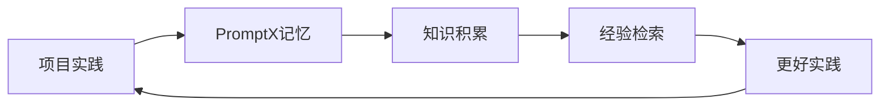

# PromptX与Cursor协作开发指南

## 📋 概述

PromptX是一个系统性的AI专业能力增强框架，通过MCP协议为Cursor等AI IDE提供专业角色、记忆管理和知识体系。本指南详细介绍如何将PromptX与Cursor IDE结合，实现智能化协作开发。

## 🎯 核心价值

### PromptX核心功能
- **🎭 专业角色系统**: 获得Java后端开发者、产品经理等专业能力
- **🧠 记忆管理**: AI主动学习和记忆项目知识，支持跨会话保持
- **📚 知识体系**: 学习最佳实践、架构模式和技术框架
- **🔍 智能检索**: 基于项目上下文的知识检索和应用

### Cursor核心功能  
- **⚡ 智能代码补全**: 基于项目上下文的代码生成
- **🏗️ 项目理解**: 深度理解代码库结构和业务逻辑
- **🔧 实时编辑**: 自然语言驱动的代码修改
- **📊 代码分析**: 代码质量分析和优化建议

## 🚀 配置步骤

### 1. 在Cursor中配置PromptX MCP服务

#### 打开Cursor MCP设置
1. 打开Cursor IDE
2. 按 `Ctrl/Cmd + ,` 打开设置
3. 搜索 "MCP" 或导航至 "MCP Servers"

#### 添加PromptX MCP服务器
```json
{
  "mcpServers": {
    "promptx": {
      "command": "npx",
      "args": ["-y", "-f", "dpml-prompt@snapshot", "mcp-server"],
      "env": {
        "PROMPTX_WORKSPACE": "C:\\Users\\John\\Documents\\IdeaProject\\springboot3Main011"
      }
    }
  }
}
```

#### 验证配置
1. 重启Cursor IDE
2. 在聊天界面检查是否出现PromptX工具
3. 应该看到6个PromptX工具：`promptx_init`, `promptx_hello`, `promptx_action`, `promptx_learn`, `promptx_recall`, `promptx_remember`

### 2. 创建项目协作规则

在项目根目录创建 `.cursor-rules` 文件：

```markdown
# Spring Boot项目开发规则

你是一个专业的Java后端开发专家，使用PromptX增强能力协作开发。

## 工作流程
1. 首先使用 promptx_init 初始化PromptX环境
2. 使用 promptx_hello 发现可用的专业角色  
3. 使用 promptx_action java-backend-developer 激活Java后端开发者角色
4. 使用 promptx_recall 检索相关项目记忆和最佳实践
5. 根据检索到的知识提供专业建议和代码实现

## 技术栈要求
- Spring Boot 3.x
- Spring Cloud 2023.x
- Java 21
- Maven 3.9+
- Docker容器化部署

## 代码规范
- 使用函数式编程风格
- 遵循DDD领域驱动设计
- 实现完整的错误处理机制
- 编写单元测试和集成测试
- 使用Lombok减少样板代码

## 架构原则
- 微服务架构
- 六边形架构模式
- 配置外部化
- 云原生设计

## 每次开发任务后记忆重要经验
使用 promptx_remember 将重要的架构决策、最佳实践和解决方案保存到记忆中。
```

## 🔄 协作工作流

### 1. 项目启动阶段

```markdown
开发者: 开始新的Spring Boot项目开发

AI助手(Cursor): 
1. 首先初始化PromptX环境
2. 激活Java后端开发者角色
3. 检索Spring Boot相关的最佳实践
4. 提供项目架构建议
```

#### 具体操作示例：
```
开发者: 我需要创建一个新的微服务模块，用于用户管理

AI (使用PromptX工具):
1. promptx_init() # 初始化环境
2. promptx_action("java-backend-developer") # 激活角色
3. promptx_recall("微服务 用户管理 Spring Boot") # 检索相关经验
4. 基于检索结果提供专业建议和代码实现
5. promptx_remember("用户管理微服务架构设计经验...") # 保存新经验
```

### 2. 开发过程中的协作模式

#### A. 问题分析模式
```
开发者问题 → PromptX角色激活 → 记忆检索 → Cursor代码分析 → 综合解决方案
```

#### B. 代码重构模式  
```
Cursor代码理解 → PromptX最佳实践检索 → 重构建议 → 代码实现 → 经验记忆
```

#### C. 架构设计模式
```
业务需求 → PromptX架构经验 → Cursor项目分析 → 设计方案 → 代码生成
```

### 3. 知识积累工作流

#### 持续学习循环


## 🎯 实际应用场景

### 场景1: 配置服务架构优化

```markdown
开发者: 当前的配置服务有性能问题，需要优化

AI协作流程:
1. promptx_recall("配置服务 性能优化 Spring Cloud Config")
2. 分析当前代码结构 (Cursor)
3. 提供优化建议和实现方案
4. promptx_remember("配置服务性能优化经验: ...")
```

### 场景2: 新功能开发

```markdown
开发者: 需要添加配置变更审计功能

AI协作流程:
1. promptx_action("java-backend-developer")
2. promptx_recall("审计日志 事件驱动 Spring")
3. 基于项目结构生成代码 (Cursor)
4. 提供测试策略和监控方案
5. promptx_remember("审计功能实现最佳实践...")
```

### 场景3: 问题排查

```markdown
开发者: GitLab连接超时，如何处理？

AI协作流程:
1. promptx_recall("GitLab 连接超时 故障处理")
2. 分析相关代码 (Cursor)
3. 提供故障排查步骤和修复方案
4. promptx_remember("GitLab连接问题解决方案...")
```

## 🛠️ 高级技巧

### 1. 自定义角色创建
```javascript
// 可以通过PromptX创建项目特定的角色
promptx_remember(`创建自定义角色: Platform架构师
专业能力:
- 微服务架构设计
- Spring Cloud生态系统
- Docker和Kubernetes部署
- 配置中心最佳实践`)
```

### 2. 项目知识库构建
```markdown
定期使用 promptx_remember 记录:
- 架构决策和权衡
- 技术选型理由
- 性能优化经验
- 常见问题解决方案
```

### 3. 团队知识共享
```markdown
导出PromptX记忆:
1. 使用 promptx_recall 检索所有项目相关知识
2. 整理成文档分享给团队
3. 团队成员可以导入相同的知识库
```

## 📊 效果监控

### 开发效率指标
- **代码生成速度**: 使用PromptX+Cursor vs 传统开发
- **代码质量**: 缺陷率、测试覆盖率
- **知识复用**: 相似问题解决时间减少
- **团队协作**: 知识传递效率

### 知识积累指标
- **记忆条目数量**: 项目相关知识点数量
- **检索成功率**: 相关问题找到解决方案的比例
- **应用频率**: 历史经验被重复使用的次数

## 🔧 故障排查

### 常见问题

#### 1. PromptX工具不可用
```
解决方案:
1. 检查MCP服务器配置
2. 重启Cursor IDE
3. 验证npm包版本: npx dpml-prompt@snapshot --version
```

#### 2. 记忆无法检索
```  
解决方案:
1. 确认工作空间路径正确
2. 检查 .promptx 目录权限
3. 重新初始化: promptx_init()
```

#### 3. 角色激活失败
```
解决方案:
1. 使用 promptx_hello 查看可用角色
2. 确认角色ID拼写正确
3. 重新激活: promptx_action("java-backend-developer")
```

## 📚 最佳实践

### 1. 记忆管理策略
- **及时记录**: 解决问题后立即记录经验
- **结构化存储**: 使用统一的标签和分类
- **定期整理**: 清理过时或重复的记忆

### 2. 角色使用策略
- **专业对口**: 根据任务类型选择合适角色
- **能力叠加**: 可以连续激活多个角色获得综合能力
- **持续学习**: 让AI学习领域特定知识

### 3. 协作效率提升
- **上下文准备**: 为AI提供充分的项目背景
- **问题细化**: 将复杂问题分解为具体的子问题
- **反馈循环**: 及时验证AI的建议和代码

## 🎯 进阶应用

### 1. 自动化工作流
```markdown
创建自动化脚本，在特定触发条件下：
1. 自动激活相关角色
2. 检索相关经验
3. 生成解决方案
4. 记录新的经验
```

### 2. 知识图谱构建
```markdown
利用PromptX的记忆系统构建项目知识图谱：
1. 技术栈关系映射
2. 问题-解决方案关联
3. 最佳实践网络
```

### 3. 持续集成整合
```markdown
将PromptX集成到CI/CD流程：
1. 代码review阶段检索最佳实践
2. 部署阶段应用运维经验
3. 监控阶段记录性能数据
```

---

## 🎉 结语

PromptX与Cursor的结合为我们提供了一个强大的智能开发环境。通过专业角色系统、记忆管理和知识积累，我们可以：

1. **提升开发效率**: 智能代码生成+专业知识指导
2. **保证代码质量**: 最佳实践检索+实时质量分析  
3. **加速团队成长**: 知识共享+经验传承
4. **降低维护成本**: 问题解决方案复用+自动化流程

立即开始使用PromptX+Cursor，让AI成为你的专业开发伙伴！ 