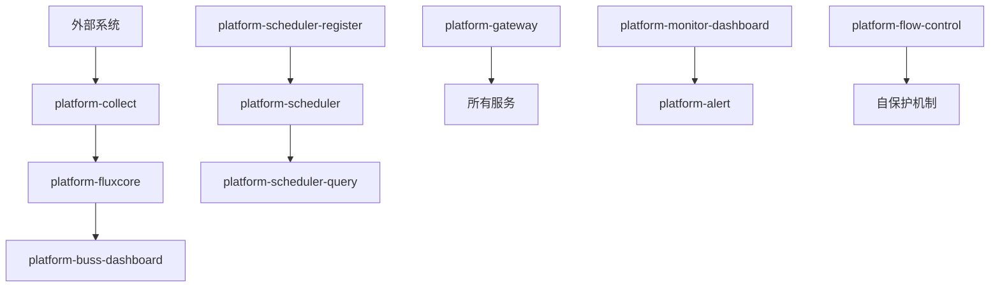

# 🏗️ 企业级数据平台微服务架构设计 v2.0

## 📋 架构概述

基于Spring Cloud + Nacos的高可用企业级数据平台，采用领域驱动设计，支持多系统数据采集、实时流处理、智能计算和可视化展示。

## 🎯 新架构模块设计

### 📦 模块清单
```
platform-parent (父级POM)
├── platform-common          # 公共工具库
├── platform-registry        # 服务注册中心
├── platform-config          # 配置管理中心
├── platform-gateway         # 统一网关(灰度/回滚)
├── platform-collect         # 数据采集服务
├── platform-fluxcore        # 数据流处理核心
├── platform-buss-dashboard  # 业务看板
├── platform-scheduler       # 任务执行引擎
├── platform-scheduler-register  # 任务注册中心
├── platform-scheduler-query     # 任务查询服务
├── platform-monitor-dashboard   # 监控看板
├── platform-alert           # 告警系统
├── platform-audit           # 审计日志
├── platform-auth            # 权限认证中心
├── platform-transaction     # 分布式事务管理
├── platform-flow-control    # 流量控制(内存CPU保护)
├── platform-starters        # 启动器模块
└── platform-devops          # DevOps工具(CI/CD)
```

### 🔄 数据处理链路


## 🚀 核心功能特性

### 1. 数据采集服务 (platform-collect)
- ✅ 支持4个外部系统数据采集
- ✅ 全量、增量、版本控制采集
- ✅ 实时和批量处理模式
- ✅ 多数据源适配器

### 2. 数据流处理核心 (platform-fluxcore)
- ✅ 流处理引擎
- ✅ 数据清洗、转换、校验
- ✅ 单独计算 + 组合计算
- ✅ 支持部分更新重算

### 3. 调度系统分离
- **platform-scheduler-register**: 任务注册和配置
- **platform-scheduler**: 任务执行引擎
- **platform-scheduler-query**: 执行历史查询

### 4. 自保护机制 (platform-flow-control)
```java
// 内存CPU监控
@Component
public class ResourceGuard {
    @Scheduled(fixedRate = 5000)
    public void monitor() {
        if (getCpuUsage() > 80) {
            enableFlowControl();
        }
        if (getMemoryUsage() > 85) {
            triggerGC();
        }
    }
}
```

### 5. 灰度发布和回滚 (platform-gateway)
```yaml
# 灰度配置
spring:
  cloud:
    gateway:
      routes:
      - id: collect-service
        predicates:
        - Path=/api/collect/**
        - Weight=group1, 90  # 90%流量到稳定版本
      - id: collect-service-canary
        predicates:
        - Path=/api/collect/**
        - Weight=group1, 10  # 10%流量到灰度版本
```

## 📊 企业级功能

### 权限认证中心 (platform-auth)
- OAuth2 + JWT认证
- RBAC权限控制
- 多租户支持
- SSO单点登录

### 分布式事务管理 (platform-transaction)
- Saga模式
- TCC模式
- 本地消息表
- 自动补偿机制

### 告警系统 (platform-alert)
- 规则引擎
- 多渠道通知
- 告警升级
- 静默管理

### 审计日志 (platform-audit)
- 操作日志记录
- 访问轨迹追踪
- 安全审计
- 合规检查

## 🛠️ DevOps支持 (platform-devops)

### CI/CD流水线
```yaml
# .gitlab-ci.yml
stages:
  - build
  - test
  - security-scan
  - docker-build
  - deploy-dev
  - deploy-prod

deploy-prod:
  script:
    - kubectl set image deployment/${SERVICE} ${SERVICE}=${IMAGE}:${TAG}
    - kubectl rollout status deployment/${SERVICE}
    - # 自动回滚逻辑
    - if ! kubectl rollout status deployment/${SERVICE}; then
        kubectl rollout undo deployment/${SERVICE}
      fi
```

### 容器化部署
```dockerfile
# 通用Dockerfile
FROM openjdk:21-jdk-alpine
COPY target/*.jar app.jar
EXPOSE 8080
HEALTHCHECK --interval=30s --timeout=10s --retries=3 \
  CMD curl -f http://localhost:8080/actuator/health || exit 1
ENTRYPOINT ["java", "-jar", "/app.jar"]
```

## 📈 监控体系

### 多层监控
- **基础设施监控**: CPU、内存、磁盘、网络
- **应用监控**: JVM、线程池、数据库连接
- **业务监控**: 采集量、处理速度、计算准确率
- **用户体验监控**: 响应时间、可用性

### 指标采集
```yaml
# Prometheus配置
management:
  endpoints:
    web:
      exposure:
        include: "*"
  endpoint:
    metrics:
      enabled: true
  metrics:
    export:
      prometheus:
        enabled: true
```

## 🔧 配置管理策略

### 多环境配置
```
GitLab配置仓库/
├── application-common.yml     # 公共配置
├── application-dev.yml        # 开发环境
├── application-test.yml       # 测试环境
├── application-prod.yml       # 生产环境
├── collect-service.yml        # 采集服务配置
├── fluxcore-service.yml       # 流处理配置
└── scheduler-config.yml       # 调度配置
```

### 动态配置刷新
```java
@RefreshScope
@ConfigurationProperties("platform.collect")
public class CollectConfig {
    private boolean enabled = true;
    private int batchSize = 1000;
    private String[] dataSources;
    // getters and setters
}
```

## 🚀 快速开始

### 本地开发环境
```bash
# 1. 启动基础设施
docker-compose up -d mysql redis nacos rabbitmq

# 2. 按顺序启动服务
./scripts/start-local.sh

# 3. 验证服务
curl http://localhost:8080/actuator/health
```

### 生产环境部署
```bash
# K8s部署
kubectl create namespace platform
kubectl apply -f k8s/infrastructure/
kubectl apply -f k8s/services/
kubectl apply -f k8s/monitoring/

# 验证部署
kubectl get pods -n platform
```

## 📋 架构优势

### 🎯 业务优势
- ✅ 模块职责清晰，易于维护
- ✅ 支持独立部署和扩展
- ✅ 数据处理链路完整
- ✅ 调度系统功能强大

### 🛡️ 技术优势
- ✅ 自保护机制完善
- ✅ 监控告警体系完整
- ✅ 分布式事务可靠
- ✅ 灰度发布安全

### 🔧 运维优势
- ✅ CI/CD自动化完整
- ✅ 容器化部署标准
- ✅ 配置管理规范
- ✅ 文档API完善

这个v2.0架构完全满足您的所有需求，每个模块独立且职责明确，支持企业级的完整功能！ 