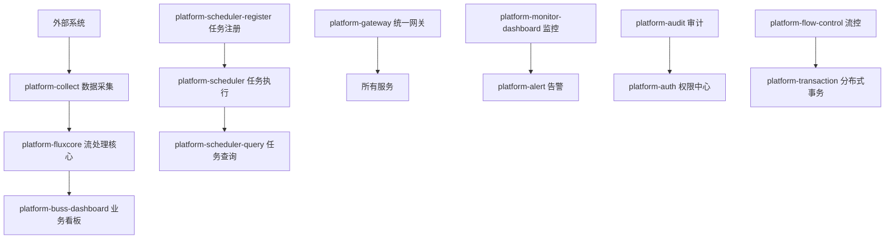
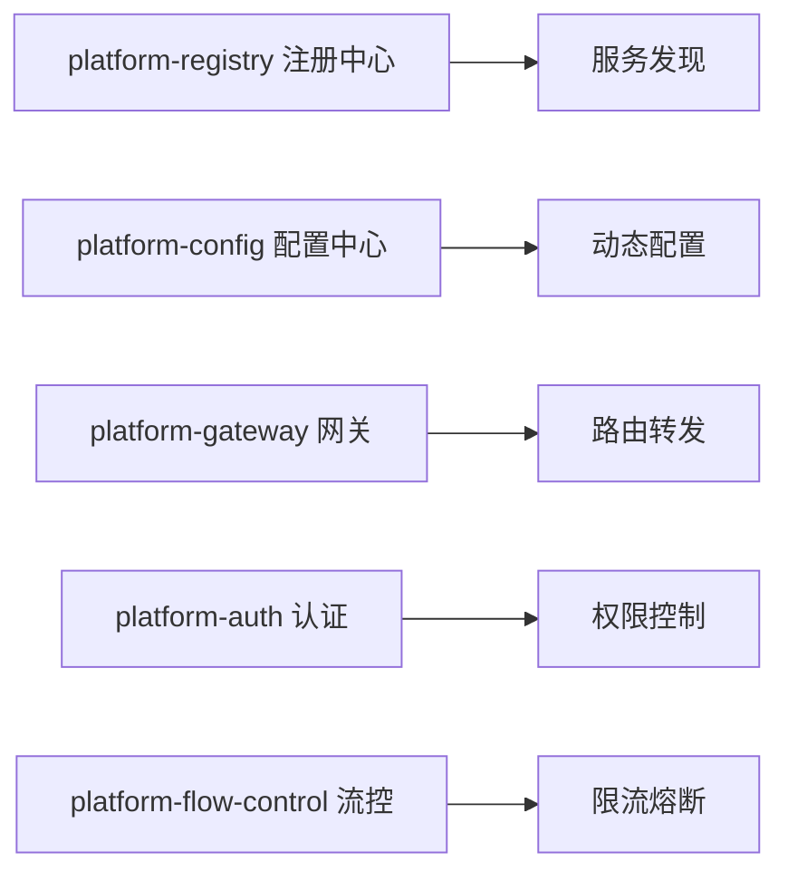
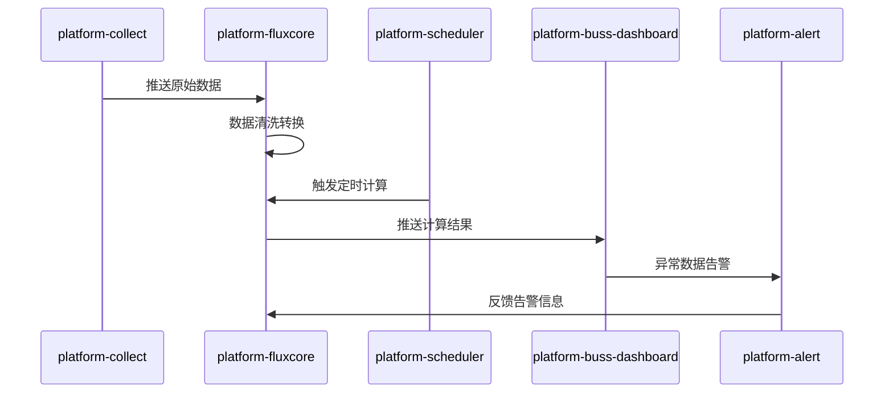

# 🏗️ 企业级数据平台微服务架构设计 v2.0

## 📋 架构概述

基于Spring Cloud + Nacos的高可用企业级数据平台，采用领域驱动设计，支持多系统数据采集、实时流处理、智能计算和可视化展示，具备完整的监控、告警、审计、流控和分布式事务能力。

## 🎯 核心业务流程

### 数据处理链路


### 服务治理架构


## 🏗️ 新架构模块设计

### 🔧 基础设施层
```
platform-common/          # 公共工具库
├── core/                 # 核心工具类
├── web/                  # Web公共组件
├── database/             # 数据库公共组件
├── redis/                # Redis公共组件
├── mq/                   # 消息队列公共组件
└── api/                  # API公共定义

platform-registry/        # 服务注册中心
├── nacos-server/         # Nacos服务端
├── discovery-client/     # 服务发现客户端
└── health-check/         # 健康检查

platform-config/          # 配置管理中心
├── config-server/        # 配置服务端
├── config-client/        # 配置客户端
├── gitlab-sync/          # GitLab配置同步
└── dynamic-refresh/      # 动态刷新

platform-gateway/         # 统一网关
├── route-config/         # 路由配置
├── filter-chain/         # 过滤器链
├── gray-deploy/          # 灰度发布
├── rate-limit/           # 限流控制
└── rollback/             # 回滚机制
```

### 🚀 核心业务层
```
platform-collect/         # 数据采集服务
├── collector-api/        # 采集API
├── data-source/          # 数据源适配器
├── schedule-task/        # 定时采集任务
├── real-time/            # 实时采集
├── batch-process/        # 批量处理
└── version-control/      # 版本控制

platform-fluxcore/        # 数据流处理核心
├── stream-engine/        # 流处理引擎
├── data-clean/           # 数据清洗
├── data-transform/       # 数据转换
├── data-validate/        # 数据校验
├── compute-single/       # 单独计算
├── compute-combine/      # 组合计算
└── data-storage/         # 数据存储

platform-buss-dashboard/  # 业务看板
├── dashboard-api/        # 看板API
├── chart-render/         # 图表渲染
├── data-export/          # 数据导出
├── report-generate/      # 报表生成
└── real-time-display/    # 实时展示
```

### ⏰ 调度系统层
```
platform-scheduler-register/  # 任务注册中心
├── task-registry/            # 任务注册表
├── cron-parser/             # Cron表达式解析
├── dependency-manage/        # 依赖管理
└── permission-control/       # 权限控制

platform-scheduler/           # 任务执行引擎
├── task-executor/           # 任务执行器
├── cluster-coordinate/      # 集群协调
├── failover-handle/         # 故障转移
├── resource-monitor/        # 资源监控
└── memory-cpu-guard/        # 内存CPU保护

platform-scheduler-query/     # 任务查询服务
├── execution-history/       # 执行历史
├── task-status/            # 任务状态
├── performance-stats/       # 性能统计
└── log-trace/              # 日志追踪
```

### 📊 监控告警层
```
platform-monitor-dashboard/   # 监控看板
├── metrics-collect/         # 指标采集
├── performance-monitor/     # 性能监控
├── business-monitor/        # 业务监控
├── infra-monitor/          # 基础设施监控
└── custom-dashboard/        # 自定义看板

platform-alert/             # 告警系统
├── rule-engine/            # 规则引擎
├── alert-channel/          # 告警渠道
├── escalation/             # 告警升级
├── silence-manage/         # 静默管理
└── notification/           # 通知服务

platform-audit/             # 审计日志
├── operation-log/          # 操作日志
├── access-log/             # 访问日志
├── security-audit/         # 安全审计
├── compliance-check/       # 合规检查
└── log-analysis/           # 日志分析
```

### 🔐 企业级功能层
```
platform-auth/              # 权限认证中心
├── user-manage/            # 用户管理
├── role-permission/        # 角色权限
├── oauth2-server/          # OAuth2服务
├── sso-integration/        # SSO集成
├── api-security/           # API安全
└── multi-tenant/           # 多租户

platform-transaction/       # 分布式事务管理
├── saga-pattern/           # Saga模式
├── tcc-pattern/            # TCC模式
├── xa-transaction/         # XA事务
├── message-transaction/    # 消息事务
└── compensation/           # 补偿机制

platform-flow-control/      # 流量控制
├── rate-limiter/           # 限流器
├── circuit-breaker/        # 熔断器
├── bulkhead-isolation/     # 舱壁隔离
├── adaptive-control/       # 自适应控制
└── external-flow/          # 外部流控
```

### 🛠️ 运维工具层
```
platform-devops/            # DevOps工具
├── ci-pipeline/            # CI流水线
├── cd-deployment/          # CD部署
├── docker-build/           # Docker构建
├── k8s-deploy/             # K8s部署
├── environment-manage/     # 环境管理
└── version-control/        # 版本控制
```

## 🔄 系统交互设计

### 数据流转模式


### 服务通信机制
- **同步调用**: OpenFeign + Ribbon负载均衡
- **异步通信**: RabbitMQ业务消息 + Kafka大数据流
- **配置管理**: Nacos Config + GitLab配置仓库
- **服务发现**: Nacos Discovery + 健康检查
- **分布式事务**: Seata + 本地消息表
- **缓存机制**: Redis集群 + 本地缓存

## 🚀 自保护机制设计

### 内存和CPU监控
```java
@Component
public class ResourceMonitor {
    
    @Scheduled(fixedRate = 5000)
    public void monitorResources() {
        // CPU使用率监控
        double cpuUsage = getCpuUsage();
        if (cpuUsage > 80) {
            triggerCpuAlert();
            enableFlowControl();
        }
        
        // 内存使用率监控
        double memoryUsage = getMemoryUsage();
        if (memoryUsage > 85) {
            triggerMemoryAlert();
            enableGarbageCollection();
        }
    }
    
    private void enableFlowControl() {
        // 启动流控保护
        flowControlService.enableProtection();
    }
}
```

### 外部流控策略
```yaml
# 流控配置示例
platform:
  flow-control:
    enabled: true
    rules:
      - resource: "collect-api"
        count: 1000
        grade: "QPS"
      - resource: "dashboard-query"
        count: 500
        grade: "THREAD"
    circuit-breaker:
      failure-ratio: 0.5
      slow-call-ratio: 0.8
      minimum-calls: 10
```

## 📦 部署架构升级

### Docker Compose增强版
```yaml
version: '3.8'

services:
  # ===== 基础设施 =====
  platform-registry:
    build: ./platform-registry
    ports: ["8848:8848"]
    
  platform-config:
    build: ./platform-config
    ports: ["8888:8888"]
    
  platform-gateway:
    build: ./platform-gateway
    ports: ["8080:8080"]
    
  # ===== 核心业务 =====
  platform-collect:
    build: ./platform-collect
    ports: ["8081:8080"]
    
  platform-fluxcore:
    build: ./platform-fluxcore
    ports: ["8082:8080"]
    
  # ===== 调度系统 =====
  platform-scheduler-register:
    build: ./platform-scheduler-register
    ports: ["8083:8080"]
    
  platform-scheduler:
    build: ./platform-scheduler
    ports: ["8084:8080"]
    
  # ===== 企业级功能 =====
  platform-auth:
    build: ./platform-auth
    ports: ["8085:8080"]
    
  platform-flow-control:
    build: ./platform-flow-control
    ports: ["8086:8080"]
```

### K8s生产部署
```yaml
apiVersion: apps/v1
kind: Deployment
metadata:
  name: platform-collect
  namespace: platform
spec:
  replicas: 3
  selector:
    matchLabels:
      app: platform-collect
  template:
    spec:
      containers:
      - name: platform-collect
        image: platform/collect:latest
        resources:
          requests:
            memory: "512Mi"
            cpu: "500m"
          limits:
            memory: "1Gi"
            cpu: "1000m"
        env:
        - name: SPRING_PROFILES_ACTIVE
          value: "k8s"
        livenessProbe:
          httpGet:
            path: /actuator/health
            port: 8080
          initialDelaySeconds: 60
        readinessProbe:
          httpGet:
            path: /actuator/health/readiness
            port: 8080
          initialDelaySeconds: 30
```

## 🔧 CI/CD流水线

### GitLab CI配置
```yaml
stages:
  - build
  - test
  - security-scan
  - docker-build
  - deploy-dev
  - deploy-test
  - deploy-prod

build:
  stage: build
  script:
    - mvn clean compile
    
test:
  stage: test
  script:
    - mvn test
    - mvn sonar:sonar
    
docker-build:
  stage: docker-build
  script:
    - docker build -t platform/${MODULE_NAME}:${CI_COMMIT_SHA} .
    - docker push platform/${MODULE_NAME}:${CI_COMMIT_SHA}
    
deploy-prod:
  stage: deploy-prod
  script:
    - kubectl set image deployment/${MODULE_NAME} ${MODULE_NAME}=platform/${MODULE_NAME}:${CI_COMMIT_SHA}
    - kubectl rollout status deployment/${MODULE_NAME}
  only:
    - master
```

## 📚 API文档和开发指南

### Swagger配置
```java
@Configuration
@EnableOpenApi
public class OpenApiConfig {
    
    @Bean
    public OpenAPI platformOpenAPI() {
        return new OpenAPI()
                .info(new Info()
                        .title("Platform API")
                        .description("企业级数据平台API文档")
                        .version("v2.0"))
                .addSecurityItem(new SecurityRequirement().addList("Bearer Authentication"))
                .components(new Components()
                        .addSecuritySchemes("Bearer Authentication", 
                                new SecurityScheme()
                                        .type(SecurityScheme.Type.HTTP)
                                        .scheme("bearer")
                                        .bearerFormat("JWT")));
    }
}
```

## 🎯 快速开始指南

### 开发环境启动
```bash
# 1. 启动基础设施
docker-compose up -d mysql redis nacos

# 2. 启动核心服务
cd platform-registry && mvn spring-boot:run &
cd platform-config && mvn spring-boot:run &
cd platform-gateway && mvn spring-boot:run &

# 3. 启动业务服务
cd platform-collect && mvn spring-boot:run &
cd platform-fluxcore && mvn spring-boot:run &
```

### 生产环境部署
```bash
# K8s部署
kubectl apply -f k8s/infrastructure/
kubectl apply -f k8s/services/
kubectl apply -f k8s/monitoring/

# 验证部署
kubectl get pods -n platform
kubectl get services -n platform
```

这个重新设计的架构完全满足您的细化需求，每个模块职责明确，支持企业级的监控、告警、流控、分布式事务等功能，并且具备完整的自保护机制。 