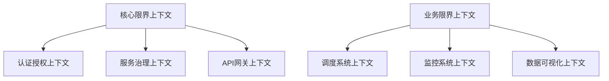
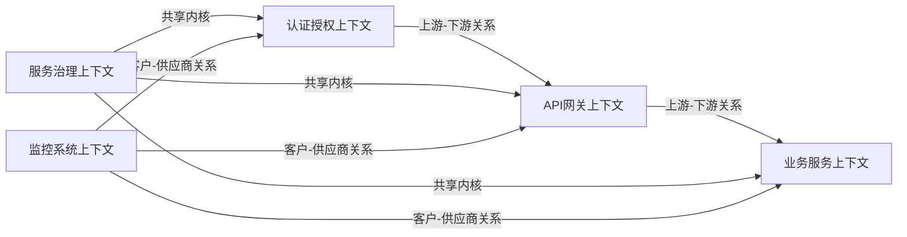
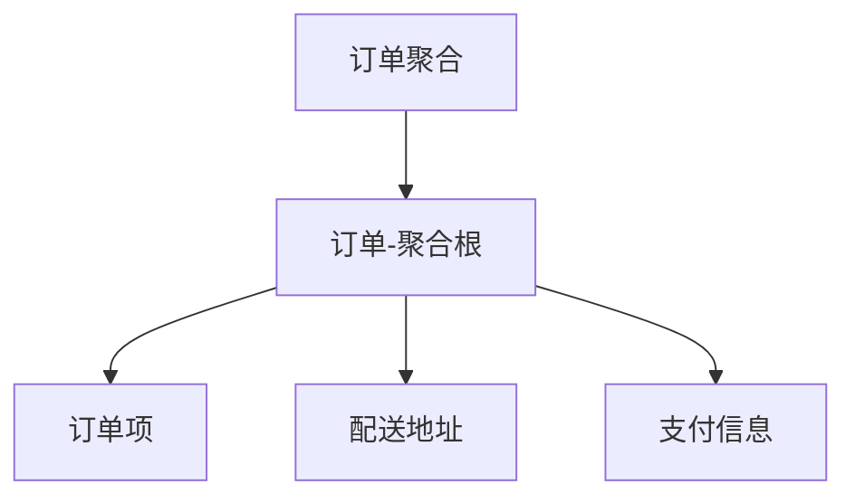
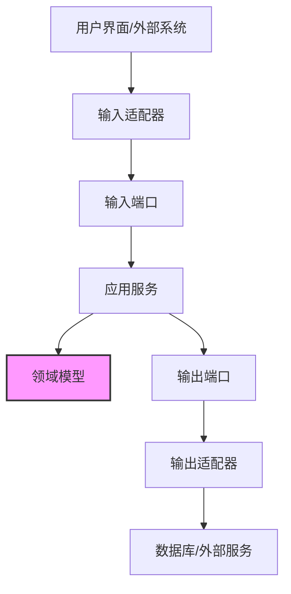
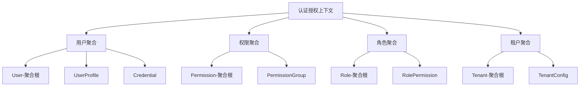
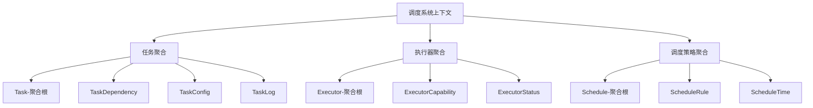

# 领域驱动设计详解

## 1. 什么是领域驱动设计 (DDD)

领域驱动设计(Domain-Driven Design，简称DDD)是一种软件开发方法，专注于以下核心原则：

- 把复杂的领域（业务）模型作为项目核心
- 通过领域专家和开发团队的紧密合作建立统一语言
- 明确业务边界，形成限界上下文（Bounded Context）
- 使用战略设计和战术设计的方法来应对复杂性

DDD特别适合处理复杂业务逻辑的系统，如本微服务平台项目。

## 2. 战略设计元素

### 2.1 限界上下文 (Bounded Context)

限界上下文是一个明确定义了特定业务领域模型适用范围的边界。在我们的项目中，主要包括以下限界上下文：



### 2.2 上下文映射 (Context Mapping)

上下文映射定义了不同限界上下文之间的关系：



### 2.3 子域 (Subdomain)

在我们的平台中，可以识别出以下子域：

1. **核心子域**：
   - 认证与授权
   - 服务治理
   - 调度系统

2. **支撑子域**：
   - 数据可视化
   - 监控系统
   - 集成服务

3. **通用子域**：
   - 通知
   - 用户管理
   - 配置管理

## 3. 战术设计元素

### 3.1 实体 (Entity)

实体是具有唯一标识符的领域对象。实体的同一性由其ID确定，而不是其属性。

在我们的项目中的实体示例：

```java
public class User {
    private final UserId id;
    private String username;
    private String email;
    private Set<Role> roles;
    
    // 构造函数、方法等
}
```

### 3.2 值对象 (Value Object)

值对象是没有唯一标识的对象，通过其所有属性值来判断相等性。值对象应该是不可变的。

在我们的项目中的值对象示例：

```java
public final class Address {
    private final String street;
    private final String city;
    private final String zipCode;
    private final String country;
    
    // 构造函数、equals/hashCode方法等
}
```

### 3.3 聚合 (Aggregate)

聚合是一组相关对象的集合，作为一个整体被看待。每个聚合有一个聚合根（根实体），外部引用只能指向聚合根。



### 3.4 领域服务 (Domain Service)

领域服务用于处理不自然地属于任何单个实体或值对象的领域逻辑。

```java
public interface PaymentService {
    PaymentResult processPayment(Order order, PaymentMethod paymentMethod);
}
```

### 3.5 仓储 (Repository)

仓储为聚合提供持久化机制，隐藏基础设施细节。

```java
public interface UserRepository {
    User findById(UserId id);
    void save(User user);
    void remove(User user);
    // 其他方法
}
```

### 3.6 领域事件 (Domain Event)

领域事件表示领域中发生的重要事件，用于解耦系统组件。

```java
public class UserCreatedEvent implements DomainEvent {
    private final UserId userId;
    private final LocalDateTime createdAt;
    
    // 构造函数、方法等
}
```

## 4. 六边形架构与DDD集成

六边形架构(Hexagonal Architecture)也称为端口与适配器架构，它与DDD结合使用，可以提供更清晰的系统结构：



在我们的项目中，六边形架构的实现包括：

1. **输入端口(Input Ports)**：应用程序对外暴露的API
   ```java
   public interface UserApplicationService {
       UserDTO createUser(CreateUserCommand command);
       UserDTO findUser(FindUserQuery query);
   }
   ```

2. **输入适配器(Input Adapters)**：处理外部请求，调用相应的输入端口
   ```java
   @RestController
   @RequestMapping("/api/users")
   public class UserController {
       private final UserApplicationService userService;
       
       // 构造函数、API端点方法等
   }
   ```

3. **输出端口(Output Ports)**：定义应用程序需要的外部服务
   ```java
   public interface UserRepository {
       User findById(UserId id);
       void save(User user);
   }
   ```

4. **输出适配器(Output Adapters)**：实现输出端口，连接外部服务
   ```java
   @Repository
   public class MySQLUserRepository implements UserRepository {
       private final JdbcTemplate jdbcTemplate;
       
       // 构造函数、方法实现等
   }
   ```

## 5. 项目中的DDD实践

### 5.1 认证授权上下文实现



### 5.2 调度系统上下文实现



### 5.3 现有系统与理想架构的差距

目前的系统与理想的DDD架构存在一些差距：

1. **领域模型不够丰富**：一些模块仍使用贫血模型，业务逻辑分散在服务层
2. **边界不够清晰**：一些上下文之间的边界模糊，存在耦合
3. **聚合设计不完善**：聚合边界未严格定义，导致潜在的一致性问题
4. **缺少领域事件**：系统间通信仍主要依赖直接调用，领域事件使用较少

## 6. 重构建议

针对上述差距，提出以下重构建议：

1. **充实领域模型**：
   - 将业务逻辑从服务层移到领域模型中
   - 确保实体和值对象的正确使用
   - 设计更丰富的领域行为

2. **明确限界上下文**：
   - 创建上下文映射图，明确定义各上下文间关系
   - 为每个上下文设计专用的反腐层
   - 考虑使用微服务进一步强化边界

3. **优化聚合设计**：
   - 识别正确的聚合根
   - 限制聚合间的直接引用
   - 确保事务一致性

4. **引入领域事件**：
   - 设计关键领域事件
   - 实现事件发布订阅机制
   - 使用事件驱动架构实现上下文间通信 