# 服务架构与调用链分析

## 1. 微服务架构概述

本项目采用微服务架构，将系统拆分成多个独立部署、独立运行的服务。主要服务包括：

- 服务注册与发现（platform-registry）
- 配置中心（platform-config）
- API网关（platform-gateway）
- 认证授权服务（platform-auth-service）
- 监控仪表板（platform-monitor-dashboard）
- 调度系统（platform-scheduler）
- 数据可视化（platform-data-visualization）

各服务之间的关系如下图所示：

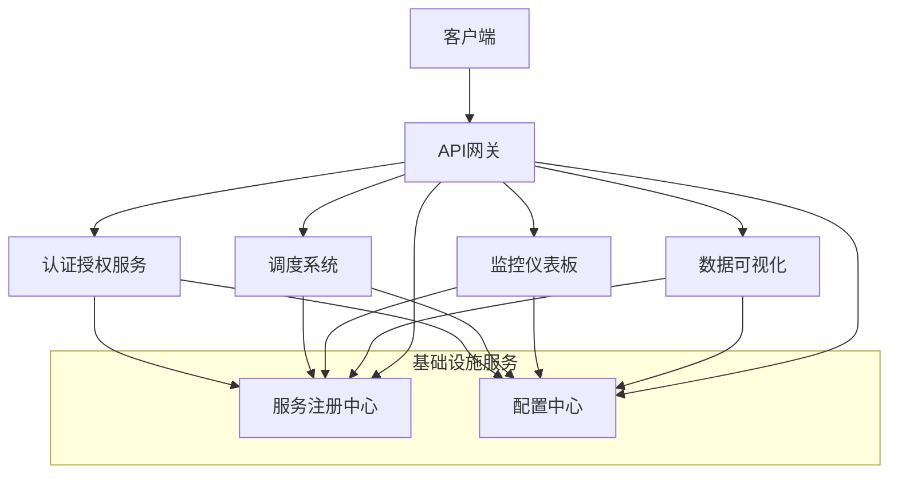

## 2. 服务注册与发现

服务注册与发现基于Nacos实现，主要工作流程如下：

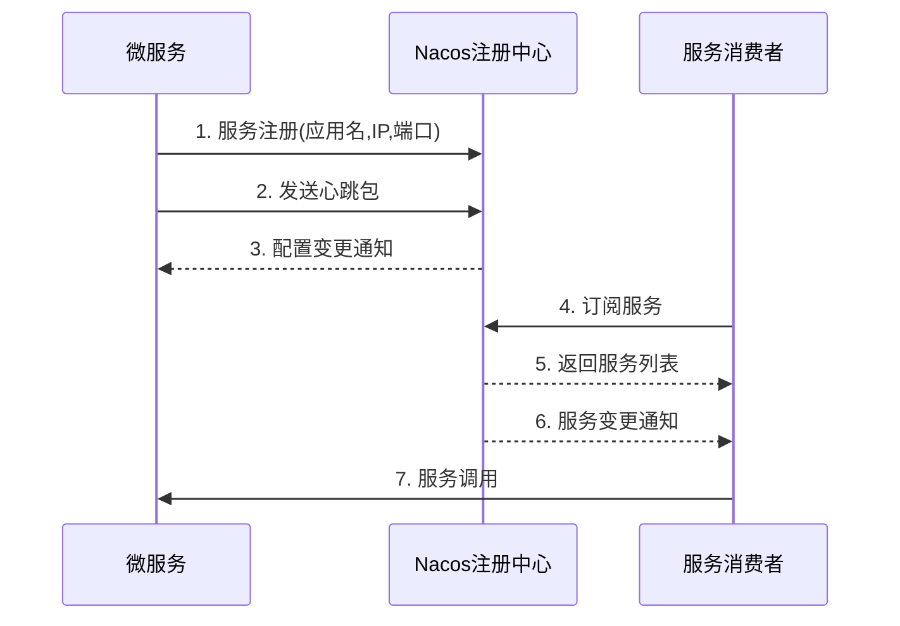

### 2.1 关键配置

服务注册配置示例：

```yaml
spring:
  application:
    name: platform-auth-service
  cloud:
    nacos:
      discovery:
        server-addr: localhost:8848
        namespace: ${spring.profiles.active:dev}
```

## 3. API网关

API网关使用Spring Cloud Gateway实现，主要职责包括：

- 路由转发
- 统一认证
- 限流控制
- 请求日志
- 响应缓存

### 3.1 网关调用流程

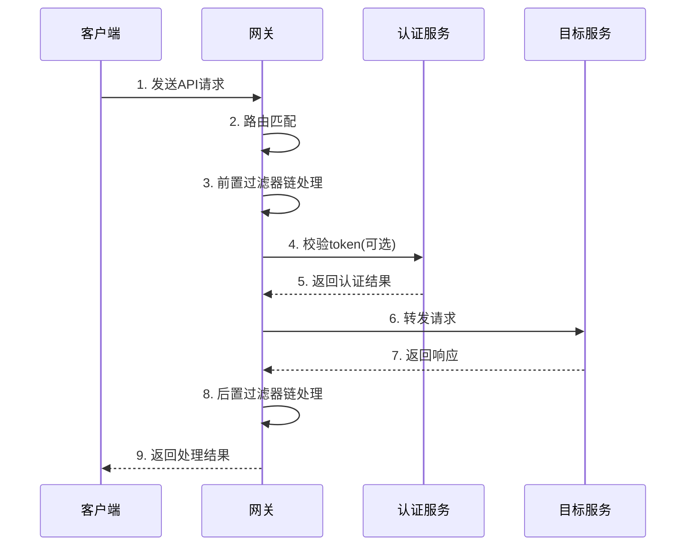

### 3.2 网关路由配置

```yaml
spring:
  cloud:
    gateway:
      routes:
        - id: auth-service
          uri: lb://platform-auth-service
          predicates:
            - Path=/auth/**
          filters:
            - StripPrefix=1
            - name: RequestRateLimiter
              args:
                redis-rate-limiter.replenishRate: 10
                redis-rate-limiter.burstCapacity: 20
```

## 4. 认证授权服务

认证授权服务基于Spring Security和JWT实现，提供用户认证、权限管理和令牌颁发功能。

### 4.1 认证流程

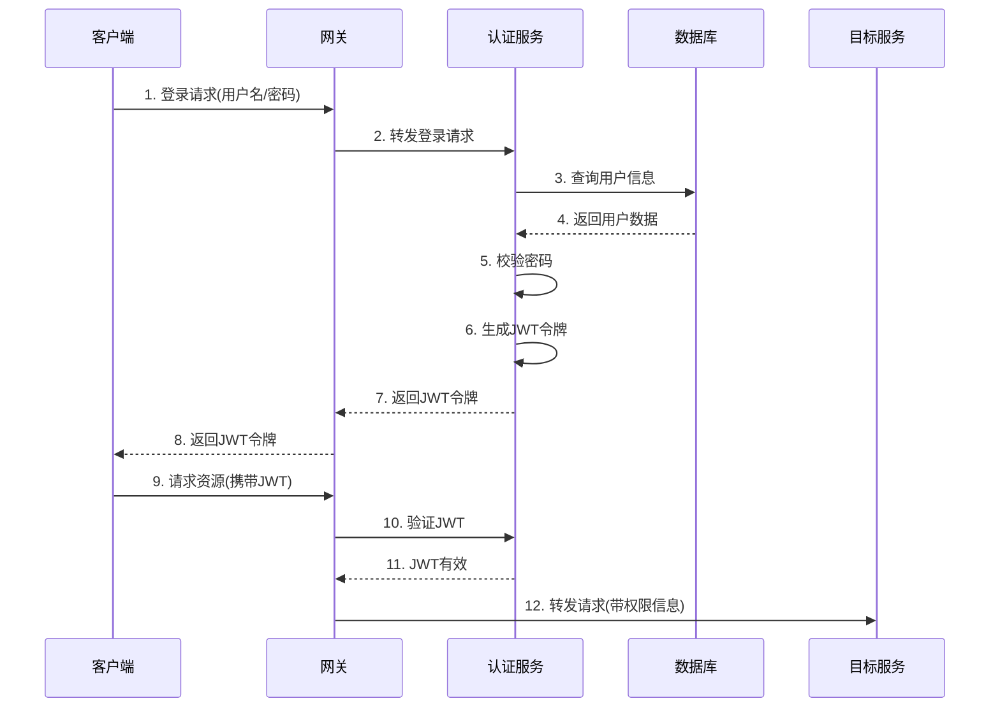

### 4.2 权限模型

系统采用RBAC(基于角色的访问控制)权限模型，主要包括：

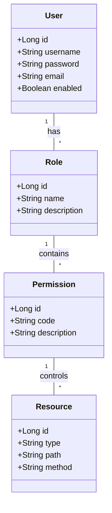

## 5. 配置中心

配置中心基于Nacos实现，提供集中配置管理、动态配置刷新等功能。

### 5.1 配置获取流程

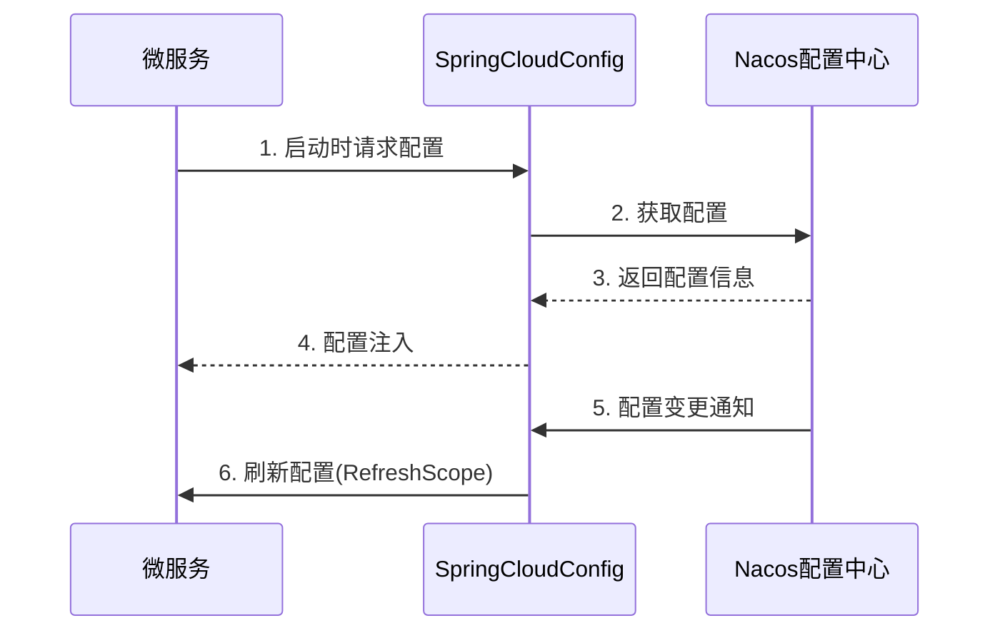

### 5.2 配置项结构

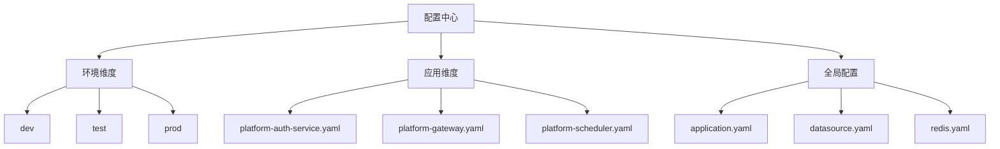

## 6. 监控仪表板

监控仪表板服务提供系统健康状态、性能指标的可视化展示。

### 6.1 监控数据流

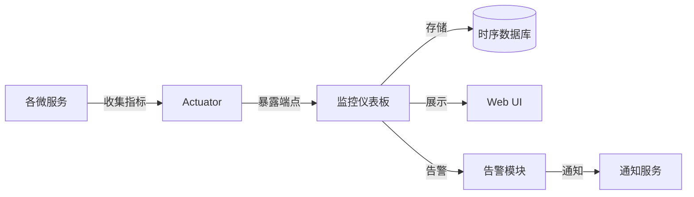

### 6.2 主要监控指标

- 服务健康状态
- JVM内存使用
- GC情况
- 线程使用
- HTTP请求统计
- 数据库连接池状态
- 自定义业务指标

## 7. 调度系统

调度系统负责任务的定时执行、依赖管理和分布式协调。

### 7.1 调度系统架构

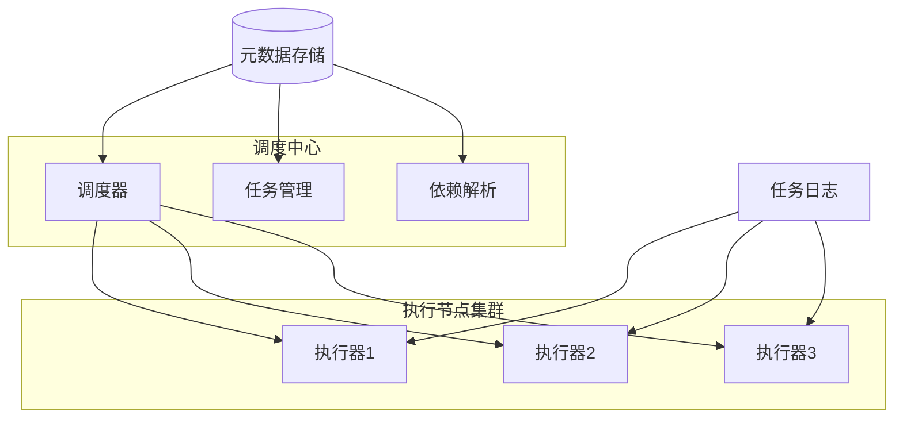

### 7.2 任务执行流程

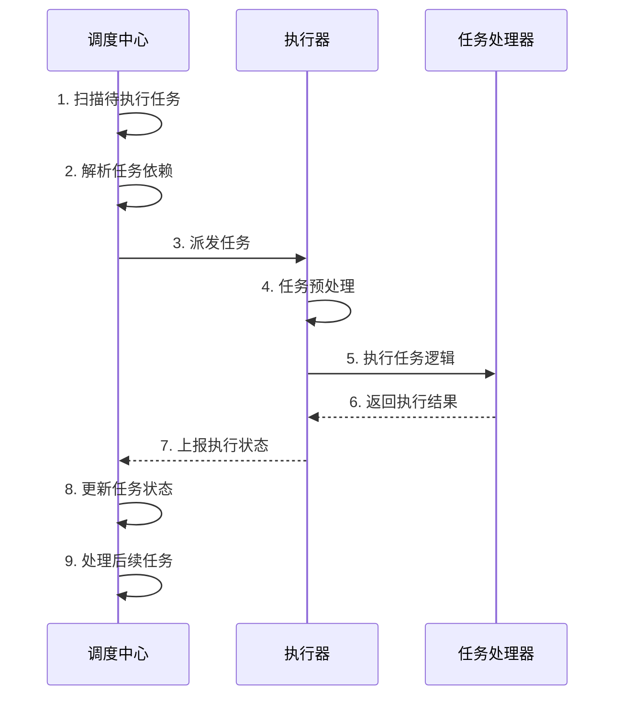

## 8. 服务间调用链分析

### 8.1 典型用户请求调用链

以用户登录并访问调度系统为例：

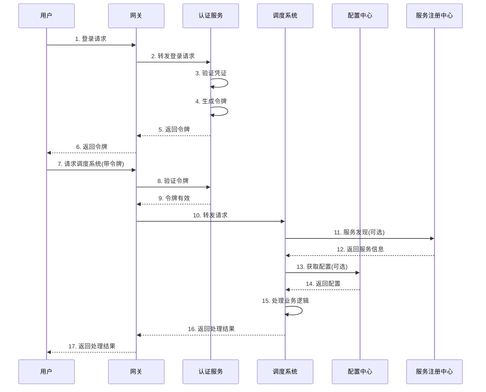

### 8.2 系统间主要依赖关系

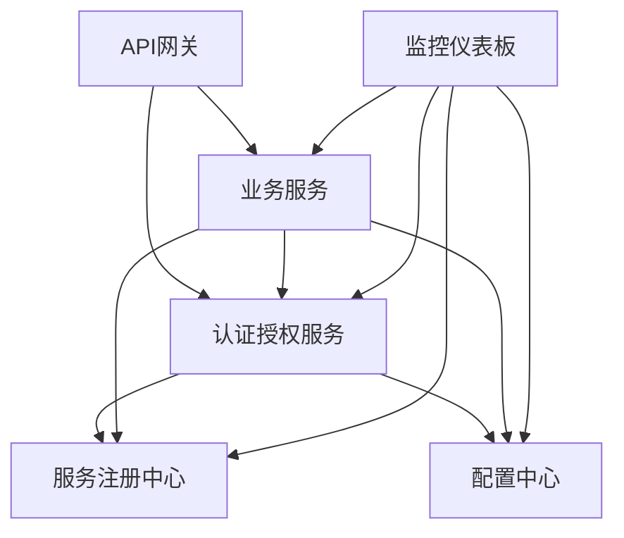

## 9. 重构建议

基于调用链分析，提出以下重构建议：

1. **提高服务弹性**：
   - 实现熔断机制(Circuit Breaker)
   - 添加重试机制和超时控制
   - 设置服务降级策略

2. **优化认证流程**：
   - 考虑分布式SSO
   - 引入OAuth2.0/OIDC规范
   - 实现令牌缓存和刷新机制

3. **完善服务治理**：
   - 添加分布式追踪(Distributed Tracing)
   - 实现全链路监控
   - 集成日志聚合系统

4. **API网关增强**：
   - 实现动态路由更新
   - 增加请求/响应数据转换
   - 加强安全防护措施

5. **微服务通信优化**：
   - 评估RPC与REST的适用场景
   - 考虑引入事件驱动架构
   - 优化序列化/反序列化性能 