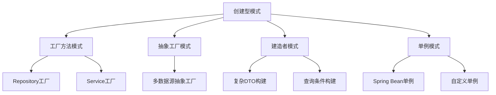
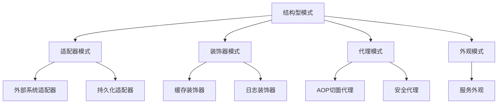
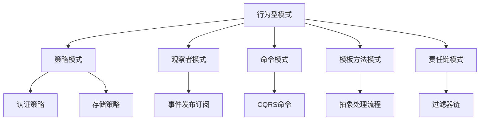
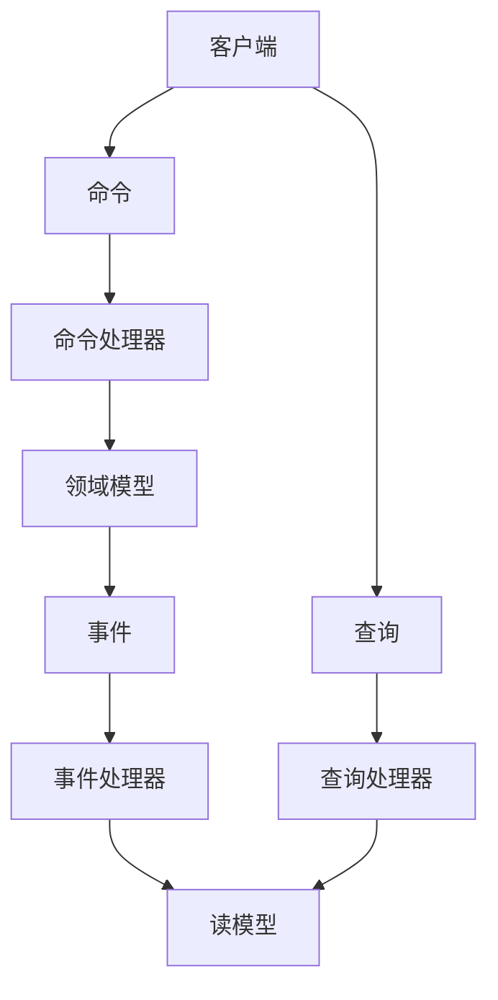
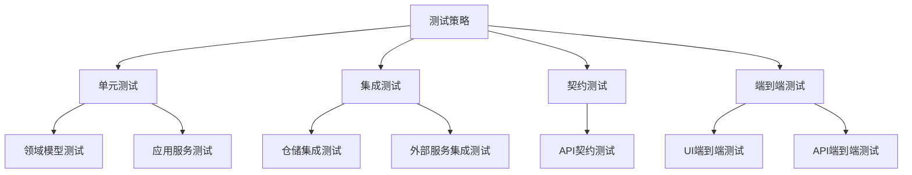

# 代码结构与模式分析

## 1. 项目整体代码结构

本项目遵循Maven多模块结构，每个微服务都是独立的Maven模块。以下是整体代码组织结构：

```
platform-parent (父项目)
├── platform-dependency (依赖管理)
├── platform-common (通用工具和组件)
├── platform-registry (服务注册中心)
├── platform-gateway (API网关)
├── platform-auth-service (认证授权服务)
├── platform-config (配置中心)
├── platform-monitor-dashboard (监控仪表板)
├── platform-scheduler (调度系统)
├── platform-scheduler-register (调度注册)
└── 其他业务模块...
```

## 2. 标准微服务模块结构

每个微服务模块采用类似的包结构，遵循六边形架构和DDD原则：

```
└── src/main/java/com/platform/{module-name}
    ├── application         # 应用层
    │   ├── command         # 命令处理器
    │   ├── dto             # 数据传输对象
    │   ├── query           # 查询处理器
    │   └── service         # 应用服务
    ├── domain              # 领域层
    │   ├── model           # 领域模型
    │   ├── repository      # 仓储接口
    │   ├── service         # 领域服务
    │   └── event           # 领域事件
    ├── infrastructure      # 基础设施层
    │   ├── config          # 配置类
    │   ├── repository      # 仓储实现
    │   ├── messaging       # 消息队列适配器
    │   └── external        # 外部服务适配器
    └── interfaces          # 接口层
        ├── rest            # REST API
        ├── graphql         # GraphQL API (可选)
        ├── grpc            # gRPC API (可选)
        └── facade          # 内部模块间调用接口
```

## 3. 设计模式应用

### 3.1 创建型模式

本项目中使用的主要创建型模式：



代码示例：

#### 3.1.1 工厂方法模式

```java
// 仓储工厂
public interface RepositoryFactory {
    UserRepository createUserRepository();
    RoleRepository createRoleRepository();
}

// MySQL实现
@Component
public class MySQLRepositoryFactory implements RepositoryFactory {
    @Override
    public UserRepository createUserRepository() {
        return new MySQLUserRepository();
    }
    
    @Override
    public RoleRepository createRoleRepository() {
        return new MySQLRoleRepository();
    }
}
```

#### 3.1.2 建造者模式

```java
// 复杂查询条件构建
public class TaskQueryBuilder {
    private String name;
    private String type;
    private LocalDateTime startTime;
    private LocalDateTime endTime;
    private String status;
    private Integer priority;
    
    public TaskQueryBuilder withName(String name) {
        this.name = name;
        return this;
    }
    
    public TaskQueryBuilder withType(String type) {
        this.type = type;
        return this;
    }
    
    // 其他setter方法...
    
    public TaskQuery build() {
        return new TaskQuery(name, type, startTime, endTime, status, priority);
    }
}
```

### 3.2 结构型模式

本项目中使用的主要结构型模式：



代码示例：

#### 3.2.1 适配器模式

```java
// 领域接口
public interface NotificationService {
    void sendNotification(User user, String message);
}

// 适配外部邮件系统
@Service
public class EmailNotificationAdapter implements NotificationService {
    private final EmailClient emailClient;
    
    @Override
    public void sendNotification(User user, String message) {
        EmailMessage email = new EmailMessage();
        email.setTo(user.getEmail());
        email.setSubject("通知");
        email.setBody(message);
        
        emailClient.send(email);
    }
}
```

#### 3.2.2 装饰器模式

```java
// 基础接口
public interface TaskRepository {
    Task findById(TaskId id);
    void save(Task task);
}

// 缓存装饰器
@Component
public class CachedTaskRepository implements TaskRepository {
    private final TaskRepository delegate;
    private final Cache<TaskId, Task> cache;
    
    @Override
    public Task findById(TaskId id) {
        return cache.get(id, k -> delegate.findById(k));
    }
    
    @Override
    public void save(Task task) {
        delegate.save(task);
        cache.put(task.getId(), task);
    }
}
```

### 3.3 行为型模式

本项目中使用的主要行为型模式：



代码示例：

#### 3.3.1 策略模式

```java
// 认证策略接口
public interface AuthenticationStrategy {
    AuthenticationResult authenticate(Credentials credentials);
}

// 密码认证实现
@Component
public class PasswordAuthenticationStrategy implements AuthenticationStrategy {
    @Override
    public AuthenticationResult authenticate(Credentials credentials) {
        // 密码认证逻辑
    }
}

// OAuth认证实现
@Component
public class OAuthAuthenticationStrategy implements AuthenticationStrategy {
    @Override
    public AuthenticationResult authenticate(Credentials credentials) {
        // OAuth认证逻辑
    }
}

// 策略选择器
@Service
public class AuthenticationService {
    private final Map<String, AuthenticationStrategy> strategies;
    
    public AuthenticationResult authenticate(String type, Credentials credentials) {
        AuthenticationStrategy strategy = strategies.get(type);
        if (strategy == null) {
            throw new UnsupportedAuthenticationTypeException(type);
        }
        return strategy.authenticate(credentials);
    }
}
```

#### 3.3.2 观察者模式

```java
// 领域事件
public interface DomainEventPublisher {
    void publish(DomainEvent event);
}

// Spring实现
@Component
public class SpringDomainEventPublisher implements DomainEventPublisher {
    private final ApplicationEventPublisher publisher;
    
    @Override
    public void publish(DomainEvent event) {
        publisher.publishEvent(event);
    }
}

// 事件监听器
@Component
public class UserCreatedEventListener {
    @EventListener
    public void handleUserCreatedEvent(UserCreatedEvent event) {
        // 处理用户创建事件
    }
}
```

## 4. CQRS架构模式

在调度系统和监控仪表板中，我们采用了CQRS（命令查询责任分离）架构模式：



代码结构：

```
└── src/main/java/com/platform/scheduler
    ├── application
    │   ├── command                       # 命令处理
    │   │   ├── CreateTaskCommand.java    # 创建任务命令
    │   │   ├── UpdateTaskCommand.java    # 更新任务命令
    │   │   └── TaskCommandHandler.java   # 命令处理器
    │   └── query                         # 查询处理
    │       ├── TaskQuery.java            # 任务查询对象
    │       ├── TaskQueryResult.java      # 任务查询结果
    │       └── TaskQueryHandler.java     # 查询处理器
    ├── domain
    │   ├── model
    │   │   └── Task.java                 # 领域模型
    │   └── event
    │       ├── TaskCreatedEvent.java     # 任务创建事件
    │       └── TaskUpdatedEvent.java     # 任务更新事件
    └── infrastructure
        ├── repository                    # 写模型存储
        └── readmodel                     # 读模型存储
```

## 5. 代码分层与职责

### 5.1 接口层 (Interfaces)

接口层负责处理外部请求和呈现，主要包括：

- **Controller**: 处理HTTP请求，参数验证，响应封装
- **Assembler**: 在DTO和领域对象间转换
- **DTO**: 数据传输对象，面向客户端的数据结构

示例：

```java
@RestController
@RequestMapping("/api/tasks")
public class TaskController {
    private final TaskApplicationService taskService;
    private final TaskAssembler taskAssembler;
    
    @PostMapping
    public ResponseEntity<TaskDTO> createTask(@RequestBody @Valid CreateTaskRequest request) {
        CreateTaskCommand command = new CreateTaskCommand(
            request.getName(),
            request.getDescription(),
            request.getDueDate()
        );
        
        Task task = taskService.createTask(command);
        TaskDTO dto = taskAssembler.toDTO(task);
        
        return ResponseEntity.created(URI.create("/api/tasks/" + dto.getId()))
                             .body(dto);
    }
}
```

### 5.2 应用层 (Application)

应用层是用例实现层，负责：

- 协调领域对象之间的交互
- 事务边界管理
- 安全检查
- 集成其他应用服务

示例：

```java
@Service
@Transactional
public class TaskApplicationService {
    private final TaskRepository taskRepository;
    private final DomainEventPublisher eventPublisher;
    
    public Task createTask(CreateTaskCommand command) {
        // 创建任务
        Task task = new Task(
            new TaskId(),
            command.getName(),
            command.getDescription(),
            command.getDueDate()
        );
        
        // 保存任务
        taskRepository.save(task);
        
        // 发布事件
        eventPublisher.publish(new TaskCreatedEvent(task.getId()));
        
        return task;
    }
}
```

### 5.3 领域层 (Domain)

领域层包含业务核心概念和规则：

- **实体**: 具有唯一标识的对象
- **值对象**: 不可变的描述性对象
- **聚合**: 确保业务不变性的对象集合
- **领域服务**: 不适合放在实体或值对象中的领域逻辑

示例：

```java
public class Task {
    private final TaskId id;
    private String name;
    private String description;
    private LocalDateTime dueDate;
    private TaskStatus status;
    
    // 构造函数、getter和setter
    
    public void markAsCompleted() {
        if (status != TaskStatus.IN_PROGRESS) {
            throw new InvalidTaskStateException(
                "只有进行中的任务可以被标记为已完成"
            );
        }
        
        this.status = TaskStatus.COMPLETED;
    }
    
    public boolean isOverdue() {
        return dueDate.isBefore(LocalDateTime.now()) 
               && status != TaskStatus.COMPLETED;
    }
}
```

### 5.4 基础设施层 (Infrastructure)

基础设施层提供技术支持：

- 仓储实现
- 消息发送/接收
- 外部API集成
- 安全机制
- 缓存实现

示例：

```java
@Repository
public class MySQLTaskRepository implements TaskRepository {
    private final JdbcTemplate jdbcTemplate;
    private final TaskRowMapper taskRowMapper;
    
    @Override
    public Task findById(TaskId id) {
        String sql = "SELECT * FROM tasks WHERE id = ?";
        return jdbcTemplate.queryForObject(
            sql, 
            new Object[]{id.getValue()}, 
            taskRowMapper
        );
    }
    
    @Override
    public void save(Task task) {
        if (exists(task.getId())) {
            update(task);
        } else {
            insert(task);
        }
    }
    
    private boolean exists(TaskId id) {
        String sql = "SELECT COUNT(*) FROM tasks WHERE id = ?";
        Integer count = jdbcTemplate.queryForObject(
            sql, 
            new Object[]{id.getValue()}, 
            Integer.class
        );
        return count != null && count > 0;
    }
    
    private void insert(Task task) {
        // 插入实现
    }
    
    private void update(Task task) {
        // 更新实现
    }
}
```

## 6. 代码质量分析

### 6.1 主要优点

1. **清晰的分层结构**：系统采用了清晰的分层架构，职责边界明确
2. **领域模型聚焦**：领域层专注于业务逻辑实现，不包含技术细节
3. **松耦合设计**：通过接口抽象和依赖注入实现了系统组件的松耦合
4. **丰富的设计模式**：合理使用了多种设计模式来解决特定问题
5. **单一职责**：多数类只有一个变更理由，遵循单一职责原则

### 6.2 存在的问题

1. **贫血模型过多**：部分模块的领域对象趋向贫血，业务逻辑散布在服务层
2. **技术框架泄露**：部分领域对象引入了框架注解，违反了框架无关原则
3. **长类和长方法**：一些服务类职责过重，存在方法过长问题
4. **异常处理不统一**：异常处理策略不够一致，有些使用错误码，有些使用异常抛出
5. **代码重复**：部分通用功能实现重复，缺少抽象

### 6.3 改进建议

1. **充实领域模型**：将散布在服务层的业务逻辑迁移到领域对象中
2. **重构贫血模型**：为领域对象添加行为，使其更符合面向对象设计
3. **移除框架依赖**：使领域模型与技术框架彻底分离
4. **提取通用组件**：识别并提取重复代码为通用组件
5. **重构长类和长方法**：使用提取方法、提取类等重构手段
6. **统一异常处理**：建立一致的异常处理策略

## 7. 测试架构

系统采用了多层次的测试策略：



### 7.1 单元测试

单元测试覆盖领域模型、应用服务和工具类：

```java
@ExtendWith(MockitoExtension.class)
public class TaskTest {
    
    @Test
    void shouldMarkTaskAsCompleted() {
        // 准备
        Task task = new Task(new TaskId(), "测试任务", "描述", LocalDateTime.now().plusDays(1));
        task.start(); // 将任务设为进行中
        
        // 执行
        task.markAsCompleted();
        
        // 验证
        assertEquals(TaskStatus.COMPLETED, task.getStatus());
    }
    
    @Test
    void shouldThrowExceptionWhenMarkingNonInProgressTaskAsCompleted() {
        // 准备
        Task task = new Task(new TaskId(), "测试任务", "描述", LocalDateTime.now().plusDays(1));
        // 任务处于初始化状态，未开始
        
        // 执行 & 验证
        assertThrows(InvalidTaskStateException.class, task::markAsCompleted);
    }
}
```

## 8. 重构建议

基于以上分析，对代码结构提出以下重构建议：

1. **统一分层架构**：确保所有模块遵循相同的分层架构和包结构
2. **实现充血模型**：重构贫血领域模型，确保领域逻辑封装在领域对象中
3. **严格隔离领域模型**：消除领域模型对框架和基础设施的依赖
4. **提取共享抽象**：识别跨模块的通用模式，提取为共享抽象
5. **扩展单元测试**：增加测试覆盖率，特别是对领域逻辑的测试
6. **实现统一异常处理**：建立全局异常处理机制，统一异常响应格式
7. **重构长方法**：应用提取方法、策略模式等重构大型方法
8. **引入更多不变性**：增加值对象使用，确保关键数据不可变性 