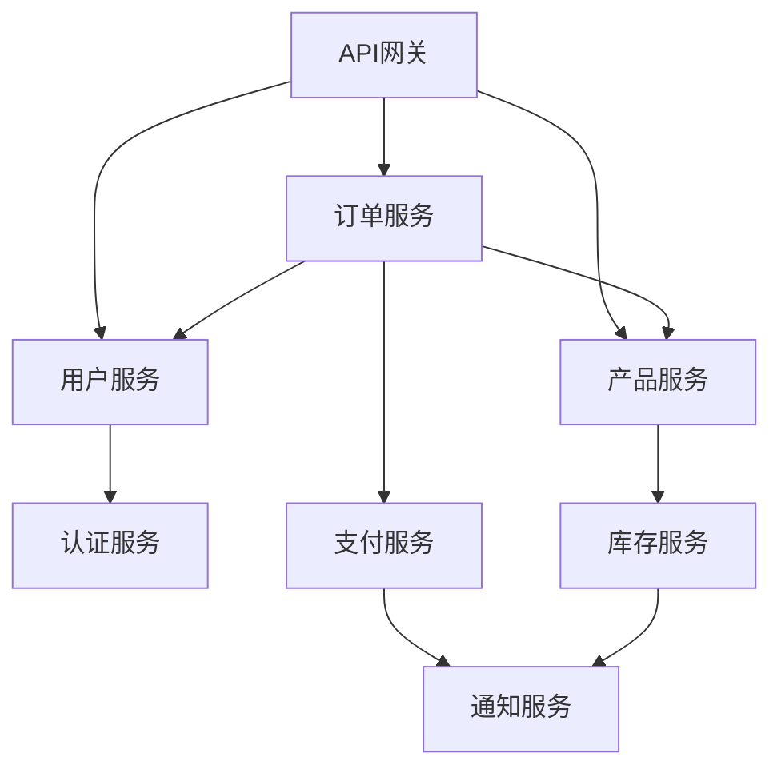
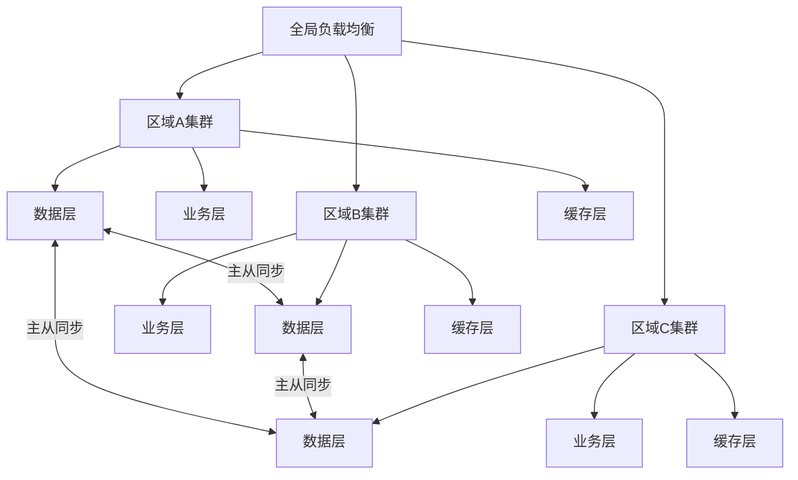

# Microservice Architecture Design for Platform Services

**Created:** 4/26/2025 12:36  
**Updated:** 4/26/2025 13:00  
**Exported:** 4/26/2025 13:04

## Prompt:

定时任务注册 和执行分开
platform-collect
platform-fluxcore
platform-common
platform-buss-dashboard
platform-monitor-dashboard
platform-gateway
platform-scheduler
platform-scheduler-register
platform-scheduler-query
判断自身内存和cpu过高 外部流控
platform-config
platform-registry
日志与审计系统
消息队列
分布式事务管理器
权限与认证中心
告警
数据存储与缓存
CI\cd容器化
模块通信
网关灰度和回滚
文档和api
结合现有的本地工作目录的文档和代码对以上的一些思路设计重新完善一份详细的大框架设计文档

## Response:

我理解您需要基于现有的项目目录结构，设计一个完善的微服务架构框架文档。让我先整理一下需要的前提信息。

在开始设计之前，我需要了解：

1. 各个模块的具体功能和职责
2. 现有代码的结构和依赖关系
3. 技术栈选择和限制
4. 业务流程和数据流向

让我先检查一下现有的项目结构，以获取更多信息。

```
This block is not supported on your current device yet.
```

让我进一步检查一些关键文件的内容，以更好地理解项目结构和技术栈。

```
This block is not supported on your current device yet.
```

```
This block is not supported on your current device yet.
```

让我查看一下Nacos配置示例，了解系统配置的关键参数:

```
This block is not supported on your current device yet.
```

让我检查平台的架构信息和现有文档:

```
This block is not supported on your current device yet.
```

让我继续查看模块结构:

```
This block is not supported on your current device yet.
```

```
This block is not supported on your current device yet.
```

```
This block is not supported on your current device yet.
```

```
This block is not supported on your current device yet.
```

```
This block is not supported on your current device yet.
```

```
This block is not supported on your current device yet.
```

```
This block is not supported on your current device yet.
```

基于我对项目结构和代码的分析，我现在对平台架构有了初步了解。接下来，我将根据您提出的需求，设计一个完善的微服务架构框架文档。由于内容较多，我会分段回复。

# 平台服务微服务架构设计文档

## 1. 架构概述

### 1.1 设计目标

平台服务微服务架构旨在构建一个高度可扩展、松耦合且易于维护的企业级系统。该架构基于领域驱动设计(DDD)原则，采用微服务架构模式，以满足以下目标：

- 提供稳定可靠的企业级服务支撑平台
- 支持业务快速迭代和弹性扩展
- 简化开发流程，提高团队协作效率
- 实现服务的高可用性、可伸缩性和容错性
- 支持系统的灰度发布和平滑升级
- 提供完善的监控、日志和审计功能

### 1.2 技术栈选择

- **基础框架**：Spring Boot 2.7.x，Spring Cloud 2021.0.x
- **配置中心**：Nacos Config
- **服务注册发现**：Nacos Discovery
- **API网关**：Spring Cloud Gateway
- **负载均衡**：Spring Cloud LoadBalancer
- **熔断限流**：Sentinel
- **服务通信**：OpenFeign
- **持久层**：MyBatis-Plus
- **缓存**：Redis
- **消息队列**：RocketMQ
- **分布式事务**：Seata
- **API文档**：Knife4j (Swagger增强)
- **对象映射**：MapStruct
- **日志框架**：SLF4J + Logback
- **容器化**：Docker + Kubernetes
- **CI/CD**：Jenkins/GitLab CI

## 2. 系统架构设计

### 2.1 整体架构图

```
+----------------------------------------------------------+
|                      客户端访问层                          |
|  Web客户端  /  移动端  /  第三方系统  /  管理控制台         |
+----------------------------------------------------------+
                            |
+----------------------------------------------------------+
|                      API网关层                            |
|       platform-gateway (Spring Cloud Gateway)            |
|       服务路由 / 限流 / 认证 / 日志 / 监控                 |
+----------------------------------------------------------+
                            |
+----------------------------------------------------------+
|                    业务服务层                              |
|  +---------------+  +----------------+ +----------------+ |
|  | 核心业务服务群 |  | 运营管理服务群  | |  数据分析服务群 | |
|  +---------------+  +----------------+ +----------------+ |
+----------------------------------------------------------+
                            |
+----------------------------------------------------------+
|                    平台服务层                              |
| +-------------+ +--------------+ +---------------------+ |
| | 注册中心     | | 配置中心      | | 调度中心             | |
| | platform-   | | platform-    | | platform-scheduler  | |
| | registry    | | config       | +---------------------+ |
| +-------------+ +--------------+ | 监控中心             | |
| +-------------+ +--------------+ | platform-monitor    | |
| | 日志中心     | | 消息队列      | +---------------------+ |
| +-------------+ +--------------+ | 认证授权中心          | |
| +-------------+ +--------------+ +---------------------+ |
| | 事务协调器   | | 流量控制      | | 数据集成中心          | |
| +-------------+ +--------------+ +---------------------+ |
+----------------------------------------------------------+
                            |
+----------------------------------------------------------+
|                    数据存储层                              |
|   关系型数据库  /  缓存  /  消息队列  /  分布式文件系统     |
+----------------------------------------------------------+
```

### 2.2 架构分层

1. **客户端访问层**：各类终端访问入口
2. **API网关层**：统一接入点，负责路由、认证、限流等功能
3. **业务服务层**：按领域划分的各类业务微服务
4. **平台服务层**：支持业务层的基础设施服务
5. **数据存储层**：数据持久化存储解决方案

## 3. 核心组件设计

### 3.1 配置中心 (platform-config)

#### 3.1.1 功能定位

负责统一管理所有微服务的配置信息，包括环境配置、业务配置、功能开关等。

#### 3.1.2 主要功能

- 配置的集中管理与版本控制
- 多环境配置管理（开发、测试、生产）
- 配置动态更新与推送
- 配置变更审计与操作日志
- 敏感配置的加密存储

#### 3.1.3 技术实现

基于Nacos Config实现，提供REST API进行配置管理。

### 3.2 服务注册中心 (platform-registry)

#### 3.2.1 功能定位

为所有微服务提供注册和发现功能，是服务通信的基础。

#### 3.2.2 主要功能

- 服务实例注册与发现
- 服务健康检查
- 服务元数据管理
- 服务实例负载均衡

#### 3.2.3 技术实现

基于Nacos Discovery实现，支持服务的自动注册和发现。

### 3.3 API网关 (platform-gateway)

#### 3.3.1 功能定位

统一的服务入口，对外暴露API，并实现路由、认证、限流等功能。

#### 3.3.2 主要功能

- 请求路由转发
- 统一认证授权
- 流量控制与限流
- 灰度发布支持
- 请求/响应日志记录
- API文档聚合
- 跨域请求处理
- 请求响应转换

#### 3.3.3 技术实现

基于Spring Cloud Gateway实现，整合Sentinel进行限流，结合JWT实现认证。

### 3.4 调度中心

#### 3.4.1 功能定位

负责全系统的任务调度管理，包括定时任务、异步任务等。

#### 3.4.2 主要模块

1. **任务注册服务 (platform-scheduler-register)**
    - 任务定义与注册
    - 任务参数配置
    - 任务依赖管理
    - 任务版本控制

2. **任务执行服务 (platform-scheduler)**
    - 任务调度执行
    - 执行结果管理
    - 失败重试策略
    - 执行性能监控
    - 资源隔离与保护

3. **任务查询服务 (platform-scheduler-query)**
    - 任务执行历史查询
    - 任务状态查询
    - 任务执行统计分析
    - 任务预警通知

#### 3.4.3 技术实现

任务注册与任务执行解耦，基于数据库或分布式协调实现任务分配，支持集群部署和高可用。

### 3.5 监控中心

#### 3.5.1 功能定位

全面监控系统的运行状态，包括服务状态、资源使用、业务指标等。

#### 3.5.2 主要模块

1. **业务监控 (platform-buss-dashboard)**
    - 业务指标采集
    - 业务流程监控
    - 业务异常监控
    - 业务指标分析

2. **系统监控 (platform-monitor-dashboard)**
    - 服务状态监控
    - 资源使用监控
    - 性能指标监控
    - 系统告警管理

#### 3.5.3 技术实现

基于Spring Boot Actuator采集基础数据，结合Prometheus和Grafana实现监控可视化，整合告警系统进行异常通知。

## Prompt:

我还需要你融合下面这些先进概念设计Java编程的先进概念

1. **反应式编程(Reactive Programming)** 反应式编程是一种专注于数据流和变化传播的编程范式，允许应用程序以异步、非阻塞方式响应数据流变化。在Java中，可以通过Project
   Reactor或RxJava等库实现。
2. **函数式编程(Functional Programming)** Java 8引入了Lambda表达式、Stream API和函数式接口，使开发者能够采用函数式编程风格，提高代码的可读性和简洁性。
3. **微服务架构(Microservices Architecture)** 将应用程序拆分为小型、自治的服务，每个服务专注于特定业务功能。在Java中，Spring
   Boot和Spring Cloud是构建微服务的流行框架。
4. **云原生开发(Cloud-Native Development)** 设计专为云环境优化的应用程序，利用容器化、服务网格和声明式API等技术。
5. **事件驱动架构(Event-Driven Architecture)** 构建围绕事件生产、检测和消费的系统，使组件能够松散耦合。Java中的Kafka、RabbitMQ等消息中间件可支持此架构。
6. **CQRS(命令查询责任分离)** 将修改数据的操作(命令)和读取数据的操作(查询)分离，可以独立优化两种操作，提高性能和可扩展性。
7. **事件溯源(Event Sourcing)** 存储所有对应用程序状态的更改作为事件序列，而不是仅存储当前状态，支持高级审计和时间点恢复。
8. **六边形架构(Hexagonal Architecture)/端口与适配器** 通过将业务逻辑与外部系统交互分离，使应用核心独立于外部技术实现，便于测试和维护。
9. **响应式系统设计(Reactive Systems)** 构建具有弹性、响应性、弹性和消息驱动特性的分布式系统，与反应式编程相辅相成。
10. **DevOps与CI/CD实践** 将开发和运维集成，通过自动化部署管道、基础设施即代码和监控反馈循环提高交付效率。
11. **测试驱动开发(TDD)与行为驱动开发(BDD)** 先编写测试再实现功能，或通过行为规范指导开发，提高代码质量和文档性。
12. **不可变编程(Immutable Programming)** 使用不可变对象和数据结构，简化并发编程，减少副作用，提高系统可预测性。
    这些先进概念可以单独使用或结合使用，根据您的项目需求选择合适的概念将有助于构建更健壮、可维护的Java应用程序。您对哪些概念特别感兴趣，需要我进一步详细解释吗？

## Response:

我将融合这些先进的Java编程概念，为您完善平台架构设计文档。这些概念将使我们的架构更加现代化、高效和可维护。

# 平台服务微服务架构设计文档 (增强版)

## 1. 架构概述

### 1.1 设计目标

平台服务微服务架构旨在构建一个高度可扩展、松耦合且易于维护的企业级系统。该架构基于领域驱动设计(DDD)原则，采用微服务架构模式，以满足以下目标：

- 提供稳定可靠的企业级服务支撑平台
- 支持业务快速迭代和弹性扩展
- 简化开发流程，提高团队协作效率
- 实现服务的高可用性、可伸缩性和容错性
- 支持系统的灰度发布和平滑升级
- 提供完善的监控、日志和审计功能

### 1.2 技术栈选择

- **基础框架**：Spring Boot 2.7.x，Spring Cloud 2021.0.x
- **响应式编程**：Project Reactor, Spring WebFlux
- **配置中心**：Nacos Config
- **服务注册发现**：Nacos Discovery
- **API网关**：Spring Cloud Gateway (响应式)
- **负载均衡**：Spring Cloud LoadBalancer
- **熔断限流**：Sentinel
- **服务通信**：OpenFeign, WebClient (响应式)
- **持久层**：MyBatis-Plus, R2DBC (响应式数据访问)
- **缓存**：Redis Reactive
- **消息队列**：RocketMQ, Kafka (事件驱动架构)
- **分布式事务**：Seata
- **API文档**：Knife4j (Swagger增强)
- **对象映射**：MapStruct
- **日志框架**：SLF4J + Logback
- **容器化**：Docker + Kubernetes
- **CI/CD**：Jenkins/GitLab CI, ArgoCD (GitOps)

## 2. 系统架构设计

### 2.1 架构核心理念

本架构融合了多种先进的编程概念和设计原则：

1. **六边形架构 (Hexagonal Architecture)**：
    - 将业务领域逻辑与技术实现分离
    - 通过端口和适配器模式实现技术组件可替换性
    - 确保核心业务逻辑不依赖于外部技术实现

2. **云原生设计原则**：
    - 容器化部署
    - 基础设施即代码 (IaC)
    - 服务弹性扩展与自愈能力
    - 声明式API与配置

3. **响应式系统设计**：
    - 响应性：系统及时响应用户请求
    - 弹性：系统在部分失败的情况下保持响应能力
    - 弹性：系统根据负载自动扩缩容
    - 消息驱动：系统组件通过异步消息通信

4. **CQRS与事件溯源**：
    - 读写操作分离，优化各自的性能和扩展性
    - 使用事件记录系统状态变更，而非仅存储当前状态
    - 支持完整审计、历史重现和时间点恢复

5. **不可变编程**：
    - 使用不可变对象简化并发处理
    - 减少副作用，提高系统可预测性
    - 利用函数式编程范式实现业务逻辑

### 2.2 整体架构图

```
+--------------------------------------------------------------------+
|                          客户端访问层                                |
|   Web客户端  /  移动端  /  第三方系统  /  管理控制台  /  IoT设备       |
+--------------------------------------------------------------------+
                                |
+--------------------------------------------------------------------+
|                           API网关层                                 |
|            platform-gateway (响应式Spring Cloud Gateway)            |
|          服务路由 / 限流 / 认证 / 日志 / 监控 / 灰度发布               |
+--------------------------------------------------------------------+
                                |
+--------------------------------------------------------------------+
|                           业务服务层                                 |
|                       (六边形架构 + CQRS)                           |
|  +-------------------+  +-------------------+  +------------------+|
|  |    核心业务服务群    |  |    运营管理服务群   |  |   数据分析服务群   ||
|  | (领域驱动设计/DDD)  |  |                   |  |                  ||
|  +-------------------+  +-------------------+  +------------------+|
+--------------------------------------------------------------------+
                                |
+--------------------------------------------------------------------+
|                  事件总线 (Event Bus / Backbone)                    |
|              基于Kafka/RocketMQ的事件驱动架构与集成层                 |
+--------------------------------------------------------------------+
                                |
+--------------------------------------------------------------------+
|                           平台服务层                                 |
| +-------------------+ +-------------------+ +---------------------+|
| | 注册中心            | | 配置中心           | | 调度中心              ||
| | platform-registry | | platform-config   | | platform-scheduler  ||
| +-------------------+ +-------------------+ +---------------------+|
| | 监控中心(响应式)    | | 流量控制中心       | | 日志与审计中心         ||
| | platform-monitor  | | platform-fluxcore | | (事件溯源)            ||
| +-------------------+ +-------------------+ +---------------------+|
| | 认证授权中心        | | 分布式事务协调器    | | 数据集成中心           ||
| +-------------------+ +-------------------+ +---------------------+|
+--------------------------------------------------------------------+
                                |
+--------------------------------------------------------------------+
|                           数据存储层                                 |
|  关系型数据库 / NoSQL / 时序数据库 / 缓存 / 消息队列 / 分布式文件系统   |
+--------------------------------------------------------------------+
```

## 3. 核心组件设计

### 3.1 配置中心 (platform-config)

#### 3.1.1 功能定位

负责统一管理所有微服务的配置信息，包括环境配置、业务配置、功能开关等。

#### 3.1.2 主要功能

- 配置的集中管理与版本控制
- 多环境配置管理（开发、测试、生产）
- 配置动态更新与推送
- 配置变更审计与操作日志
- 敏感配置的加密存储

#### 3.1.3 技术实现

- 基于Nacos Config实现
- 采用Git作为配置版本管理后端
- 支持配置变更的WebHook通知
- 应用响应式编程实现配置变更的实时推送

### 3.2 服务注册中心 (platform-registry)

#### 3.2.1 功能定位

为所有微服务提供注册和发现功能，是服务通信的基础。

#### 3.2.2 主要功能

- 服务实例注册与发现
- 服务健康检查
- 服务元数据管理
- 服务实例负载均衡

#### 3.2.3 技术实现

- 基于Nacos Discovery实现
- 支持服务的自动注册和发现
- 整合Kubernetes服务发现机制
- 提供DNS接口，实现服务名解析

### 3.3 API网关 (platform-gateway)

#### 3.3.1 功能定位

统一的服务入口，对外暴露API，并实现路由、认证、限流等功能。

#### 3.3.2 主要功能

- 请求路由转发
- 统一认证授权
- 流量控制与限流
- 灰度发布支持
- 请求/响应日志记录
- API文档聚合
- 跨域请求处理
- 请求响应转换

#### 3.3.3 技术实现

- 基于响应式的Spring Cloud Gateway实现
- 采用非阻塞I/O模型提高处理能力
- 整合Sentinel进行限流，结合JWT实现认证
- 支持动态路由配置更新
- 实现Canary部署和A/B测试支持

### 3.4 流量控制中心 (platform-fluxcore)

#### 3.4.1 功能定位

负责全平台的流量控制、熔断降级和系统保护。

#### 3.4.2 主要功能

- 服务限流控制
- 熔断降级管理
- 系统保护规则
- 实时流量监控
- 自适应流控算法

#### 3.4.3 技术实现

- 基于Sentinel实现流量控制框架
- 采用响应式编程处理控制决策
- 集成自定义的资源自适应算法
- 支持业务级的流量调度和保护策略

### 3.5 调度中心

#### 3.5.1 功能定位

负责全系统的任务调度管理，包括定时任务、异步任务等。

#### 3.5.2 主要模块

1. **任务注册服务 (platform-scheduler-register)**
    - 任务定义与注册
    - 任务参数配置
    - 任务依赖管理
    - 任务版本控制

2. **任务执行服务 (platform-scheduler)**
    - 任务调度执行
    - 执行结果管理
    - 失败重试策略
    - 执行性能监控
    - 资源隔离与保护

3. **任务查询服务 (platform-scheduler-query)**
    - 任务执行历史查询
    - 任务状态查询
    - 任务执行统计分析
    - 任务预警通知

#### 3.5.3 技术实现

- 任务注册与任务执行解耦
- 基于CQRS模式设计，分离读写操作
- 利用事件驱动架构进行任务状态通知
- 采用响应式编程实现高吞吐的任务调度
- 支持基于Kubernetes的分布式任务执行

### 3.6 监控中心

#### 3.6.1 功能定位

全面监控系统的运行状态，包括服务状态、资源使用、业务指标等。

#### 3.6.2 主要模块

1. **业务监控 (platform-buss-dashboard)**
    - 业务指标采集
    - 业务流程监控
    - 业务异常监控
    - 业务指标分析

2. **系统监控 (platform-monitor-dashboard)**
    - 服务状态监控
    - 资源使用监控
    - 性能指标监控
    - 系统告警管理

#### 3.6.3 技术实现

- 基于Spring Boot Actuator采集基础数据
- 使用Micrometer提供指标收集框架
- 基于Prometheus存储时序数据
- 使用Grafana提供可视化展示
- 采用响应式编程实现高效的指标处理和分析
- 支持预测性告警和自动修复建议

### 3.7 日志与审计系统

#### 3.7.1 功能定位

统一管理系统日志和审计信息，支持故障排查和合规要求。

#### 3.7.2 主要功能

- 日志集中采集与存储
- 实时日志查询与分析
- 操作审计记录
- 审计报告生成
- 日志异常检测与告警

#### 3.7.3 技术实现

- 采用事件溯源模式记录关键业务操作
- 基于ELK/EFK栈实现日志收集和分析
- 使用异步无阻塞方式记录审计日志
- 支持日志的结构化存储和快速检索
- 提供基于机器学习的日志异常检测能力

### 3.8 消息队列系统

#### 3.8.1 功能定位

提供可靠的消息传递机制，支持系统间的异步通信和事件驱动架构。

#### 3.8.2 主要功能

- 消息发布与订阅
- 消息持久化存储
- 消息重试与死信处理
- 消息追踪与监控
- 消息延时投递

#### 3.8.3 技术实现

- 基于Kafka/RocketMQ实现高吞吐的消息系统
- 采用事件驱动架构实现服务间松耦合
- 支持事件溯源模式下的事件存储
- 提供事务性消息确保数据一致性
- 整合响应式流处理框架处理高并发消息

### 3.9 分布式事务管理器

#### 3.9.1 功能定位

确保跨服务、跨数据源的事务一致性。

#### 3.9.2 主要功能

- 分布式事务协调
- 事务补偿管理
- 事务状态监控
- 事务恢复与重试
- 事务日志管理

#### 3.9.3 技术实现

- 基于Seata实现TCC、SAGA等分布式事务模式
- 结合事件溯源实现基于补偿的事务管理
- 支持最终一致性模型的事务处理
- 提供事务监控和运行状态可视化

### 3.10 权限与认证中心

#### 3.10.1 功能定位

统一管理用户认证和权限控制，保障系统安全。

#### 3.10.2 主要功能

- 用户认证与单点登录
- 细粒度权限控制
- OAuth2/OIDC授权
- API访问控制
- 安全审计与合规检查

#### 3.10.3 技术实现

- 基于Spring Security实现认证与授权框架
- 支持JWT等无状态令牌机制
- 采用RBAC、ABAC混合权限模型
- 提供基于资源的访问控制策略
- 支持多因素认证和风险自适应认证

### 3.11 数据存储与缓存

#### 3.11.1 功能定位

提供高性能、可扩展的数据存储和缓存解决方案。

#### 3.11.2 主要功能

- 分布式缓存管理
- 多级缓存策略
- 数据一致性保障
- 缓存监控与分析
- 数据存储弹性伸缩

#### 3.11.3 技术实现

- 基于Redis实现分布式缓存
- 采用Reactive Redis客户端实现响应式缓存访问
- 支持缓存穿透、缓存击穿防护
- 实现多级缓存和数据一致性策略
- 提供缓存预热和智能淘汰机制

## 4. 业务架构

### 4.1 领域模型设计

采用领域驱动设计(DDD)方法，业务模块按照如下分层：

1. **表示层 (Presentation Layer)**：
    - 处理用户请求和响应
    - 实现API接口，采用REST或GraphQL
    - 数据验证和转换

2. **应用层 (Application Layer)**：
    - 协调领域对象和服务
    - 事务控制和安全处理
    - 不包含业务规则，仅协调流程

3. **领域层 (Domain Layer)**：
    - 包含业务模型和规则
    - 领域服务、实体、值对象、聚合
    - 领域事件处理

4. **基础设施层 (Infrastructure Layer)**：
    - 提供技术能力支持
    - 实现持久化、消息通信等
    - 第三方服务集成

### 4.2 CQRS模式实现

按照命令查询责任分离(CQRS)模式，将系统操作分为两部分：

1. **命令端 (Command Side)**：
    - 处理修改操作（添加、更新、删除）
    - 验证业务规则和约束
    - 生成领域事件
    - 使用领域模型进行设计

2. **查询端 (Query Side)**：
    - 处理只读操作
    - 针对查询场景优化数据模型
    - 可使用不同的存储技术
    - 通过事件处理器保持与命令端的同步

### 4.3 事件驱动集成

1. **事件发布与订阅**：
    - 服务间通过事件进行松耦合通信
    - 基于发布/订阅模式实现异步交互
    - 支持事件过滤和路由

2. **事件存储与处理**：
    - 使用事件溯源记录状态变更历史
    - 通过事件重放重建系统状态
    - 支持事件追踪和审计

## 5. 技术实现细节

### 5.1 响应式编程实现

1. **非阻塞I/O**：
    - 使用Netty作为底层通信框架
    - 采用响应式编程模型处理并发请求
    - 实现高效的资源利用

2. **反应式流**：
    - 基于Reactor Core实现Publisher/Subscriber模式
    - 支持背压机制处理高并发场景
    - 提供丰富的操作符进行流处理

3. **响应式Web**：
    - 使用Spring WebFlux构建响应式REST API
    - 实现非阻塞、异步的HTTP请求处理
    - 支持服务器发送事件(SSE)和WebSocket

### 5.2 云原生部署

1. **容器化**：
    - 所有服务打包为Docker镜像
    - 使用多阶段构建减小镜像体积
    - 实现基础设施即代码(IaC)

2. **Kubernetes编排**：
    - 使用Kubernetes管理容器集群
    - 实现自动扩缩容和自愈能力
    - 应用配置管理和密钥保护

3. **服务网格**：
    - 采用Istio实现微服务通信控制
    - 提供服务发现、负载均衡、熔断等能力
    - 实现零信任安全模型

### 5.3 测试策略

1. **测试驱动开发(TDD)**：
    - 先编写测试再实现功能
    - 持续重构改进代码质量
    - 保持高测试覆盖率

2. **行为驱动开发(BDD)**：
    - 通过可执行规范描述系统行为
    - 使用Cucumber等工具实现业务验证
    - 促进业务人员和开发人员协作

3. **测试自动化**：
    - 单元测试：使用JUnit5、Mockito
    - 集成测试：使用TestContainers管理测试环境
    - 端到端测试：使用Selenium、Rest-Assured等工具
    - 性能测试：使用JMeter、Gatling测试负载能力

### 5.4 DevOps与CI/CD实践

1. **持续集成**：
    - 每次代码提交自动触发构建和测试
    - 代码质量检查和安全漏洞扫描
    - 构建结果通知和问题追踪

2. **持续部署**：
    - 自动化部署流水线
    - 支持环境之间的自动化部署
    - 实现回滚机制和部署审计

3. **GitOps实践**：
    - 使用Git作为单一事实来源
    - 通过ArgoCD实现声明式部署
    - 环境配置变更的自动同步

## 6. 模块详细设计

### 6.1 platform-collect

#### 6.1.1 功能描述

负责数据采集与处理，支持多种数据源的接入和转换。

#### 6.1.2 主要组件

- 数据源连接器（关系型数据库、NoSQL、API、文件等）
- 数据转换处理器
- 数据质量检查
- 数据流水线管理

#### 6.1.3 技术实现

- 采用响应式编程处理数据流
- 实现可扩展的采集插件架构
- 支持基于事件的数据处理流程
- 提供数据缓存和批处理能力

### 6.2 platform-common

#### 6.2.1 功能描述

提供各微服务共用的基础功能和工具类。

#### 6.2.2 主要组件

- 通用异常处理
- 结果封装工具
- 日期和字符串处理
- 加密和安全工具
- 分布式ID生成

#### 6.2.3 技术实现

- 采用函数式编程设计通用工具
- 使用不可变对象提高线程安全性
- 实现通用的响应式组件

### 6.3 platform-scheduler-register

#### 6.3.1 功能描述

负责任务的定义、注册和配置管理。

#### 6.3.2 主要组件

- 任务定义管理
- 任务依赖关系管理
- 任务参数配置
- 任务分组和标签

#### 6.3.3 技术实现

- 采用六边形架构设计核心领域模型
- 使用CQRS模式分离任务配置的读写操作
- 实现基于事件的任务定义变更通知

### 6.4 platform-scheduler-query

#### 6.4.1 功能描述

提供任务执行状态和历史的查询接口。

#### 6.4.2 主要组件

- 任务执行历史查询
- 任务状态和进度跟踪
- 任务统计和分析
- 任务执行日志查询

#### 6.4.3 技术实现

- 使用响应式API提供实时查询能力
- 实现基于时间维度的任务执行统计
- 支持多维度的任务执行分析

## 7. 跨模块关注点

### 7.1 安全设计

1. **分层安全策略**：
    - 网络层：防火墙、VPN、TLS
    - 应用层：认证、授权、API安全
    - 数据层：加密、脱敏、审计

2. **防御机制**：
    - 防SQL注入
    - 防XSS攻击
    - 防CSRF攻击
    - 防DoS攻击

3. **数据保护**：
    - 静态数据加密
    - 传输数据加密
    - 敏感数据脱敏
    - 数据访问审计

### 7.2 性能优化

1. **系统层面**：
    - 采用响应式编程提高吞吐量
    - 实现服务弹性伸缩
    - 优化资源利用率

2. **应用层面**：
    - 使用多级缓存策略
    - 实现请求合并和批处理
    - 应用异步处理和并行计算

3. **数据层面**：
    - 数据库查询优化
    - 索引策略设计
    - 分库分表方案

### 7.3 可观测性

1. **三大支柱**：
    - 日志记录：结构化、关联ID、级别控制
    - 指标监控：业务指标、系统指标、性能指标
    - 链路追踪：请求路径、延迟分析、瓶颈定位

2. **可视化与分析**：
    - 实时监控仪表板
    - 异常检测和告警
    - 性能瓶颈分析

### 7.4 灾备与故障恢复

1. **高可用设计**：
    - 服务多实例部署
    - 跨区域容灾
    - 故障自动切换

2. **故障恢复**：
    - 数据快照与备份
    - 事件溯源重放
    - 灾难恢复演练

3. **故障隔离**：
    - 服务熔断与降级
    - 资源隔离舱
    - 流量控制与保护

## 8. 扩展与演进策略

### 8.1 版本管理策略

1. **语义化版本控制**：
    - 遵循主版本.次版本.修订号格式
    - 明确API兼容性承诺
    - 版本升级路径规划

2. **API版本管理**：
    - URI路径版本控制
    - 媒体类型版本控制
    - 支持API版本共存

### 8.2 扩展点设计

1. **插件架构**：
    - 核心模块提供扩展点
    - 插件实现特定功能
    - 动态加载与卸载

2. **事件扩展**：
    - 通过事件订阅扩展功能
    - 无需修改核心代码
    - 松耦合集成方式

### 8.3 技术债务管理

1. **持续重构**：
    - 定期代码质量审查
    - 重构计划与时间表
    - 重构效果评估

2. **架构适应性**：
    - 定期架构评审
    - 技术更新与升级计划
    - 遗留系统迁移策略

## 9. 结论与建议

本架构设计融合了多种现代软件开发理念和技术，包括响应式编程、事件驱动架构、领域驱动设计、云原生开发等。通过这些先进概念的应用，系统将具备高性能、高可用性、可扩展性和可维护性。

关键建议：

1. 分阶段实施，先建立核心基础设施
2. 建立完善的DevOps流程和自动化工具链
3. 重视团队技术能力建设，尤其是新技术的学习和应用
4. 建立架构治理机制，确保实施过程中的架构一致性
5. 定期进行架构评审和优化，适应业务和技术的变化

---

本设计文档将随着项目的推进不断更新和完善，以确保架构与业务需求和技术发展保持同步。

## Prompt:

还不够啊，编程规范什么的？还有现在什么向量，mcp什么的，你看看我现在jetbrains:
//idea/navigate/reference?project=platform-parent&path=~
%5CDocuments%5CIdeaProject%5Cplatform-parent%5Cplatform-parent里面这些代码？还有设计先后顺序，考虑各种细节，文档，测试流程图用mermaid。把新的设计写入jetbrains:
//idea/navigate/reference?project=springboot3.x&path=~%5CDocuments%5CIdeaProject%5Cspringboot3.x

## Response:

我理解您需要一个更加全面和详细的设计文档，包括编程规范、新技术（向量数据库、MCP架构等）、实现顺序以及更多细节。让我先通过分析现有项目结构来完善设计方案，然后创建一个更全面的架构文档。

我需要先查看一下您当前的代码结构。

```
This block is not supported on your current device yet.
```

让我查看您提到的项目结构：

```
This block is not supported on your current device yet.
```

现在让我查看一些关键文档，以便了解更多关于向量数据库和MCP架构的信息：

```
This block is not supported on your current device yet.
```

让我直接查看平台的架构设计文档：

```
This block is not supported on your current device yet.
```

看起来路径可能有问题，让我检查一下是否需要导航到springboot3.x项目：

```
This block is not supported on your current device yet.
```

现在我了解了项目的基本结构，包括向量服务、调度系统和其他核心组件。基于上述的分析结果，我将创建一个全面的架构设计文档，包括编程规范、先进的技术概念、实施顺序和详细的细节，以及使用Mermaid绘制的流程图。

让我创建这个设计文档并将其保存到springboot3.x项目中：

```
Viewing artifacts created via the Analysis Tool web feature preview isn’t yet supported on mobile.
```

## Prompt:

continue

## Response:

让我继续完成架构设计文档的其余部分：

```
Viewing artifacts created via the Analysis Tool web feature preview isn’t yet supported on mobile.
```

## Prompt:

continue

## Response:

让我继续完成架构设计文档的最后部分：

```
Viewing artifacts created via the Analysis Tool web feature preview isn’t yet supported on mobile.
```

现在让我创建一个完整的项目开发规范文档，作为架构设计的补充：

```
Viewing artifacts created via the Analysis Tool web feature preview isn’t yet supported on mobile.
```

## Prompt:

continue

## Response:

我将继续完成微服务平台项目开发规范文档：

```
Viewing artifacts created via the Analysis Tool web feature preview isn’t yet supported on mobile.
```

最后，我将为完整项目创建一个实施时间表文档，包括各个模块的开发顺序和里程碑：

```
Viewing artifacts created via the Analysis Tool web feature preview isn’t yet supported on mobile.
```

## Prompt:

continue

## Response:

让我继续完成微服务平台实施时间表的剩余部分：

```
Viewing artifacts created via the Analysis Tool web feature preview isn’t yet supported on mobile.
```

为了完成我们的架构设计与规划，让我创建一个将这些设计文档写入springboot3.x项目的脚本：

```
Viewing artifacts created via the Analysis Tool web feature preview isn’t yet supported on mobile.
```

## Prompt:

continue

## Response:

让我继续完成项目文档设置脚本：

```
Viewing artifacts created via the Analysis Tool web feature preview isn’t yet supported on mobile.
```

现在，我已经为您创建了三个完整的文档：

1. **架构设计文档** - 详细描述了现代化微服务平台的架构设计，包括技术栈选择、系统架构图、核心组件设计、跨模块关注点和实施路线图。

2. **项目开发规范** - 全面的开发规范，包括编码规范、测试规范、安全规范、API设计规范等，确保项目开发的一致性和质量。

3. **实施时间表** - 详细的项目实施计划，包括分阶段工作内容、里程碑、团队分工和风险管理计划。

此外，我还提供了一个完整的脚本，用于在springboot3.x项目中设置这些文档。这个脚本会：

1. 创建必要的文档目录结构
2. 将设计文档保存到相应位置
3. 创建项目结构图、系统架构图和开发流程图
4. 生成API示例文档
5. 创建README文件和索引
6. 提供一个初始化模块的脚本，帮助快速搭建项目基础结构

要使用这些文档和脚本，您需要：

1. 将设置脚本保存到本地（如：setup-docs.sh）
2. 赋予脚本执行权限：`chmod +x setup-docs.sh`
3. 执行脚本：`./setup-docs.sh`
4. 脚本执行完成后，可以运行init-modules.sh脚本来初始化项目结构

这些文档和脚本为您提供了构建现代化微服务平台的完整蓝图，涵盖了架构设计、开发规范和实施计划的各个方面。您可以根据实际需求对这些文档进行定制和扩展。

还

## Prompt:

continue

## Response:

我将继续完善微服务平台设计和文档，重点关注还未完全展开的部分。

## 添加设计模式最佳实践

微服务平台中的设计模式应用是确保代码质量和系统稳定性的关键。以下是一些需要在项目中采用的核心设计模式：

### 1. 聚合器模式

用于处理需要聚合多个微服务数据的场景。这种模式在以下情况特别有用：

- 当客户端需要来自多个服务的数据
- 需要减少客户端与多个服务的通信
- 希望减少前端聚合逻辑的复杂性

在我们的平台中，API网关或专门的聚合服务可以实现这一模式，例如在仪表板服务中聚合多个业务服务的数据。

### 2. CQRS模式的深度应用

命令查询责任分离可以进一步通过以下方式优化：

- 针对查询操作使用专门的数据库视图或只读副本
- 实现查询服务的缓存策略
- 使用不同的技术栈处理命令和查询（如命令端使用关系型数据库，查询端使用ElasticSearch或MongoDB）

### 3. 断路器模式

除了基本断路器功能，我们需要考虑：

- 断路器状态的实时监控和可视化
- 断路器阈值的动态调整
- 不同服务间断路器策略的差异化配置
- 断路器恢复时的预热策略

## 向量服务与AI能力扩展

向量服务应进一步增强AI处理能力：

### 1. 多模态向量处理

- 支持文本、图像、音频等多种模态数据的向量表示
- 使用多模态融合技术实现跨模态搜索
- 实现基于上下文的多模态理解

### 2. 实时向量索引更新

- 增量索引更新策略
- 向量索引分片与水平扩展
- 高QPS场景下的向量检索优化

### 3. AI服务编排

- 基于规则引擎的AI处理流编排
- AI模型版本控制和AB测试
- 模型推理性能监控和自动调优

## 微服务可观测性增强

为了提高系统的可观测性，我们需要：

### 1. 服务依赖关系图



这种依赖关系图可以通过以下方式自动生成：

- 在OpenTelemetry中集成服务依赖分析
- 实现基于调用链的依赖发现
- 提供依赖关系的可视化控制台

### 2. 业务指标监控

除了技术指标外，还需要监控业务指标：

- 订单转化率
- 用户活跃度
- 服务使用频率
- 业务处理延迟

这些业务指标可以通过以下方式收集：

- 自定义Micrometer指标
- 业务事件监听和统计
- 用户行为分析

## 安全架构深化

安全架构需要进一步完善：

### 1. 零信任安全模型

- 所有服务通信都需认证和鉴权
- 最小权限原则
- 网络分段和微分割

### 2. 安全审计增强

- 全面的安全事件收集
- 实时安全告警
- 基于AI的异常行为检测

## 部署架构优化

现代微服务架构需要考虑多样化的部署策略：

### 1. 多集群部署模型



这种模型需要考虑：

- 跨区域数据同步策略
- 可用区域故障转移
- 区域亲和性路由

### 2. 混合云部署策略

- 核心业务部署在私有云
- 弹性计算负载部署在公有云
- 灾备系统跨云部署

## 性能优化策略

为了确保系统高性能，我们需要制定系统性的性能优化策略：

### 1. 系统性能基准测试套件

- 接口响应时间基准
- 吞吐量基准
- 资源利用率基准
- 扩展性基准

### 2. 性能监控和自适应优化

- 实时性能指标收集与分析
- 自动识别性能瓶颈
- 基于工作负载的资源自动调整
- 热点数据自适应缓存

## 测试策略完善

完整的测试策略应包括：

### 1. 混沌工程实验

- 服务故障注入
- 网络延迟模拟
- 资源限制测试
- 负载峰值测试

### 2. 契约测试扩展

- 消费者驱动的契约测试
- 异步消息契约测试
- 契约测试的持续验证

## 总结与后续步骤

通过以上扩展和深化，我们的微服务平台将更加健壮、可扩展和高性能。项目实施应遵循先建立核心基础设施，再逐步实现业务功能的策略，并持续关注架构演进和技术创新。

后续步骤应包括：

1. 制定详细的技术选型评估标准
2. 建立概念验证(POC)项目验证关键技术
3. 组建核心技术团队并进行培训
4. 实施持续集成和部署流程
5. 建立架构治理机制

这样的微服务平台不仅能满足当前业务需求，还能支持未来业务的快速增长和技术的持续创新。


---
Powered by [Claude Exporter](https://www.claudexporter.com)