# 现代化微服务平台架构设计文档

**版本**: 1.0.0  
**日期**: 2025-04-26  
**作者**: 架构团队  

## 目录

1. [引言](#1-引言)
2. [架构概述](#2-架构概述)
3. [技术栈选择](#3-技术栈选择)
4. [系统架构设计](#4-系统架构设计)
5. [核心子系统详细设计](#5-核心子系统详细设计)
6. [跨模块关注点](#6-跨模块关注点)
7. [开发规范](#7-开发规范)
8. [项目结构与模块划分](#8-项目结构与模块划分)
9. [开发与部署流程](#9-开发与部署流程)
10. [实施路线图](#10-实施路线图)
11. [附录](#11-附录)

## 1. 引言

### 1.1 文档目的

本文档详细描述了现代化微服务平台的架构设计，旨在为开发团队提供清晰的架构蓝图，确保系统实现符合预期的质量属性和业务需求。

### 1.2 设计目标

本架构设计的主要目标包括：

- 构建高度可扩展、松耦合且易于维护的企业级系统
- 支持快速业务迭代和弹性扩展
- 简化开发流程，提高团队协作效率
- 实现服务的高可用性、可伸缩性和容错性
- 支持系统的灰度发布和平滑升级
- 提供完善的监控、日志和审计功能
- 支持现代化AI和向量数据分析能力

### 1.3 关键设计决策

本架构采用以下关键设计决策：

- 基于领域驱动设计(DDD)的微服务架构
- 采用响应式编程模型提高系统吞吐量
- 实现CQRS和事件溯源模式分离读写操作
- 使用六边形架构(Hexagonal Architecture)隔离业务逻辑
- 采用事件驱动架构实现服务间松耦合通信
- 引入向量数据库支持高级AI和相似性检索能力
- 基于MCP(微服务云平台)模式提供全面的云原生能力

## 2. 架构概述

### 2.1 架构核心理念

本架构融合了多种先进的编程概念和设计原则：

1. **六边形架构 (Hexagonal Architecture)**：
   - 将业务领域逻辑与技术实现分离
   - 通过端口和适配器模式实现技术组件可替换性
   - 确保核心业务逻辑不依赖于外部技术实现

2. **云原生设计原则**：
   - 容器化部署
   - 基础设施即代码 (IaC)
   - 服务弹性扩展与自愈能力
   - 声明式API与配置

3. **响应式系统设计**：
   - 响应性：系统及时响应用户请求
   - 弹性：系统在部分失败的情况下保持响应能力
   - 弹性：系统根据负载自动扩缩容
   - 消息驱动：系统组件通过异步消息通信

4. **CQRS与事件溯源**：
   - 读写操作分离，优化各自的性能和扩展性
   - 使用事件记录系统状态变更，而非仅存储当前状态
   - 支持完整审计、历史重现和时间点恢复

5. **不可变编程**：
   - 使用不可变对象简化并发处理
   - 减少副作用，提高系统可预测性
   - 利用函数式编程范式实现业务逻辑

6. **向量数据分析**：
   - 支持向量化数据存储和检索
   - 提供高维数据的相似性搜索
   - 实现AI驱动的数据分析和推荐

### 2.2 整体架构图

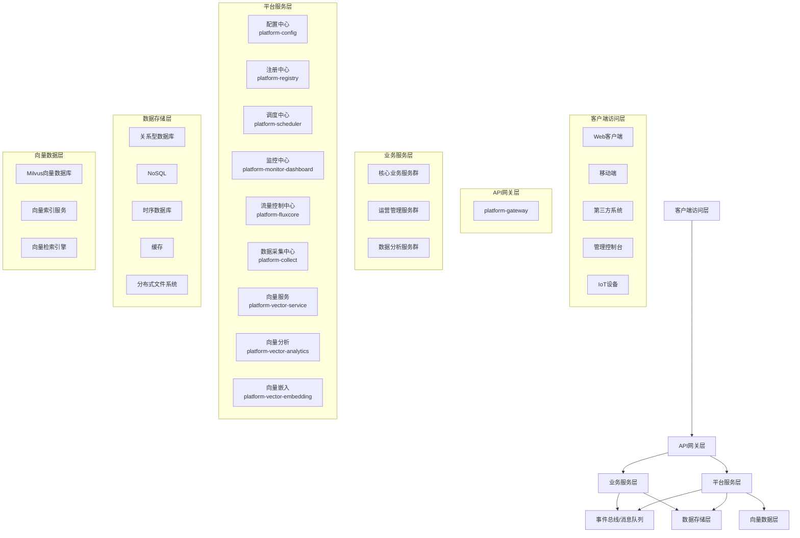

### 2.3 系统层次结构

1. **客户端访问层**：各类终端访问入口，包括Web应用、移动应用、第三方系统、管理控制台等。

2. **API网关层**：统一的服务入口，负责路由、认证、限流等功能，由platform-gateway模块实现。

3. **业务服务层**：按领域划分的各类业务微服务，采用DDD方法进行设计和实现。

4. **平台服务层**：支持业务层的基础设施服务，包括配置中心、注册中心、调度中心、监控中心等。

5. **事件总线/消息队列**：基于事件驱动架构的服务间通信机制。

6. **数据存储层**：包括关系型数据库、NoSQL、时序数据库、缓存和分布式文件系统等。

7. **向量数据层**：支持AI和相似性搜索的向量数据管理服务。

## 3. 技术栈选择

### 3.1 基础框架与语言

- **编程语言**: Java 17, Kotlin
- **构建工具**: Maven, Gradle
- **基础框架**: Spring Boot 3.x, Spring Cloud 2022.x

### 3.2 微服务基础设施

- **配置中心**: Nacos Config
- **服务注册与发现**: Nacos Discovery
- **API网关**: Spring Cloud Gateway (响应式)
- **服务熔断与限流**: Sentinel, Resilience4j
- **负载均衡**: Spring Cloud LoadBalancer

### 3.3 数据存储与缓存

- **关系型数据库**: MySQL 8.x, PostgreSQL 15.x
- **NoSQL数据库**: MongoDB 6.x
- **缓存**: Redis 7.x
- **时序数据库**: InfluxDB, Prometheus TSDB
- **向量数据库**: Milvus 2.x
- **分布式文件系统**: MinIO

### 3.4 消息与事件处理

- **消息队列**: Kafka 3.x, RocketMQ 5.x
- **流处理**: Kafka Streams, Spring Cloud Stream
- **批处理**: Spring Batch

### 3.5 响应式编程

- **响应式框架**: Project Reactor, Spring WebFlux
- **响应式数据访问**: R2DBC
- **响应式流**: Reactive Streams, RxJava 3

### 3.6 AI与向量处理

- **机器学习框架**: DJL (Deep Java Library)
- **向量计算**: ONNX Runtime, ND4J
- **向量检索引擎**: FAISS (通过JNI)
- **NLP处理**: HuggingFace模型 (通过DJL)

### 3.7 DevOps与云原生

- **容器化**: Docker
- **容器编排**: Kubernetes
- **CI/CD**: GitHub Actions, GitLab CI
- **配置管理**: Helm, Kustomize
- **服务网格**: Istio
- **可观测性**: OpenTelemetry, Grafana, Prometheus

## 4. 系统架构设计

### 4.1 业务领域划分

基于领域驱动设计(DDD)方法，系统按照以下领域进行划分：

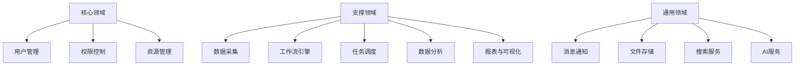

### 4.2 微服务设计原则

1. **单一职责原则**：每个微服务只负责特定的业务功能。

2. **自治原则**：微服务应该能够独立开发、测试、部署和运行。

3. **数据自治原则**：每个微服务应该拥有自己的数据存储。

4. **有界上下文原则**：微服务边界应与DDD中的有界上下文一致。

5. **异步通信偏好原则**：优先考虑异步通信以提高系统弹性。

6. **幂等性原则**：服务接口设计应支持幂等操作。

7. **容错设计原则**：服务应设计为在下游服务失败时仍能工作。

### 4.3 微服务通信模式

1. **同步通信**：
   - REST API (OpenAPI 3.0规范)
   - gRPC (高性能场景)
   - GraphQL (复杂查询场景)

2. **异步通信**：
   - 消息队列 (Kafka/RocketMQ)
   - 事件驱动 (CloudEvents规范)
   - 发布/订阅模式

3. **混合通信**：
   - 命令查询职责分离(CQRS)
   - 事件溯源(Event Sourcing)

### 4.4 数据管理策略

1. **数据分区**：
   - 按服务边界分区
   - 按数据生命周期分区
   - 按地理位置分区

2. **数据一致性**：
   - 最终一致性模型
   - 分布式事务 (Seata/TCC)
   - 事件溯源与补偿

3. **数据访问模式**：
   - CQRS模式
   - 响应式数据访问
   - 多态持久化

### 4.5 向量数据架构

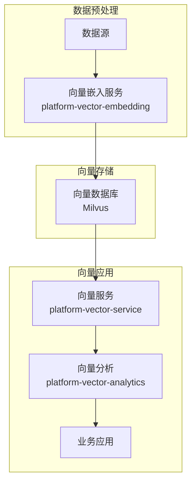

1. **向量嵌入服务**：负责将非结构化数据(文本、图像等)转换为向量表示。

2. **向量数据库**：存储和索引高维向量数据，支持高效的相似性搜索。

3. **向量服务**：提供向量数据的CRUD和检索API，支持KNN和ANN查询。

4. **向量分析**：提供向量聚类、分类、降维等高级分析功能。

## 5. 核心子系统详细设计

### 5.1 API网关 (platform-gateway)

#### 5.1.1 功能定位

作为系统的统一入口，负责请求路由、认证授权、限流熔断等功能。

#### 5.1.2 核心组件

1. **路由管理**：动态路由配置，支持路径、方法、头部等多维度路由规则。

2. **认证授权**：JWT认证、OAuth2集成、细粒度权限控制。

3. **流量控制**：基于Sentinel的限流、熔断、降级策略。

4. **日志审计**：请求响应日志记录、审计跟踪。

5. **灰度发布**：基于用户、设备、区域等维度的流量分配。

#### 5.1.3 技术实现

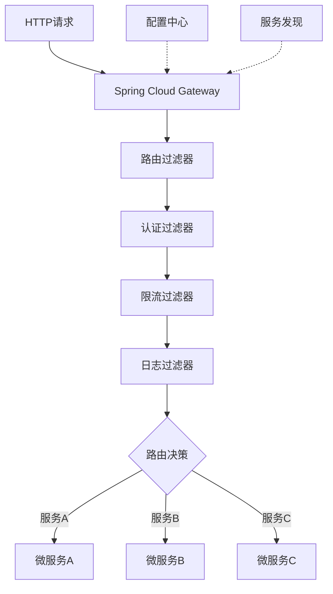

采用响应式编程模型实现，基于Spring Cloud Gateway和Project Reactor，支持高并发、低延迟的请求处理。

### 5.2 配置中心 (platform-config)

#### 5.2.1 功能定位

集中管理所有微服务的配置信息，支持动态配置更新和多环境配置管理。

#### 5.2.2 核心组件

1. **配置存储**：多数据源支持，包括文件、数据库、Git等。

2. **配置版本控制**：配置变更历史、版本比较、回滚功能。

3. **配置加密**：敏感配置的加密存储和解密使用。

4. **配置订阅**：配置变更的实时推送和通知。

#### 5.2.3 技术实现

基于Nacos Config实现，提供REST API和Web界面进行配置管理，支持配置的动态刷新和推送。

### 5.3 服务注册中心 (platform-registry)

#### 5.3.1 功能定位

提供服务注册与发现功能，是服务间通信的基础。

#### 5.3.2 核心组件

1. **服务注册**：服务实例自动注册，支持元数据管理。

2. **服务发现**：基于名称或标签的服务发现，支持负载均衡。

3. **健康检查**：服务健康状态监控，自动剔除不健康实例。

4. **集群管理**：多集群、多区域的服务发现。

#### 5.3.3 技术实现

基于Nacos Discovery实现，支持服务的自动注册和发现，提供REST API进行服务管理。

### 5.4 调度中心

#### 5.4.1 功能架构

调度中心采用分离式设计，将任务的定义、执行和查询分为独立的服务：

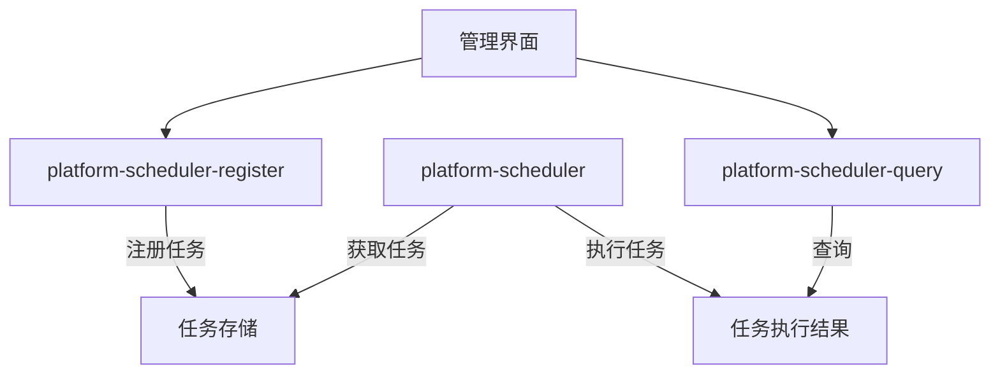

#### 5.4.2 核心组件

1. **任务注册服务 (platform-scheduler-register)**：
   - 任务定义与注册
   - 任务参数配置
   - 任务依赖管理
   - 任务版本控制

2. **任务执行服务 (platform-scheduler)**：
   - 任务调度执行
   - 执行结果管理
   - 失败重试策略
   - 执行性能监控
   - 资源隔离与保护

3. **任务查询服务 (platform-scheduler-query)**：
   - 任务执行历史查询
   - 任务状态查询
   - 任务执行统计分析
   - 任务预警通知

#### 5.4.3 技术实现

基于CQRS模式设计，使用事件驱动架构实现任务状态通知，支持分布式任务执行和集群扩展。

### 5.5 流量控制中心 (platform-fluxcore)

#### 5.5.1 功能定位

负责系统的流量控制、熔断降级和自适应保护，确保系统在高负载下仍能稳定运行。

#### 5.5.2 核心组件

1. **流量控制器**：基于QPS、并发线程数等维度的流量控制。

2. **熔断器**：基于错误率、响应时间等指标的熔断决策。

3. **系统自适应保护**：监控系统级指标(CPU、内存、负载等)，自动调整流控策略。

4. **规则配置中心**：集中管理各服务的流控规则。

#### 5.5.3 技术实现

基于Sentinel实现流量控制框架，采用响应式编程处理控制决策，支持规则的动态更新和推送。

### 5.6 向量服务体系

#### 5.6.1 向量嵌入服务 (platform-vector-embedding)

负责将非结构化数据(文本、图像等)转换为向量表示，支持多种嵌入模型：

- 文本嵌入：BERT、Word2Vec、Sentence-BERT等
- 图像嵌入：ResNet、EfficientNet等
- 多模态嵌入：CLIP等

#### 5.6.2 向量服务 (platform-vector-service)

提供向量数据的CRUD和检索API，支持：

- 向量存储与检索
- 相似性搜索(KNN、ANN)
- 向量计算(距离计算、聚合等)
- 向量索引管理

#### 5.6.3 向量分析 (platform-vector-analytics)

提供向量数据的高级分析功能：

- 向量聚类分析
- 降维与可视化
- 异常检测
- 推荐引擎

#### 5.6.4 技术实现

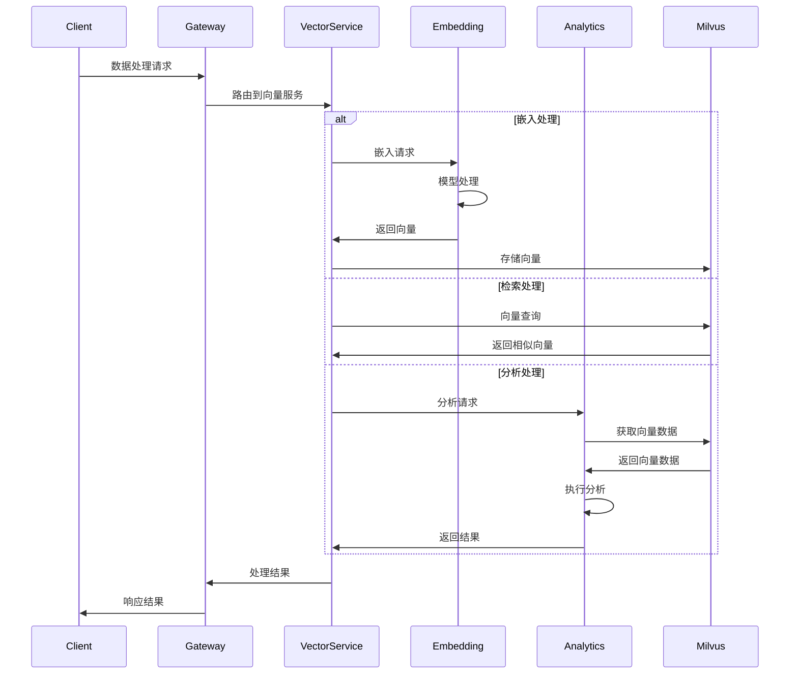

基于Java实现，使用DJL加载和运行嵌入模型，通过Milvus Java SDK与向量数据库交互，提供RESTful API和gRPC接口。

### 5.7 数据采集中心 (platform-collect)

#### 5.7.1 功能定位

负责各类数据源的数据采集、清洗、转换和加载，是数据处理的入口。

#### 5.7.2 核心组件

1. **采集器**：支持多种数据源(关系型数据库、文件、API等)的数据采集。

2. **转换器**：数据清洗、转换、验证、标准化等处理。

3. **加载器**：将处理后的数据加载到目标存储。

4. **调度器**：采集任务的调度和监控。

5. **元数据管理**：数据源、数据结构、数据映射等元数据管理。

#### 5.7.3 技术实现

采用插件化架构，支持各类数据源的接入，基于事件驱动和流处理模型进行数据处理。

### 5.8 监控中心

#### 5.8.1 功能架构

监控中心分为业务监控和系统监控两个部分：

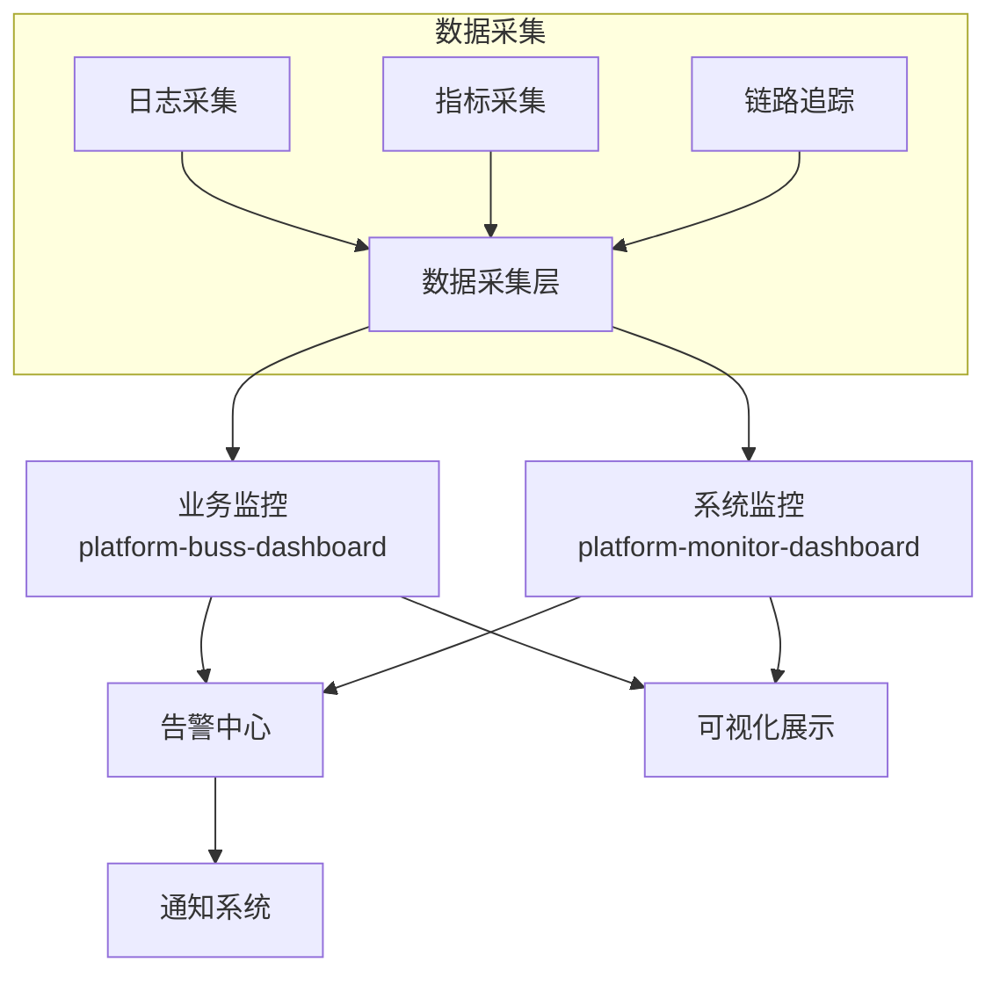

#### 5.8.2 业务监控 (platform-buss-dashboard)

- 业务指标采集与分析
- 业务流程监控
- 业务异常监控
- 用户行为分析

#### 5.8.3 系统监控 (platform-monitor-dashboard)

- 服务健康状态监控
- 资源使用监控 (CPU、内存、磁盘等)
- 性能指标监控 (响应时间、吞吐量等)
- 系统告警管理

#### 5.8.4 技术实现

基于Prometheus和Grafana实现监控数据的采集、存储和可视化，结合OpenTelemetry提供全链路追踪能力。

## 6. 跨模块关注点

### 6.1 安全设计

#### 6.1.1 认证与授权

1. **统一身份认证**：
   - OAuth2/OIDC协议支持
   - JWT令牌机制
   - 多因素认证
   - 单点登录(SSO)

2. **细粒度授权**：
   - RBAC (基于角色的访问控制)
   - ABAC (基于属性的访问控制)
   - 数据级权限控制

#### 6.1.2 数据安全

1. **数据加密**：
   - 传输加密 (TLS/SSL)
   - 存储加密 (字段级/表级)
   - 端到端加密

2. **数据脱敏**：
   - 展示脱敏
   - 存储脱敏
   - 日志脱敏

3. **数据安全合规**：
   - 数据分类分级
   - 数据生命周期管理
   - 敏感数据识别与保护

#### 6.1.3 安全架构

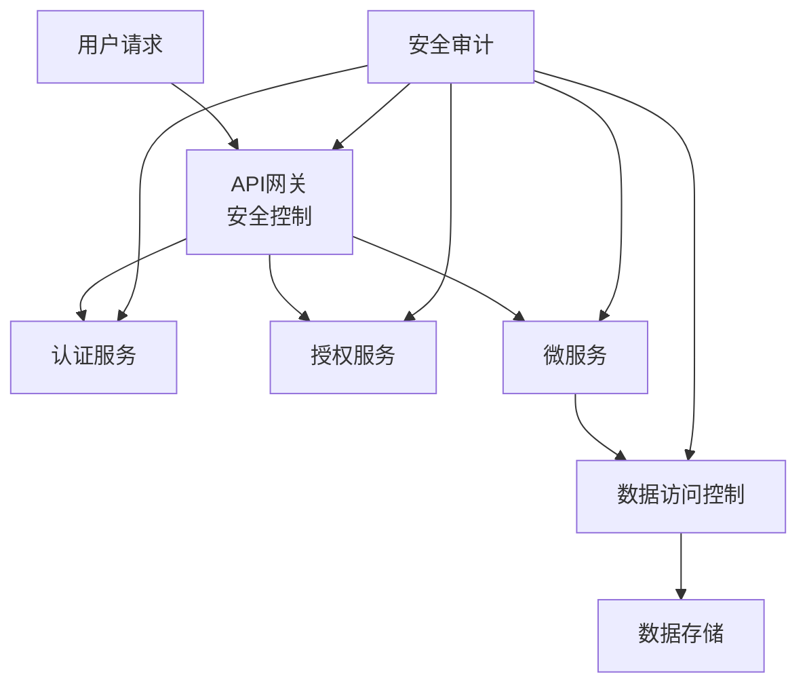

### 6.2 可观测性

#### 6.2.1 日志管理

1. **日志架构**：
   - 统一日志格式
   - 分布式日志采集
   - 实时日志分析
   - 日志归档与检索

2. **日志实践**：
   - 结构化日志
   - 关联ID追踪
   - 级别控制
   - 敏感信息过滤

#### 6.2.2 指标监控

1. **监控指标类型**：
   - 系统级指标 (CPU、内存、I/O等)
   - 应用级指标 (GC、线程、连接池等)
   - 业务级指标 (交易量、成功率等)

2. **指标收集与存储**：
   - 采用Micrometer作为指标收集框架
   - Prometheus作为时序数据存储
   - 指标标准化和规范化

#### 6.2.3 分布式追踪

1. **链路追踪**：
   - 请求全链路追踪
   - 服务依赖分析
   - 性能瓶颈定位

2. **技术实现**：
   - 基于OpenTelemetry实现链路追踪
   - 采用W3C TraceContext标准
   - 支持采样策略和优先级控制

#### 6.2.4 可观测性架构

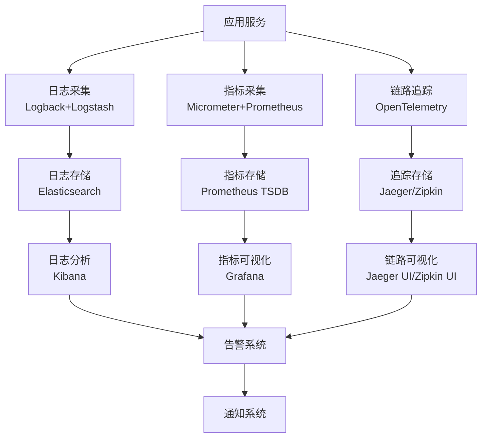

### 6.3 性能优化

#### 6.3.1 性能设计原则

1. **响应式设计**：
   - 采用非阻塞I/O模型
   - 利用异步编程提高吞吐量
   - 支持背压机制处理过载

2. **资源隔离**：
   - 服务间资源隔离
   - 关键业务优先保障
   - 弹性限流与熔断

3. **缓存策略**：
   - 多级缓存设计
   - 缓存一致性保障
   - 热点数据识别与预加载

#### 6.3.2 性能测试与优化

1. **测试类型**：
   - 负载测试
   - 压力测试
   - 持久性测试
   - 峰值测试

2. **优化方向**：
   - 代码级优化
   - 架构级优化
   - 基础设施优化
   - 数据库优化

#### 6.3.3 性能监控与分析

1. **性能指标**：
   - 响应时间
   - 吞吐量
   - 错误率
   - 资源利用率

2. **分析工具**：
   - APM工具 (Application Performance Monitoring)
   - 线程分析
   - GC分析
   - SQL分析

### 6.4 可用性设计

#### 6.4.1 高可用架构

1. **多级容错**：
   - 实例级容错 (多实例部署)
   - 服务级容错 (服务降级)
   - 数据中心级容错 (多区域部署)

2. **故障检测与恢复**：
   - 健康检查机制
   - 故障自动恢复
   - 跨区域容灾切换

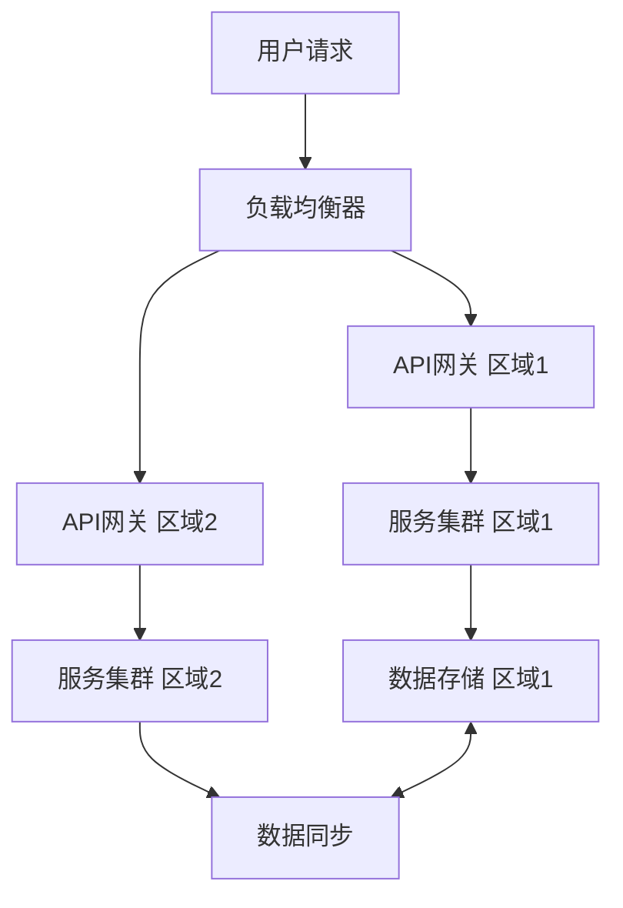

#### 6.4.2 弹性扩展

1. **自动伸缩**：
   - 基于负载的水平扩展
   - 基于资源的垂直扩展
   - 自定义指标触发扩展

2. **无状态设计**：
   - 服务无状态化
   - 会话外部化存储
   - 幂等性设计

#### 6.4.3 灾备策略

1. **数据备份**：
   - 定期全量备份
   - 增量备份
   - 事件溯源备份

2. **灾难恢复**：
   - 恢复点目标 (RPO)
   - 恢复时间目标 (RTO)
   - 灾难恢复演练

## 7. 开发规范

### 7.1 编码规范

#### 7.1.1 Java编码规范

1. **命名规范**：
   - 类名：PascalCase，具有描述性，避免缩写
   - 方法名：camelCase，动词开头，明确表达行为
   - 变量名：camelCase，有意义的名称，避免单字符
   - 常量名：UPPER_SNAKE_CASE，全大写下划线分隔
   - 包名：全小写，反向域名命名方式

2. **代码格式**：
   - 使用4空格缩进（不使用制表符）
   - 行宽限制在120字符以内
   - 大括号使用K&R风格（左大括号不换行）
   - 方法之间用一个空行分隔
   - 逻辑相关的代码段用空行分组

3. **编程实践**：
   - 遵循SOLID原则
   - 优先使用不可变对象
   - 异常处理：只捕获能处理的异常，避免空catch块
   - 避免使用原始类型的包装类作为锁对象
   - 优先使用Java内置函数式接口

4. **注释规范**：
   - 使用Javadoc注释所有公共API
   - 注释说明"为什么"而不仅仅是"是什么"
   - 代码即注释，保持注释与代码的一致性
   - 使用TODO和FIXME标记待办事项

#### 7.1.2 响应式编程规范

1. **流处理规范**：
   - 避免在流处理中使用阻塞操作
   - 合理使用并行处理，避免过度并行
   - 使用适当的调度器(Scheduler)
   - 正确处理错误和资源释放

2. **背压处理**：
   - 实现背压机制处理上下游速度不匹配
   - 使用合适的缓冲策略(buffer, window等)
   - 监控背压情况，及时调整参数

3. **代码风格**：
   - 使用链式调用提高代码可读性
   - 合理使用操作符组合，避免过长的操作链
   - 优先使用高级操作符而非基础操作符
   - 显式处理所有错误路径

#### 7.1.3 REST API设计规范

1. **URI设计**：
   - 使用名词表示资源，复数形式
   - 使用嵌套结构表示资源关系
   - 避免在URI中包含动词
   - 使用连字符(-)连接单词，不使用下划线

2. **HTTP方法使用**：
   - GET：获取资源，安全且幂等
   - POST：创建资源，非幂等
   - PUT：全量更新资源，幂等
   - PATCH：部分更新资源
   - DELETE：删除资源，幂等

3. **状态码使用**：
   - 2xx：成功响应
   - 3xx：重定向
   - 4xx：客户端错误
   - 5xx：服务端错误

4. **版本控制**：
   - 在URI中包含版本号：/api/v1/resources
   - 使用媒体类型版本：Accept: application/vnd.company.v1+json

### 7.2 测试规范

#### 7.2.1 测试策略

1. **测试类型**：
   - 单元测试：测试最小可测试单元
   - 集成测试：测试组件间交互
   - 契约测试：测试服务间接口契约
   - 端到端测试：测试完整业务流程
   - 性能测试：测试系统性能指标

2. **测试比例**：
   - 单元测试：70%
   - 集成测试：20%
   - 端到端测试：10%

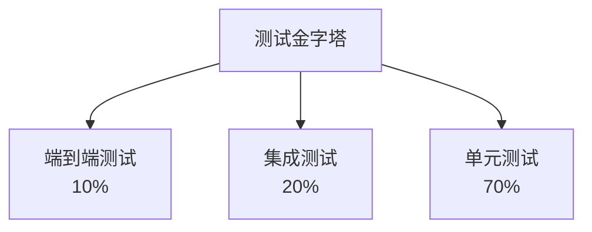

#### 7.2.2 测试实践

1. **单元测试实践**：
   - 一个测试方法只测试一个场景
   - 使用AAA模式：Arrange, Act, Assert
   - 使用Mock/Stub隔离外部依赖
   - 测试边界条件和异常路径

2. **集成测试实践**：
   - 使用TestContainers管理测试环境
   - 测试真实的外部依赖交互
   - 测试异步交互和事件处理

3. **契约测试实践**：
   - 使用Spring Cloud Contract定义契约
   - 消费者驱动的契约测试
   - 自动化契约验证

4. **测试代码质量**：
   - 测试代码应遵循与产品代码相同的质量标准
   - 避免在测试中使用条件逻辑
   - 测试应该是可重复和独立的
   - 测试失败应提供明确的错误信息

### 7.3 文档规范

#### 7.3.1 API文档

1. **API规范**：
   - 使用OpenAPI 3.0规范描述REST API
   - 使用gRPC Protocol Buffers描述gRPC服务
   - 文档作为代码，与源代码一起版本控制

2. **文档工具**：
   - 使用Springdoc-OpenAPI自动生成API文档
   - 使用Knife4j提供增强的Swagger UI
   - 使用Spring REST Docs生成API文档

3. **文档内容**：
   - 详细的API描述和使用场景
   - 请求/响应示例
   - 错误码和处理方式
   - 安全和认证要求

#### 7.3.2 技术文档

1. **文档类型**：
   - 架构文档：描述系统架构和设计决策
   - 开发指南：帮助开发人员快速上手
   - 运维手册：部署、监控、故障处理等
   - 变更记录：记录系统变更历史

2. **文档格式**：
   - 使用Markdown格式编写文档
   - 使用AsciiDoc编写复杂结构文档
   - 使用Mermaid/PlantUML绘制图表

3. **文档管理**：
   - 文档与代码共同存储和版本控制
   - 使用文档生成工具自动构建文档网站
   - 定期审查和更新文档

## 8. 项目结构与模块划分

### 8.1 代码库组织

#### 8.1.1 代码库策略

1. **多仓库策略**：
   - 核心基础设施：单独仓库
   - 公共组件库：单独仓库
   - 业务微服务：按领域划分仓库
   - 前端应用：单独仓库

2. **版本控制**：
   - 使用Git作为版本控制系统
   - 采用GitFlow或GitHub Flow作为分支策略
   - 使用语义化版本规范(SemVer)

#### 8.1.2 项目结构

```
platform-parent/                        # 父项目
├── platform-common/                    # 公共工具库
│   ├── platform-common-core/           # 核心工具类
│   ├── platform-common-web/            # Web相关工具
│   ├── platform-common-security/       # 安全相关工具
│   └── platform-common-test/           # 测试工具
├── platform-dependencies/              # 依赖管理
├── platform-framework/                 # 框架核心
│   ├── platform-framework-core/        # 框架核心功能
│   ├── platform-framework-web/         # Web框架
│   ├── platform-framework-data/        # 数据访问框架
│   └── platform-framework-security/    # 安全框架
├── platform-infrastructure/            # 基础设施服务
│   ├── platform-config/                # 配置中心
│   ├── platform-registry/              # 注册中心
│   ├── platform-gateway/               # API网关
│   ├── platform-monitor-dashboard/     # 监控中心
│   ├── platform-buss-dashboard/        # 业务监控
│   └── platform-fluxcore/              # 流量控制中心
├── platform-scheduler/                 # 调度系统
│   ├── platform-scheduler-api/         # 调度系统API
│   ├── platform-scheduler-register/    # 任务注册服务
│   ├── platform-scheduler-core/        # 任务执行服务
│   └── platform-scheduler-query/       # 任务查询服务
├── platform-vector/                    # 向量服务
│   ├── platform-vector-api/            # 向量服务API
│   ├── platform-vector-embedding/      # 向量嵌入服务
│   ├── platform-vector-service/        # 向量服务
│   └── platform-vector-analytics/      # 向量分析服务
├── platform-collect/                   # 数据采集服务
├── platform-auth/                      # 认证授权服务
├── platform-storage/                   # 对象存储服务
├── platform-message/                   # 消息服务
└── platform-business/                  # 业务服务
    ├── business-module-a/              # 业务模块A
    ├── business-module-b/              # 业务模块B
    └── business-module-c/              # 业务模块C
```

### 8.2 模块结构

#### 8.2.1 微服务模块结构

每个微服务按照六边形架构设计，内部结构如下：

```
service-name/
├── service-name-api/                   # 服务API定义
│   ├── src/main/java
│   │   └── com/company/service
│   │       ├── api/                    # API接口定义
│   │       ├── dto/                    # 数据传输对象
│   │       └── enums/                  # 枚举定义
│   └── pom.xml
├── service-name-application/           # 应用层
│   ├── src/main/java
│   │   └── com/company/service
│   │       ├── application/            # 应用服务
│   │       ├── assembler/              # DTO转换
│   │       └── config/                 # 应用配置
│   ├── src/test/java
│   └── pom.xml
├── service-name-domain/                # 领域层
│   ├── src/main/java
│   │   └── com/company/service
│   │       ├── domain/
│   │       │   ├── model/              # 领域模型
│   │       │   ├── service/            # 领域服务
│   │       │   ├── repository/         # 仓储接口
│   │       │   └── event/              # 领域事件
│   │       └── exception/              # 异常定义
│   ├── src/test/java
│   └── pom.xml
├── service-name-infrastructure/        # 基础设施层
│   ├── src/main/java
│   │   └── com/company/service
│   │       ├── infrastructure/
│   │       │   ├── repository/         # 仓储实现
│   │       │   ├── adapter/            # 外部服务适配器
│   │       │   ├── message/            # 消息处理
│   │       │   └── config/             # 基础设施配置
│   │       └── mapper/                 # ORM映射
│   ├── src/main/resources
│   │   ├── mapper/                     # MyBatis映射文件
│   │   └── application.yml             # 应用配置
│   ├── src/test/java
│   └── pom.xml
├── service-name-starter/               # 启动模块
│   ├── src/main/java
│   │   └── com/company/service
│   │       └── ServiceApplication.java # 应用入口
│   ├── src/main/resources
│   └── pom.xml
└── pom.xml                             # 父POM
```

#### 8.2.2 CQRS结构

对于采用CQRS模式的服务，结构调整如下：

```
service-name/
├── service-name-api/
│   ├── command-api/                    # 命令API
│   └── query-api/                      # 查询API
├── service-name-command/               # 命令侧
│   ├── application/                    # 命令应用服务
│   ├── domain/                         # 命令领域模型
│   └── infrastructure/                 # 命令基础设施
├── service-name-query/                 # 查询侧
│   ├── application/                    # 查询应用服务
│   ├── projection/                     # 查询投影
│   └── infrastructure/                 # 查询基础设施
├── service-name-common/                # 公共部分
└── pom.xml
```

## 9. 开发与部署流程

### 9.1 开发流程

#### 9.1.1 环境设置

1. **开发环境**：
   - 本地开发环境
   - 开发测试环境
   - 集成测试环境
   - UAT环境
   - 生产环境

2. **环境管理**：
   - 使用Docker Compose管理本地开发环境
   - 使用Kubernetes管理测试和生产环境
   - 使用配置中心管理各环境配置

#### 9.1.2 开发工作流

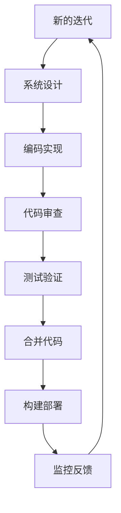

1. **需求管理**：
   - 使用Jira/GitLab Issue管理需求和任务
   - 需求拆分和优先级排序
   - 敏捷迭代计划

2. **开发过程**：
   - 基于特性分支开发
   - 提交前本地测试
   - 代码审查（Peer Review）
   - 持续集成验证

3. **质量保障**：
   - 单元测试和集成测试
   - 代码静态分析
   - 安全漏洞扫描
   - 性能测试

### 9.2 CI/CD流程

#### 9.2.1 持续集成

1. **自动化构建**：
   - 代码提交触发自动构建
   - 并行构建加速
   - 缓存优化构建速度

2. **自动化测试**：
   - 单元测试
   - 集成测试
   - 代码质量检查
   - 测试覆盖率报告

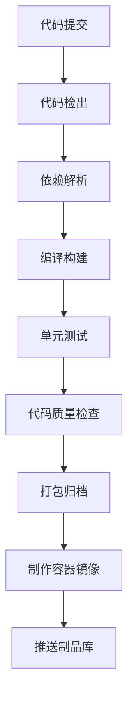

#### 9.2.2 持续部署

1. **部署策略**：
   - 蓝绿部署
   - 金丝雀部署
   - 灰度发布

2. **基础设施即代码**：
   - 使用Terraform管理云资源
   - 使用Helm管理Kubernetes应用
   - 使用Ansible管理服务器配置

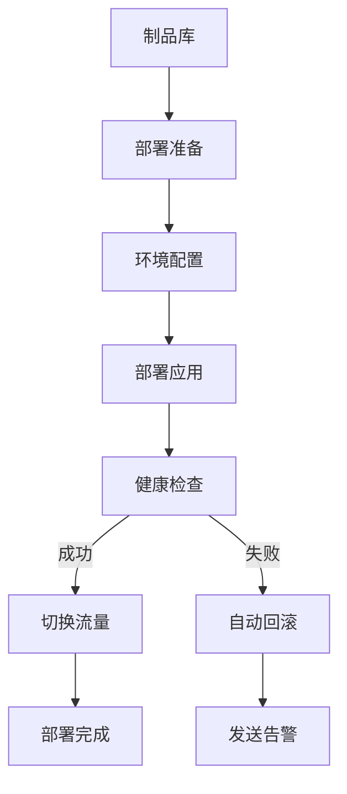

### 9.3 运维管理

#### 9.3.1 监控与告警

1. **监控体系**：
   - 基础设施监控
   - 应用监控
   - 业务监控
   - 安全监控

2. **告警策略**：
   - 多级告警
   - 告警抑制与聚合
   - 告警路由与升级

#### 9.3.2 日志管理

1. **日志收集**：
   - 容器日志收集
   - 应用日志收集
   - 审计日志收集

2. **日志分析**：
   - 日志检索与分析
   - 异常检测
   - 行为分析

#### 9.3.3 故障处理

1. **故障处理流程**：
   - 故障检测
   - 故障定位
   - 故障修复
   - 事后分析

2. **故障演练**：
   - 混沌工程实践
   - 故障注入
   - 故障恢复演练

## 10. 实施路线图

### 10.1 阶段划分

#### 10.1.1 第一阶段：基础设施建设（3个月）

1. **核心基础设施**：
   - 配置中心 (platform-config)
   - 注册中心 (platform-registry)
   - API网关 (platform-gateway)

2. **基础支撑服务**：
   - 认证授权服务
   - 监控中心 (platform-monitor-dashboard)
   - 日志服务

3. **开发环境与流程**：
   - 开发环境搭建
   - CI/CD流程建立
   - 开发规范制定

#### 10.1.2 第二阶段：核心功能实现（6个月）

1. **核心业务服务**：
   - 用户服务
   - 资源服务
   - 订单服务
   - 支付服务

2. **支撑服务完善**：
   - 调度中心 (platform-scheduler)
   - 流量控制 (platform-fluxcore)
   - 数据采集 (platform-collect)

3. **运维体系建设**：
   - 监控告警体系完善
   - 自动化运维工具
   - 灾备体系建设

#### 10.1.3 第三阶段：高级功能拓展（6个月）

1. **向量服务体系**：
   - 向量嵌入服务 (platform-vector-embedding)
   - 向量服务 (platform-vector-service)
   - 向量分析 (platform-vector-analytics)

2. **业务能力拓展**：
   - 高级分析功能
   - 推荐引擎
   - 智能搜索

3. **性能优化与扩展**：
   - 性能调优
   - 多数据中心部署
   - 全球化部署准备

### 10.2 实施计划

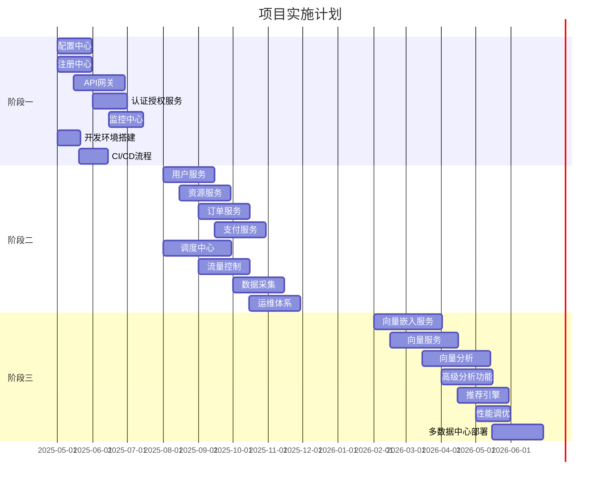

### 10.3 里程碑计划

1. **M1：基础设施就绪**
   - 时间点：2025-07-31
   - 关键成果：
     - 配置中心、注册中心、API网关投产
     - 开发环境和CI/CD流程建立
     - 基础技术组件库完成

2. **M2：核心业务上线**
   - 时间点：2025-12-31
   - 关键成果：
     - 核心业务服务投产
     - 调度中心、流量控制中心投产
     - 监控运维体系完善

3. **M3：平台能力完善**
   - 时间点：2026-06-30
   - 关键成果：
     - 向量服务体系投产
     - 高级分析与推荐能力投产
     - 多数据中心部署完成

## 11. 附录

### 11.2 技术栈版本列表

| 技术 | 版本 | 用途 |
|-----|------|-----|
| Java | 17 | 编程语言 |
| Kotlin | 1.8.x | 编程语言 |
| Spring Boot | 3.1.x | 应用框架 |
| Spring Cloud | 2022.0.x | 微服务框架 |
| Spring WebFlux | 3.1.x | 响应式编程框架 |
| Project Reactor | 3.5.x | 响应式编程库 |
| Spring Cloud Gateway | 4.0.x | API网关 |
| Spring Security | 6.1.x | 安全框架 |
| Spring Data R2DBC | 3.1.x | 响应式数据访问 |
| Nacos | 2.2.x | 配置中心/服务注册 |
| Sentinel | 1.8.x | 流量控制 |
| MySQL | 8.0.x | 关系型数据库 |
| PostgreSQL | 15.x | 关系型数据库 |
| MongoDB | 6.0.x | NoSQL数据库 |
| Redis | 7.0.x | 缓存/分布式数据结构 |
| Milvus | 2.2.x | 向量数据库 |
| Kafka | 3.4.x | 消息队列/事件流 |
| RocketMQ | 5.1.x | 消息队列 |
| Seata | 1.7.x | 分布式事务 |
| Elasticsearch | 8.8.x | 搜索引擎/日志存储 |
| Prometheus | 2.45.x | 监控系统 |
| Grafana | 10.0.x | 可视化平台 |
| OpenTelemetry | 1.28.x | 可观测性框架 |
| Docker | 24.0.x | 容器化 |
| Kubernetes | 1.27.x | 容器编排 |
| Istio | 1.18.x | 服务网格 |
| MinIO | 2023.5.x | 对象存储 |
| DJL | 0.22.x | 深度学习框架 |

### 11.3 参考文档

1. Spring官方文档：[https://spring.io/projects](https://spring.io/projects)
2. Reactive Manifesto：[https://www.reactivemanifesto.org/](https://www.reactivemanifesto.org/)
3. Kubernetes文档：[https://kubernetes.io/docs/home/](https://kubernetes.io/docs/home/)
4. Domain-Driven Design Reference：[https://www.domainlanguage.com/ddd/reference/](https://www.domainlanguage.com/ddd/reference/)
5. Microservices Patterns (Chris Richardson)：[https://microservices.io/patterns/](https://microservices.io/patterns/)
6. Milvus向量数据库文档：[https://milvus.io/docs](https://milvus.io/docs)
7. OpenTelemetry文档：[https://opentelemetry.io/docs/](https://opentelemetry.io/docs/)
8. RESTful API设计指南：[https://restfulapi.net/](https://restfulapi.net/)

### 11.4 设计决策记录

| 决策 | 说明 | 替代方案 | 优势 |
|-----|------|---------|-----|
| 采用Spring WebFlux | 使用响应式编程提高系统吞吐量 | Spring MVC | 更好的资源利用率，支持更高并发 |
| 使用Nacos作为配置中心 | 统一管理配置，支持动态更新 | Spring Cloud Config | 更好的易用性和功能丰富性 |
| 使用Milvus向量数据库 | 支持高维向量的存储和检索 | Elasticsearch | 专为向量搜索优化，性能更好 |
| CQRS与事件溯源 | 分离读写操作，优化各自的性能 | 传统CRUD | 更好的扩展性和历史追踪能力 |
| 采用DDD设计方法 | 基于业务领域建模，减少技术与业务耦合 | 传统三层架构 | 更好地表达业务逻辑，减少翻译成本 |
| 容器化部署 | 使用Docker和Kubernetes进行部署 | 虚拟机部署 | 资源利用率高，部署一致性好 |1 术语表

| 术语 | 定义 |
|-----|------|
| DDD | 领域驱动设计，一种软件设计方法论 |
| CQRS | 命令查询责任分离，将读写操作分离的架构模式 |
| Event Sourcing | 事件溯源，使用事件序列存储系统状态变更的模式 |
| MCP | 微服务云平台，提供全面云原生能力的平台 |
| API Gateway | API网关，系统的统一入口，提供路由、认证等功能 |
| Vector Database | 向量数据库，存储和检索高维向量数据的专用数据库 |
| K8s | Kubernetes的简称，容器编排平台 |
| Reactive | 响应式，一种关注数据流和变化传播的编程范式 |

### 11.