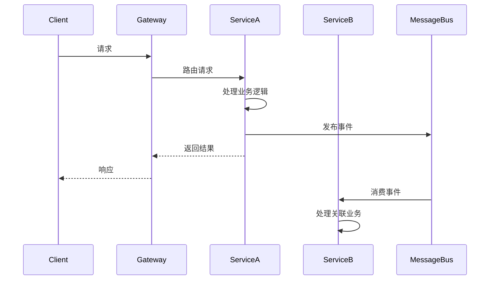
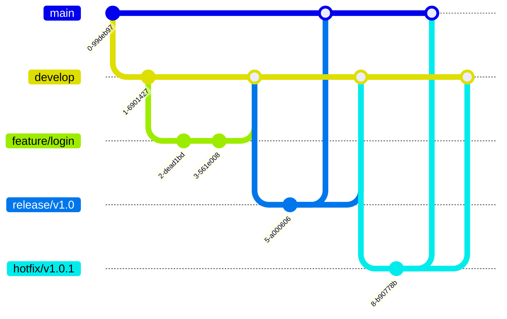
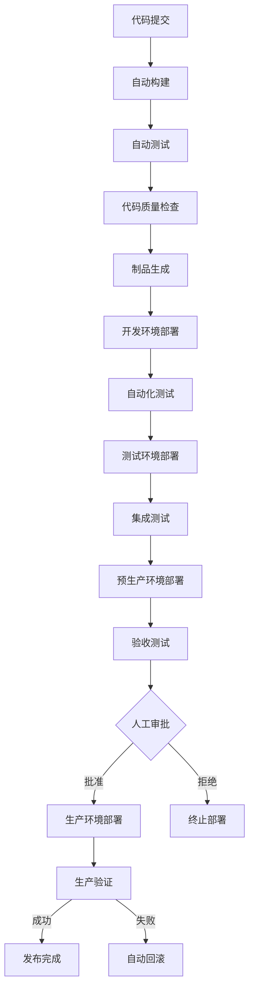

# 微服务平台项目开发规范

**版本**: 1.0.0  
**日期**: 2025-04-26  
**状态**: 正式发布  

## 目录

1. [前言](#1-前言)
2. [通用规范](#2-通用规范)
3. [Java编码规范](#3-java编码规范)
4. [Kotlin编码规范](#4-kotlin编码规范)
5. [响应式编程规范](#5-响应式编程规范)
6. [领域驱动设计实践](#6-领域驱动设计实践)
7. [微服务设计规范](#7-微服务设计规范)
8. [API设计规范](#8-api设计规范)
9. [数据库设计规范](#9-数据库设计规范)
10. [测试规范](#10-测试规范)
11. [文档规范](#11-文档规范)
12. [安全规范](#12-安全规范)
13. [日志规范](#13-日志规范)
14. [版本控制规范](#14-版本控制规范)
15. [持续集成与部署规范](#15-持续集成与部署规范)
16. [附录](#16-附录)

## 1. 前言

### 1.1 目的

本规范旨在统一项目开发标准，提高代码质量，规范开发流程，降低维护成本，提升系统整体质量。

### 1.2 适用范围

本规范适用于微服务平台的所有服务模块，包括基础设施服务、业务服务和前端应用。

### 1.3 规范结构

本规范包含必须遵守的强制规范（SHALL）、推荐遵守的规范（SHOULD）和可选规范（MAY）三个级别。

## 2. 通用规范

### 2.1 编码风格

1. **[强制]** 所有源代码文件必须使用UTF-8编码。

2. **[强制]** 所有源代码文件的行尾必须使用LF（\n）而非CRLF（\r\n）。

3. **[强制]** 缩进使用4个空格，不使用制表符（Tab）。

4. **[强制]** 行宽不超过120个字符。

5. **[推荐]** 相关代码应当按照逻辑分组，组之间用空行分隔。

6. **[强制]** 源文件结尾必须有一个空行。

### 2.2 命名规范

1. **[强制]** 所有命名均应使用英文，禁止使用拼音、中文或特殊字符。

2. **[强制]** 命名应当具有描述性，避免使用缩写（除非是广泛接受的缩写，如HTTP、URL等）。

3. **[强制]** 禁止使用单字符命名，除了循环索引和临时变量。

4. **[推荐]** 命名长度应当与其作用域成正比，局部变量可短，全局变量应详细。

### 2.3 注释规范

1. **[强制]** 所有公共API必须有Javadoc注释。

2. **[强制]** 复杂的业务逻辑和算法必须有详细注释。

3. **[推荐]** 注释应当解释"为什么"而不仅仅是"是什么"。

4. **[推荐]** 使用TODO注释标记待完成的工作，使用FIXME标记待修复的问题。

5. **[强制]** 废弃的API必须用@Deprecated注解并在文档中解释替代方案。

## 3. Java编码规范

### 3.1 文件组织

1. **[强制]** 每个源文件只包含一个顶级类，且文件名与类名一致。

2. **[强制]** 源文件组织顺序：package语句、import语句、类/接口定义。

3. **[强制]** import语句按以下顺序分组，每组之间空一行：
   - 标准Java库
   - 第三方库
   - 项目内部导入

4. **[强制]** 类内部组织顺序：
   - 静态变量
   - 实例变量
   - 构造函数
   - 公共方法
   - 私有方法

### 3.2 Java编码实践

1. **[强制]** 优先使用接口而非实现类作为变量和参数类型。

2. **[强制]** 使用Optional表示可能为空的值，避免返回null。

3. **[强制]** 捕获异常时必须处理或记录日志，禁止使用空catch块。

4. **[强制]** 集合类型声明使用泛型。

5. **[强制]** 优先使用Java 8+的Stream API和Lambda表达式处理集合操作。

6. **[推荐]** 使用工厂方法创建对象，如List.of()、Map.of()。

7. **[强制]** 使用StringBuilder而非+拼接字符串。

8. **[强制]** 所有的重写方法必须使用@Override注解。

9. **[强制]** 使用try-with-resources语句自动关闭资源。

10. **[强制]** 优先使用不可变对象和不可变集合。

```java
// 推荐：使用不可变集合
List<String> items = List.of("item1", "item2", "item3");

// 不推荐：使用可变集合
List<String> mutableItems = new ArrayList<>();
mutableItems.add("item1");
mutableItems.add("item2");
mutableItems.add("item3");
```

### 3.3 日期和时间处理

1. **[强制]** 使用Java 8日期时间API（java.time.*），禁止使用Date和Calendar。

2. **[强制]** 时区敏感的操作必须明确指定时区，避免使用默认时区。

3. **[推荐]** 在持久化层使用UTC时间，在表现层根据需要转换为本地时区。

### 3.4 异常处理

1. **[强制]** 禁止捕获异常后不处理（空catch块）。

2. **[强制]** 业务异常应继承自自定义的基础异常类。

3. **[强制]** 异常信息应提供足够的上下文，方便问题诊断。

4. **[强制]** 禁止在循环中直接使用try-catch，应将循环体抽取为单独方法。

5. **[推荐]** 使用自定义异常传递业务含义，而非通用异常。

## 4. Kotlin编码规范

### 4.1 基本约定

1. **[强制]** 源文件名应与顶级类名一致，使用驼峰命名法。

2. **[强制]** 函数名使用驼峰命名法，以动词开头。

3. **[强制]** 属性名使用驼峰命名法，避免使用简单前缀如m_。

4. **[强制]** 使用4个空格缩进，不使用制表符。

### 4.2 语言特性使用

1. **[推荐]** 优先使用val（不可变）而非var（可变）。

2. **[推荐]** 使用数据类（data class）表示简单的数据载体。

3. **[推荐]** 使用sealed class表示有限状态集合。

4. **[推荐]** 使用扩展函数增强现有类的功能。

5. **[强制]** 使用空安全特性，避免空指针异常。

6. **[推荐]** 使用高阶函数和Lambda表达式简化代码。

```kotlin
// 推荐：使用Kotlin的函数式API
val doubled = numbers.map { it * 2 }

// 不推荐：使用循环
val doubled = mutableListOf<Int>()
for (number in numbers) {
    doubled.add(number * 2)
}
```

### 4.3 协程使用

1. **[强制]** 异步操作优先使用协程，避免使用回调或Future。

2. **[强制]** 所有挂起函数必须标记为suspend。

3. **[强制]** 在协程作用域中捕获异常，避免未处理的异常导致应用崩溃。

4. **[推荐]** 使用结构化并发，避免使用GlobalScope。

5. **[推荐]** 使用适当的调度器（Dispatchers），如IO密集型操作使用Dispatchers.IO。

## 5. 响应式编程规范

### 5.1 基本原则

1. **[强制]** 所有I/O操作（网络、文件、数据库）必须使用非阻塞API。

2. **[强制]** 避免在响应式流中执行阻塞操作，必要时使用publishOn切换线程。

3. **[强制]** 正确处理错误，使用onErrorResume而非try-catch。

4. **[强制]** 合理使用背压策略，避免内存溢出。

5. **[推荐]** 使用flatMap处理嵌套操作，避免Mono嵌套。

### 5.2 Reactor使用规范

1. **[强制]** 响应式流处理链中必须包含终端操作（如subscribe）才能触发执行。

2. **[强制]** 在subscribe时必须处理错误信号，避免异常被吞没。

3. **[推荐]** 使用transform操作符封装可重用的操作序列。

4. **[推荐]** 使用适当的调度器（Scheduler）处理并发，如Schedulers.boundedElastic()用于I/O操作。

5. **[强制]** 避免在响应式流中使用阻塞API，如果无法避免，使用fromCallable和subscribeOn包装。

```java
// 推荐：正确处理响应式流中的错误
return webClient.get()
    .uri("/api/resource")
    .retrieve()
    .bodyToMono(Resource.class)
    .onErrorResume(WebClientResponseException.class, e -> {
        log.error("Error fetching resource: {}", e.getMessage());
        return Mono.empty();
    });

// 不推荐：使用try-catch处理错误
try {
    return webClient.get()
        .uri("/api/resource")
        .retrieve()
        .bodyToMono(Resource.class);
} catch (WebClientResponseException e) {  // 这无法捕获异步错误
    log.error("Error fetching resource: {}", e.getMessage());
    return Mono.empty();
}
```

### 5.3 响应式数据访问

1. **[强制]** 使用R2DBC进行响应式数据库访问，避免使用JDBC。

2. **[强制]** 使用Reactive Redis客户端进行缓存操作。

3. **[推荐]** 使用Spring Data R2DBC或响应式MongoDB处理数据访问层。

4. **[推荐]** 使用非阻塞驱动进行外部服务调用，如WebClient代替RestTemplate。

5. **[强制]** 在处理大量数据时使用背压和批处理避免内存溢出。

## 6. 领域驱动设计实践

### 6.1 战略设计

1. **[强制]** 使用统一语言（Ubiquitous Language）保持业务概念一致性。

2. **[强制]** 基于业务能力而非技术维度划分限界上下文（Bounded Context）。

3. **[强制]** 明确定义上下文之间的关系（如共享内核、客户-供应商等）。

4. **[推荐]** 使用上下文映射图（Context Map）可视化系统整体结构。

### 6.2 战术设计

1. **[强制]** 实体（Entity）必须有唯一标识和生命周期，实现equals和hashCode方法。

2. **[强制]** 值对象（Value Object）必须是不可变的，相等性基于属性比较。

3. **[强制]** 聚合（Aggregate）必须维护不变性约束，通过聚合根访问内部实体。

4. **[强制]** 领域服务（Domain Service）处理跨多个实体的操作。

5. **[推荐]** 使用领域事件（Domain Event）实现聚合间通信。

6. **[推荐]** 使用资源库（Repository）抽象数据持久化操作。

```java
// 推荐：值对象设计
@Value // Lombok注解创建不可变类
public class Money {
    BigDecimal amount;
    Currency currency;
    
    public Money add(Money other) {
        if (!currency.equals(other.currency)) {
            throw new IllegalArgumentException("Cannot add money with different currencies");
        }
        return new Money(amount.add(other.amount), currency);
    }
}

// 推荐：聚合根设计
public class Order {
    private OrderId id;
    private CustomerId customerId;
    private List<OrderLine> orderLines = new ArrayList<>();
    private OrderStatus status;
    
    // 聚合边界内的行为
    public void addOrderLine(Product product, int quantity) {
        OrderLine line = new OrderLine(new OrderLineId(), product.getId(), product.getPrice(), quantity);
        orderLines.add(line);
    }
    
    // 聚合不变性验证
    public void confirm() {
        if (orderLines.isEmpty()) {
            throw new OrderCannotBeConfirmedException("Order must have at least one line item");
        }
        this.status = OrderStatus.CONFIRMED;
    }
}
```

### 6.3 代码组织

1. **[强制]** 按照限界上下文和领域层次组织代码包结构。

2. **[强制]** 使用六边形架构（Hexagonal Architecture）或洋葱架构分离领域逻辑与技术实现。

3. **[推荐]** 包结构遵循以下模式：
   - xx.domain：领域模型和业务逻辑
   - xx.application：应用服务和用例
   - xx.infrastructure：技术实现
   - xx.interfaces：对外接口

4. **[推荐]** 使用CQRS模式分离读写操作，优化各自的性能。

## 7. 微服务设计规范

### 7.1 服务边界

1. **[强制]** 服务边界应与业务领域和限界上下文一致。

2. **[强制]** 服务应该高内聚，每个服务专注于单一业务能力。

3. **[强制]** 服务间低耦合，通过定义良好的API通信。

4. **[强制]** 每个服务应拥有自己的数据存储，避免共享数据库。

5. **[推荐]** 遵循"单一职责原则"和"接口隔离原则"设计服务。

### 7.2 服务通信

1. **[强制]** 服务间同步通信使用RESTful API或gRPC。

2. **[强制]** 异步通信使用消息队列或事件总线。

3. **[强制]** 服务间通信必须处理失败情况，实现重试、断路、超时等机制。

4. **[推荐]** 使用API网关统一对外暴露服务。

5. **[推荐]** 实现服务发现机制简化服务寻址。



### 7.3 服务部署

1. **[强制]** 每个服务独立部署，不共享运行时环境。

2. **[强制]** 服务容器化部署，使用Docker封装。

3. **[强制]** 使用Kubernetes编排容器，管理服务生命周期。

4. **[推荐]** 实现自动扩缩容，根据负载调整实例数。

5. **[推荐]** 使用ConfigMap和Secret管理配置，避免硬编码。

### 7.4 服务监控

1. **[强制]** 实现健康检查接口(/actuator/health)。

2. **[强制]** 暴露指标接口(/actuator/prometheus)供监控系统采集。

3. **[强制]** 实现分布式追踪，使用统一的TraceId和SpanId。

4. **[推荐]** 使用结构化日志，包含关联ID方便追踪。

5. **[推荐]** 实现业务指标监控，如请求量、错误率、响应时间。

## 8. API设计规范

### 8.1 RESTful API规范

1. **[强制]** URI使用名词而非动词，复数形式表示资源集合。

2. **[强制]** 使用HTTP方法表示操作：
   - GET：查询资源，幂等
   - POST：创建资源，非幂等
   - PUT：全量更新资源，幂等
   - PATCH：部分更新资源，幂等性取决于操作
   - DELETE：删除资源，幂等

3. **[强制]** URI格式：`/api/v{n}/{resources}/{resourceId}/{subresources}`

4. **[强制]** 查询参数使用camelCase命名。

5. **[强制]** 时间类型使用ISO 8601格式（yyyy-MM-ddTHH:mm:ssZ）。

6. **[推荐]** 支持分页、排序和过滤：
   - 分页：page、size参数
   - 排序：sort参数，如sort=name,asc&sort=createTime,desc
   - 过滤：field=value参数

### 8.2 API响应规范

1. **[强制]** 使用标准HTTP状态码：
   - 2xx：成功
   - 3xx：重定向
   - 4xx：客户端错误
   - 5xx：服务端错误

2. **[强制]** 响应体使用统一的数据结构：

```json
{
  "code": 200,
  "message": "操作成功",
  "data": {
    // 业务数据
  },
  "timestamp": "2025-04-26T10:30:00Z"
}
```

3. **[强制]** 错误响应包含详细信息：

```json
{
  "code": 400,
  "message": "请求参数有误",
  "errors": [
    {
      "field": "email",
      "message": "邮箱格式不正确"
    }
  ],
  "timestamp": "2025-04-26T10:30:00Z"
}
```

4. **[强制]** 分页响应包含分页信息：

```json
{
  "code": 200,
  "message": "操作成功",
  "data": {
    "content": [
      // 数据列表
    ],
    "pageable": {
      "pageNumber": 0,
      "pageSize": 10,
      "sort": [
        {
          "property": "createTime",
          "direction": "DESC"
        }
      ]
    },
    "totalElements": 100,
    "totalPages": 10
  },
  "timestamp": "2025-04-26T10:30:00Z"
}
```

### 8.3 API版本控制

1. **[强制]** 在URI中包含版本号：`/api/v1/resources`

2. **[强制]** 版本号使用整数，按照兼容性变更递增。

3. **[强制]** 主版本号变更表示不兼容的API变更。

4. **[推荐]** 保持旧版本API一段过渡期，方便客户端迁移。

### 8.4 API文档

1. **[强制]** 使用OpenAPI 3.0规范编写API文档。

2. **[强制]** API文档应包含：
   - 接口描述
   - 请求参数说明
   - 响应结构说明
   - 错误码说明
   - 请求/响应示例

3. **[强制]** API文档与代码同步更新，使用注解生成。

4. **[推荐]** 使用Knife4j或Swagger UI提供在线API文档。

## 9. 数据库设计规范

### 9.1 关系型数据库

1. **[强制]** 表名使用小写字母，单词间用下划线分隔，采用复数形式。

2. **[强制]** 字段名使用小写字母，单词间用下划线分隔，采用单数形式。

3. **[强制]** 主键使用自增长整数或UUID，命名为id。

4. **[强制]** 外键命名规则：`{关联表名单数}_id`

5. **[强制]** 所有表必须包含以下审计字段：
   - created_at：创建时间
   - updated_at：更新时间
   - created_by：创建人
   - updated_by：更新人

6. **[强制]** 使用软删除而非物理删除，添加is_deleted字段。

7. **[推荐]** 字段添加适当注释。

8. **[推荐]** 表名前缀使用模块名，如user_accounts, user_profiles。

### 9.2 NoSQL数据库

1. **[强制]** MongoDB集合名使用小写字母，单词间用连字符分隔，采用复数形式。

2. **[强制]** 文档字段名使用camelCase命名。

3. **[强制]** 文档必须包含_id字段作为唯一标识。

4. **[强制]** 文档必须包含创建和更新时间字段。

5. **[推荐]** 根据查询模式设计文档结构，避免过深嵌套。

6. **[推荐]** 关联数据适当冗余，减少跨集合查询。

### 9.3 向量数据库

1. **[强制]** 向量集合（Collection）命名使用小写字母，单词间用连字符分隔。

2. **[强制]** 向量必须指定维度和距离指标（如欧氏距离、余弦相似度）。

3. **[强制]** 向量数据必须包含元数据字段，便于过滤和验证。

4. **[强制]** 向量索引必须根据查询特点和数据规模选择合适的索引类型（如IVF、HNSW）。

5. **[推荐]** 大规模向量集合应进行分区，避免单分区过大影响性能。

### 9.4 缓存设计

1. **[强制]** 缓存键命名格式：`{业务名}:{实体名}:{ID}`。

2. **[强制]** 缓存必须设置过期时间，避免无效数据长期存留。

3. **[强制]** 缓存更新策略采用Cache-Aside模式，先更新数据库，再删除或更新缓存。

4. **[强制]** 缓存穿透防护：对不存在的数据设置短期空值缓存。

5. **[强制]** 缓存击穿防护：使用互斥锁或布隆过滤器。

6. **[推荐]** 大对象拆分缓存，避免单个键值对过大。

7. **[推荐]** 热点数据使用本地缓存配合分布式缓存，降低网络开销。

### 9.5 数据迁移和版本控制

1. **[强制]** 使用Flyway或Liquibase管理数据库版本。

2. **[强制]** 每个迁移脚本必须是幂等的。

3. **[强制]** 迁移脚本命名格式：`V{版本号}__{描述}.sql`。

4. **[强制]** 不允许修改已应用的迁移脚本，必须创建新脚本进行修正。

5. **[推荐]** 大型数据迁移应分批次进行，避免长时间锁表。

## 10. 测试规范

### 10.1 测试类型与覆盖率

1. **[强制]** 单元测试覆盖率不低于80%。

2. **[强制]** 核心业务逻辑必须有单元测试覆盖。

3. **[强制]** 公共API必须有集成测试覆盖。

4. **[强制]** 关键业务流程必须有端到端测试覆盖。

5. **[推荐]** 性能敏感的组件应有性能测试。

### 10.2 单元测试规范

1. **[强制]** 测试类命名：`{被测类名}Test`。

2. **[强制]** 测试方法命名：`test{测试场景}_{预期结果}`。

3. **[强制]** 每个测试方法只测试一个场景，避免多重断言。

4. **[强制]** 使用AAA模式（Arrange-Act-Assert）组织测试代码。

5. **[强制]** 使用适当的Mock/Stub隔离外部依赖。

6. **[强制]** 测试必须稳定可重复，不依赖外部环境。

7. **[推荐]** 使用参数化测试验证多种输入场景。

```java
@Test
void testCalculatePrice_WithValidQuantity_ReturnsCorrectTotal() {
    // Arrange
    Product product = new Product("Test Product", new Money(BigDecimal.TEN, Currency.getInstance("USD")));
    int quantity = 5;
    PriceCalculator calculator = new PriceCalculator();
    
    // Act
    Money totalPrice = calculator.calculatePrice(product, quantity);
    
    // Assert
    assertEquals(new Money(new BigDecimal("50.00"), Currency.getInstance("USD")), totalPrice);
}
```

### 10.3 集成测试规范

1. **[强制]** 集成测试应使用测试配置，不依赖生产配置。

2. **[强制]** 使用TestContainers管理测试环境（数据库、缓存等）。

3. **[强制]** 每次测试前重置数据状态，避免测试间相互影响。

4. **[强制]** 集成测试应覆盖外部依赖交互，如数据库、缓存、外部API。

5. **[推荐]** 使用WireMock模拟外部服务响应。

### 10.4 性能测试规范

1. **[强制]** 性能测试有明确的指标和目标（如TPS、响应时间、错误率）。

2. **[强制]** 性能测试环境应尽量接近生产环境。

3. **[强制]** 性能测试前进行预热，避免冷启动影响结果。

4. **[强制]** 性能测试必须有监控，收集系统指标（CPU、内存、I/O等）。

5. **[推荐]** 进行多级负载测试：正常负载、峰值负载、压力测试、持久性测试。

## 11. 文档规范

### 11.1 代码文档

1. **[强制]** 所有公共API必须有完整的Javadoc/KDoc注释，包括：
   - 方法说明
   - 参数说明
   - 返回值说明
   - 异常说明
   - 使用示例（如适用）

2. **[强制]** 复杂算法和业务逻辑必须有详细的内部注释。

3. **[强制]** 代码变更时同步更新相关文档。

4. **[推荐]** 使用Markdown编写项目文档，与代码一同版本控制。

### 11.2 架构文档

1. **[强制]** 每个项目必须有架构概述文档，包括：
   - 系统整体架构
   - 关键组件说明
   - 技术选型理由
   - 部署架构

2. **[强制]** 关键设计决策必须有文档记录（ADR - Architecture Decision Record）。

3. **[强制]** 系统接口关系必须有文档描述，推荐使用图表呈现。

4. **[推荐]** 使用C4模型描述系统架构的不同层次。

### 11.3 API文档

1. **[强制]** 使用OpenAPI规范编写API文档。

2. **[强制]** API文档必须包含：
   - 接口功能描述
   - 请求参数详细说明
   - 响应结构详细说明
   - 错误码及处理方式
   - 请求/响应示例

3. **[强制]** API变更必须更新文档，保持文档与代码一致。

4. **[推荐]** 使用示例代码展示API调用方式。

### 11.4 操作文档

1. **[强制]** 系统必须有部署文档，包括：
   - 环境要求
   - 部署步骤
   - 配置说明
   - 常见问题处理

2. **[强制]** 系统必须有运维文档，包括：
   - 监控指标说明
   - 日志格式说明
   - 故障处理流程
   - 扩容/缩容流程

3. **[推荐]** 使用自动化脚本简化部署和运维操作。

## 12. 安全规范

### 12.1 身份认证与授权

1. **[强制]** 使用成熟的身份认证框架（如Spring Security），避免自研。

2. **[强制]** 密码必须加盐哈希存储，禁止明文或可逆加密存储。

3. **[强制]** 实现基于角色（RBAC）和基于属性（ABAC）的访问控制。

4. **[强制]** 使用JWT等无状态令牌，包含过期时间。

5. **[强制]** 敏感操作必须二次验证。

6. **[推荐]** 实现多因素认证（MFA）。

### 12.2 数据安全

1. **[强制]** 传输数据使用TLS 1.3加密。

2. **[强制]** 敏感数据（如PII）必须加密存储。

3. **[强制]** 敏感信息（如密码、密钥）在日志和错误信息中脱敏。

4. **[强制]** 数据脱敏遵循最小必要原则，只保留必要信息。

5. **[推荐]** 实现数据访问审计，记录敏感数据的访问操作。

### 12.3 API安全

1. **[强制]** 实现API限流防止DoS攻击。

2. **[强制]** 所有输入数据必须验证和转义，防止注入攻击。

3. **[强制]** 实现CSRF保护机制。

4. **[强制]** 设置安全响应头，如：
   - Content-Security-Policy
   - X-Content-Type-Options
   - X-Frame-Options
   - X-XSS-Protection

5. **[推荐]** 使用API密钥或OAuth2.0保护API访问。

### 12.4 配置与依赖安全

1. **[强制]** 敏感配置（密码、密钥等）使用配置中心或环境变量注入，禁止硬编码。

2. **[强制]** 定期检查并更新依赖库，修复已知漏洞。

3. **[强制]** CI流程中集成依赖扫描，阻止引入有漏洞的依赖。

4. **[强制]** 生产环境禁用调试功能和开发工具。

5. **[推荐]** 使用最小化基础镜像，减少攻击面。

## 13. 日志规范

### 13.1 日志级别使用

1. **[强制]** 日志级别定义：
   - ERROR: 影响系统运行的错误，需要立即处理
   - WARN: 潜在问题或即将发生的错误，需要关注
   - INFO: 重要业务操作和系统状态变更
   - DEBUG: 详细的系统运行信息，用于问题排查
   - TRACE: 最详细的跟踪信息，一般只在开发环境使用

2. **[强制]** 正确选择日志级别，避免日志过多或过少。

3. **[强制]** 生产环境默认使用INFO级别，可动态调整。

4. **[推荐]** 关键服务可通过配置中心动态调整日志级别。

### 13.2 日志内容规范

1. **[强制]** 日志必须包含以下基本信息：
   - 时间戳（ISO 8601格式）
   - 日志级别
   - 线程名
   - 类名
   - 请求ID/跟踪ID
   - 日志内容

2. **[强制]** 错误日志必须包含详细的异常堆栈和上下文信息。

3. **[强制]** 敏感信息（密码、令牌等）必须脱敏后记录。

4. **[推荐]** 使用结构化日志格式（JSON），便于解析和分析。

### 13.3 日志最佳实践

1. **[强制]** 使用日志门面（SLF4J）而非直接使用具体实现。

2. **[强制]** 使用参数化日志而非字符串拼接，提高性能。

```java
// 推荐：参数化日志
log.info("User {} performed action {} on resource {}", userId, action, resourceId);

// 不推荐：字符串拼接
log.info("User " + userId + " performed action " + action + " on resource " + resourceId);
```

3. **[强制]** 避免在循环中过度记录日志，导致日志风暴。

4. **[强制]** 日志应包含足够上下文，便于问题定位。

5. **[推荐]** 实现基于MDC（Mapped Diagnostic Context）的上下文传递。

## 14. 版本控制规范

### 14.1 分支管理

1. **[强制]** 主干分支（main/master）保持稳定，随时可发布。

2. **[强制]** 功能开发使用特性分支（feature/*），从主干分支创建。

3. **[强制]** 版本发布使用发布分支（release/*），完成后合并回主干分支。

4. **[强制]** 紧急修复使用热修复分支（hotfix/*），修复完成后合并回主干分支和发布分支。

5. **[推荐]** 采用Git Flow或GitHub Flow工作流。



### 14.2 提交规范

1. **[强制]** 提交信息遵循Conventional Commits规范：
   ```
   <type>(<scope>): <subject>
   
   <body>
   
   <footer>
   ```

2. **[强制]** 类型（type）包括：
   - feat: 新功能
   - fix: 缺陷修复
   - docs: 文档变更
   - style: 代码格式变更
   - refactor: 代码重构
   - test: 测试相关
   - chore: 构建过程或辅助工具变更

3. **[强制]** 主题（subject）简明扼要，不超过50个字符。

4. **[强制]** 每个提交只做一件事，保持提交原子性。

5. **[推荐]** 正文（body）详细描述变更内容，解释原因和影响。

### 14.3 版本号管理

1. **[强制]** 遵循语义化版本（SemVer）规范：X.Y.Z
   - X: 主版本号，不兼容的API变更
   - Y: 次版本号，向后兼容的功能新增
   - Z: 修订号，向后兼容的问题修复

2. **[强制]** 预发布版本使用后缀标识：X.Y.Z-alpha.N，X.Y.Z-beta.N，X.Y.Z-rc.N

3. **[强制]** 版本号递增必须遵循规范，不允许跳跃。

4. **[推荐]** 使用Git标签标记发布版本。

## 15. 持续集成与部署规范

### 15.1 持续集成

1. **[强制]** 代码提交到特性分支后自动触发CI流程。

2. **[强制]** CI流程必须包含：
   - 代码编译
   - 单元测试
   - 代码质量检查
   - 安全漏洞扫描

3. **[强制]** 构建失败必须立即修复，保持主干分支随时可构建。

4. **[强制]** 构建产物必须有唯一标识，关联源代码版本。

5. **[推荐]** 使用缓存加速构建过程，如依赖缓存、编译缓存。

### 15.2 持续部署

1. **[强制]** 遵循环境阶梯部署流程：开发环境 -> 测试环境 -> 预生产环境 -> 生产环境。

2. **[强制]** 生产环境部署必须人工审批。

3. **[强制]** 部署过程必须自动化，避免人工干预。

4. **[强制]** 部署后必须进行自动化验证，确认服务正常。

5. **[推荐]** 实现灰度发布或蓝绿部署，降低发布风险。



### 15.3 环境管理

1. **[强制]** 环境配置使用配置中心管理，避免环境间差异。

2. **[强制]** 敏感配置（密码、密钥等）使用安全管理，避免明文存储。

3. **[强制]** 不同环境使用隔离的资源，避免相互影响。

4. **[强制]** 生产环境访问需要严格权限控制和操作审计。

5. **[推荐]** 使用基础设施即代码（IaC）管理环境配置。

## 16. 附录

### 16.1 常用工具

| 类别 | 工具 | 用途 |
|-----|------|-----|
| 构建工具 | Maven, Gradle | 项目构建与依赖管理 |
| 代码质量 | SonarQube, CheckStyle | 代码质量检查 |
| 单元测试 | JUnit 5, Mockito | 单元测试与模拟 |
| API测试 | RestAssured | REST API测试 |
| 性能测试 | JMeter, Gatling | 性能与负载测试 |
| 代码覆盖率 | JaCoCo | 测试覆盖率分析 |
| CI/CD | GitHub Actions, Jenkins | 持续集成与部署 |
| 容器化 | Docker, Kubernetes | 容器与编排 |
| 监控 | Prometheus, Grafana | 指标监控与可视化 |
| 日志 | ELK Stack, Loki | 日志收集与分析 |
| 追踪 | Jaeger, Zipkin | 分布式追踪 |

### 16.2 参考资料

1. Clean Code: A Handbook of Agile Software Craftsmanship (Robert C. Martin)
2. Effective Java (Joshua Bloch)
3. Domain-Driven Design (Eric Evans)
4. Building Microservices (Sam Newman)
5. Reactive Microservices Architecture (Jonas Bonér)
6. DevOps Handbook (Gene Kim, et al.)
7. Spring Framework Documentation (https://spring.io/projects/spring-framework)
8. Kubernetes Documentation (https://kubernetes.io/docs/home/)

### 16.3 术语表

| 术语 | 定义 |
|-----|------|
| DDD | 领域驱动设计(Domain-Driven Design)，一种以业务领域为中心的软件设计方法 |
| CQRS | 命令查询责任分离(Command Query Responsibility Segregation)，将读写操作分离的架构模式 |
| REST | 表现层状态转移(Representational State Transfer)，一种API设计风格 |
| JWT | JSON Web Token，一种用于安全传输信息的开放标准 |
| TDD | 测试驱动开发(Test-Driven Development)，先编写测试再实现功能的开发方法 |
| CI/CD | 持续集成/持续部署(Continuous Integration/Continuous Deployment) |
| SemVer | 语义化版本(Semantic Versioning)，一种版本号管理方案 |
| RBAC | 基于角色的访问控制(Role-Based Access Control) |
| ABAC | 基于属性的访问控制(Attribute-Based Access Control) |