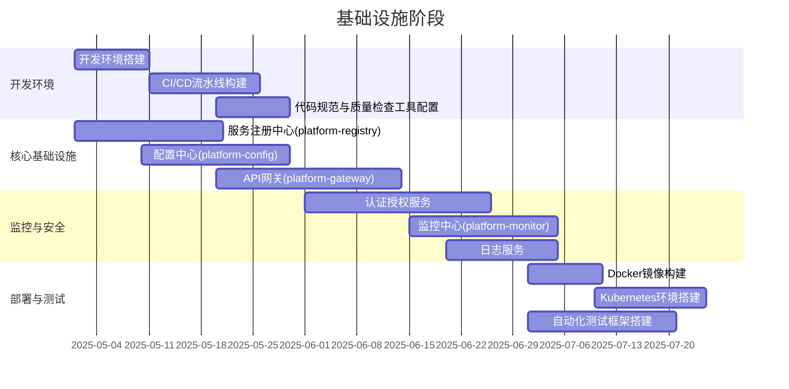
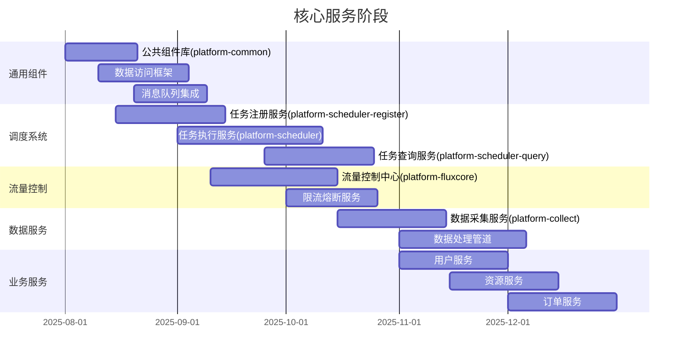
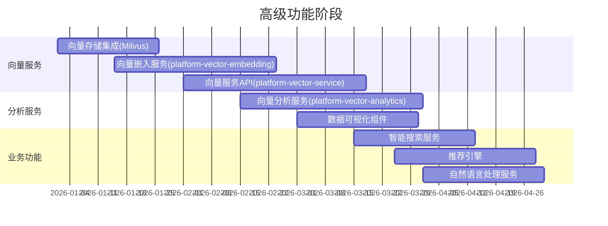
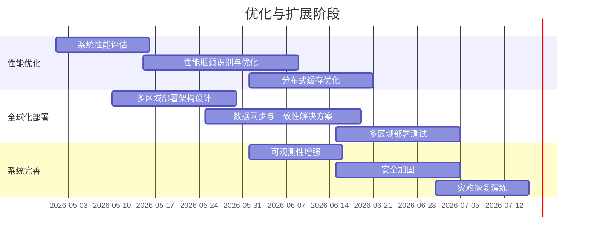
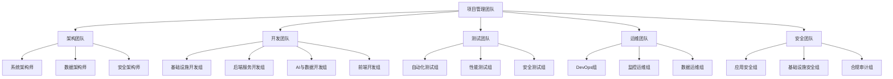
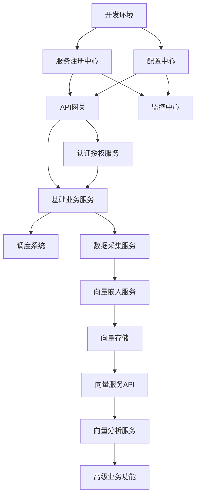

# 微服务平台项目实施时间表

**版本**: 1.0.0  
**日期**: 2025-04-26  
**状态**: 规划阶段

## 1. 项目概述

本文档详细规划微服务平台的实施时间表，包括各个阶段的工作内容、里程碑、团队分工和风险管理计划。实施计划基于架构设计文档中的技术选型和模块划分，确保系统按照预期进度和质量交付。

## 2. 项目分期

项目实施分为四个主要阶段：

1. **基础设施阶段**：搭建核心基础设施和开发环境
2. **核心服务阶段**：实现关键业务服务和支撑系统
3. **高级功能阶段**：实现AI和向量分析等高级功能
4. **优化与扩展阶段**：性能优化和全球化部署准备

## 3. 详细时间表

### 3.1 基础设施阶段 (2025年5月 - 2025年7月)

#### 关键里程碑：

- **M1-1**: 开发环境与CI/CD流水线就绪 (2025-05-25)
- **M1-2**: 核心基础服务可用 (2025-06-15)
- **M1-3**: 安全与监控体系就绪 (2025-07-05)
- **M1-4**: 容器化部署和自动化测试框架完成 (2025-07-25)

#### 交付物：

1. 开发环境标准化文档
2. CI/CD流水线
3. 服务注册中心
4. 配置中心
5. API网关
6. 认证授权服务
7. 基础监控平台
8. 容器化部署工具链

### 3.2 核心服务阶段 (2025年8月 - 2025年12月)

#### 关键里程碑：

- **M2-1**: 公共组件与数据访问框架完成 (2025-09-04)
- **M2-2**: 调度系统完成 (2025-10-25)
- **M2-3**: 流量控制系统完成 (2025-10-26)
- **M2-4**: 数据服务完成 (2025-12-05)
- **M2-5**: 核心业务服务完成 (2025-12-31)

#### 交付物：

1. 公共组件库
2. 响应式数据访问框架
3. 完整的调度系统
4. 流量控制中心
5. 数据采集与处理服务
6. 核心业务服务群

### 3.3 高级功能阶段 (2026年1月 - 2026年4月)

#### 关键里程碑：

- **M3-1**: 向量存储和嵌入服务完成 (2026-02-24)
- **M3-2**: 向量服务API完成 (2026-03-17)
- **M3-3**: 向量分析和可视化完成 (2026-04-01)
- **M3-4**: 高级业务功能完成 (2026-05-01)

#### 交付物：

1. 向量数据服务体系
2. 高性能向量检索API
3. 数据分析与可视化组件
4. 智能搜索和推荐引擎
5. 自然语言处理服务集成

### 3.4 优化与扩展阶段 (2026年5月 - 2026年7月)

#### 关键里程碑：

- **M4-1**: 系统性能优化完成 (2026-06-20)
- **M4-2**: 多区域部署架构就绪 (2026-07-05)
- **M4-3**: 可观测性和安全增强完成 (2026-07-05)
- **M4-4**: 灾难恢复能力验证 (2026-07-15)
- **M4-5**: 项目全面完成 (2026-07-31)

#### 交付物：

1. 性能优化报告与实施结果
2. 多区域部署架构文档
3. 增强的可观测性平台
4. 安全加固报告
5. 灾难恢复方案与演练报告

## 4. 团队分工

### 4.1 团队组成

项目实施需要以下团队配置：

### 4.2 人员配置

| 团队   | 角色         | 人数 | 主要职责        |
|------|------------|----|-------------|
| 项目管理 | 项目经理       | 1  | 总体项目规划与协调   |
| 项目管理 | 产品经理       | 2  | 产品需求与规划     |
| 项目管理 | 敏捷教练       | 1  | 敏捷实践指导      |
| 架构团队 | 系统架构师      | 2  | 系统整体架构设计    |
| 架构团队 | 数据架构师      | 1  | 数据模型与存储设计   |
| 架构团队 | 安全架构师      | 1  | 安全体系设计      |
| 开发团队 | 基础设施开发工程师  | 5  | 基础服务开发      |
| 开发团队 | 后端服务开发工程师  | 8  | 业务服务开发      |
| 开发团队 | AI与数据开发工程师 | 4  | 向量服务与分析开发   |
| 开发团队 | 前端开发工程师    | 4  | 前端应用开发      |
| 测试团队 | 自动化测试工程师   | 3  | 自动化测试用例开发   |
| 测试团队 | 性能测试工程师    | 2  | 性能测试与优化     |
| 测试团队 | 安全测试工程师    | 2  | 安全测试与漏洞扫描   |
| 运维团队 | DevOps工程师  | 3  | CI/CD与自动化部署 |
| 运维团队 | 监控运维工程师    | 2  | 监控与告警体系     |
| 运维团队 | 数据运维工程师    | 2  | 数据库与缓存维护    |
| 安全团队 | 应用安全工程师    | 2  | 应用层安全       |
| 安全团队 | 基础设施安全工程师  | 1  | 基础设施安全      |
| 安全团队 | 合规审计师      | 1  | 安全合规审计      |

### 4.3 资源分配矩阵

各阶段的团队资源分配（人数）：

| 团队       | 基础设施阶段 | 核心服务阶段 | 高级功能阶段 | 优化与扩展阶段 |
|----------|--------|--------|--------|---------|
| 项目管理团队   | 4      | 4      | 4      | 4       |
| 架构团队     | 4      | 4      | 4      | 4       |
| 基础设施开发组  | 5      | 3      | 2      | 3       |
| 后端服务开发组  | 4      | 8      | 6      | 4       |
| AI与数据开发组 | 1      | 2      | 4      | 2       |
| 前端开发组    | 2      | 3      | 4      | 2       |
| 测试团队     | 3      | 5      | 7      | 7       |
| 运维团队     | 5      | 5      | 5      | 7       |
| 安全团队     | 2      | 3      | 3      | 4       |

## 5. 依赖关系管理

### 5.1 关键依赖项

下面的图表展示了项目中关键组件之间的依赖关系：

### 5.2 外部依赖

项目实施过程中，需要管理以下外部依赖：

1. **云服务提供商资源**：计算、存储、网络资源
2. **第三方服务集成**：支付服务、短信服务、邮件服务等
3. **开源组件版本**：Spring框架、Kubernetes、Milvus等
4. **开发工具链**：IDE、构建工具、代码质量工具等
5. **安全合规要求**：数据保护法规、行业标准等

## 6. 风险管理

### 6.1 已识别风险

| 风险ID | 风险描述              | 影响级别 | 发生概率 | 风险等级 | 预防措施         | 应对策略          |
|------|-------------------|------|------|------|--------------|---------------|
| R-01 | 技术栈学习曲线陡峭，影响开发进度  | 高    | 中    | 高    | 提前培训，建立技术社区  | 引入外部专家，增加学习时间 |
| R-02 | 微服务边界划分不合理，导致后期重构 | 高    | 中    | 高    | DDD事件风暴，架构评审 | 快速迭代，持续重构     |
| R-03 | 基础设施不稳定，影响开发和测试   | 高    | 低    | 中    | 冗余设计，监控告警    | 备用环境，快速恢复方案   |
| R-04 | 数据安全合规要求变更        | 中    | 中    | 中    | 提前了解法规，灵活设计  | 模块化设计，快速调整    |
| R-05 | 团队协作不顺畅，沟通效率低     | 中    | 中    | 中    | 敏捷实践，透明沟通    | 团队建设，调整工作方式   |
| R-06 | 向量数据库性能不满足需求      | 高    | 低    | 中    | 提前POC验证，性能测试 | 替代方案，优化策略     |
| R-07 | 第三方服务集成延迟         | 中    | 中    | 中    | 提前对接，模拟服务    | 优先级调整，临时替代方案  |
| R-08 | 业务需求频繁变更          | 高    | 中    | 高    | 需求优先级，变更管理   | 增量开发，快速响应     |

### 6.2 风险应对计划

针对高风险项目，制定详细的应对计划：

#### R-01: 技术栈学习曲线陡峭

1. **预防措施**：
    - 在项目开始前2周组织技术培训
    - 建立技术知识库和学习资源
    - 实施导师制，经验丰富的开发者指导新手

2. **应对策略**：
    - 引入有经验的外部顾问指导开发
    - 调整项目计划，为学习预留额外时间
    - 优先实施简单功能，积累经验

#### R-02: 微服务边界划分不合理

1. **预防措施**：
    - 开展领域驱动设计工作坊
    - 邀请业务专家参与服务边界设计
    - 架构评审会议验证服务划分

2. **应对策略**：
    - 采用迭代式服务边界调整
    - 建立服务拆分/合并的标准流程
    - 保持代码库的清晰组织，便于重构

#### R-08: 业务需求频繁变更

1. **预防措施**：
    - 实施严格的需求变更管理流程
    - 需求优先级排序和验证
    - 合理规划迭代周期，控制变更频率

2. **应对策略**：
    - 增量开发方法，减少变更影响
    - 松耦合架构，隔离变更影响范围
    - 自动化测试保障变更质量

## 7. 质量保障计划

### 7.1 质量目标

项目设定以下质量目标：

1. **代码质量**：
    - 测试覆盖率达到80%以上
    - 代码重复率低于5%
    - 静态代码分析无严重问题

2. **性能指标**：
    - API响应时间P99低于300ms
    - 系统吞吐量达到1000TPS
    - CPU利用率峰值不超过70%

3. **可靠性指标**：
    - 系统可用性达到99.95%以上
    - 故障平均修复时间(MTTR)低于30分钟
    - 平均故障间隔时间(MTBF)高于2000小时

4. **安全指标**：
    - 无高危安全漏洞
    - 所有安全事件24小时内响应
    - 安全合规审计通过率100%

### 7.2 质量保障活动

| 阶段   | 活动     | 频率   | 负责团队  | 输出物    |
|------|--------|------|-------|--------|
| 编码阶段 | 代码审查   | 每次提交 | 开发团队  | 审查报告   |
| 编码阶段 | 静态代码分析 | 每日   | 开发团队  | 分析报告   |
| 编码阶段 | 单元测试   | 持续   | 开发团队  | 测试报告   |
| 集成阶段 | 集成测试   | 每周   | 测试团队  | 测试报告   |
| 集成阶段 | 接口契约测试 | 每周   | 测试团队  | 契约测试报告 |
| 发布前  | 性能测试   | 每个迭代 | 性能测试组 | 性能测试报告 |
| 发布前  | 安全扫描   | 每个迭代 | 安全测试组 | 安全扫描报告 |
| 发布前  | 用户验收测试 | 每个迭代 | 产品团队  | 验收测试报告 |
| 运行阶段 | 监控告警   | 持续   | 运维团队  | 监控报告   |
| 运行阶段 | 故障分析   | 按需   | 运维团队  | 故障报告   |

## 8. 沟通管理计划

### 8.1 沟通矩阵

| 沟通类型   | 目标受众       | 频率    | 格式   | 负责人   | 目的            |
|--------|------------|-------|------|-------|---------------|
| 项目启动会  | 所有相关方      | 项目开始  | 现场会议 | 项目经理  | 明确项目目标、范围和计划  |
| 每日站会   | 开发团队       | 每日    | 简短会议 | 敏捷教练  | 同步进度、识别障碍     |
| 迭代评审   | 所有相关方      | 双周    | 演示会议 | 产品经理  | 展示成果、收集反馈     |
| 迭代规划   | 开发团队、产品团队  | 双周    | 规划会议 | 产品经理  | 规划下一迭代工作      |
| 架构评审   | 架构团队、技术负责人 | 月度    | 评审会议 | 系统架构师 | 评估架构设计、解决问题   |
| 项目状态报告 | 管理层、相关方    | 周度    | 书面报告 | 项目经理  | 报告项目状态、风险和问题  |
| 技术分享会  | 开发团队       | 双周    | 知识分享 | 轮值主讲  | 技术学习、解决方案分享   |
| 里程碑评审  | 所有相关方      | 里程碑节点 | 评审会议 | 项目经理  | 评估阶段成果、决策下一阶段 |

### 8.2 文档管理

项目文档管理策略：

1. **文档存储**：
    - 所有文档存储在Git仓库中
    - 技术文档与代码同步版本控制
    - 使用Markdown格式，便于协作和版本管理

2. **文档类型**：
    - 产品需求文档
    - 技术设计文档
    - API文档
    - 用户手册
    - 运维文档
    - 测试文档
    - 会议记录
    - 状态报告

3. **文档审核流程**：
    - 文档创建者负责初稿
    - 指定审核人进行评审
    - 评审意见以PR评论方式提交
    - 修改后合并到主分支

## 9. 交付与验收

### 9.1 交付策略

项目采用持续交付策略，按照以下流程：

1. **持续集成**：
    - 每次代码提交触发自动化构建
    - 运行单元测试和代码质量检查
    - 生成构建报告

2. **持续部署**：
    - 开发环境自动部署
    - 测试环境定时部署
    - 预生产和生产环境手动审批后部署

3. **环境阶梯**：
    - 开发环境：最新代码，每日多次更新
    - 测试环境：经过测试的代码，每周更新
    - 预生产环境：接近生产配置，每次发布前更新
    - 生产环境：经过全面验证的代码，按发布计划更新

### 9.2 验收标准

各阶段验收标准：

#### 基础设施阶段验收标准

1. 开发环境可正常使用，支持自动构建和部署
2. 服务注册中心和配置中心功能完善，支持服务发现和配置管理
3. API网关可正常路由请求，支持认证和限流
4. 监控系统可收集和展示基础指标
5. CI/CD流水线正常运行，支持自动化测试

#### 核心服务阶段验收标准

1. 调度系统可正常注册、执行和查询任务
2. 流量控制系统可正常进行限流和熔断
3. 数据采集服务可连接多种数据源并处理数据
4. 核心业务服务功能完整，API符合规范
5. 所有服务的单元测试和集成测试通过

#### 高级功能阶段验收标准

1. 向量服务可正常存储和检索向量数据
2. 向量分析功能可执行聚类和相似性分析
3. 智能搜索和推荐引擎准确率达到设定目标
4. 数据可视化组件可展示复杂数据关系
5. 性能指标满足需求要求

#### 优化与扩展阶段验收标准

1. 系统性能满足设定的吞吐量和响应时间目标
2. 多区域部署架构验证成功，数据同步正常
3. 可观测性平台可全面监控系统状态
4. 安全扫描无严重漏洞
5. 灾难恢复演练成功，恢复时间符合要求

## 10. 总结

本实施时间表为微服务平台的建设提供了详细的规划和指导，包括四个主要阶段的工作内容、里程碑、团队分工和质量保障计划。项目将在15个月内完成，从基础设施建设到系统优化，最终构建一个高性能、可扩展、安全可靠的微服务平台。

项目实施过程中，将严格遵循敏捷开发原则，通过迭代开发、持续集成和部署，灵活应对需求变更和风险挑战，确保项目按计划顺利交付。