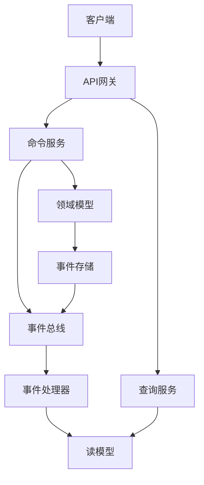
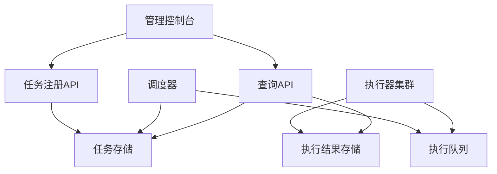

# 微服务平台架构优化与升级方案

**文档版本**: 1.0.0  
**日期**: 2025-04-26  
**作者**: 架构团队

## 目录

1. [引言](#1-引言)
2. [现状分析](#2-现状分析)
3. [技术栈升级](#3-技术栈升级)
4. [架构优化](#4-架构优化)
5. [模块重构](#5-模块重构)
6. [实施计划](#6-实施计划)
7. [附录](#7-附录)

## 1. 引言

本文档基于对微服务平台现有架构的分析，提出全面的优化与升级方案，以满足系统未来发展需求，提高系统性能、可维护性和可扩展性。

### 1.1 优化目标

1. **技术栈升级**：升级至Java 21/24，以利用新特性提升性能和开发效率
2. **架构优化**：优化服务边界，减少模块间耦合，改进系统整体架构
3. **框架隔离**：提供良好的抽象层，使技术框架易于升级和替换
4. **性能提升**：通过架构优化和技术栈升级，提高系统整体性能
5. **可维护性增强**：优化代码结构和组织，提高系统可维护性

## 2. 现状分析

### 2.1 现有架构优势

1. **模块化设计**：系统已按功能划分为多个模块，便于开发和维护
2. **微服务思想**：采用了微服务架构，实现了服务间的解耦
3. **领域驱动设计**：多数模块采用DDD思想设计，业务边界清晰
4. **高级特性支持**：已集成向量数据库，支持AI和向量搜索能力
5. **响应式架构**：部分模块采用响应式编程，提高系统吞吐量

### 2.2 存在的问题

1. **框架耦合度高**：业务逻辑与框架代码耦合紧密，不易升级和替换
2. **服务边界模糊**：部分服务边界划分不合理，导致职责混乱
3. **技术栈老旧**：基于Java 17的技术栈，未能充分利用新版本特性
4. **网关与注册中心冗余**：网关和注册中心功能存在重叠，配置复杂
5. **限流策略分散**：缺乏统一的限流策略管理，配置分散在各服务中

## 3. 技术栈升级

### 3.1 Java版本升级

#### 3.1.1 升级至JDK 21 LTS

**优势**：

- 虚拟线程支持，显著提高并发性能
- 增强的垃圾收集器，降低延迟
- 改进的模式匹配，简化代码
- 记录模式（Record Patterns）增强类型安全

**实施步骤**：

1. 更新Maven/Gradle配置，指定Java 21编译目标
2. 修改Docker基础镜像为OpenJDK 21
3. 利用虚拟线程改进高并发场景性能
4. 使用模式匹配简化代码

#### 3.1.2 为JDK 24准备

**规划**：

- JDK 24预计带来更多性能优化和新特性
- 设计框架隔离层，使未来升级更平滑
- 保持对新JDK特性的持续评估

### 3.2 Spring框架升级

#### 3.2.1 升级至Spring Boot 3.2.x

**优势**：

- 对Java 21虚拟线程的原生支持
- GraalVM原生镜像支持改进
- 性能优化和内存占用降低
- 安全性增强

**实施步骤**：

1. 更新依赖管理，指定新版本
2. 适配API变更
3. 迁移配置到新格式
4. 启用虚拟线程支持

#### 3.2.2 响应式框架增强

**优化方向**：

- 升级Project Reactor到最新版本
- 提供标准的响应式模式和最佳实践
- 完善响应式数据访问(R2DBC)支持
- 基于虚拟线程评估部分服务从响应式迁回命令式编程

### 3.3 辅助工具与框架升级

- 升级Milvus向量数据库客户端至2.3.x版本
- 升级监控栈(Prometheus/Grafana)至最新LTS版本
- 引入OpenTelemetry替代直接使用Micrometer
- 升级消息队列客户端至最新版本

## 4. 架构优化

### 4.1 核心架构优化

#### 4.1.1 六边形架构强化

**优化方向**：

- 严格实施端口和适配器模式
- 领域模型完全独立于框架和技术实现
- 通过依赖倒置原则减少框架耦合
- 定义清晰的领域服务接口和应用服务接口

**具体实施**：

1. 将所有外部依赖通过适配器访问
2. 领域模型不引用任何框架类
3. 使用依赖注入注册适配器实现
4. 框架特定代码限制在基础设施层

```java
// 领域模型示例 - 独立于任何框架
public class Order {
    private OrderId id;
    private CustomerId customerId;
    private List<OrderLine> orderLines;
    private OrderStatus status;
    
    // 领域逻辑和行为...
}

// 领域服务接口
public interface OrderRepository {
    Optional<Order> findById(OrderId id);
    void save(Order order);
    // 其他方法...
}

// 框架适配器 - 在基础设施层实现
@Component
public class SpringDataOrderRepository implements OrderRepository {
    private final JpaOrderRepository jpaRepository;
    
    // 实现方法，转换JPA实体和领域对象...
}
```

#### 4.1.2 CQRS模式优化

**优化方向**：

- 严格分离读写操作，优化各自性能
- 读操作使用专用模型和存储，避免ORM开销
- 将复杂查询迁移到专用查询服务
- 使用事件溯源记录状态变更

**具体实施**：

1. 将现有服务拆分为命令服务和查询服务
2. 命令服务产生领域事件
3. 查询服务构建读模型投影
4. 使用消息队列实现异步通信



### 4.2 网关与注册中心整合

#### 4.2.1 整合方案

**优化目标**：

- 将gateway和registry功能合理整合，减少冗余
- 统一配置管理，简化维护
- 提供全局流量控制能力

**整合策略**：

1. 评估gateway和nacos功能重叠度
2. 保留各自核心功能，消除冗余部分
3. 统一配置管理入口
4. 提供统一的服务发现接口

#### 4.2.2 全局限流方案

**特性**：

- 基于gateway实现统一入口限流
- 支持多维度限流策略（IP、用户、接口、业务）
- 动态配置和即时生效
- 分布式限流数据同步

**技术实现**：

- 使用Redis + Lua脚本实现分布式限流
- 支持令牌桶和滑动窗口算法
- 通过配置中心动态调整限流规则
- 提供限流监控和告警机制

```yaml
# 限流配置示例
limit:
  global: 
    rate: 10000 # 全局QPS限制
  routes:
    - id: user-service
      rate: 2000 # 服务级别限制
      resources:
        - uri: /api/v1/users
          method: POST
          rate: 100 # 接口级别限制
          type: IP # 限流维度
```

### 4.3 数据流处理优化

#### 4.3.1 数据采集与处理流程重构

**优化方向**：

- 重构数据采集框架，提高灵活性和可扩展性
- 基于管道模式设计数据处理流程
- 支持并行处理和背压机制
- 提供插件化的数据转换和加载能力

**技术实现**：

- 使用Project Reactor实现响应式数据流
- 定义标准数据处理接口
- 支持声明式数据处理配置
- 提供丰富的数据转换操作符

```java
// 数据处理管道示例
DataPipeline.create()
    .source(kafkaSource("topic"))
    .filter(data -> data.getSize() > 0)
    .map(this::transformData)
    .batch(100, Duration.ofSeconds(5))
    .sink(jdbcSink("table"))
    .start();
```

#### 4.3.2 向量处理服务增强

**优化方向**：

- 增强向量嵌入服务，支持多种模型和算法
- 优化向量索引和检索性能
- 提供向量操作的高级API
- 增加向量数据可视化能力

**技术实现**：

- 集成ONNX Runtime加速模型推理
- 使用Milvus 2.3提供的新特性
- 实现向量缓存和批处理机制
- 提供REST和gRPC双重API接口

## 5. 模块重构

### 5.1 核心模块职责优化

#### 5.1.1 platform-common模块

**重构目标**：

- 减少对特定框架的依赖
- 提供通用的工具类和模型
- 增强抽象能力，便于框架替换
- 支持新JDK特性

**具体实施**：

1. 清理不必要的框架依赖
2. 使用Java 21新特性重构工具类
3. 提供框架无关的异常处理机制
4. 使用记录类(Record)简化DTO设计

#### 5.1.2 platform-fluxcore模块

**重构目标**：

- 完善外源数据处理能力
- 提供标准的数据转换API
- 增强流量控制和熔断功能
- 支持分布式流处理

**具体实施**：

1. 实现可插拔的数据处理组件
2. 设计声明式的流处理DSL
3. 提供开箱即用的数据转换器
4. 集成Kafka Streams增强流处理能力

### 5.2 业务模块调整

#### 5.2.1 数据采集模块(platform-collect)

**职责定位**：

- 专注于外源数据采集
- 支持多种数据源接入
- 提供数据质量验证
- 与platform-fluxcore协作处理数据

**具体实施**：

1. 增强数据源适配器
2. 实现数据采集调度器
3. 提供数据质量监控机制
4. 设计数据采集配置界面

#### 5.2.2 仪表盘模块调整

**区分业务和监控仪表盘**：

- platform-buss-dashboard：业务数据可视化，对外提供业务API
- platform-monitor-dashboard：系统监控和运维，提供系统健康状态

**具体实施**：

1. 明确划分两个模块的职责边界
2. 优化各自的数据收集和存储机制
3. 增强业务仪表盘的数据分析能力
4. 提供更丰富的可视化组件

### 5.3 调度系统优化

**优化方向**：

- 进一步解耦注册器、执行器和查询器
- 增强分布式任务调度能力
- 提供更友好的任务管理界面
- 支持复杂的任务依赖关系

**具体实施**：

1. 重构任务模型，支持更丰富的调度类型
2. 实现基于DAG的任务依赖管理
3. 优化任务分派和负载均衡算法
4. 增强任务执行状态跟踪和失败恢复



## 6. 实施计划

### 6.1 分阶段实施策略

#### 6.1.1 第一阶段：基础设施升级(2个月)

1. **JDK升级**：
    - 将所有模块升级到JDK 21
    - 调整编译和运行时配置
    - 性能测试和优化

2. **依赖升级**：
    - 升级Spring Boot到3.2.x
    - 升级Spring Cloud相关组件
    - 升级数据库驱动和客户端

3. **容器环境更新**：
    - 更新Docker基础镜像
    - 调整JVM参数适配新版本
    - 更新K8s配置

#### 6.1.2 第二阶段：架构优化(3个月)

1. **核心模块重构**：
    - 实施六边形架构改造
    - 优化CQRS模式实现
    - 减少框架耦合

2. **网关与注册中心整合**：
    - 评估整合可行性
    - 实施功能整合
    - 迁移现有配置

3. **全局限流实现**：
    - 设计分布式限流方案
    - 实现限流核心功能
    - 整合到网关

#### 6.1.3 第三阶段：功能增强(3个月)

1. **数据流处理增强**：
    - 重构数据采集框架
    - 优化向量处理服务
    - 增强流处理能力

2. **调度系统优化**：
    - 实现基于DAG的任务依赖
    - 优化任务分派算法
    - 增强管理界面

3. **前端升级**：
    - 升级Vue框架到Vue 3
    - 改进组件设计
    - 优化用户体验

### 6.2 风险管理

| 风险          | 影响 | 缓解措施            |
|-------------|----|-----------------|
| JDK升级兼容性问题  | 中  | 提前测试关键依赖，准备回退方案 |
| 架构改造影响业务连续性 | 高  | 渐进式改造，保持向后兼容    |
| 性能回归        | 中  | 全面的性能测试，建立性能基准  |
| 团队学习曲线      | 中  | 提前培训，编写详细指南     |
| 依赖库冲突       | 低  | 全面的依赖分析，解决潜在冲突  |

## 7. 附录

### 7.1 JDK 21主要特性

- **虚拟线程(JEP 444)**：轻量级线程实现，显著提高并发性能
- **记录模式(JEP 440)**：增强类型匹配和数据提取
- **Sequenced Collections(JEP 431)**：为集合API添加序列操作
- **键值映射API(JEP 441)**：增强Map接口功能
- **Vector API(JEP 448)**：支持向量计算优化

### 7.2 六边形架构示例结构

```
service-name/
├── domain/                  # 领域层：核心业务逻辑
│   ├── model/               # 领域模型
│   ├── service/             # 领域服务
│   ├── repository/          # 仓储接口
│   └── event/               # 领域事件
├── application/             # 应用层：业务用例和协调
│   ├── service/             # 应用服务
│   ├── command/             # 命令处理器
│   ├── query/               # 查询处理器
│   └── event/               # 事件处理器
├── infrastructure/          # 基础设施层：技术实现
│   ├── repository/          # 仓储实现
│   ├── messaging/           # 消息机制实现
│   ├── persistence/         # 持久化实现
│   └── service/             # 外部服务适配器
└── interfaces/              # 接口层：对外暴露的接口
    ├── rest/                # REST API
    ├── messaging/           # 消息接口
    ├── scheduler/           # 调度接口
    └── batch/               # 批处理接口
```

### 7.3 技术栈版本对照表

| 组件              | 当前版本     | 目标版本     | 主要变化                 |
|-----------------|----------|----------|----------------------|
| JDK             | 17       | 21       | 虚拟线程, 记录模式, 集合增强     |
| Spring Boot     | 3.1.x    | 3.2.x    | 虚拟线程支持, GraalVM增强    |
| Spring Cloud    | 2022.0.0 | 2023.0.0 | 服务发现优化, 限流增强         |
| Project Reactor | 3.5.x    | 3.6.x    | 性能优化, 虚拟线程集成         |
| Milvus          | 2.2.x    | 2.3.x    | 混合搜索增强, 性能优化         |
| Vue             | 2.x      | 3.x      | 组合式API, TypeScript支持 |
