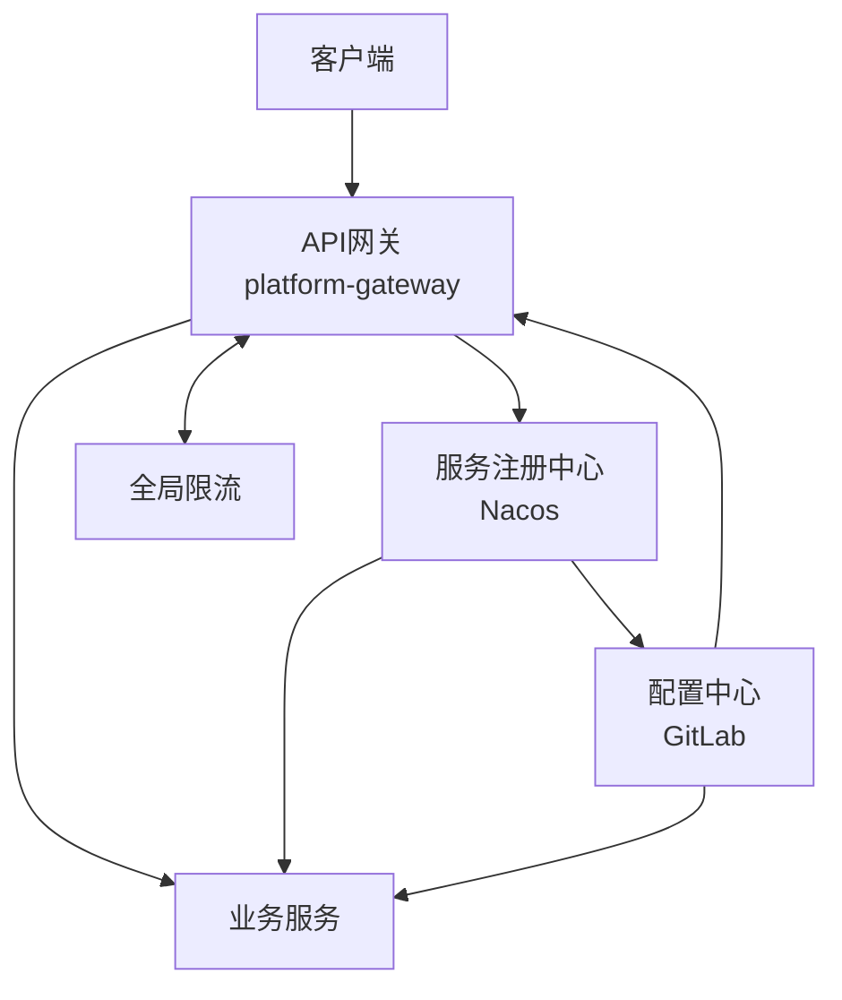

# 微服务平台技术栈升级与模块重构实施方案

**文档版本**: 1.0.0  
**日期**: 2025-04-26  
**状态**: 规划阶段  

## 目录

1. [概述](#1-概述)
2. [技术栈升级](#2-技术栈升级)
3. [模块重构与职责优化](#3-模块重构与职责优化)
4. [关键优化点实施细则](#4-关键优化点实施细则)
5. [分阶段实施计划](#5-分阶段实施计划)
6. [风险管理](#6-风险管理)
7. [资源需求](#7-资源需求)

## 1. 概述

本方案基于对现有微服务平台架构的分析，结合未来发展需求，提出全面的技术栈升级方案和模块重构计划。升级目标是保持基础框架的稳定性和可扩展性，同时为未来的迭代升级奠定良好基础。

### 1.1 现状评估

- 现有平台基于Java 17和Spring Boot 3.x构建
- 采用微服务架构和DDD设计理念
- 已实现基础的AI和向量分析能力
- 存在模块职责不清晰、框架耦合过重等问题

### 1.2 升级目标

- 升级核心技术栈至JDK 21，为JDK 24做好准备
- 优化模块结构，明确各模块职责
- 降低框架耦合度，提高可维护性
- 优化网关与限流设计
- 增强前端体验，升级至Vue 3

## 2. 技术栈升级

### 2.1 Java平台升级

#### 2.1.1 JDK 21 LTS升级

**升级内容**:
- 将所有模块编译和运行时环境升级至JDK 21
- 利用虚拟线程(Virtual Threads)提升并发性能
- 应用结构化并发(Structured Concurrency)简化异步代码
- 利用记录模式(Record Patterns)优化数据处理

**具体措施**:
1. 更新`pom.xml`中的Java版本配置：
```xml
<properties>
    <java.version>21</java.version>
    <maven.compiler.source>${java.version}</maven.compiler.source>
    <maven.compiler.target>${java.version}</maven.compiler.target>
</properties>
```

2. 修改Docker基础镜像：
```dockerfile
FROM eclipse-temurin:21-jre-jammy
```

3. 调整JVM参数以优化GC：
```
-XX:+UseZGC -XX:+ZGenerational -Xmx4g
```

4. 启用虚拟线程支持：
```java
// Spring Boot 配置类
@Bean
public TomcatProtocolHandlerCustomizer<?> protocolHandlerVirtualThreadExecutorCustomizer() {
    return protocolHandler -> {
        protocolHandler.setExecutor(Executors.newVirtualThreadPerTaskExecutor());
    };
}
```

#### 2.1.2 为JDK 24平稳升级做准备

**准备措施**:
- 设计框架抽象层，减少直接依赖JDK版本特定API
- 持续监控JDK预览特性和孵化器模块
- 建立技术债务跟踪机制，计划性地调整不兼容代码

### 2.2 核心框架升级

#### 2.2.1 Spring Boot升级

**升级版本**：Spring Boot 3.2.9

**升级内容**:
- 利用Spring Boot对虚拟线程的原生支持
- 应用Observable API增强监控能力
- 利用HTTP接口简化客户端代码
- 优化自动配置减少启动时间

**关键配置变更**:
```yaml
spring:
  threads:
    virtual:
      enabled: true
  application:
    startup-details: true
```

#### 2.2.2 Spring Cloud升级

**升级版本**：Spring Cloud 2023.0.0

**升级内容**:
- 增强服务发现与注册功能
- 优化负载均衡策略
- 改进分布式配置管理
- 加强弹性客户端能力

#### 2.2.3 响应式框架升级

**升级内容**:
- 升级Project Reactor至3.6.x
- 优化R2DBC支持
- 增强WebFlux性能
- 结合虚拟线程优化响应式编程模型

**使用示例**:
```java
// 结合虚拟线程和响应式编程
Mono.fromCallable(() -> {
    // 在虚拟线程中执行阻塞操作
    return expensiveOperation();
})
.subscribeOn(Schedulers.fromExecutor(
    Executors.newVirtualThreadPerTaskExecutor()
))
.flatMap(result -> processReactively(result))
.subscribe();
```

### 2.3 向量数据库与AI组件升级

**升级内容**:
- 升级Milvus客户端至2.3.3
- 更新ONNX Runtime至1.16.3
- 优化DL4J框架配置
- 增强向量索引性能

**配置示例**:
```yaml
milvus:
  client:
    version: 2.3.3
    connection-pool-size: 10
    metadata-cache-size: 512
  collection:
    auto-create: true
    shard-num: 2
```

### 2.4 监控与可观测性升级

**升级内容**:
- 升级Micrometer至1.12.2
- 升级Prometheus客户端至0.16.0
- 集成OpenTelemetry追踪
- 增强日志结构化和聚合

**代码示例**:
```java
@Bean
public OpenTelemetry openTelemetry(MeterRegistry meterRegistry) {
    return OpenTelemetrySdk.builder()
        .setMeterProvider(SdkMeterProvider.builder()
            .registerMetricReader(
                PeriodicMetricReader.builder(
                    PrometheusHttpServer.builder().build())
                .build())
            .build())
        .build();
}
```

## 3. 模块重构与职责优化

### 3.1 模块职责明确化

#### 3.1.1 platform-collect (数据采集)

**职责定位**:
- 专注于外源数据采集
- 支持多种数据源的连接和数据提取
- 提供数据采集的调度和监控
- 数据质量检验和预处理

**隔离点**:
- 将数据源连接器抽象为接口，实现与具体技术解耦
- 提供标准数据模型，减少对外部格式的直接依赖
- 设计插件化架构，便于扩展新数据源

#### 3.1.2 platform-fluxcore (数据处理)

**职责定位**:
- 负责将外源数据处理为内源数据
- 提供数据转换、聚合、过滤等处理能力
- 实现数据处理流水线的编排和执行
- 支持批处理和流处理两种模式

**隔离点**:
- 设计数据处理接口层，与具体实现分离
- 实现处理器注册机制，支持插件化扩展
- 将处理逻辑与调度逻辑分离
- 抽象数据格式转换，减少对特定格式的依赖

#### 3.1.3 platform-common (公共组件)

**职责定位**:
- 提供各模块共用的工具类和通用组件
- 定义系统级异常和错误处理机制
- 提供跨模块的通用数据模型
- 封装第三方库的通用访问接口

**隔离点**:
- 避免引入特定于框架的依赖
- 将工具类按功能领域划分为子模块
- 使用Java标准库API代替特定实现
- 提供框架无关的抽象接口

#### 3.1.4 platform-buss-dashboard (业务数据看板)

**职责定位**:
- 提供业务数据的可视化展示
- 对外提供业务数据API接口
- 支持数据报表生成和导出
- 提供数据分析和趋势预测功能

**隔离点**:
- 前后端分离，清晰界定接口边界
- 将数据处理与展示逻辑分离
- 抽象化数据源接口，减少直接依赖
- 采用插件式架构支持多种可视化方式

#### 3.1.5 platform-monitor-dashboard (监控管理看板)

**职责定位**:
- 系统运行状态监控和展示
- 性能指标采集和分析
- 系统告警和通知管理
- 运维验证和故障分析工具

**隔离点**:
- 将监控数据采集与展示分离
- 抽象告警规则引擎，支持可配置策略
- 设计通用的指标数据模型
- 监控面板组件化设计

### 3.2 网关和注册中心整合

#### 3.2.1 功能评估与整合

**整合原则**:
- 保留各自核心功能，消除冗余部分
- 统一配置管理，简化部署和维护
- 明确职责边界，避免功能交叉
- 提供兼容层，确保平滑迁移

**具体方案**:
1. 保留Nacos作为配置中心和服务发现核心
2. 将网关的路由规则纳入统一配置管理
3. 增强网关的服务发现能力，减少依赖
4. 简化部署架构，降低运维复杂度



#### 3.2.2 全局限流方案

**设计目标**:
- 提供全局一致的限流策略
- 支持多维度限流规则(IP、用户、接口等)
- 实现限流规则的动态调整
- 提供限流监控和预警机制

**实现方式**:
- 网关层实现集中式限流
- 服务层实现分布式限流
- 使用Redis + Lua实现计数器和令牌桶算法
- 通过配置中心统一管理限流规则

**代码示例**:
```java
@Configuration
public class GlobalRateLimiterConfig {
    
    @Bean
    public RedisRateLimiter redisRateLimiter(
            ReactiveRedisTemplate<String, String> redisTemplate,
            LimiterProperties properties) {
        return new RedisRateLimiter(redisTemplate, properties);
    }
    
    @Bean
    public RateLimiterGatewayFilterFactory rateLimiterGatewayFilterFactory(
            RedisRateLimiter limiter) {
        return new RateLimiterGatewayFilterFactory(limiter);
    }
}
```

### 3.3 调度器系统优化

#### 3.3.1 组件职责划分

**platform-scheduler** (集群定时器):
- 调度任务的执行和分配
- 管理任务执行状态和生命周期
- 实现任务优先级和资源隔离
- 提供任务执行的监控和统计

**platform-scheduler-register** (定时注册器):
- 业务任务的注册和元数据管理
- 任务依赖关系的定义和管理
- 任务参数验证和前置检查
- 提供任务模板和复用机制

**platform-scheduler-query** (管控接口):
- 任务执行历史查询和分析
- 调度器集群状态监控
- 任务执行统计和报表生成
- 提供管理界面和操作接口

#### 3.3.2 功能增强

**分布式调度增强**:
- 实现基于Raft的调度器选举机制
- 支持任务动态分片和负载均衡
- 增强失败恢复和补偿执行能力
- 提供细粒度的任务执行控制

**任务依赖管理**:
- 实现基于DAG的任务依赖关系管理
- 支持条件触发和事件驱动执行
- 提供任务执行路径的可视化展示
- 自动优化执行计划和资源分配

**扩展性优化**:
- 实现任务执行器的插件化架构
- 支持动态加载和热插拔
- 提供标准化的任务开发SDK
- 简化自定义任务的开发和部署

## 4. 关键优化点实施细则

### 4.1 JDK 21虚拟线程应用

#### 4.1.1 Web服务优化

**实施步骤**:
1. 配置Tomcat/Netty使用虚拟线程执行器:
```java
@Bean
public WebServerFactoryCustomizer<TomcatServletWebServerFactory> tomcatCustomizer() {
    return (factory) -> factory.addConnectorCustomizers(connector -> {
        ProtocolHandler handler = connector.getProtocolHandler();
        handler.setExecutor(Executors.newVirtualThreadPerTaskExecutor());
    });
}
```

2. 使用虚拟线程管理HTTP请求处理:
```java
@RestController
public class UserController {
    @GetMapping("/users/{id}")
    public User getUser(@PathVariable Long id) {
        try (var scope = new StructuredTaskScope.ShutdownOnFailure()) {
            Future<UserProfile> profileFuture = scope.fork(() -> 
                userProfileService.getProfile(id));
            Future<List<Order>> ordersFuture = scope.fork(() -> 
                orderService.getOrdersByUserId(id));
            
            scope.join();
            scope.throwIfFailed();
            
            return new User(id, profileFuture.resultNow(), 
                            ordersFuture.resultNow());
        } catch (Exception e) {
            throw new RuntimeException(e);
        }
    }
}
```

#### 4.1.2 数据访问优化

**实施步骤**:
1. 将阻塞数据库操作封装到虚拟线程中:
```java
public Mono<User> findById(Long id) {
    return Mono.fromCallable(() -> {
        // 在虚拟线程中执行JDBC操作
        return jdbcTemplate.queryForObject(
            "SELECT * FROM users WHERE id = ?", 
            new Object[]{id}, userRowMapper);
    }).subscribeOn(Schedulers.fromExecutor(
        Executors.newVirtualThreadPerTaskExecutor()));
}
```

2. 改进批处理操作:
```java
public void batchProcess(List<Task> tasks) {
    try (var executor = Executors.newVirtualThreadPerTaskExecutor()) {
        tasks.stream()
            .map(task -> CompletableFuture.runAsync(
                () -> processTask(task), executor))
            .collect(Collectors.toList())
            .forEach(CompletableFuture::join);
    }
}
```

### 4.2 六边形架构实施

#### 4.2.1 领域层设计

**实施步骤**:
1. 定义领域模型和值对象:
```java
// 领域模型，不依赖框架
public final class Order {
    private final OrderId id;
    private final CustomerId customerId;
    private List<OrderLine> orderLines;
    private OrderStatus status;
    
    // 构造函数、业务方法...
    
    public void addProduct(Product product, int quantity) {
        // 领域逻辑...
    }
    
    public void confirm() {
        // 领域逻辑...
    }
}
```

2. 定义领域服务接口:
```java
// 领域服务接口
public interface OrderService {
    void placeOrder(Order order);
    void cancelOrder(OrderId orderId, CancellationReason reason);
}

// 仓储接口
public interface OrderRepository {
    Optional<Order> findById(OrderId id);
    void save(Order order);
}
```

#### 4.2.2 应用层设计

**实施步骤**:
1. 实现应用服务:
```java
@ApplicationService
public class OrderApplicationService {
    private final OrderRepository orderRepository;
    private final PaymentService paymentService;
    private final EventPublisher eventPublisher;
    
    public void placeOrder(PlaceOrderCommand command) {
        // 应用服务逻辑...
        Order order = createOrderFromCommand(command);
        orderRepository.save(order);
        paymentService.processPayment(order);
        eventPublisher.publish(new OrderPlacedEvent(order.getId()));
    }
}
```

2. 定义命令和查询模型:
```java
// 命令对象
public record PlaceOrderCommand(
    CustomerId customerId,
    List<OrderLineDto> orderLines,
    PaymentInfo paymentInfo) {}

// 查询结果对象
public record OrderSummaryDto(
    UUID orderId,
    String customerName,
    BigDecimal totalAmount,
    OrderStatus status,
    LocalDateTime createdAt) {}
```

#### 4.2.3 基础设施层设计

**实施步骤**:
1. 实现仓储适配器:
```java
@Repository
public class JpaOrderRepository implements OrderRepository {
    private final OrderJpaRepository jpaRepository;
    private final OrderMapper mapper;
    
    @Override
    public Optional<Order> findById(OrderId id) {
        return jpaRepository.findById(id.getValue())
            .map(mapper::toDomain);
    }
    
    @Override
    public void save(Order order) {
        OrderEntity entity = mapper.toEntity(order);
        jpaRepository.save(entity);
    }
}
```

2. 实现事件发布适配器:
```java
@Component
public class KafkaEventPublisher implements EventPublisher {
    private final KafkaTemplate<String, Object> kafkaTemplate;
    
    @Override
    public void publish(DomainEvent event) {
        kafkaTemplate.send(determineTopicName(event), event);
    }
    
    private String determineTopicName(DomainEvent event) {
        // 根据事件类型确定主题名...
    }
}
```

### 4.3 前端Vue 3迁移

**实施步骤**:
1. 项目架构调整:
   - 采用Vite作为构建工具
   - 使用Composition API替代Options API
   - 采用TypeScript增强类型安全
   - 使用Pinia替代Vuex进行状态管理

2. 组件改造示例:
```typescript
// Vue 3 Composition API组件示例
<script setup lang="ts">
import { ref, onMounted } from 'vue'
import { useUserStore } from '@/stores/user'

const userStore = useUserStore()
const users = ref<User[]>([])
const loading = ref(false)

onMounted(async () => {
  loading.value = true
  try {
    users.value = await userStore.fetchUsers()
  } finally {
    loading.value = false
  }
})
</script>

<template>
  <div class="user-list">
    <div v-if="loading">Loading...</div>
    <ul v-else>
      <li v-for="user in users" :key="user.id">
        {{ user.name }}
      </li>
    </ul>
  </div>
</template>
```

3. API调用优化:
```typescript
// 使用Fetch API和Composition API封装
export function useApi() {
  const baseUrl = import.meta.env.VITE_API_BASE_URL
  
  async function get<T>(endpoint: string): Promise<T> {
    const response = await fetch(`${baseUrl}${endpoint}`, {
      headers: {
        'Content-Type': 'application/json',
        'Authorization': `Bearer ${getToken()}`
      }
    })
    
    if (!response.ok) {
      throw new Error(`API error: ${response.status}`)
    }
    
    return response.json()
  }
  
  // post, put, delete方法...
  
  return { get, post, put, delete: deleteMethod }
}
```

## 5. 分阶段实施计划

### 5.1 准备阶段 (1个月)

**主要任务**:
- 环境与工具准备
- 团队培训
- 详细技术选型
- 项目依赖分析与兼容性评估

**具体活动**:
1. 建立JDK 21开发环境
2. 培训团队了解新特性和架构变化
3. 评估现有代码库与JDK 21的兼容性
4. 制定详细升级路线图和里程碑

### 5.2 基础设施升级阶段 (2个月)

**主要任务**:
- JDK升级
- Spring框架升级
- 容器与CI/CD流程调整
- 基础性能测试与调优

**里程碑**:
1. 开发环境完成JDK 21迁移
2. CI/CD流程支持新技术栈
3. 核心框架升级至目标版本
4. 完成基准性能测试

### 5.3 核心模块重构阶段 (3个月)

**主要任务**:
- platform-common抽象层改造
- 网关与注册中心功能整合
- 全局限流实现
- 数据处理框架优化

**里程碑**:
1. 完成platform-common抽象层设计
2. 实现网关与注册中心功能整合
3. 部署全局限流系统
4. 数据处理框架完成优化

### 5.4 业务模块升级阶段 (3个月)

**主要任务**:
- 业务服务升级与优化
- 调度系统重构
- AI与向量服务增强
- 前端升级至Vue 3

**里程碑**:
1. 核心业务服务完成升级
2. 调度系统功能增强完成
3. AI与向量服务优化完成
4. 前端完成Vue 3迁移

### 5.5 测试与优化阶段 (2个月)

**主要任务**:
- 全面功能测试
- 性能基准测试
- 安全测试
- 生产环境部署准备

**里程碑**:
1. 全功能测试通过
2. 性能达到或超过目标指标
3. 安全测试无高危漏洞
4. 生产环境部署方案确定

### 5.6 生产部署阶段 (1个月)

**主要任务**:
- 灰度发布策略实施
- 生产环境监控增强
- 用户培训
- 系统文档更新

**里程碑**:
1. 系统成功部署到生产环境
2. 监控系统全面覆盖
3. 运维团队完成培训
4. 文档体系完善

## 6. 风险管理

### 6.1 主要风险及应对策略

| 风险 | 影响程度 | 发生概率 | 应对策略 |
|-----|---------|---------|---------|
| JDK 21兼容性问题 | 高 | 中 | 预先全面测试，准备兼容性补丁 |
| 架构变更导致系统不稳定 | 高 | 中 | 渐进式改造，保持兼容层 |
| 性能退化 | 中 | 低 | 建立基准测试，持续监控 |
| 团队适应新架构困难 | 中 | 中 | 提前培训，编写详细指南 |
| 第三方库不兼容 | 高 | 低 | 提前评估，准备替代方案 |
| 生产环境部署风险 | 高 | 低 | 制定回滚方案，灰度发布 |

### 6.2 风险监控与评估

**监控机制**:
- 定期风险评估会议 (每周)
- 建立风险跟踪清单
- 设定风险预警指标
- 制定应急处理流程

**评估方法**:
- 技术POC验证
- 代码审查与架构评审
- 自动化兼容性测试
- 性能基准对比测试

## 7. 资源需求

### 7.1 人员配置

**开发团队**:
- 架构师: 2人 (负责架构设计和技术决策)
- 高级开发工程师: 4人 (负责核心模块重构)
- 开发工程师: 6人 (负责业务模块升级)
- 前端工程师: 3人 (负责Vue 3迁移)

**测试与运维**:
- 测试工程师: 3人 (功能和性能测试)
- DevOps工程师: 2人 (CI/CD和部署)
- 系统运维工程师: 2人 (生产环境支持)

### 7.2 硬件与环境需求

**开发环境**:
- 开发服务器: 高性能工作站 (16核CPU, 32GB内存)
- 测试环境: 模拟生产配置的测试集群
- CI/CD系统: 自动化构建和部署环境

**工具需求**:
- JDK 21开发套件
- 性能测试工具套件
- 代码质量分析工具
- 监控与日志分析平台

### 7.3 时间与成本估算

**时间估算**:
- 总体实施周期: 12个月
- 关键路径: 核心模块重构 → 业务模块升级 → 测试与优化

**成本估算**:
- 人力成本: 团队全职投入12个月
- 硬件成本: 升级和扩容相关基础设施
- 培训成本: 技术培训和知识转移
- 运维成本: 过渡期双环境运行
