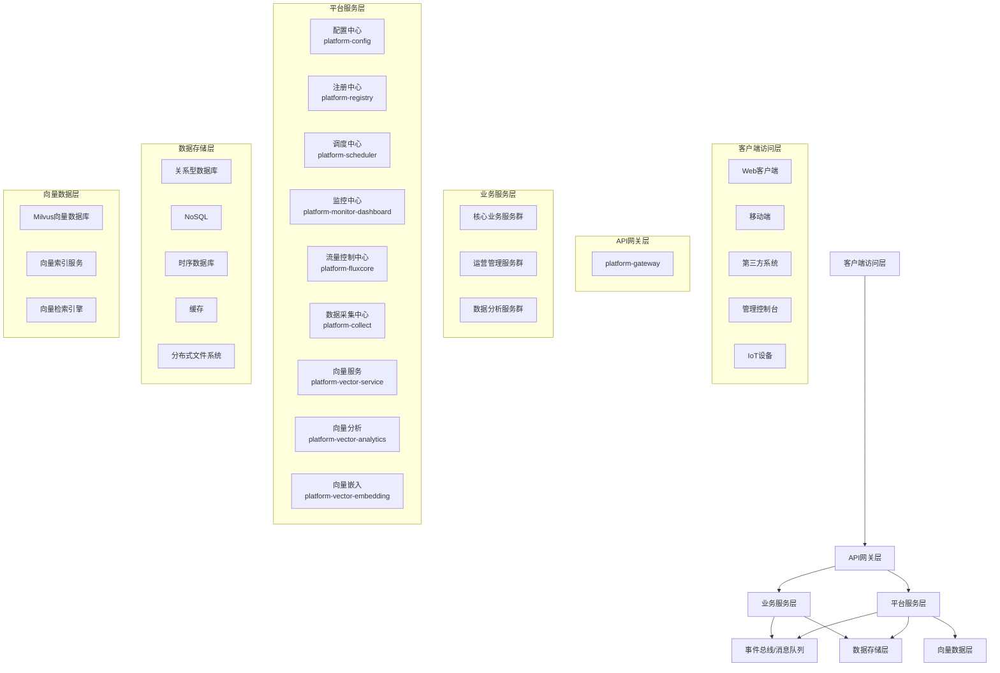

# 现代化微服务平台架构概述

**版本**: 2.0.0  
**日期**: 2025-04-26  
**作者**: 架构团队  

## 目录

1. [引言](#1-引言)
2. [架构概述](#2-架构概述)
3. [技术栈选择](#3-技术栈选择)

## 1. 引言

### 1.1 文档目的

本文档详细描述了现代化微服务平台的架构设计，旨在为开发团队提供清晰的架构蓝图，确保系统实现符合预期的质量属性和业务需求。同时，文档也作为技术决策的基础，指导未来版本的迭代和演进。

### 1.2 设计目标

本架构设计的主要目标包括：

- 构建高度可扩展、松耦合且易于维护的企业级系统
- 支持快速业务迭代和弹性扩展
- 简化开发流程，提高团队协作效率
- 实现服务的高可用性、可伸缩性和容错性
- 支持系统的灰度发布和平滑升级
- 提供完善的监控、日志和审计功能
- 支持现代化AI和向量数据分析能力
- 实现技术栈的平滑升级路径

### 1.3 关键设计决策

本架构采用以下关键设计决策：

- 基于领域驱动设计(DDD)的微服务架构
- 采用响应式编程模型提高系统吞吐量
- 实现CQRS和事件溯源模式分离读写操作
- 使用六边形架构(Hexagonal Architecture)隔离业务逻辑
- 采用事件驱动架构实现服务间松耦合通信
- 引入向量数据库支持高级AI和相似性检索能力
- 基于MCP(微服务云平台)模式提供全面的云原生能力
- 采用JDK 21的虚拟线程提升系统性能，并为JDK 24做好准备

## 2. 架构概述

### 2.1 架构核心理念

本架构融合了多种先进的编程概念和设计原则：

1. **六边形架构 (Hexagonal Architecture)**：
   - 将业务领域逻辑与技术实现分离
   - 通过端口和适配器模式实现技术组件可替换性
   - 确保核心业务逻辑不依赖于外部技术实现

2. **云原生设计原则**：
   - 容器化部署
   - 基础设施即代码 (IaC)
   - 服务弹性扩展与自愈能力
   - 声明式API与配置

3. **响应式系统设计**：
   - 响应性：系统及时响应用户请求
   - 弹性：系统在部分失败的情况下保持响应能力
   - 弹性：系统根据负载自动扩缩容
   - 消息驱动：系统组件通过异步消息通信

4. **CQRS与事件溯源**：
   - 读写操作分离，优化各自的性能和扩展性
   - 使用事件记录系统状态变更，而非仅存储当前状态
   - 支持完整审计、历史重现和时间点恢复

5. **不可变编程**：
   - 使用不可变对象简化并发处理
   - 减少副作用，提高系统可预测性
   - 利用函数式编程范式实现业务逻辑

6. **向量数据分析**：
   - 支持向量化数据存储和检索
   - 提供高维数据的相似性搜索
   - 实现AI驱动的数据分析和推荐

### 2.2 整体架构图

### 2.3 系统层次结构

1. **客户端访问层**：各类终端访问入口，包括Web应用、移动应用、第三方系统、管理控制台等。

2. **API网关层**：统一的服务入口，负责路由、认证、限流等功能，由platform-gateway模块实现。

3. **业务服务层**：按领域划分的各类业务微服务，采用DDD方法进行设计和实现。

4. **平台服务层**：支持业务层的基础设施服务，包括配置中心、注册中心、调度中心、监控中心等。

5. **事件总线/消息队列**：基于事件驱动架构的服务间通信机制。

6. **数据存储层**：包括关系型数据库、NoSQL、时序数据库、缓存和分布式文件系统等。

7. **向量数据层**：支持AI和相似性搜索的向量数据管理服务。

## 3. 技术栈选择

### 3.1 基础框架与语言

- **编程语言**: Java 21 LTS, Kotlin 1.9.x
- **构建工具**: Maven, Gradle
- **基础框架**: Spring Boot 3.2.x, Spring Cloud 2023.x

### 3.2 微服务基础设施

- **配置中心**: Nacos Config
- **服务注册与发现**: Nacos Discovery
- **API网关**: Spring Cloud Gateway (响应式)
- **服务熔断与限流**: Sentinel, Resilience4j
- **负载均衡**: Spring Cloud LoadBalancer

### 3.3 数据存储与缓存

- **关系型数据库**: MySQL 8.x, PostgreSQL 16.x
- **NoSQL数据库**: MongoDB 7.x
- **缓存**: Redis 7.x
- **时序数据库**: InfluxDB, Prometheus TSDB
- **向量数据库**: Milvus 2.3.x
- **分布式文件系统**: MinIO

### 3.4 消息与事件处理

- **消息队列**: Kafka 3.6.x, RocketMQ 5.1.x
- **流处理**: Kafka Streams, Spring Cloud Stream
- **批处理**: Spring Batch

### 3.5 响应式编程

- **响应式框架**: Project Reactor 3.6.x, Spring WebFlux
- **响应式数据访问**: R2DBC
- **响应式流**: Reactive Streams, RxJava 3

### 3.6 AI与向量处理

- **机器学习框架**: DJL (Deep Java Library)
- **向量计算**: ONNX Runtime 1.16.x, ND4J
- **向量检索引擎**: FAISS (通过JNI)
- **NLP处理**: HuggingFace模型 (通过DJL)

### 3.7 DevOps与云原生

- **容器化**: Docker
- **容器编排**: Kubernetes
- **CI/CD**: GitHub Actions, GitLab CI
- **配置管理**: Helm, Kustomize
- **服务网格**: Istio
- **可观测性**: OpenTelemetry, Grafana, Prometheus

### 3.8 前端技术栈

- **前端框架**: Vue 3.x
- **构建工具**: Vite
- **状态管理**: Pinia
- **UI组件库**: Element Plus / Naive UI
- **类型系统**: TypeScript 5.x