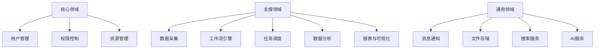
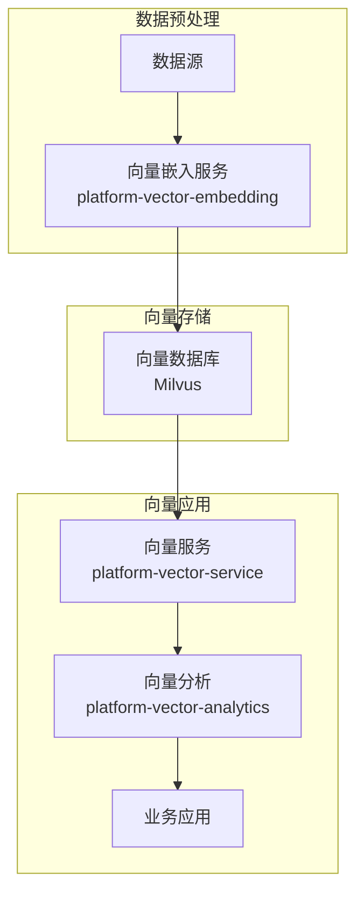
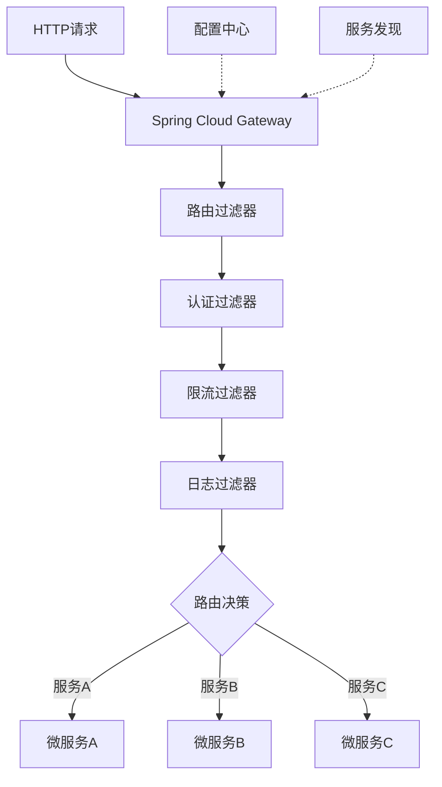
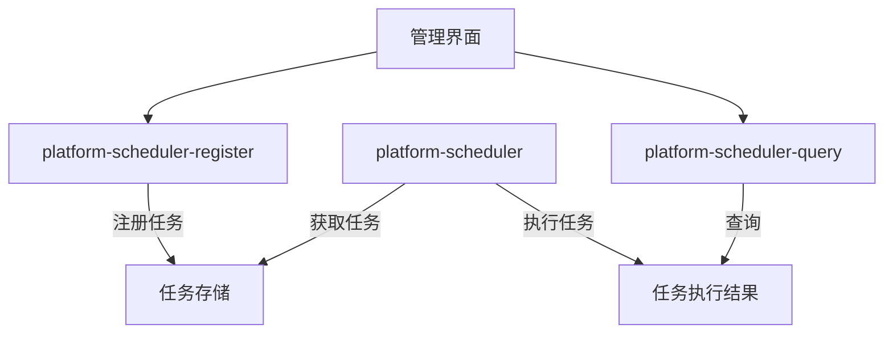

# 系统架构详细设计

**版本**: 2.0.0  
**日期**: 2025-04-26  
**作者**: 架构团队  

## 目录

1. [系统架构设计](#1-系统架构设计)
2. [核心子系统设计](#2-核心子系统设计)

## 1. 系统架构设计

### 1.1 业务领域划分

基于领域驱动设计(DDD)方法，系统按照以下领域进行划分：



### 1.2 微服务设计原则

1. **单一职责原则**：每个微服务只负责特定的业务功能。

2. **自治原则**：微服务应该能够独立开发、测试、部署和运行。

3. **数据自治原则**：每个微服务应该拥有自己的数据存储。

4. **有界上下文原则**：微服务边界应与DDD中的有界上下文一致。

5. **异步通信偏好原则**：优先考虑异步通信以提高系统弹性。

6. **幂等性原则**：服务接口设计应支持幂等操作。

7. **容错设计原则**：服务应设计为在下游服务失败时仍能工作。

### 1.3 微服务通信模式

1. **同步通信**：
   - REST API (OpenAPI 3.0规范)
   - gRPC (高性能场景)
   - GraphQL (复杂查询场景)

2. **异步通信**：
   - 消息队列 (Kafka/RocketMQ)
   - 事件驱动 (CloudEvents规范)
   - 发布/订阅模式

3. **混合通信**：
   - 命令查询职责分离(CQRS)
   - 事件溯源(Event Sourcing)

### 1.4 数据管理策略

1. **数据分区**：
   - 按服务边界分区
   - 按数据生命周期分区
   - 按地理位置分区

2. **数据一致性**：
   - 最终一致性模型
   - 分布式事务 (Seata/TCC)
   - 事件溯源与补偿

3. **数据访问模式**：
   - CQRS模式
   - 响应式数据访问
   - 多态持久化

### 1.5 向量数据架构



1. **向量嵌入服务**：负责将非结构化数据(文本、图像等)转换为向量表示。

2. **向量数据库**：存储和索引高维向量数据，支持高效的相似性搜索。

3. **向量服务**：提供向量数据的CRUD和检索API，支持KNN和ANN查询。

4. **向量分析**：提供向量聚类、分类、降维等高级分析功能。

## 2. 核心子系统设计

### 2.1 API网关 (platform-gateway)

#### 2.1.1 功能定位

作为系统的统一入口，负责请求路由、认证授权、限流熔断等功能。

#### 2.1.2 核心组件

1. **路由管理**：动态路由配置，支持路径、方法、头部等多维度路由规则。

2. **认证授权**：JWT认证、OAuth2集成、细粒度权限控制。

3. **流量控制**：基于Sentinel的限流、熔断、降级策略。

4. **日志审计**：请求响应日志记录、审计跟踪。

5. **灰度发布**：基于用户、设备、区域等维度的流量分配。

#### 2.1.3 技术实现



采用响应式编程模型实现，基于Spring Cloud Gateway和Project Reactor，支持高并发、低延迟的请求处理。利用JDK 21虚拟线程提升性能，实现更高效的请求处理。

#### 2.1.4 全局限流与流量控制

统一的限流配置管理：

```yaml
limit:
  global:
    qps: 10000
    algorithm: token-bucket
    burst-capacity: 1000
  
  services:
    user-service:
      qps: 2000
      algorithm: sliding-window
      window-size: 10s
      
      endpoints:
        "/api/v1/users":
          methods: [POST]
          qps: 100
          algorithm: fixed-window
          dimension: IP
          response:
            code: 429
            message: "请求过于频繁，请稍后再试"
```

基于Redis + Lua脚本实现分布式限流，支持多种限流算法和多维度限流规则。

### 2.2 配置中心 (platform-config)

#### 2.2.1 功能定位

集中管理所有微服务的配置信息，支持动态配置更新和多环境配置管理。

#### 2.2.2 核心组件

1. **配置存储**：多数据源支持，包括文件、数据库、Git等。

2. **配置版本控制**：配置变更历史、版本比较、回滚功能。

3. **配置加密**：敏感配置的加密存储和解密使用。

4. **配置订阅**：配置变更的实时推送和通知。

#### 2.2.3 技术实现

基于Nacos Config实现，提供REST API和Web界面进行配置管理，支持配置的动态刷新和推送。集成Git作为配置版本管理后端，实现配置变更的审计和回滚。

### 2.3 服务注册中心 (platform-registry)

#### 2.3.1 功能定位

提供服务注册与发现功能，是服务间通信的基础。

#### 2.3.2 核心组件

1. **服务注册**：服务实例自动注册，支持元数据管理。

2. **服务发现**：基于名称或标签的服务发现，支持负载均衡。

3. **健康检查**：服务健康状态监控，自动剔除不健康实例。

4. **集群管理**：多集群、多区域的服务发现。

#### 2.3.3 技术实现

基于Nacos Discovery实现，支持服务的自动注册和发现，提供REST API进行服务管理。整合Kubernetes服务发现机制，提供DNS接口实现服务名解析。

### 2.4 调度中心

#### 2.4.1 功能架构

调度中心采用分离式设计，将任务的定义、执行和查询分为独立的服务：



#### 2.4.2 核心组件

1. **任务注册服务 (platform-scheduler-register)**：
   - 任务定义与注册
   - 任务参数配置
   - 任务依赖管理
   - 任务版本控制

2. **任务执行服务 (platform-scheduler)**：
   - 任务调度执行
   - 执行结果管理
   - 失败重试策略
   - 执行性能监控
   - 资源隔离与保护

3. **任务查询服务 (platform-scheduler-query)**：
   - 任务执行历史查询
   - 任务状态查询
   - 任务执行统计分析
   - 任务预警通知

#### 2.4.3 技术实现

基于CQRS模式设计，使用事件驱动架构实现任务状态通知，利用JDK 21虚拟线程优化任务执行性能。支持基于DAG的任务依赖关系管理，实现复杂任务流的编排和执行。

```java
// 任务定义示例
@TaskDefinition(name = "dataProcessTask", description = "处理数据任务")
public class DataProcessTask implements Task {
    @Override
    public TaskResult execute(TaskContext context) {
        try (var scope = new StructuredTaskScope.ShutdownOnFailure()) {
            Future<DataSource> dataSourceFuture = scope.fork(() -> 
                loadDataSource(context.getParameter("sourceId")));
            Future<ProcessConfig> configFuture = scope.fork(() -> 
                loadConfig(context.getParameter("configId")));
            
            // 等待所有子任务完成或任一子任务失败
            scope.join();
            // 如果任何子任务失败，抛出异常
            scope.throwIfFailed();
            
            // 处理数据
            DataSource dataSource = dataSourceFuture.resultNow();
            ProcessConfig config = configFuture.resultNow();
            return processData(dataSource, config);
        } catch (Exception e) {
            return TaskResult.failure("数据处理失败: " + e.getMessage());
        }
    }
}
```

### 2.5 流量控制中心 (platform-fluxcore)

#### 2.5.1 功能定位

负责系统的流量控制、熔断降级和自适应保护，确保系统在高负载下仍能稳定运行。

#### 2.5.2 核心组件

1. **流量控制器**：基于QPS、并发线程数等维度的流量控制。

2. **熔断器**：基于错误率、响应时间等指标的熔断决策。

3. **系统自适应保护**：监控系统级指标(CPU、内存、负载等)，自动调整流控策略。

4. **规则配置中心**：集中管理各服务的流控规则。

#### 2.5.3 技术实现

基于Sentinel实现流量控制框架，采用响应式编程处理控制决策，支持规则的动态更新和推送。

```java
// 流量控制配置示例
@Configuration
public class FluxCoreConfig {
    
    @Bean
    public SentinelReactiveWebFilter sentinelWebFilter() {
        return new SentinelReactiveWebFilter();
    }
    
    @PostConstruct
    public void init() {
        // 配置资源流控规则
        FlowRule rule = new FlowRule();
        rule.setResource("/api/users");
        rule.setGrade(RuleConstant.FLOW_GRADE_QPS);
        rule.setCount(100);
        
        // 加载规则
        FlowRuleManager.loadRules(Collections.singletonList(rule));
        
        // 监听配置中心规则变更
        initDynamicRuleListener();
    }
}
```