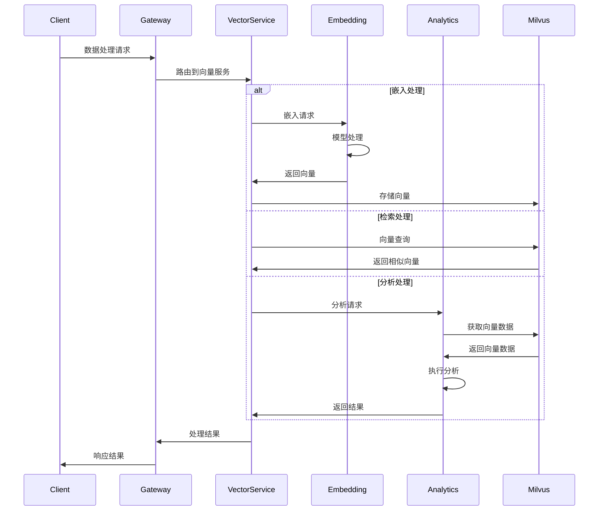
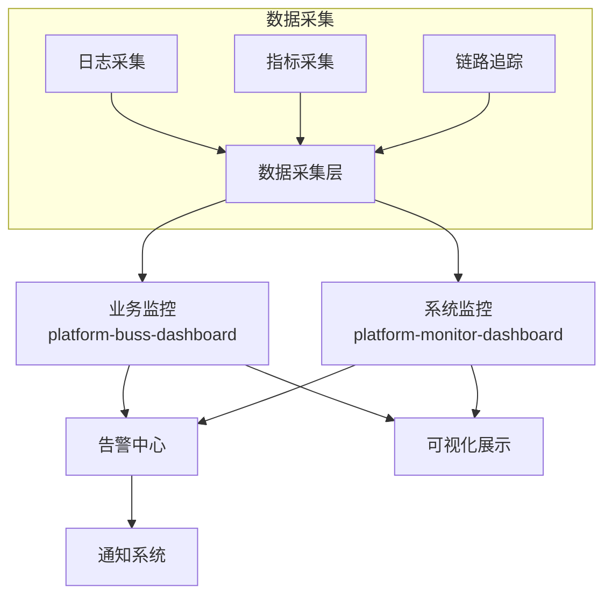

# 高级服务设计

**版本**: 2.0.0  
**日期**: 2025-04-26  
**作者**: 架构团队

## 目录

1. [向量服务体系](#1-向量服务体系)
2. [数据采集中心](#2-数据采集中心)
3. [监控中心](#3-监控中心)

## 1. 向量服务体系

### 1.1 向量嵌入服务 (platform-vector-embedding)

负责将非结构化数据(文本、图像等)转换为向量表示，支持多种嵌入模型：

- 文本嵌入：BERT、Word2Vec、Sentence-BERT等
- 图像嵌入：ResNet、EfficientNet等
- 多模态嵌入：CLIP等

关键优化：

- 利用ONNX Runtime加速模型推理
- 实现模型缓存机制提高性能
- 支持批处理提高吞吐量

### 1.2 向量服务 (platform-vector-service)

提供向量数据的CRUD和检索API，支持：

- 向量存储与检索
- 相似性搜索(KNN、ANN)
- 向量计算(距离计算、聚合等)
- 向量索引管理

关键优化：

- 实现向量操作的批处理机制
- 提供向量缓存减少数据库访问
- 支持混合查询(向量+属性)

### 1.3 向量分析 (platform-vector-analytics)

提供向量数据的高级分析功能：

- 向量聚类分析
- 降维与可视化
- 异常检测
- 推荐引擎

### 1.4 技术实现



基于Java实现，使用DJL加载和运行嵌入模型，通过Milvus Java SDK与向量数据库交互，提供RESTful API和gRPC接口。

### 1.5 配置示例

#### 向量嵌入服务配置

```yaml
embedding:
  models:
    text:
      - name: bert-base
        path: models/bert-base-uncased
        dimension: 768
        batchSize: 64
        maxLength: 512
        runtime: onnx
      - name: sentence-bert
        path: models/all-MiniLM-L6-v2
        dimension: 384
        batchSize: 128
        maxLength: 256
        runtime: onnx
    image:
      - name: resnet50
        path: models/resnet50
        dimension: 2048
        batchSize: 32
        runtime: onnx
  cache:
    enabled: true
    maximumSize: 10000
    expireAfterWrite: 1h
```

#### Milvus连接配置

```yaml
milvus:
  uri: tcp://milvus-service:19530
  collections:
    text:
      name: text_vectors
      dimension: 768
      index:
        type: IVF_FLAT
        params:
          nlist: 1024
      search:
        params:
          nprobe: 16
```

## 2. 数据采集中心 (platform-collect)

### 2.1 功能定位

负责各类数据源的数据采集、清洗、转换和加载，是数据处理的入口。

### 2.2 核心组件

1. **采集器**：支持多种数据源(关系型数据库、文件、API等)的数据采集。

2. **转换器**：数据清洗、转换、验证、标准化等处理。

3. **加载器**：将处理后的数据加载到目标存储。

4. **调度器**：采集任务的调度和监控。

5. **元数据管理**：数据源、数据结构、数据映射等元数据管理。

### 2.3 技术实现

采用插件化架构，支持各类数据源的接入，基于事件驱动和流处理模型进行数据处理。关键优化包括使用虚拟线程处理I/O密集型任务，实现非阻塞的数据处理流程。

```java
// 数据处理管道示例
@Configuration
public class DataPipelineConfig {
    
    @Bean
    public DataPipeline<RawData, ProcessedData> createPipeline(
            KafkaSource<RawData> source,
            DataTransformer<RawData, IntermediateData> transformer,
            DataValidator<IntermediateData> validator,
            DataEnricher<IntermediateData, ProcessedData> enricher,
            JdbcSink<ProcessedData> sink) {
        
        return DataPipeline.create()
            .source(source)
            .transform(transformer)
            .filter(validator::validate)
            .enrich(enricher)
            .batch(100, Duration.ofSeconds(5))
            .sink(sink)
            .errorHandler(this::handleError)
            .build();
    }
    
    private void handleError(Throwable error, Object data) {
        // 错误处理逻辑
    }
}
```

### 2.4 数据源适配器

系统支持多种数据源的适配器：

1. **关系型数据库适配器**：
    - 支持MySQL、PostgreSQL、Oracle等主流数据库
    - 增量采集支持（基于时间戳、主键或日志）
    - 批量采集与流式采集

2. **文件适配器**：
    - 支持CSV、JSON、XML、Excel等格式
    - 支持本地文件和远程文件（FTP/SFTP/S3等）
    - 文件变更检测与增量处理

3. **API适配器**：
    - RESTful API支持
    - WebSocket支持
    - 自定义HTTP客户端配置

4. **消息队列适配器**：
    - 支持Kafka、RocketMQ、RabbitMQ等
    - 支持不同的消费模式和序列化方式

### 2.5 数据处理能力

1. **数据转换**：
    - 字段映射转换
    - 类型转换与格式化
    - 数据清洗与规范化
    - 复杂表达式计算

2. **数据验证**：
    - 数据格式验证
    - 业务规则验证
    - 数据一致性检查
    - 异常数据处理

3. **数据加载**：
    - 批量写入优化
    - 事务控制
    - 冲突解决策略
    - 失败重试机制

## 3. 监控中心

### 3.1 功能架构

监控中心分为业务监控和系统监控两个部分：



### 3.2 业务监控 (platform-buss-dashboard)

- 业务指标采集与分析
- 业务流程监控
- 业务异常监控
- 用户行为分析

### 3.3 系统监控 (platform-monitor-dashboard)

- 服务健康状态监控
- 资源使用监控 (CPU、内存、磁盘等)
- 性能指标监控 (响应时间、吞吐量等)
- 系统告警管理

### 3.4 技术实现

#### 3.4.1 指标采集

基于OpenTelemetry和Micrometer实现统一的指标采集框架：

```java
@Configuration
public class MetricsConfig {
    
    @Bean
    public MeterRegistry meterRegistry() {
        CompositeMeterRegistry registry = new CompositeMeterRegistry();
        
        // Prometheus注册
        PrometheusMeterRegistry prometheusRegistry = new PrometheusMeterRegistry(
            PrometheusConfig.DEFAULT);
        registry.add(prometheusRegistry);
        
        // OpenTelemetry注册
        OpenTelemetryMeterRegistry otelRegistry = OpenTelemetryMeterRegistry
            .builder(OpenTelemetryConfig.DEFAULT)
            .build();
        registry.add(otelRegistry);
        
        return registry;
    }
    
    @Bean
    public TimedAspect timedAspect(MeterRegistry registry) {
        return new TimedAspect(registry);
    }
}
```

#### 3.4.2 链路追踪

基于OpenTelemetry实现分布式追踪：

```java
@Configuration
public class TracingConfig {
    
    @Bean
    public OpenTelemetry openTelemetry() {
        Resource resource = Resource.getDefault()
            .merge(Resource.create(Attributes.builder()
                .put(ResourceAttributes.SERVICE_NAME, "service-name")
                .put(ResourceAttributes.SERVICE_VERSION, "1.0.0")
                .build()));
        
        SdkTracerProvider tracerProvider = SdkTracerProvider.builder()
            .setResource(resource)
            .addSpanProcessor(BatchSpanProcessor.builder(
                OtlpGrpcSpanExporter.builder()
                    .setEndpoint("http://otel-collector:4317")
                    .build())
                .build())
            .build();
        
        return OpenTelemetrySdk.builder()
            .setTracerProvider(tracerProvider)
            .setPropagators(ContextPropagators.create(
                TextMapPropagator.composite(
                    W3CTraceContextPropagator.getInstance(),
                    W3CBaggagePropagator.getInstance())))
            .build();
    }
}
```

#### 3.4.3 告警系统

基于规则引擎实现灵活的告警规则配置和告警通知：

```yaml
alerts:
  rules:
    - name: high-error-rate
      query: sum(rate(http_server_requests_seconds_count{status=~"5.."}[5m])) / sum(rate(http_server_requests_seconds_count[5m])) > 0.05
      for: 5m
      labels:
        severity: critical
        category: availability
      annotations:
        summary: High error rate detected
        description: Error rate is above 5% for the last 5 minutes
    
    - name: high-latency
      query: histogram_quantile(0.95, sum(rate(http_server_requests_seconds_bucket[5m])) by (le, service)) > 0.5
      for: 5m
      labels:
        severity: warning
        category: performance
      annotations:
        summary: High latency detected
        description: 95th percentile latency is above 500ms for the last 5 minutes
```

### 3.5 可视化仪表盘

基于Grafana实现丰富的可视化仪表盘，主要包括：

1. **系统概览仪表盘**：
    - 系统健康状态
    - 关键指标趋势
    - 告警概览
    - 服务拓扑图

2. **服务监控仪表盘**：
    - 服务健康状态
    - 请求统计与趋势
    - 错误率与分布
    - 响应时间分布

3. **业务监控仪表盘**：
    - 业务KPI指标
    - 用户行为分析
    - 业务流程监控
    - 异常事件分析

4. **资源监控仪表盘**：
    - 容器资源使用率
    - 数据库性能监控
    - 网络流量监控
    - 存储使用监控