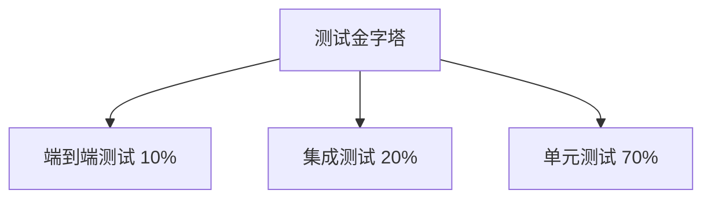
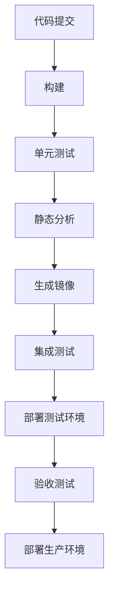

# 开发规范与项目结构

**版本**: 2.0.0  
**日期**: 2025-04-26  
**作者**: 架构团队

## 目录

1. [开发规范](#1-开发规范)
2. [项目结构与模块划分](#2-项目结构与模块划分)
3. [开发与部署流程](#3-开发与部署流程)

## 1. 开发规范

### 1.1 Java编码规范

#### 1.1.1 命名规范

1. **包名**：全小写，使用域名反转格式，如：`com.company.project.module`。

2. **类名**：PascalCase，名词，具体而有意义，如：`UserService`，`OrderController`。

3. **接口名**：PascalCase，形容词或名词，如：`Runnable`，`UserRepository`。

4. **方法名**：camelCase，动词或动词短语，如：`getUserById`，`saveOrder`。

5. **变量名**：camelCase，有意义的名词，如：`userId`，`orderItems`。

6. **常量名**：UPPER_SNAKE_CASE，如：`MAX_RETRY_COUNT`，`DEFAULT_TIMEOUT`。

7. **枚举名**：PascalCase for enum type, UPPER_SNAKE_CASE for enum constants, 如：
   ```java
   enum HttpStatus {
       OK,
       NOT_FOUND,
       INTERNAL_SERVER_ERROR
   }
   ```

#### 1.1.2 代码结构与格式

1. **缩进**：使用4个空格（不是制表符）。

2. **行长度**：不超过120个字符。

3. **换行**：
    - 操作符之前换行，下一行增加一个缩进层次。
    - 方法调用链换行，下一行增加一个缩进层次。

4. **花括号**：
    - 左花括号不换行。
    - 右花括号单独一行，除非后面跟着同一语句的其他部分，如`else`或`;`。

5. **导入语句**：
    - 按静态导入、Java核心类库、第三方库、本项目类的顺序分组。
    - 每组内按字母顺序排序。
    - 避免通配符导入(`import java.util.*`)。

6. **类结构**：按以下顺序排列类的成员：
    - 静态变量
    - 实例变量
    - 构造函数
    - 方法（按功能分组）

#### 1.1.3 最佳实践

1. **遵循SOLID原则**：
    - 单一职责原则(SRP)
    - 开放封闭原则(OCP)
    - 里氏替换原则(LSP)
    - 接口隔离原则(ISP)
    - 依赖倒置原则(DIP)

2. **避免魔法值**：不要在代码中直接使用数字或字符串常量，应定义为命名常量。

3. **优先使用不可变对象**：减少状态变化导致的bug。

4. **异常处理**：
    - 不要捕获后不做任何处理（空catch块）。
    - 只捕获预期可能发生且能够处理的异常。
    - 使用自定义异常传递业务含义。

5. **使用Java最新特性**：
    - 虚拟线程(JDK 21+)处理并发任务
    - 记录类(Record)简化数据传输对象
    - 模式匹配增强代码可读性
    - 文本块增强多行字符串处理
    - 密封类控制类层次结构

```java
// 良好实践示例
public record UserDto(String id, String name, String email) {}

public sealed interface PaymentMethod 
    permits CreditCard, BankTransfer, DigitalWallet {}

public void processOrder(Order order) {
    try (var scope = new StructuredTaskScope.ShutdownOnFailure()) {
        Future<Payment> paymentFuture = scope.fork(() -> 
            paymentService.processPayment(order.getPayment()));
        Future<Inventory> inventoryFuture = scope.fork(() -> 
            inventoryService.checkAvailability(order.getItems()));
        
        scope.join();
        scope.throwIfFailed();
        
        // 所有异步操作成功，继续处理
        Payment payment = paymentFuture.resultNow();
        Inventory inventory = inventoryFuture.resultNow();
        
        completeOrder(order, payment, inventory);
    } catch (ExecutionException e) {
        throw new OrderProcessingException("Failed to process order", e.getCause());
    } catch (InterruptedException e) {
        Thread.currentThread().interrupt();
        throw new OrderProcessingException("Order processing interrupted", e);
    }
}
```

### 1.2 响应式编程规范

#### 1.2.1 基本原则

1. **避免阻塞操作**：
    - 不要在响应式流中执行阻塞操作（如JDBC查询）。
    - 必要时使用专门的调度器（如`publishOn(Schedulers.boundedElastic())`）。

2. **错误处理**：
    - 总是处理错误信号，避免错误被吞没。
    - 使用`onErrorResume`、`onErrorReturn`等操作符而不是try-catch。

3. **资源管理**：
    - 使用`using`、`usingWhen`等操作符管理资源。
    - 确保所有资源都能正确释放。

4. **背压处理**：
    - 实现背压机制，处理生产者和消费者速度不匹配的情况。
    - 合理使用缓冲策略（buffer、window等）。

#### 1.2.2 Project Reactor使用规范

1. **操作符选择**：
    - 使用`flatMap`处理异步操作，而不是嵌套订阅。
    - 使用`map`处理同步转换。
    - 使用`concatMap`保持顺序，使用`flatMap`实现并发。

2. **流组合**：
    - 使用`zip`、`combineLatest`等操作符组合多个流。
    - 使用`merge`、`concat`等操作符合并流。

3. **错误处理最佳实践**：
    - 在业务逻辑中使用`onErrorResume`转换特定错误。
    - 在端点处使用全局错误处理。

4. **调度器使用**：
    - 计算密集型任务使用`Schedulers.parallel()`。
    - I/O密集型任务使用`Schedulers.boundedElastic()`。

```java
// 响应式编程示例
public Mono<OrderResponse> createOrder(OrderRequest request) {
    return validateRequest(request)
        .flatMap(validRequest -> 
            Mono.zip(
                customerRepository.findById(validRequest.getCustomerId())
                    .switchIfEmpty(Mono.error(new CustomerNotFoundException())),
                productRepository.findAllById(validRequest.getProductIds())
                    .collectList()
            )
        )
        .flatMap(tuple -> {
            Customer customer = tuple.getT1();
            List<Product> products = tuple.getT2();
            
            Order order = orderFactory.createOrder(customer, products);
            return orderRepository.save(order);
        })
        .flatMap(order -> 
            paymentService.processPayment(order.getId(), order.getTotalAmount())
                .thenReturn(order)
        )
        .flatMap(this::sendOrderConfirmation)
        .map(orderMapper::toResponse)
        .onErrorResume(CustomerNotFoundException.class, e -> 
            Mono.error(new OrderCreationException("Invalid customer", e))
        )
        .onErrorResume(PaymentException.class, e -> 
            Mono.error(new OrderCreationException("Payment failed", e))
        );
}
```

### 1.3 DDD与六边形架构实践

#### 1.3.1 领域模型设计

1. **实体（Entity）**：
    - 具有唯一标识和生命周期。
    - 负责维护其内部状态的一致性。
    - 实现领域规则和业务逻辑。

2. **值对象（Value Object）**：
    - 不可变，没有标识。
    - 相等性基于属性值而非引用。
    - 可以包含业务逻辑，但不改变其状态。

3. **聚合（Aggregate）**：
    - 由聚合根（根实体）和一组相关对象组成。
    - 确保跨实体的业务规则一致性。
    - 外部引用只能通过聚合根。

4. **领域服务（Domain Service）**：
    - 处理跨多个实体的业务逻辑。
    - 无状态，不持有领域数据。
    - 协调多个实体和值对象的交互。

#### 1.3.2 六边形架构实现

1. **核心规则**：
    - 依赖方向始终指向领域层。
    - 领域模型不依赖于框架、UI、数据库等外部技术。
    - 外部系统通过适配器与领域模型交互。

2. **层次结构**：
    - **领域层**：领域模型、领域服务、仓储接口等。
    - **应用层**：用例、应用服务，协调领域对象。
    - **适配器层**：UI、API、持久化、外部服务集成等。

3. **包结构**：
   ```
   com.company.service
   ├── domain               # 领域层
   │   ├── model            # 领域模型
   │   ├── service          # 领域服务
   │   └── repository       # 仓储接口
   ├── application          # 应用层
   │   ├── service          # 应用服务
   │   ├── dto              # 数据传输对象
   │   └── mapper           # DTO与领域模型映射
   ├── infrastructure       # 基础设施层
   │   ├── persistence      # 持久化实现
   │   ├── messaging        # 消息队列集成
   │   └── external         # 外部服务集成
   └── interfaces           # 接口层
       ├── rest             # REST API
       ├── graphql          # GraphQL API
       └── messaging        # 消息监听器
   ```

#### 1.3.3 CQRS实现

1. **命令侧（Command Side）**：
    - 负责处理修改操作（创建、更新、删除）。
    - 使用完整的领域模型。
    - 生成领域事件记录状态变更。

2. **查询侧（Query Side）**：
    - 负责处理查询操作。
    - 使用针对查询优化的数据模型。
    - 通过事件处理器保持与命令侧的同步。

```java
// 命令侧
@Service
public class CreateOrderService {
    private final OrderRepository orderRepository;
    private final EventPublisher eventPublisher;
    
    public OrderId createOrder(CreateOrderCommand command) {
        Order order = new Order(
            new OrderId(),
            new CustomerId(command.getCustomerId()),
            command.getOrderLines().stream()
                .map(line -> new OrderLine(
                    new ProductId(line.getProductId()),
                    line.getQuantity(),
                    new Money(line.getAmount(), Currency.getInstance(line.getCurrency()))
                ))
                .collect(Collectors.toList())
        );
        
        order.validate();
        orderRepository.save(order);
        
        eventPublisher.publish(new OrderCreatedEvent(order.getId().getValue()));
        
        return order.getId();
    }
}

// 查询侧
@Service
public class OrderQueryService {
    private final OrderReadRepository orderReadRepository;
    
    public OrderDetailDto getOrderDetail(String orderId) {
        return orderReadRepository.findOrderDetailById(orderId)
            .orElseThrow(() -> new OrderNotFoundException(orderId));
    }
    
    public Page<OrderSummaryDto> searchOrders(OrderSearchCriteria criteria, Pageable pageable) {
        return orderReadRepository.searchOrders(criteria, pageable);
    }
}
```

## 2. 项目结构与模块划分

### 2.1 模块化设计

#### 2.1.1 模块职责

1. **平台公共模块**：
    - **platform-common**: 通用工具类和抽象，被所有模块依赖
    - **platform-dependencies**: 依赖管理，统一版本控制
    - **platform-framework**: 框架增强和扩展

2. **基础设施模块**：
    - **platform-config**: 配置中心
    - **platform-registry**: 服务注册中心
    - **platform-gateway**: API网关
    - **platform-monitor-dashboard**: 系统监控
    - **platform-buss-dashboard**: 业务监控

3. **核心功能模块**：
    - **platform-scheduler/register/query**: 调度中心
    - **platform-fluxcore**: 流量控制
    - **platform-collect**: 数据采集
    - **platform-vector-***: 向量服务体系

4. **业务模块**：
    - 根据业务领域划分，遵循DDD边界

#### 2.1.2 依赖原则

1. **依赖方向**：
    - 从外层向内层依赖（界面层→应用层→领域层→基础设施层）
    - 平台公共模块可被所有模块依赖
    - 业务模块间尽量避免直接依赖

2. **模块隔离**：
    - 模块间通过API交互，而非直接依赖内部实现
    - 每个模块拥有自己的数据存储
    - 共享数据通过事件或API共享，而非直接访问

### 2.2 代码库组织

#### 2.2.1 代码仓库策略

1. **模块化仓库**：
    - 平台核心：单独仓库（`platform-parent`）
    - 业务模块：按领域分割仓库
    - 共享库：单独仓库（`platform-common`、`platform-dependencies`）

2. **版本控制**：
    - 使用Git作为版本控制系统
    - 采用GitFlow工作流
    - 使用语义化版本号（SemVer）

#### 2.2.2 具体结构

```
platform-parent/                     # 平台父项目
├── platform-common/                 # 公共库
│   ├── platform-common-core/        # 核心工具
│   ├── platform-common-web/         # Web相关
│   ├── platform-common-security/    # 安全相关
│   └── platform-common-test/        # 测试工具
├── platform-dependencies/           # 依赖管理
├── platform-framework/              # 框架模块
│   ├── platform-framework-core/     # 框架核心
│   ├── platform-framework-web/      # Web框架
│   └── platform-framework-reactive/ # 响应式框架
├── platform-infrastructure/         # 基础设施
│   ├── platform-config/             # 配置中心
│   ├── platform-registry/           # 注册中心
│   ├── platform-gateway/            # API网关
│   ├── platform-monitor-dashboard/  # 系统监控
│   └── platform-buss-dashboard/     # 业务监控
├── platform-scheduler/              # 调度系统
│   ├── platform-scheduler-api/      # 调度API
│   ├── platform-scheduler-register/ # 任务注册
│   ├── platform-scheduler-core/     # 调度核心
│   └── platform-scheduler-query/    # 任务查询
├── platform-fluxcore/               # 流量控制
├── platform-collect/                # 数据采集
└── platform-vector/                 # 向量服务
    ├── platform-vector-api/         # 向量API
    ├── platform-vector-embedding/   # 向量嵌入
    ├── platform-vector-service/     # 向量服务
    └── platform-vector-analytics/   # 向量分析
```

### 2.3 微服务模块内部结构

#### 2.3.1 六边形架构的模块结构

每个业务微服务模块都遵循六边形架构和DDD原则，标准结构如下：

```
service-module/
├── service-module-api/                  # 对外API
│   ├── src/main/java
│   │   └── com/company/service
│   │       ├── api/                     # API接口
│   │       ├── dto/                     # DTO对象
│   │       └── event/                   # 领域事件
│   └── pom.xml
├── service-module-application/          # 应用层
│   ├── src/main/java
│   │   └── com/company/service
│   │       ├── application/             # 应用服务
│   │       │   ├── command/             # 命令处理
│   │       │   └── query/               # 查询处理
│   │       ├── config/                  # 应用配置
│   │       └── mapper/                  # DTO映射
│   └── pom.xml
├── service-module-domain/               # 领域层
│   ├── src/main/java
│   │   └── com/company/service
│   │       ├── domain/
│   │       │   ├── model/               # 领域模型
│   │       │   ├── service/             # 领域服务
│   │       │   └── repository/          # 仓储接口
│   │       └── exception/               # 领域异常
│   └── pom.xml
├── service-module-infrastructure/       # 基础设施层
│   ├── src/main/java
│   │   └── com/company/service
│   │       ├── infrastructure/
│   │       │   ├── persistence/         # 持久化
│   │       │   ├── messaging/           # 消息集成
│   │       │   └── external/            # 外部服务
│   │       └── config/                  # 基础设施配置
│   └── pom.xml
└── service-module-interfaces/           # 接口层
    ├── src/main/java
    │   └── com/company/service
    │       ├── interfaces/
    │       │   ├── rest/                # REST API
    │       │   ├── graphql/             # GraphQL
    │       │   └── messaging/           # 消息监听
    │       └── config/                  # 接口配置
    └── pom.xml
```

#### 2.3.2 CQRS模式的模块结构

对于采用CQRS模式的服务，可以使用以下结构：

```
service-module/
├── service-module-api/               # 共享API
│   ├── command-api/                  # 命令API
│   └── query-api/                    # 查询API
├── service-module-command/           # 命令侧
│   ├── application/                  # 命令应用服务
│   ├── domain/                       # 命令领域模型
│   └── infrastructure/               # 命令基础设施
├── service-module-query/             # 查询侧
│   ├── application/                  # 查询应用服务
│   ├── projection/                   # 查询投影
│   └── infrastructure/               # 查询基础设施
├── service-module-common/            # 共享部分
└── pom.xml
```

## 3. 开发与部署流程

### 3.1 开发流程

#### 3.1.1 开发环境

1. **本地开发环境**：
    - Java 21 JDK
    - Maven 3.9.x / Gradle 8.x
    - Docker Desktop
    - IDE (IntelliJ IDEA推荐)
    - Git客户端

2. **本地依赖服务**：
    - 使用Docker Compose启动必要的基础设施服务
    - 使用TestContainers进行集成测试
    - 环境配置通过配置中心管理

#### 3.1.2 开发工作流


1. **需求管理**：
    - 使用JIRA/Azure DevOps进行需求和任务管理
    - 需求拆分为可独立交付的小粒度任务
    - 任务估算和进度跟踪

2. **分支策略**：
    - 主分支（main/master）：稳定版本，随时可发布
    - 开发分支（develop）：开发中的下一个版本
    - 特性分支（feature/*）：单个功能或修复
    - 发布分支（release/*）：发布准备
    - 热修复分支（hotfix/*）：生产问题紧急修复

3. **提交规范**：
    - 使用Conventional Commits格式
    - 提交前运行静态检查和单元测试
    - 提交信息关联任务ID

```
<type>(<scope>): <subject>

<body>

<footer>
```

- 类型（type）：feat、fix、docs、style、refactor、perf、test、chore等
- 范围（scope）：可选，表示影响范围
- 主题（subject）：简明扼要的描述

#### 3.1.3 代码质量保障

1. **静态代码分析**：
    - SonarQube：代码质量分析
    - CheckStyle：编码规范检查
    - SpotBugs：潜在bug检测
    - PMD：静态代码分析

2. **测试覆盖率**：
    - JaCoCo：代码覆盖率分析
    - 单元测试覆盖率目标：80%+
    - 分支覆盖率目标：70%+

3. **代码审查**：
    - 每个PR至少需要一个审查者批准
    - 使用审查清单确保质量一致性
    - 鼓励建设性的反馈

### 3.2 测试策略

#### 3.2.1 测试金字塔



1. **单元测试**：
    - 测试独立组件（类、方法）
    - 使用模拟（Mock）隔离外部依赖
    - 快速执行，反馈迅速

2. **集成测试**：
    - 测试多个组件间的交互
    - 使用TestContainers管理测试环境
    - 验证系统边界和外部集成

3. **端到端测试**：
    - 测试完整的业务流程
    - 模拟真实用户场景
    - 验证系统整体功能

#### 3.2.2 测试工具

1. **单元测试**：
    - JUnit 5：测试框架
    - Mockito：模拟框架
    - AssertJ：流式断言库
    - ArchUnit：架构单元测试

2. **集成测试**：
    - TestContainers：容器化测试环境
    - REST Assured：API测试
    - Spring Test：SpringBoot集成测试

3. **性能测试**：
    - JMeter：负载测试
    - Gatling：性能测试
    - Prometheus：指标采集
    - k6：轻量性能测试

### 3.3 构建与部署

#### 3.3.1 CI/CD流水线



1. **持续集成阶段**：
    - 代码编译和构建
    - 单元测试执行
    - 代码质量分析
    - 制品打包与版本管理

2. **持续部署阶段**：
    - 部署到测试环境
    - 自动化集成测试
    - 部署到准生产环境
    - 验收测试与性能测试
    - 部署到生产环境

#### 3.3.2 容器化与云原生部署

1. **容器镜像**：
    - 使用分层构建优化镜像大小
    - 基础镜像安全扫描
    - 镜像版本与应用版本一致

2. **Kubernetes部署**：
    - 使用Helm Charts管理应用
    - 资源请求与限制合理配置
    - 健康检查和就绪探针
    - 滚动更新策略

3. **部署策略**：
    - 蓝绿部署：两个相同环境，一个提供服务，一个待机
    - 金丝雀发布：逐步增加新版本流量比例
    - A/B测试：同时运行多个版本进行比较

#### 3.3.3 环境管理

1. **环境隔离**：
    - 开发环境：开发人员使用
    - 测试环境：自动化测试
    - 预生产环境：与生产配置一致，用于最终验证
    - 生产环境：实际用户使用

2. **配置管理**：
    - 所有环境配置存储在配置中心
    - 敏感配置加密存储
    - 环境差异通过配置中心管理

3. **监控与反馈**：
    - 全环境监控一致性
    - 部署结果自动验证
    - 问题快速反馈机制