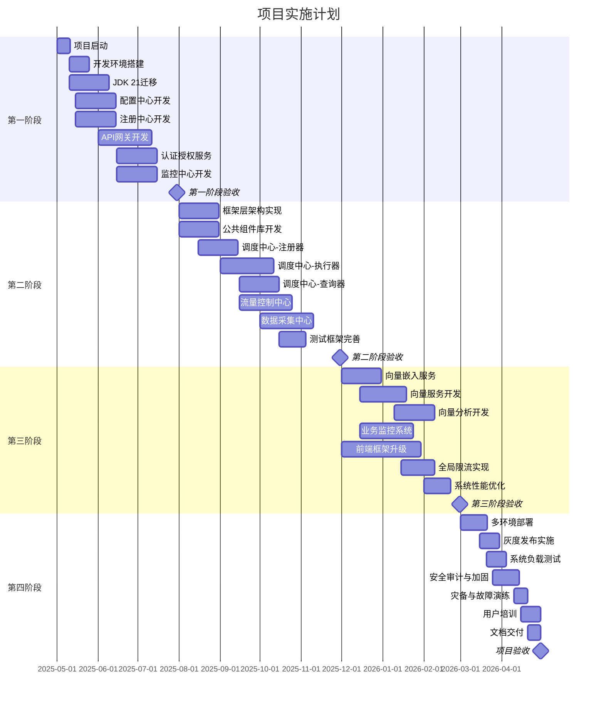
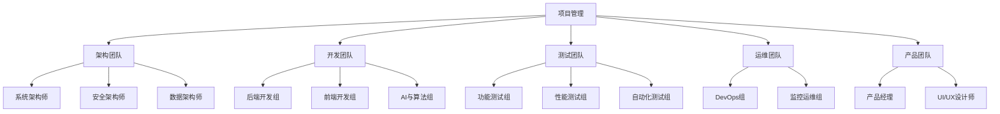

# 实施路线图与升级策略

**版本**: 2.0.0  
**日期**: 2025-04-26  
**作者**: 架构团队

## 目录

1. [实施路线图](#1-实施路线图)
2. [升级策略](#2-升级策略)
3. [风险管理](#3-风险管理)
4. [资源需求](#4-资源需求)

## 1. 实施路线图

### 1.1 阶段划分

项目实施分为四个主要阶段，每个阶段有明确的目标和交付物：

#### 1.1.1 第一阶段：基础设施建设（3个月）

**目标**：构建核心基础设施和公共组件库，为后续业务服务提供支撑。

**主要工作**：

1. **核心基础设施**：
    - 配置中心 (platform-config)
    - 注册中心 (platform-registry)
    - API网关 (platform-gateway)

2. **支撑服务**：
    - 认证授权服务
    - 监控中心 (platform-monitor-dashboard)
    - 日志服务

3. **技术基础**：
    - JDK 21迁移与优化
    - 响应式框架升级
    - 开发环境与流程建立

**关键里程碑**：

- M1-1: 基础设施服务可用
- M1-2: 开发环境与CI/CD就绪
- M1-3: JDK 21迁移完成

#### 1.1.2 第二阶段：核心功能实现（4个月）

**目标**：实现系统核心功能模块，包括调度系统、流量控制和数据采集等。

**主要工作**：

1. **平台框架**：
    - 框架层六边形架构实现
    - 响应式支持增强
    - 公共组件库完善

2. **核心功能模块**：
    - 调度中心 (platform-scheduler)
    - 流量控制中心 (platform-fluxcore)
    - 数据采集中心 (platform-collect)

3. **开发支持**：
    - 测试框架完善
    - 统一异常处理
    - API文档系统

**关键里程碑**：

- M2-1: 框架层六边形架构实现
- M2-2: 调度系统可用
- M2-3: 流量控制系统可用
- M2-4: 数据采集系统可用

#### 1.1.3 第三阶段：高级功能实现（3个月）

**目标**：实现系统高级功能，包括向量服务、业务监控和前端升级等。

**主要工作**：

1. **向量服务体系**：
    - 向量嵌入服务 (platform-vector-embedding)
    - 向量服务 (platform-vector-service)
    - 向量分析 (platform-vector-analytics)

2. **业务支持**：
    - 业务监控 (platform-buss-dashboard)
    - 前端升级 (Vue 3)
    - 全局限流实现

3. **集成与优化**：
    - 系统集成测试
    - 性能测试与优化
    - 文档完善

**关键里程碑**：

- M3-1: 向量服务体系可用
- M3-2: 业务监控系统可用
- M3-3: 前端框架升级完成
- M3-4: 系统性能达标

#### 1.1.4 第四阶段：部署与优化（2个月）

**目标**：系统部署、调优和验证，确保系统稳定可靠。

**主要工作**：

1. **部署与验证**：
    - 多环境部署
    - 灰度发布验证
    - 负载测试

2. **安全与可靠性**：
    - 安全审计与加固
    - 灾备与故障演练
    - 可观测性优化

3. **项目交付**：
    - 用户培训
    - 文档交付
    - 运维交接

**关键里程碑**：

- M4-1: 系统稳定部署
- M4-2: 安全审计通过
- M4-3: 用户培训完成
- M4-4: 项目验收通过

### 1.2 详细进度计划

### 1.3 交付物清单

#### 1.3.1 第一阶段交付物

1. **代码和组件**：
    - 配置中心服务
    - 注册中心服务
    - API网关服务
    - 认证授权服务
    - 监控中心服务

2. **文档**：
    - 系统架构设计文档
    - 开发环境搭建指南
    - API文档
    - 操作手册

3. **环境**：
    - 开发环境配置
    - CI/CD流水线
    - 测试环境

#### 1.3.2 第二阶段交付物

1. **代码和组件**：
    - 六边形架构框架
    - 公共组件库
    - 调度中心完整系统
    - 流量控制中心
    - 数据采集中心

2. **文档**：
    - 框架开发指南
    - 调度系统使用手册
    - 流量控制配置指南
    - 数据采集系统使用手册

3. **测试**：
    - 单元测试套件
    - 集成测试套件
    - 性能测试基线

#### 1.3.3 第三阶段交付物

1. **代码和组件**：
    - 向量服务完整体系
    - 业务监控系统
    - Vue 3前端框架
    - 全局限流实现

2. **文档**：
    - 向量服务开发指南
    - 业务监控使用手册
    - 前端开发指南
    - 性能优化报告

3. **集成**：
    - 系统集成测试报告
    - 性能测试报告
    - 功能验证报告

#### 1.3.4 第四阶段交付物

1. **系统部署**：
    - 生产环境部署方案
    - 灰度发布配置
    - 系统监控配置

2. **安全与可靠性**：
    - 安全审计报告
    - 灾备方案
    - 故障恢复手册

3. **项目结项**：
    - 用户培训资料
    - 完整技术文档
    - 代码库
    - 验收报告

## 2. 升级策略

### 2.1 技术栈升级

#### 2.1.1 JDK升级策略

**目标**：从JDK 17升级到JDK 21，同时为JDK 24做准备。

**实施策略**：

1. **双阶段升级**：
    - 第一阶段：全面升级到JDK 21 LTS
    - 第二阶段：关注JDK 24特性，预研适配方案

2. **核心优化点**：
    - 虚拟线程适配：提高系统并发性能
    - 结构化并发：简化并行和异步代码
    - 记录模式：优化数据处理代码
    - 增强的模式匹配：简化类型处理

3. **兼容性保障**：
    - 设计通用抽象层，隔离JDK版本差异
    - 建立兼容性测试套件
    - 预留版本切换入口

**时间规划**：

- JDK 21迁移：项目开始后1-2个月完成
- 虚拟线程优化：2-3个月内完成
- JDK 24预研：项目后期开始

#### 2.1.2 Spring框架升级

**目标**：升级到Spring Boot 3.2.x和Spring Cloud 2023.x。

**实施策略**：

1. **关键模块**：
    - Spring WebFlux：优化响应式编程支持
    - Spring Cloud Gateway：增强API网关能力
    - Spring Data：支持响应式数据访问

2. **优化方向**：
    - 配置简化
    - 启动性能提升
    - 原生镜像支持
    - 云原生特性增强

3. **迁移路径**：
    - 先升级核心库，再升级应用模块
    - 测试驱动验证每个变更点
    - 保留兼容性适配层

#### 2.1.3 前端框架升级

**目标**：从Vue 2迁移到Vue 3，引入Typescript和Vite。

**实施策略**：

1. **迁移计划**：
    - 组件库迁移：UI组件优先升级
    - 核心功能迁移：业务逻辑逐步重构
    - 状态管理迁移：从Vuex到Pinia
    - 构建系统迁移：从Webpack到Vite

2. **技术改进**：
    - Options API迁移到Composition API
    - 引入TypeScript类型系统
    - 使用响应式API增强性能

3. **兼容性保障**：
    - 使用@vue/compat兼容层
    - 组件库版本管理
    - 渐进式迁移

### 2.2 架构升级

#### 2.2.1 六边形架构实现

**目标**：在所有核心模块中实施六边形架构，实现业务逻辑与技术实现解耦。

**实施策略**：

1. **分层设计**：
    - 领域层：核心业务逻辑
    - 应用层：用例和服务协调
    - 适配器层：外部交互和技术实现

2. **依赖反转**：
    - 所有依赖指向领域核心
    - 通过接口实现技术隔离
    - 使用依赖注入连接各层

3. **迁移路径**：
    - 先确立架构标准
    - 新模块直接采用新架构
    - 旧模块渐进式重构

#### 2.2.2 CQRS模式增强

**目标**：在关键业务服务中实现完整的CQRS模式，优化读写性能。

**实施策略**：

1. **命令侧优化**：
    - 基于领域模型实现命令处理
    - 使用事件溯源记录状态变更
    - 实现幂等性处理

2. **查询侧优化**：
    - 构建专用查询模型
    - 实现查询缓存
    - 支持复杂查询和报表

3. **事件处理**：
    - 通过事件流更新查询模型
    - 保证最终一致性
    - 实现回放和重建能力

#### 2.2.3 响应式架构强化

**目标**：全面应用响应式编程模型，提高系统吞吐量和资源利用率。

**实施策略**：

1. **关键组件**：
    - 网关层：非阻塞请求处理
    - 服务层：响应式服务实现
    - 数据层：响应式数据访问

2. **性能优化**：
    - 背压处理机制完善
    - 响应式线程模型优化
    - 缓冲策略调优

3. **实施路径**：
    - 制定响应式编程规范
    - 公共组件支持响应式
    - 性能测试验证效果

### 2.3 模块优化升级

#### 2.3.1 网关与服务发现整合

**目标**：优化网关和服务发现机制，提高系统整体一致性和可维护性。

**实施策略**：

1. **功能整合**：
    - 统一配置管理
    - 路由规则与服务发现联动
    - 元数据共享机制

2. **技术优化**：
    - 响应式网关实现
    - 服务发现缓存机制
    - 故障检测增强

3. **迁移计划**：
    - 功能需求分析
    - 概念验证
    - 灰度迁移实施

#### 2.3.2 调度系统强化

**目标**：完善分布式调度系统，支持复杂依赖和大规模任务处理。

**实施策略**：

1. **架构优化**：
    - 完全分离注册器和执行器
    - 基于DAG实现任务依赖
    - 实现分布式执行协调

2. **性能提升**：
    - 利用虚拟线程优化执行效率
    - 实现任务分片机制
    - 增强资源隔离能力

3. **可用性增强**：
    - 故障转移机制
    - 执行结果持久化
    - 任务执行监控

## 3. 风险管理

### 3.1 主要风险识别

| 风险ID | 风险描述          | 影响级别 | 发生概率 | 风险等级 | 责任人  |
|------|---------------|------|------|------|------|
| R-01 | JDK 21迁移兼容性问题 | 高    | 中    | 高    | 架构团队 |
| R-02 | 六边形架构实施复杂度超预期 | 高    | 中    | 高    | 架构团队 |
| R-03 | 响应式编程学习曲线陡峭   | 中    | 高    | 高    | 培训团队 |
| R-04 | 向量服务性能不达标     | 高    | 中    | 高    | 性能团队 |
| R-05 | 前端框架升级兼容性问题   | 中    | 中    | 中    | 前端团队 |
| R-06 | 进度延误          | 高    | 中    | 高    | 项目经理 |
| R-07 | 系统集成问题        | 中    | 中    | 中    | 集成团队 |
| R-08 | 性能不达标         | 高    | 低    | 中    | 性能团队 |
| R-09 | 安全漏洞          | 高    | 低    | 中    | 安全团队 |
| R-10 | 团队协作不畅        | 中    | 中    | 中    | 团队领导 |

### 3.2 风险应对策略

#### 3.2.1 JDK 21迁移兼容性问题

**预防措施**：

- 提前建立兼容性测试套件
- 在非核心模块先试点
- 建立回退机制
- 预留缓冲时间

**应对策略**：

- 问题跟踪系统
- 快速响应团队
- 寻求厂商支持
- 必要时延期特定模块升级

#### 3.2.2 六边形架构实施复杂度超预期

**预防措施**：

- 详细的架构设计验证
- 先在小模块试点
- 编写详细实施指南
- 提前培训开发团队

**应对策略**：

- 渐进式重构
- 架构简化
- 增加技术支持
- 调整实施范围

#### 3.2.3 响应式编程学习曲线陡峭

**预防措施**：

- 系统的培训计划
- 编写详细开发指南
- 实践项目
- 经验丰富的导师制

**应对策略**：

- 加强培训
- 提供模板和示例
- 组织经验分享
- 调整人员配置

#### 3.2.4 向量服务性能不达标

**预防措施**：

- 早期概念验证
- 性能基准测试
- 关键算法优化
- 多方案并行评估

**应对策略**：

- 性能调优
- 架构调整
- 替代方案准备
- 功能降级方案

### 3.3 风险监控与评估

1. **定期风险评审**：
    - 每周风险状态更新
    - 每月风险评审会议
    - 重大里程碑风险评估

2. **风险指标**：
    - 进度偏差率
    - 缺陷密度
    - 性能指标达成率
    - 团队响应时间

3. **应急预案**：
    - 关键风险应急程序
    - 决策矩阵
    - 升级路径
    - 沟通计划

## 4. 资源需求

### 4.1 人员需求

#### 4.1.1 团队结构

#### 4.1.2 人员配置

| 团队   | 角色        | 人数 | 时间  | 主要职责                 |
|------|-----------|----|-----|----------------------|
| 项目管理 | 项目经理      | 1  | 全程  | 项目整体管理、风险控制、进度跟踪     |
| 项目管理 | 项目协调员     | 1  | 全程  | 协调各团队工作、会议组织、文档管理    |
| 架构团队 | 系统架构师     | 2  | 全程  | 系统整体架构设计、技术选型、重大技术决策 |
| 架构团队 | 安全架构师     | 1  | 阶段性 | 安全架构设计、安全评估          |
| 架构团队 | 数据架构师     | 1  | 阶段性 | 数据模型设计、存储策略          |
| 开发团队 | 后端开发工程师   | 8  | 全程  | 服务端功能实现、API开发        |
| 开发团队 | 前端开发工程师   | 4  | 全程  | 前端界面开发、交互实现          |
| 开发团队 | AI与算法工程师  | 3  | 阶段性 | 向量服务、算法优化            |
| 测试团队 | 测试工程师     | 4  | 全程  | 功能测试、回归测试            |
| 测试团队 | 性能测试工程师   | 2  | 阶段性 | 性能测试、压力测试            |
| 测试团队 | 自动化测试工程师  | 2  | 全程  | 自动化测试框架、测试脚本         |
| 运维团队 | DevOps工程师 | 3  | 全程  | CI/CD、自动化部署、容器化      |
| 运维团队 | 监控运维工程师   | 2  | 阶段性 | 监控系统、日志管理、警报配置       |
| 产品团队 | 产品经理      | 2  | 全程  | 需求分析、功能规划、用户故事       |
| 产品团队 | UI/UX设计师  | 2  | 阶段性 | 界面设计、交互设计、原型设计       |

### 4.2 技术资源需求

#### 4.2.1 开发环境

1. **开发工具**：
    - IDE：IntelliJ IDEA旗舰版
    - 版本控制：Git, GitLab
    - 文档工具：Confluence, Markdown
    - 协作工具：JIRA, Slack

2. **构建工具**：
    - Maven 3.9.x
    - Gradle 8.x
    - Node.js 20.x
    - Docker Desktop

3. **测试工具**：
    - JUnit 5
    - Mockito
    - TestContainers
    - JMeter, Gatling

#### 4.2.2 运行环境

1. **开发环境**：
    - Kubernetes集群(小)
    - 数据库服务器
    - CI/CD服务器
    - 开发环境监控

2. **测试环境**：
    - Kubernetes集群(中)
    - 性能测试服务器
    - 测试数据库集群
    - 完整监控系统

3. **生产环境**：
    - Kubernetes集群(大)
    - 高可用数据库集群
    - 负载均衡服务
    - 日志与监控系统
    - 灾备系统

### 4.3 预算估算

| 类别     | 项目      | 预算(万元)   | 说明             |
|--------|---------|----------|----------------|
| 人力成本   | 开发团队    | 750      | 包括架构、开发、测试人员   |
| 人力成本   | 运维团队    | 200      | 包括DevOps、监控运维  |
| 人力成本   | 管理与支持   | 150      | 包括项目管理、产品、设计   |
| 软件与工具  | 开发工具    | 50       | IDE、构建工具、测试工具等 |
| 软件与工具  | 中间件与数据库 | 100      | 数据库、消息队列、缓存等   |
| 基础设施   | 服务器与网络  | 200      | 包括云服务器、网络设备    |
| 基础设施   | 存储与备份   | 50       | 存储系统、备份系统      |
| 培训与支持  | 技术培训    | 30       | 包括新技术培训、工具培训   |
| 培训与支持  | 外部支持    | 50       | 技术咨询、专家支持      |
| 其他     | 预留与应急   | 120      | 应对风险和变更        |
| **总计** |         | **1700** |                |