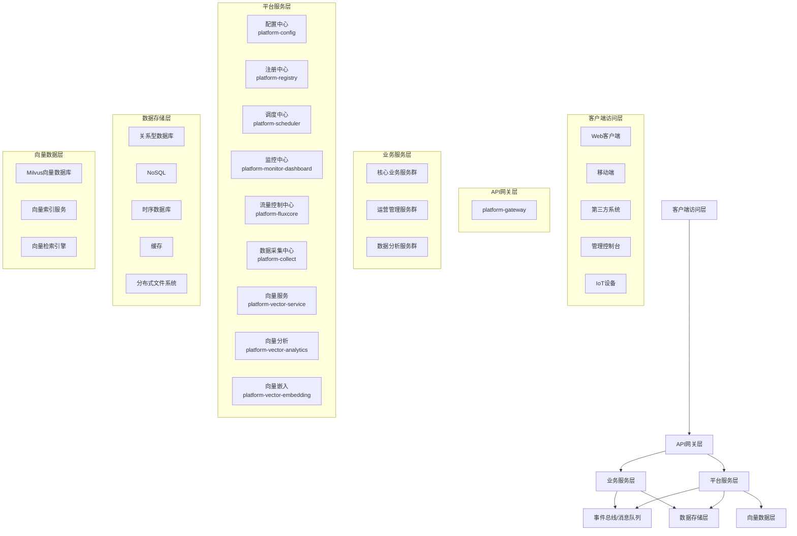

# 现代化微服务平台架构设计文档汇总

**版本**: 2.0.0  
**日期**: 2025-04-26  
**作者**: 架构团队

## 文档结构

本文档是微服务平台架构设计的主要汇总文档，提供架构设计的整体视图。具体详细内容请参考以下文档：

1. [架构概述](01-architecture-overview.md)：介绍架构设计背景、目标和整体架构。
2. [系统设计](02-system-design.md)：详细说明系统架构设计和核心子系统设计。
3. [高级服务设计](03-advanced-services.md)：描述平台高级服务的功能和设计。
4. [开发规范与项目结构](04-development-guidelines.md)：规定开发规范和项目结构。
5. [实施路线图与升级策略](05-implementation-roadmap.md)：提供实施计划和升级策略。

## 架构设计摘要

### 背景与目标

现代化微服务平台旨在构建一个高度可扩展、松耦合且易于维护的企业级系统，支持快速业务迭代和弹性扩展，同时提供完善的监控、日志和审计功能，支持现代化AI和向量数据分析能力。

关键设计目标包括：

- 构建高度可扩展、松耦合且易于维护的企业级系统
- 支持快速业务迭代和弹性扩展
- 简化开发流程，提高团队协作效率
- 实现服务的高可用性、可伸缩性和容错性
- 支持系统的灰度发布和平滑升级
- 提供完善的监控、日志和审计功能
- 支持现代化AI和向量数据分析能力
- 实现技术栈的平滑升级路径

### 关键设计决策

本架构采用以下关键设计决策：

1. **领域驱动设计(DDD)与微服务架构**：基于业务领域划分服务边界，落实"高内聚、低耦合"原则。

2. **六边形架构**：将业务领域逻辑与技术实现分离，确保核心业务逻辑不依赖于外部技术实现。

3. **响应式编程模型**：采用非阻塞I/O和响应式编程提高系统吞吐量和响应性。

4. **CQRS和事件溯源**：分离读写操作，优化各自的性能和扩展性，支持完整审计和历史重现。

5. **事件驱动架构**：通过消息队列实现服务间松耦合通信，增强系统弹性。

6. **向量数据库支持**：引入向量数据库和处理服务，支持AI驱动的相似性检索和分析。

7. **JDK 21虚拟线程**：利用虚拟线程提升系统并发性能，为JDK 24做好准备。

### 技术栈选择

**基础框架**：

- Java 21 LTS, Kotlin 1.9.x
- Spring Boot 3.2.x, Spring Cloud 2023.x
- Project Reactor 3.6.x, Spring WebFlux

**数据存储**：

- MySQL 8.x, PostgreSQL 16.x
- MongoDB 7.x, Redis 7.x
- Milvus 2.3.x (向量数据库)

**消息队列与事件处理**：

- Kafka 3.6.x, RocketMQ 5.1.x
- Kafka Streams, Spring Cloud Stream

**DevOps与云原生**：

- Docker, Kubernetes
- GitHub Actions/GitLab CI
- Istio, OpenTelemetry

**前端技术栈**：

- Vue 3.x, TypeScript 5.x
- Vite, Pinia

## 系统架构概览

### 整体架构图



### 核心子系统

1. **API网关（platform-gateway）**：系统的统一入口，负责路由、认证、限流等功能。

2. **配置中心（platform-config）**：集中管理所有微服务的配置，支持动态更新和多环境管理。

3. **服务注册中心（platform-registry）**：提供服务注册和发现功能，支持多集群管理。

4. **调度中心（platform-scheduler）**：分布式任务调度系统，包含任务注册、执行和查询三个独立服务。

5. **流量控制中心（platform-fluxcore）**：负责系统流量控制、熔断降级和自适应保护。

6. **向量服务体系**：包括向量嵌入、存储和分析，支持AI驱动的数据分析能力。

7. **数据采集中心（platform-collect）**：负责外部数据采集、清洗和加载，支持多种数据源接入。

8. **监控中心**：分为业务监控（platform-buss-dashboard）和系统监控（platform-monitor-dashboard）。

## 开发与部署

### 开发规范

1. **Java/Kotlin编码规范**：包括命名约定、代码格式、最佳实践等。

2. **响应式编程规范**：非阻塞编程、流处理、错误处理、背压管理等。

3. **DDD与六边形架构实践**：领域模型设计、层次划分、依赖方向等。

4. **API设计规范**：REST/GraphQL接口设计、请求/响应格式、错误处理等。

### 项目结构

```
platform-parent/                     # 平台父项目
├── platform-common/                 # 公共库
├── platform-dependencies/           # 依赖管理
├── platform-framework/              # 框架模块
├── platform-infrastructure/         # 基础设施
│   ├── platform-config/             # 配置中心
│   ├── platform-registry/           # 注册中心
│   ├── platform-gateway/            # API网关
│   ├── platform-monitor-dashboard/  # 系统监控
│   └── platform-buss-dashboard/     # 业务监控
├── platform-scheduler/              # 调度系统
├── platform-fluxcore/               # 流量控制
├── platform-collect/                # 数据采集
└── platform-vector/                 # 向量服务
```

### 微服务模块内部结构

基于六边形架构的标准模块结构：

```
service-module/
├── service-module-api/              # 对外API
├── service-module-application/      # 应用层
├── service-module-domain/           # 领域层
├── service-module-infrastructure/   # 基础设施层
└── service-module-interfaces/       # 接口层
```

### 部署流程

基于CI/CD实现自动化构建、测试和部署：

1. **构建与打包**：
    - 代码编译和单元测试
    - 静态代码分析
    - 打包Docker镜像
    - 制品推送到仓库

2. **测试环境部署**：
    - 自动部署到测试环境
    - 执行集成测试
    - 执行性能测试

3. **生产环境部署**：
    - 灰度发布或蓝绿部署
    - 健康检查和验证
    - 自动回滚机制

## 实施路线图

项目实施分为四个阶段：

1. **第一阶段（3个月）**：基础设施建设
    - 配置中心、注册中心、API网关等核心基础设施
    - JDK 21迁移与优化
    - 开发环境与CI/CD流程建立

2. **第二阶段（4个月）**：核心功能实现
    - 框架层六边形架构实现
    - 调度中心、流量控制中心、数据采集中心等核心功能模块
    - 测试框架完善

3. **第三阶段（3个月）**：高级功能实现
    - 向量服务体系
    - 业务监控系统
    - 前端框架升级
    - 性能优化

4. **第四阶段（2个月）**：部署与优化
    - 多环境部署
    - 安全审计与加固
    - 灾备与故障演练
    - 用户培训和文档交付

## 升级策略

### 技术栈升级

1. **JDK升级**：
    - 第一阶段全面升级到JDK 21 LTS
    - 虚拟线程优化
    - 为JDK 24预留升级路径

2. **Spring框架升级**：
    - 升级到Spring Boot 3.2.x和Spring Cloud 2023.x
    - 响应式编程支持强化
    - 云原生特性增强

3. **前端框架升级**：
    - 从Vue 2迁移到Vue 3
    - 引入TypeScript和Vite
    - 状态管理从Vuex迁移到Pinia

### 架构升级

1. **六边形架构实现**：
    - 建立领域、应用和适配器三层结构
    - 依赖方向指向领域核心
    - 渐进式重构现有模块

2. **CQRS模式增强**：
    - 命令与查询责任分离
    - 事件溯源记录状态变更
    - 专用查询模型优化

3. **响应式架构强化**：
    - 全面应用响应式编程模型
    - 背压处理机制完善
    - 响应式数据访问优化

## 总结

现代化微服务平台架构设计充分利用了最新的技术栈和架构模式，构建了一个高度可扩展、松耦合且易于维护的企业级系统。通过六边形架构、响应式编程、事件驱动架构等先进理念，确保系统具有高性能、高可用性和良好的可维护性。

同时，架构设计也考虑了未来的技术演进路径，为JDK升级、响应式编程增强和新功能扩展预留了空间。通过分阶段实施和风险管理，确保项目能够按计划平稳交付。