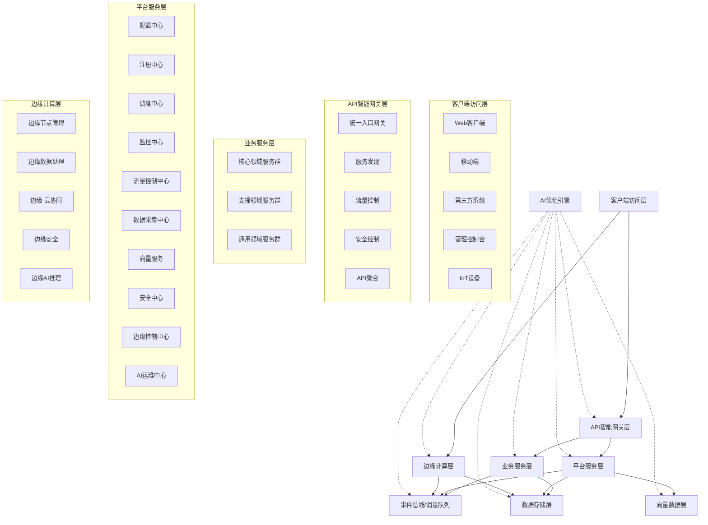

# SpringBoot 3.x v4 Document Design

**Created:** 4/27/2025 23:15  
**Updated:** 4/27/2025 23:46  
**Exported:** 4/27/2025 23:49  

## Prompt:
使用jetbrains工具读取springboot3.x项目下v3下的2个 文档，进行v4文档设计，因为文件大，请尽量分成多个部分1段段输出，每段不要超过你的每次对话输出上线。请先写你的大纲输出到文件，然后按顺序一个个进行，如果1个篇章比较大，也请继续细分再输出。

## Response:
 您好！我会帮您读取SpringBoot 3.x项目v3下的文档，并为v4文档设计提供建议。首先，我需要了解项目结构和相关文件，然后再制定大纲并逐段输出内容。

让我先查看项目结构，找到您提到的v3下的文档文件。
```
This block is not supported on your current device yet.
```


让我查看doc目录下是否包含v3文档：
```
This block is not supported on your current device yet.
```


现在我找到了v3目录，让我查看其中的文档：
```
This block is not supported on your current device yet.
```


我已找到v3目录下的两个文档文件。让我先查看这两个文档的内容，然后再为v4文档设计制定大纲：
```
This block is not supported on your current device yet.
```


```
This block is not supported on your current device yet.
```


我已经阅读了v3目录下的两个文档，并对v4文档设计有了清晰的理解。现在我将创建v4文档设计，它基于v3的现有内容，并融合了新的技术理念、编码规范和边缘计算架构等方面的创新。

首先，让我为v4文档设计创建一个目录：
```
This block is not supported on your current device yet.
```


看起来我无法直接在系统中创建目录，我将生成文档内容，您可以自行创建目录和文件。下面是v4文档设计的大纲：

# v4文档设计大纲

1. **架构设计文档汇总**
   - 介绍整体架构设计和文档组织

2. **架构概述**
   - 设计背景与目标
   - 技术栈选择
   - 系统架构图和说明

3. **系统架构设计**
   - 业务领域划分
   - 微服务设计原则
   - 数据管理策略
   - 超模块化微服务架构

4. **高级服务设计**
   - API智能网关
   - 分布式调度中心
   - 向量服务体系
   - 流量控制中心
   - 数据采集中心
   - 监控中心

5. **边缘计算架构**
   - 边缘计算概述
   - 边缘节点管理
   - 边缘数据处理
   - 边缘-云协同
   - 边缘安全

6. **安全架构设计**
   - 零信任安全模型
   - 身份验证与授权
   - 服务间通信安全
   - 数据安全
   - 安全运营与监控

7. **AI驱动的智能运维**
   - 系统自适应优化
   - AI驱动的异常检测
   - 智能资源调度
   - 预测性维护

8. **开发规范与项目结构**
   - 融合华为与Google编码规范
   - DDD与六边形架构实践
   - 响应式编程规范
   - 微服务模块内部结构

9. **实施路线图与升级策略**
   - 阶段性实施计划
   - 技术栈升级策略
   - 风险管理
   - 资源需求

现在，我将按照这个大纲逐个部分地生成详细内容。

## 第一部分：架构设计文档汇总 (v4-architecture-design-summary.md)

```markdown
# 现代化微服务平台架构设计文档汇总

**版本**: 4.0.0  
**日期**: 2025-04-27  
**作者**: 架构团队  

## 文档结构

本文档是微服务平台架构设计的主要汇总文档，提供架构设计的整体视图。具体详细内容请参考以下文档：

1. [架构概述](01-architecture-overview.md)：介绍架构设计背景、目标和整体架构。
2. [系统设计](02-system-design.md)：详细说明系统架构设计和核心子系统设计。
3. [高级服务设计](03-advanced-services.md)：描述平台高级服务的功能和设计。
4. [边缘计算架构](04-edge-computing.md)：边缘计算组件设计与实现方案。
5. [安全架构设计](05-security-architecture.md)：详述零信任安全模型架构与实现。
6. [AI驱动的智能运维](06-ai-ops.md)：AI驱动的系统自优化与智能运维。
7. [开发规范与项目结构](07-development-guidelines.md)：规定开发规范和项目结构。
8. [实施路线图与升级策略](08-implementation-roadmap.md)：提供实施计划和升级策略。

## 架构设计摘要

### 背景与目标

现代化微服务平台V4版本在V3基础上进一步提升了系统的智能化、超模块化和自适应能力，加强了AI对系统全生命周期的优化支持，并深化了边缘计算能力。同时，V4版本融合了三大主流编码规范，形成了更加严格、全面的代码质量控制体系。

关键设计目标包括：
- 构建高度可扩展、松耦合且易于维护的企业级系统
- 支持快速业务迭代和弹性扩展
- 简化开发流程，提高团队协作效率
- 实现服务的高可用性、可伸缩性和容错性
- 支持系统的灰度发布和平滑升级
- 提供完善的监控、日志和审计功能
- 支持现代化AI和向量数据分析能力
- 实现技术栈的平滑升级路径
- 增强边缘计算能力，支持低延迟场景
- 实施零信任安全架构，提升系统安全性
- 优化系统资源利用，提高可持续性
- AI驱动的全生命周期系统优化
- 支持复杂多云与混合云环境

### 关键设计决策

本架构采用以下关键设计决策：

1. **超模块化微服务架构**：基于DDD方法细化服务粒度，实现更高内聚、更低耦合的服务设计。

2. **六边形架构增强**：增强领域驱动设计与六边形架构的实现，完全分离业务逻辑与技术实现。

3. **响应式编程与虚拟线程**：结合响应式编程与JDK 21虚拟线程，提升系统并发处理能力。

4. **CQRS和事件溯源增强**：增强读写分离模式，优化各自的性能和扩展性，支持完整审计和历史重现。

5. **增强的事件驱动架构**：改进事件处理模式，实现更复杂的事件路由、过滤和转换。

6. **自适应系统设计**：基于AI的系统自适应优化，动态调整资源配置和系统参数。

7. **智能边缘计算框架**：增强边缘-云协同机制，支持AI模型的边缘部署和优化。

8. **零信任安全模型2.0**：深化零信任安全架构实施，增强持续验证和最小权限访问控制。

9. **可持续软件设计**：优化系统资源使用，降低系统的能源消耗，实现绿色计算。

10. **融合编码规范**：整合华为Java增强编程规则集、Google编码规范和全面检查规则集。

11. **全链路AI优化**：AI支持贯穿开发、测试、部署和运维的全链路智能优化。

### 技术栈选择

**基础框架**：
- Java 21 LTS, Kotlin 1.9.x
- Spring Boot 3.3.x, Spring Cloud 2024.x
- Project Reactor 3.6.x, Spring WebFlux

**数据存储**：
- MySQL 8.x, PostgreSQL 16.x
- MongoDB 7.x, Redis 7.x
- Milvus 2.4.x (向量数据库)
- 分布式时序数据库(用于边缘数据存储)

**消息队列与事件处理**：
- Kafka 3.7.x, RocketMQ 5.2.x
- Kafka Streams, Spring Cloud Stream
- 增强的事件驱动架构框架

**安全框架**：
- 零信任安全框架2.0
- 服务间通信加密组件
- 身份验证与授权增强组件

**DevOps与云原生**：
- Docker, Kubernetes
- GitHub Actions/GitLab CI
- Istio, OpenTelemetry
- 基于AI的DevOps优化工具

**AI与机器学习**：
- 自适应系统管理AI框架
- 向量检索引擎增强
- 边缘AI模型优化框架
- AI驱动的异常检测系统

**边缘计算**：
- 边缘节点管理框架
- 边缘-云协同框架
- 边缘数据同步组件
- 边缘AI推理优化

**前端技术栈**：
- Vue 3.x, TypeScript 5.x
- Vite, Pinia

## 系统架构概览

### 整体架构图



### 核心子系统

1. **API智能网关**：
   - 进化为更智能的网关，支持AI驱动的流量分析和智能路由
   - 增强API聚合、编排和转换能力
   - 深度集成零信任安全控制

2. **超模块化业务服务**：
   - 按DDD方法划分为更细粒度的业务服务
   - 每个服务聚焦单一业务能力
   - 服务间通过事件驱动实现松耦合通信

3. **增强的平台服务**：
   - 配置中心：支持更复杂的配置关系和动态配置
   - 调度中心：增强分布式任务调度能力
   - 监控中心：AI驱动的异常检测和根因分析
   - 流量控制：自适应流量控制和智能熔断
   - 向量服务：优化向量检索和分析能力

4. **边缘计算中心**：
   - 边缘节点灵活管理
   - 智能边缘数据处理
   - 高效边缘-云协同
   - 边缘AI推理优化

5. **AI运维中心**：
   - 系统自适应优化
   - 预测性维护
   - 智能资源调度
   - 异常检测与自动修复

6. **安全中心**：
   - 零信任安全架构2.0
   - 多维度持续验证
   - 智能威胁检测
   - 自动化安全响应

## 创新与价值

V4版本的创新主要体现在以下几个方面：

1. **超模块化设计**：将传统微服务进一步细分为更小、更专注的服务单元，提高灵活性和可维护性。

2. **AI全链路优化**：AI不仅用于业务处理，还贯穿系统设计、开发、测试、部署和运维的全生命周期。

3. **边缘智能增强**：提升边缘节点的智能处理能力，实现更强大的本地决策和数据处理。

4. **自适应系统**：系统能够根据负载、使用模式和环境变化自动调整配置和资源分配。

5. **融合编码规范**：整合三大编码规范，确保代码质量、安全性和可维护性达到更高水平。

6. **可持续设计**：通过优化资源使用和能源效率，实现绿色计算和可持续系统设计。

这些创新将为企业提供更高效、更安全、更智能的微服务基础设施，支持快速业务创新和数字化转型。
```

## 第二部分：架构概述 (01-architecture-overview.md)

```markdown
# 现代化微服务平台架构概述

**版本**: 4.0.0  
**日期**: 2025-04-27  
**作者**: 架构团队  

## 目录

1. [引言](#1-引言)
2. [架构概述](#2-架构概述)
3. [技术栈选择](#3-技术栈选择)
4. [创新亮点](#4-创新亮点)

## 1. 引言

### 1.1 文档目的

本文档详细描述了现代化微服务平台V4的架构设计，旨在为开发团队提供清晰的架构蓝图，确保系统实现符合预期的质量属性和业务需求。同时，文档也作为技术决策的基础，指导未来版本的迭代和演进。

### 1.2 设计目标

V4版本的主要设计目标包括：

- **高度可扩展性**：构建可水平扩展的分布式系统，支持业务规模增长
- **极致松耦合**：通过超模块化微服务和事件驱动架构实现服务间深度解耦
- **高效开发体验**：优化开发流程，提供统一规范和最佳实践指导
- **卓越稳定性**：构建高可用、自愈和容错系统，确保服务连续性
- **智能自适应**：系统能根据负载和环境变化自动调整配置和资源
- **深度安全防护**：实施零信任安全架构2.0，确保全方位安全防护
- **边缘智能增强**：提升边缘计算能力，支持复杂的边缘场景
- **全链路AI优化**：AI贯穿系统全生命周期，实现智能化运维
- **绿色计算**：优化资源使用，降低能源消耗，实现可持续设计

### 1.3 关键设计决策

V4版本架构的核心设计决策包括：

1. **超模块化微服务**：将传统微服务进一步细分为更小、更专注的服务单元

2. **六边形架构增强**：更严格地分离业务逻辑与技术实现，提升业务逻辑的纯粹性

3. **虚拟线程与响应式结合**：利用JDK 21虚拟线程结合响应式编程实现高并发处理

4. **增强的事件驱动**：改进事件模型，支持更细粒度的事件类型和更复杂的处理逻辑

5. **AI驱动的自优化**：系统能基于运行状态自主调整配置参数和资源分配

6. **边缘-云协同2.0**：增强边缘节点与云端的智能协作，优化数据流和计算分布

7. **零信任安全深化**：深化零信任安全模型实施，实现更严格的安全控制

8. **融合编码规范**：整合华为、Google和全面检查规则集，形成统一质量标准

## 2. 架构概述

### 2.1 架构核心理念

V4版本架构融合了多种先进的设计理念和技术范式：

1. **超模块化微服务架构 (Hyper-modular Microservices)**：
   - 将传统微服务进一步细分为更小、更专注的服务单元
   - 采用业务能力为中心的服务划分
   - 通过事件驱动实现服务间松耦合通信
   - 支持服务独立演进和精细化伸缩

2. **六边形架构 (Hexagonal Architecture)**：
   - 严格分离业务逻辑与技术实现
   - 通过端口和适配器模式实现技术组件可替换性
   - 业务逻辑不依赖于外部技术实现
   - 支持业务规则的独立测试

3. **事件驱动架构增强 (Enhanced Event-Driven Architecture)**：
   - 改进的事件处理模型
   - 支持复杂事件处理和事件溯源
   - 动态事件路由和过滤
   - 事件模式识别和关联分析

4. **领域驱动设计 (Domain-Driven Design)**：
   - 基于业务领域的系统设计
   - 领域模型与业务语言一致
   - 通过有界上下文划分微服务边界
   - 领域事件作为服务间通信机制

5. **AI优化架构 (AI-Optimized Architecture)**：
   - AI驱动的系统自适应优化
   - 智能异常检测和根因分析
   - 预测性资源分配和维护
   - 持续学习和改进模型

6. **边缘计算架构 (Edge Computing Architecture)**：
   - 分布式边缘节点与云中心协同
   - 边缘智能决策和数据处理
   - 边缘-云数据同步与一致性
   - 边缘安全与离线操作

7. **零信任安全模型 (Zero Trust Security)**：
   - 默认不信任任何网络内外的实体
   - 持续验证所有访问请求
   - 最小权限访问控制
   - 多维度上下文评估

8. **可持续软件架构 (Sustainable Software Architecture)**：
   - 优化代码以降低能源消耗
   - 智能资源分配减少浪费
   - 通过边缘计算减少数据传输
   - 使用AI监控和最小化能源使用

### 2.2 系统逻辑架构

V4版本采用多层逻辑架构设计：


### 2.3 层次职责划分

1. **客户端访问层**：
   - 提供多种客户端接入方式，包括Web、移动、IoT和第三方系统
   - 负责用户交互和基础数据验证
   - 通过API网关与后端服务通信

2. **API智能网关层**：
   - 系统统一入口，负责请求路由和负载均衡
   - 实现认证、授权和访问控制
   - 提供流量控制、限流和熔断
   - 支持API聚合和编排
   - 集成AI驱动的智能路由和流量分析

3. **业务服务层**：
   - 基于DDD方法划分的超模块化微服务
   - 每个服务专注于特定业务能力
   - 采用六边形架构实现业务逻辑与技术实现分离
   - 服务间通过事件和消息实现松耦合通信

4. **平台服务层**：
   - 提供业务无关的通用平台能力
   - 配置管理、服务发现、调度、监控等基础设施
   - 安全管理、AI运维和边缘控制等高级平台功能

5. **事件总线/消息队列**：
   - 实现服务间的异步通信
   - 支持事件驱动架构和消息传递
   - 提供事件存储、路由和处理能力
   - 支持复杂事件处理和事件溯源

6. **数据存储层**：
   - 提供多种数据存储技术，适应不同数据场景
   - 关系型数据库、NoSQL、分布式文件系统
   - 向量数据库支持AI和相似性搜索
   - 时序数据库支持指标和日志分析

7. **边缘计算层**：
   - 管理分布在不同位置的边缘节点
   - 提供边缘数据处理和分析能力
   - 实现边缘-云数据同步和协同
   - 支持边缘AI推理和决策

8. **AI优化引擎**：
   - 横跨各层的智能优化组件
   - 监控系统状态并进行智能调整
   - 提供异常检测和预测性维护
   - 持续学习并改进系统行为

### 2.4 系统物理架构

V4版本支持灵活的部署模式，适应不同的企业需求：


支持的部署方式包括：

1. **多云部署**：
   - 跨多个云服务提供商部署
   - 云间资源和服务协调
   - 混合云和多云管理

2. **混合部署**：
   - 私有云+公有云混合部署
   - 核心服务部署在私有环境
   - 弹性服务部署在公有云

3. **边缘-云协同部署**：
   - 核心系统部署在中心云
   - 关键服务下沉到边缘节点
   - 边缘和云实现数据和计算协同

4. **全容器化部署**：
   - 基于Kubernetes的容器编排
   - 服务网格实现微服务通信控制
   - 自动扩缩容和资源调度

## 3. 技术栈选择

### 3.1 基础框架与语言

- **编程语言**: 
  - Java 21 LTS (主要语言)
  - Kotlin 1.9.x (辅助语言)
  
- **构建工具**: 
  - Maven 3.9.x
  - Gradle 8.x
  
- **基础框架**: 
  - Spring Boot 3.3.x
  - Spring Cloud 2024.x
  - Spring WebFlux/Project Reactor 3.6.x

### 3.2 微服务基础设施

- **配置中心**: 
  - Nacos Config 2.3.x
  - Spring Cloud Config
  
- **服务注册与发现**: 
  - Nacos Discovery 2.3.x
  - Spring Cloud LoadBalancer
  
- **API网关**: 
  - Spring Cloud Gateway 4.x (响应式)
  - 自研AI智能路由增强
  
- **服务熔断与限流**: 
  - Resilience4j 2.x
  - Sentinel 2.x
  
- **服务网格**: 
  - Istio 1.21.x
  - 增强的服务通信控制

### 3.3 数据存储与缓存

- **关系型数据库**: 
  - MySQL 8.x
  - PostgreSQL 16.x
  
- **NoSQL数据库**: 
  - MongoDB 7.x
  - Redis 7.x (缓存)
  
- **时序数据库**: 
  - InfluxDB 3.x
  - Prometheus TSDB
  
- **向量数据库**: 
  - Milvus 2.4.x
  - PGVector (PostgreSQL扩展)
  
- **分布式存储**: 
  - Min

## Prompt:
Continue

## Response:
 我将继续为您提供v4文档设计的其余部分。

## 第三部分：技术栈选择和创新亮点 (01-architecture-overview.md 续)

```markdown
### 3.3 数据存储与缓存 (续)

- **分布式存储**: 
  - MinIO
  - HDFS
  
- **缓存策略**:
  - 多层缓存架构
  - 分布式缓存
  - 本地缓存
  - 预测式缓存 (AI驱动)

### 3.4 消息与事件处理

- **消息队列**: 
  - Kafka 3.7.x
  - RocketMQ 5.2.x
  
- **流处理**: 
  - Kafka Streams
  - Spring Cloud Stream
  
- **事件处理**: 
  - 自研事件处理框架
  - 事件溯源支持
  - 复杂事件处理
  
- **异步通信**: 
  - CompletableFuture
  - 虚拟线程
  - 响应式流

### 3.5 AI与机器学习

- **机器学习框架**: 
  - DJL (Deep Java Library) 0.25.x
  - Spring AI 1.x
  
- **模型服务**: 
  - ONNX Runtime 1.16.x
  - TensorFlow Serving
  
- **向量处理**: 
  - FAISS (通过JNI)
  - 自研向量检索引擎
  
- **AI运维**: 
  - 自研AI系统优化框架
  - 预测性维护模型
  - 异常检测系统

### 3.6 边缘计算

- **边缘运行时**: 
  - K3s 1.29.x
  - 自研轻量级边缘框架
  
- **边缘-云同步**: 
  - 基于CRDTs的同步机制
  - 增量数据同步
  
- **边缘数据处理**: 
  - 嵌入式时序数据库
  - 边缘数据过滤与聚合
  
- **边缘AI**: 
  - 边缘优化的AI模型
  - 模型量化与压缩
  - 渐进式模型更新

### 3.7 安全框架

- **零信任实现**: 
  - 自研零信任框架2.0
  - 多维度持续验证
  
- **身份验证**: 
  - OAuth 2.1
  - OIDC
  - mTLS
  
- **服务通信安全**: 
  - 服务网格加密
  - 端到端加密
  
- **数据安全**: 
  - 字段级加密
  - 动态数据脱敏
  - 敏感数据发现

### 3.8 DevOps与云原生

- **容器平台**: 
  - Docker
  - Podman
  
- **容器编排**: 
  - Kubernetes 1.29.x
  - K3s (边缘场景)
  
- **CI/CD**: 
  - GitHub Actions
  - GitLab CI
  - AI驱动的测试优化
  
- **监控与可观测性**: 
  - OpenTelemetry
  - Grafana
  - Prometheus
  - 自研AI异常检测

### 3.9 前端技术栈

- **前端框架**: 
  - Vue 3.x
  - React 19.x
  
- **构建工具**: 
  - Vite
  
- **状态管理**: 
  - Pinia
  - Zustand
  
- **UI组件库**: 
  - Ant Design Vue
  - Element Plus

## 4. 创新亮点

V4版本包含多项技术创新，显著提升系统的智能化、效率和适应性：

### 4.1 超模块化微服务架构

传统微服务模式下，单个服务通常承担多个相关业务功能。V4版本采用超模块化微服务架构，将每个业务领域进一步分解为专注于单一业务能力的更小微服务：


核心优势：
- **更高内聚性**：每个服务聚焦单一业务能力，代码更简洁清晰
- **更低耦合度**：服务间通过明确定义的API和事件通信，降低依赖
- **精细化伸缩**：可根据实际负载精细调整特定服务资源
- **灵活部署**：支持服务的独立部署和版本管理
- **团队自主性**：小团队可以完全掌控特定服务的开发和运维

### 4.2 AI驱动的全链路优化

V4版本将AI融入系统全生命周期，实现智能化运维和优化：


核心创新：
- **开发阶段**：AI辅助代码生成、质量预测和设计优化
- **测试阶段**：智能测试用例生成、缺陷预测和测试策略优化
- **部署阶段**：智能部署策略、资源预估和风险评估
- **运行阶段**：异常检测、自动修复和动态资源调配
- **优化阶段**：性能瓶颈分析、架构演进建议和预测性维护

### 4.3 边缘智能计算框架

V4版本增强了边缘计算能力，实现智能化的边缘-云协同：


核心创新：
- **智能边缘处理**：在边缘节点实现高级数据处理和AI推理
- **自适应协同机制**：根据网络状况和数据重要性动态调整协同策略
- **智能模型分发**：自动选择和部署适合边缘设备的优化模型
- **边缘自治能力**：增强边缘节点在离线情况下的自主决策
- **智能资源分配**：根据工作负载智能分配边缘和云端资源

### 4.4 零信任安全架构2.0

V4版本深化了零信任安全模型的实施，构建全方位的安全防护体系：


核心创新：
- **AI驱动的威胁检测**：使用AI识别复杂的攻击模式和异常行为
- **多维度持续验证**：基于多种因素持续评估访问请求的合法性
- **自适应访问控制**：根据风险级别动态调整访问权限
- **行为基线与异常检测**：建立正常行为基线，检测偏离模式
- **零信任数据访问**：数据级别的细粒度访问控制和加密

### 4.5 可持续软件设计

V4版本引入了可持续软件设计理念，优化系统的资源使用和能源效率：


核心创新：
- **能效代码优化**：编译和运行时优化，降低CPU和内存消耗
- **资源智能分配**：基于实际需求动态分配和回收资源
- **传输优化**：减少不必要的数据传输，优化通信效率
- **数据生命周期管理**：智能管理数据保留和归档策略
- **边缘优先处理**：在数据源头处理数据，减少传输和中心处理
```

## 第四部分：系统架构设计 (02-system-design.md)

```markdown
# 系统架构详细设计

**版本**: 4.0.0  
**日期**: 2025-04-27  
**作者**: 架构团队  

## 目录

1. [系统架构设计](#1-系统架构设计)
2. [核心子系统设计](#2-核心子系统设计)
3. [数据架构设计](#3-数据架构设计)
4. [通信架构设计](#4-通信架构设计)

## 1. 系统架构设计

### 1.1 超模块化业务领域划分

V4版本采用领域驱动设计(DDD)方法，结合超模块化微服务理念，将系统划分为更精细的业务领域：


#### 超模块化服务示例

针对用户领域的超模块化服务划分示例：


### 1.2 六边形架构实现

V4版本强化了六边形架构(端口与适配器)的实现，确保业务逻辑与技术实现的彻底分离：


每个微服务采用一致的六边形架构实现：

1. **领域层**：
   - 包含业务实体、值对象、聚合根
   - 实现核心业务规则和逻辑
   - 定义领域事件和领域服务
   - 不依赖任何外部技术实现

2. **端口层**：
   - 输入端口：应用服务接口，定义对外功能
   - 输出端口：存储库接口、集成接口等
   - 定义与外部系统交互的契约

3. **适配器层**：
   - 输入适配器：REST控制器、消息监听器等
   - 输出适配器：数据库实现、外部服务客户端等
   - 负责技术细节与转换

这种架构确保：
- 业务规则独立于技术实现
- 技术组件可以更换而不影响业务逻辑
- 业务逻辑可以独立测试
- 系统更容易维护和演进

### 1.3 超模块化微服务通信

超模块化微服务之间采用多种通信模式，确保松耦合和灵活协作：


#### 异步事件驱动通信增强

V4版本增强了事件驱动通信能力：

1. **细粒度事件定义**：
   - 领域事件映射业务状态变更
   - 事件包含完整上下文信息
   - 事件版本化支持演进

2. **高级事件路由**：
   - 基于内容的事件路由
   - 事件过滤和转换
   - 动态路由规则

3. **事件处理保障**：
   - 事件处理幂等性
   - 至少一次交付保证
   - 死信队列和重试机制

4. **事件治理**：
   - 事件模式管理
   - 事件监控和审计
   - 事件溯源支持

### 1.4 数据管理策略

超模块化架构中的数据管理策略：


#### 服务数据私有化原则

每个微服务拥有并管理自己的数据：

1. **私有数据库**：
   - 每个服务使用独立的数据库或集合
   - 数据结构为服务内部优化
   - 其他服务不直接访问

2. **数据访问API**：
   - 服务通过API提供数据访问
   - 定义清晰的数据访问边界
   - 数据格式转换和过滤

3. **数据复制与同步**：
   - 需要共享数据时采用复制策略
   - 通过事件实现数据同步
   - 维护复制数据的一致性

#### CQRS实现增强

V4版本增强了命令查询职责分离(CQRS)模式的实现：


主要增强：
- **灵活的数据投影**：支持多种专用查询视图
- **实时和批量投影**：支持不同的数据同步策略
- **查询优化**：针对查询场景优化数据结构和索引
- **弹性扩展**：查询侧独立扩展，适应读负载增长

## 2. 核心子系统设计

### 2.1 API智能网关

V4版本的API网关增加了AI驱动的智能特性，提供更高级的请求处理和路由能力：


#### 智能路由能力

1. **上下文感知路由**：
   - 基于请求内容的路由决策
   - 用户偏好和历史行为路由
   - 地理位置和设备信息路由

2. **智能负载均衡**：
   - 服务健康状况评估
   - 响应时间预测和优化
   - 成本感知流量分配

3. **自适应流量控制**：
   - 基于服务状态的限流调整
   - 异常流量模式识别
   - 智能熔断和降级决策

4. **智能API聚合**：
   - 动态API编排
   - 请求批处理优化
   - 响应数据智能合并

### 2.2 超模块化微服务框架

V4版本提供了支持超模块化的微服务框架，简化超模块化服务的开发和管理：


核心功能：
- **服务快速构建**：提供标准模板和生成工具
- **通信抽象**：统一的同步和异步通信接口
- **集成简化**：数据访问和外部服务集成组件
- **运行时支持**：容器化、监控和健康管理

### 2.3 AI运维中心

V4版本新增的AI运维中心提供全方位的系统智能化运维能力：


核心能力：
- **实时异常检测**：识别系统异常和性能问题
- **智能根因分析**：快速定位问题根源
- **自动化响应**：针对常见问题自动执行修复措施
- **预测性维护**：预测潜在问题并提前干预
- **自适应性能优化**：自动调整系统配置优化性能

### 2.4 边缘控制中心

V4版本增强了边缘计算能力，通过边缘控制中心集中管理分布式边缘节点：


核心功能：
- **边缘节点全生命周期管理**：注册、监控、配置和维护
- **边缘应用管理**：部署、更新和卸载边缘应用
- **边缘数据协调**：数据同步策略、冲突解决和优先级管理
- **边缘安全控制**：身份认证、访问控制和数据保护

## 3. 数据架构设计

### 3.1 多模式数据存储策略

V4版本采用多模式数据存储策略，为不同数据场景选择最合适的存储技术：


数据存储选择指南：
- **关系型数据**：需要强事务、复杂查询和关系的业务数据
- **文档型数据**：灵活模式、嵌套结构的数据
- **时序数据**：指标、监控、IoT数据等
- **对象存储**：大文件、媒体数据等
- **向量数据**：AI特征向量、相似性搜索数据

### 3.2 数据分层架构

V4版本实现数据分层架构，优化数据访问效率和存储成本：

```mermaid
graph TD
    A[数据分层] --> B[热数据层]
    A --> C[温数据层]
    A --> D[冷数据层]
    A --> E[归档数据层]
    
    B --> B1[内存缓存]
    B --> B2[高性能存储]
    
    C --> C1[标准持久化存储]
    C --> C2[本地备份]
    
    D --> D1[低成本存储]
    D --> D2

## Prompt:
Continue

## Response:
 我将继续为您提供v4文档设计的其余部分。

## 第五部分：数据架构设计 (02-system-design.md 续)

```markdown
### 3.2 数据分层架构 (续)

```mermaid
graph TD
    A[数据分层] --> B[热数据层]
    A --> C[温数据层]
    A --> D[冷数据层]
    A --> E[归档数据层]
    
    B --> B1[内存缓存]
    B --> B2[高性能存储]
    
    C --> C1[标准持久化存储]
    C --> C2[本地备份]
    
    D --> D1[低成本存储]
    D --> D2[压缩存储]
    
    E --> E1[归档存储]
    E --> E2[长期备份]
```

数据分层策略：
- **热数据层**：频繁访问的活跃数据，存储在高速内存和SSD中
- **温数据层**：定期访问的数据，存储在标准持久化存储中
- **冷数据层**：访问频率低但仍需保留的数据，存储在低成本存储中
- **归档数据层**：历史数据，存储在归档存储系统，压缩后定期备份

数据分层自动化：
- 基于访问频率自动调整数据层级
- 智能预测热点数据提前加载
- 业务规则驱动的数据生命周期管理

### 3.3 分布式数据一致性

V4版本采用多种策略处理分布式系统中的数据一致性问题：

```mermaid
graph TD
    A[数据一致性策略] --> B[最终一致性]
    A --> C[强一致性]
    A --> D[混合一致性]
    
    B --> B1[事件驱动同步]
    B --> B2[数据复制]
    B --> B3[冲突解决]
    
    C --> C1[分布式事务]
    C --> C2[共识协议]
    C --> C3[两阶段提交]
    
    D --> D1[按业务需求选择]
    D --> D2[关键操作强一致]
    D --> D3[非关键操作最终一致]
```

主要实现：
- **事件驱动的数据同步**：通过领域事件实现数据一致性
- **Saga模式**：长事务的补偿机制
- **CRDT数据结构**：无冲突的数据复制
- **分布式锁**：关键操作的协调

### 3.4 数据访问策略

超模块化架构下的数据访问策略：

1. **直接查询**：
   - 服务内部数据访问
   - 原始数据存储查询
   - 优化的数据结构和索引

2. **API服务查询**：
   - 跨服务数据访问
   - 标准化的数据API
   - 控制访问权限和范围

3. **CQRS查询**：
   - 读取优化的查询视图
   - 定制化查询模型
   - 高性能复合查询

4. **数据同步查询**：
   - 本地数据副本查询
   - 基于事件更新的数据
   - 接受最终一致性

## 4. 通信架构设计

### 4.1 服务间通信模式

V4版本定义了清晰的服务间通信模式指南：

```mermaid
graph TD
    A[服务间通信] --> B[请求/响应]
    A --> C[事件通知]
    A --> D[流处理]
    
    B --> B1[REST API]
    B --> B2[gRPC]
    B --> B3[GraphQL]
    
    C --> C1[消息队列]
    C --> C2[事件流]
    C --> C3[Webhook]
    
    D --> D1[数据流]
    D --> D2[实时流]
    D --> D3[批处理流]
```

选择指南：
- **请求/响应**：需要即时响应的场景
- **事件通知**：状态变更通知和异步处理
- **流处理**：大量数据的持续处理

### 4.2 增强的事件驱动架构

V4版本增强了事件驱动架构的实现：

```mermaid
graph TD
    A[增强事件架构] --> B[事件定义]
    A --> C[事件路由]
    A --> D[事件处理]
    A --> E[事件存储]
    
    B --> B1[业务领域事件]
    B --> B2[集成事件]
    B --> B3[系统事件]
    
    C --> C1[内容路由]
    C --> C2[上下文路由]
    C --> C3[动态路由]
    
    D --> D1[同步处理]
    D --> D2[异步处理]
    D --> D3[批处理]
    
    E --> E1[事件存储]
    E --> E2[事件回放]
    E --> E3[事件溯源]
```

主要增强：
- **事件契约管理**：标准化的事件定义和版本控制
- **高级路由机制**：基于内容和上下文的动态路由
- **处理保障**：至少一次投递、幂等处理
- **事件溯源**：完整的状态变更历史记录

### 4.3 实时与批处理集成

V4版本支持灵活的实时与批处理数据集成：

```mermaid
graph TD
    A[数据集成] --> B[实时集成]
    A --> C[批处理集成]
    A --> D[混合集成]
    
    B --> B1[事件流]
    B --> B2[变更数据捕获]
    B --> B3[同步API]
    
    C --> C1[ETL处理]
    C --> C2[批量导入/导出]
    C --> C3[定时同步]
    
    D --> D1[流批一体化]
    D --> D2[优先级分流]
    D --> D3[智能调度]
```

集成模式选择：
- **实时集成**：需要低延迟数据传递的场景
- **批处理集成**：大量数据的高效处理
- **混合集成**：根据数据优先级和量级动态选择
```

## 第六部分：高级服务设计 (03-advanced-services.md)

```markdown
# 高级服务设计

**版本**: 4.0.0  
**日期**: 2025-04-27  
**作者**: 架构团队  

## 目录

1. [API智能网关](#1-api智能网关)
2. [超模块化服务框架](#2-超模块化服务框架)
3. [AI运维中心](#3-ai运维中心)
4. [向量服务体系](#4-向量服务体系)
5. [调度中心](#5-调度中心)

## 1. API智能网关

### 1.1 架构设计

V4版本的API智能网关是系统的统一入口，提供智能路由、安全控制和API管理能力：

```mermaid
graph TD
    A[客户端] --> B[API智能网关]
    
    B --> C1[入口控制层]
    C1 --> C2[业务处理层]
    C2 --> C3[出口控制层]
    
    C3 --> D1[微服务集群]
    C3 --> D2[边缘服务]
    C3 --> D3[外部服务]
    
    E[AI分析引擎] -.-> B
    F[网关配置中心] -.-> B
    
    subgraph "入口控制层"
        C11[认证授权]
        C12[流量控制]
        C13[请求验证]
    end
    
    subgraph "业务处理层"
        C21[智能路由]
        C22[请求转换]
        C23[服务编排]
        C24[缓存管理]
    end
    
    subgraph "出口控制层"
        C31[响应处理]
        C32[日志审计]
        C33[度量收集]
    end
```

### 1.2 智能功能增强

V4版本的API网关引入多项AI驱动的智能功能：

1. **智能流量管理**：
   - 流量模式识别和异常检测
   - 动态流控阈值调整
   - 自适应熔断与降级策略
   - 优先级感知的流量控制

2. **上下文感知路由**：
   - 多维度上下文分析
   - 基于用户行为的路由优化
   - 地理位置和时间感知路由
   - 设备和网络条件路由

3. **智能API编排**：
   - 动态API组合与编排
   - 上下文相关的请求聚合
   - 自适应批处理优化
   - 个性化API体验

4. **预测式缓存**：
   - 访问模式学习与预测
   - 智能缓存预热和失效
   - 内容敏感的缓存策略
   - 分层缓存优化

### 1.3 技术实现

网关基于Spring Cloud Gateway和自研AI组件实现：

```yaml
api-gateway:
  routing:
    intelligent-routing:
      enabled: true
      context-factors:
        - user-behavior
        - location
        - device-type
        - time-of-day
        - network-condition
      
      learning-mode: online
      update-frequency: 5m
      confidence-threshold: 0.7
  
  traffic-management:
    dynamic-control:
      enabled: true
      parameters:
        - rate-limits
        - circuit-breaker-thresholds
        - timeout-values
      
      anomaly-detection:
        enabled: true
        baseline-window: 24h
        sensitivity: medium
        auto-mitigation: true
  
  orchestration:
    service-composition:
      enabled: true
      max-services: 5
      timeout: 5s
    
    request-aggregation:
      enabled: true
      batch-size: 100
      batch-window: 50ms
  
  caching:
    predictive-cache:
      enabled: true
      prediction-window: 15m
      max-prefetch-items: 1000
    
    cache-levels:
      - name: l1-memory
        time-to-live: 1m
        max-size: 1000
      - name: l2-distributed
        time-to-live: 10m
        max-size: 10000
```

### 1.4 扩展性设计

网关提供灵活的扩展机制：

1. **插件系统**：
   - 标准化插件接口
   - 热插拔支持
   - 配置驱动的插件链

2. **自定义处理器**：
   - 请求/响应转换器
   - 自定义路由规则
   - 专用安全控制

3. **集成接口**：
   - 外部认证系统集成
   - 第三方流控系统
   - 日志和监控系统

## 2. 超模块化服务框架

### 2.1 框架设计

V4版本提供专门的超模块化服务框架，简化超模块化微服务的开发和管理：

```mermaid
graph TD
    A[超模块化服务框架] --> B[领域层框架]
    A --> C[端口适配器框架]
    A --> D[基础设施框架]
    A --> E[开发支持工具]
    
    B --> B1[领域模型库]
    B --> B2[领域服务库]
    B --> B3[事件定义库]
    
    C --> C1[API适配器]
    C --> C2[事件适配器]
    C --> C3[持久化适配器]
    
    D --> D1[通信库]
    D --> D2[存储库]
    D --> D3[配置库]
    
    E --> E1[代码生成器]
    E --> E2[测试工具]
    E --> E3[文档工具]
```

### 2.2 服务开发流程

框架定义了标准化的服务开发流程：

1. **领域模型设计**：
   - 定义聚合、实体和值对象
   - 识别领域事件
   - 设计领域服务

2. **端口定义**：
   - 定义输入和输出端口
   - 设计API契约
   - 定义事件契约

3. **适配器实现**：
   - 开发API适配器
   - 实现持久化适配器
   - 集成事件适配器

4. **服务配置与部署**：
   - 设置服务属性
   - 配置运行环境
   - 部署服务实例

### 2.3 服务模板库

框架提供丰富的服务模板，加速开发过程：

```yaml
service-templates:
  - type: core-domain-service
    description: "核心领域服务模板"
    components:
      - domain-model
      - domain-service
      - repository-port
      - application-service
      - rest-adapter
      - event-publisher
  
  - type: supporting-domain-service
    description: "支撑领域服务模板"
    components:
      - domain-model-lite
      - application-service
      - rest-adapter
      - event-subscriber
  
  - type: query-service
    description: "查询服务模板"
    components:
      - query-model
      - query-repository
      - graphql-adapter
      - event-subscriber
  
  - type: integration-service
    description: "集成服务模板"
    components:
      - integration-model
      - external-client
      - message-adapter
      - transformation-service
```

### 2.4 服务通信框架

框架提供统一的服务通信组件：

1. **同步通信**：
   - 声明式REST客户端
   - gRPC客户端生成
   - GraphQL客户端

2. **异步通信**：
   - 事件发布接口
   - 消息生产者
   - 异步请求/响应

3. **通信增强**：
   - 断路器集成
   - 重试和超时控制
   - 负载均衡
   - 分布式追踪

## 3. AI运维中心

### 3.1 整体架构

V4版本引入AI运维中心，实现系统全生命周期的智能化运维：

```mermaid
graph TD
    A[AI运维中心] --> B[数据收集层]
    B --> C[分析处理层]
    C --> D[决策执行层]
    
    subgraph "数据收集层"
        B1[指标收集]
        B2[日志收集]
        B3[链路收集]
        B4[事件收集]
    end
    
    subgraph "分析处理层"
        C1[实时分析]
        C2[历史分析]
        C3[预测分析]
        C4[异常检测]
    end
    
    subgraph "决策执行层"
        D1[自动修复]
        D2[资源调整]
        D3[配置优化]
        D4[告警通知]
    end
    
    E[学习反馈循环] --> A
    D --> E
```

### 3.2 智能运维能力

AI运维中心提供全方位的智能运维能力：

1. **异常检测与诊断**：
   - 多维度异常检测
   - 智能根因分析
   - 服务依赖影响分析
   - 异常模式识别

2. **自动化运维**：
   - 自动扩缩容决策
   - 自动故障恢复
   - 智能配置调整
   - 自动化部署优化

3. **预测性维护**：
   - 系统健康趋势预测
   - 资源需求预测
   - 潜在风险预警
   - 性能瓶颈预测

4. **资源优化**：
   - 智能资源分配
   - 容量规划建议
   - 成本优化建议
   - 能效优化

### 3.3 技术实现

AI运维中心基于以下技术实现：

```yaml
ai-ops:
  data-collection:
    metrics:
      sources:
        - prometheus
        - jmx
        - custom-metrics
      scrape-interval: 15s
      retention: 30d
    
    logs:
      sources:
        - application-logs
        - system-logs
        - audit-logs
      parsing:
        pattern-recognition: true
        semantic-analysis: true
    
    traces:
      providers:
        - opentelemetry
        - jaeger
      sampling-rate: 0.1
      context-enrichment: true
  
  analytics:
    anomaly-detection:
      algorithms:
        - statistical
        - isolation-forest
        - deep-learning
      sensitivity: adjustable
      context-aware: true
    
    root-cause-analysis:
      dependency-graph: true
      causality-analysis: true
      evidence-ranking: true
      confidence-scoring: true
    
    predictive-analytics:
      forecasting-horizon: 24h
      models:
        - time-series
        - machine-learning
        - ensemble
      accuracy-monitoring: true
  
  automation:
    auto-remediation:
      enabled: true
      action-approval:
        required: configurable
        auto-approve-level: low-risk
      action-verification: true
    
    auto-scaling:
      algorithms: ai-driven
      multi-dimension: true
      cost-aware: true
    
    configuration-tuning:
      parameters:
        - connection-pools
        - thread-pools
        - cache-sizes
        - timeout-values
      learning-approach: reinforcement-learning
      a-b-testing: true
```

### 3.4 持续学习系统

AI运维中心实现持续学习闭环：

1. **模型训练流程**：
   - 历史数据收集和标注
   - 特征工程和选择
   - 模型训练和验证
   - 模型部署和监控

2. **反馈机制**：
   - 自动化决策结果跟踪
   - 人为干预反馈
   - 模型性能评估
   - 模型偏差检测

3. **持续优化**：
   - 模型增量更新
   - 知识库扩展
   - 规则调整和优化
   - 新场景适应

## 4. 向量服务体系

### 4.1 整体架构

V4版本进一步增强了向量服务体系，提供AI驱动的数据分析和检索能力：

```mermaid
graph TD
    A[向量服务体系] --> B[向量嵌入服务]
    A --> C[向量存储服务]
    A --> D[向量检索服务]
    A --> E[向量分析服务]
    
    B --> B1[文本嵌入]
    B --> B2[图像嵌入]
    B --> B3[多模态嵌入]
    
    C --> C1[向量数据库]
    C --> C2[向量索引]
    C --> C3[元数据管理]
    
    D --> D1[相似性搜索]
    D --> D2[混合查询]
    D --> D3[语义搜索]
    
    E --> E1[聚类分析]
    E --> E2[降维可视化]
    E --> E3[异常检测]
```

### 4.2 主要能力增强

V4版本增强了向量服务的多项能力：

1. **多模态向量支持**：
   - 文本、图像、音频等多模态数据
   - 跨模态融合表示
   - 统一向量空间

2. **高性能向量检索**：
   - 分布式向量索引
   - 自适应索引选择
   - GPU加速检索
   - 精度与性能平衡控制

3. **混合查询增强**：
   - 向量与结构化数据混合查询
   - 复杂查询规则支持
   - 查询结果排序和融合
   - 上下文感知查询

4. **边缘向量服务**：
   - 边缘节点轻量级向量处理
   - 向量数据同步机制
   - 边缘优化的模型和索引
   - 在线/离线模式支持

### 4.3 技术实现

向量服务体系基于以下技术实现：

```yaml
vector-services:
  embedding:
    models:
      text:
        - name: text-embedding-large
          dimension: 1536
          provider: openai
          cache-enabled: true
        - name: text-embedding-edge
          dimension: 768
          provider: local
          optimized-for: edge
      
      image:
        - name: image-embedding-large
          dimension: 2048
          provider: local
          cache-enabled: true
        - name: image-embedding-edge
          dimension: 512
          provider: local
          optimized-for: edge
      
      multimodal:
        - name: multimodal-embedding
          dimension: 1024
          provider: local
          modalities: ["text", "image"]
    
    processing:
      batch-size: auto
      parallelism: 4
      priority-queue: true
  
  storage:
    vector-db:
      primary: milvus
      secondary: pgvector
      
      sharding:
        enabled: true
        strategy: hash
        shards: 16
      
      replication:
        enabled: true
        replicas: 3
      
      indexes:
        auto-select: true
        types:
          - ivf-flat
          - hnsw
          - ivf-sq8
        build-strategy: background
    
    edge-sync:
      enabled: true
      strategy: incremental
      priority-based: true
      conflict-resolution: server-wins
  
  retrieval:
    search:
      algorithms:
        - approximate-nearest-neighbor
        - exact-nearest-neighbor
      auto-select: true
      
      hybrid-search:
        enabled: true
        fusion-methods:
          - rank-fusion
          - score-fusion
        reranking: true
      
      semantic-search:
        query-understanding: true
        context-aware: true
        personalization: true
    
    performance:
      gpu-acceleration: true
      cache-layer: true
      parallel-execution: true
      timeout: 500ms
  
  analytics:
    clustering:
      algorithms:
        - kmeans
        - dbscan
        - hierarchical
      interactive: true
    
    dimensionality-reduction:
      algorithms:
        - pca
        - tsne
        - umap
      real-time: true
    
    anomaly-detection:
      methods:
        - isolation-forest
        - local-outlier-factor
        - autoencoder
      online-learning: true
```

## 5. 调度中心

### 5.1 架构设计

V4版本的调度中心采用分离式设计，将任务的定义、执行和查询分为独立的服务：

```mermaid
graph TD
    A[调度中心] --> B[任务注册服务]
    A --> C[任务执行服务]
    A --> D[任务查询服务]
    
    B --> B1[任务定义管理]
    B --> B2[任务依赖管理]
    B --> B3[任务版本管理]
    
    C --> C1[调度引擎]
    C --> C2[执行引擎]
    C --> C3[资源管理]
    
    D --> D1[任务历史查询]
    D --> D2[状态监控]
    D --> D3[统计分析]
    
    E[AI优化引擎] -.-> C
```

### 5.2 智能调度能力

V4版本增强了调度中心的智能化能力：

1. **AI驱动的任务调度**：
   - 基于历史数据预测任务执行时间
   - 智能资源分配和优化
   - 自适应批处理策略
   - 动态优先级调整

2. **高级任务编排**：
   - 复杂工作流定义
   - 条件分支和循环
   - 动态任务生成
   - 事件驱动的任务触发

3. **智能故障处理**：
   - 预测性任务失败检测
   - 自动重试策略优化
   - 故障任务根因分析
   - 自动恢复建议

4. **资源优化**：
   - 多维度资源需求预测
   - 资源池动态调整
   - 任务亲和性分析
   - 成本感知的资源分配

### 5.3 技术实现

调度中心基于以下技术实现：

```yaml
scheduler:
  task-registry:
    definition-formats:
      - json
      - yaml
      - dsl
    
    validation:
      schema-validation: true
      dependency-validation: true
      resource-validation: true
    
    versioning:
      enabled: true
      strategy: semantic
      history-retention: 10
  
  execution-engine:
    scheduling:
      algorithms:
        - priority-based
        - fair-share
        - deadline-aware
        - cost-aware
      ai-enhanced: true
      
      batch-processing:
        enabled: true
        dynamic-batching: true
        max-batch-size: 1000
        timeout: 1s
    
    task-execution:
      isolation:
        level: container
        resource-limits: true
      
      monitoring:
        real-time: true
        metrics: ["cpu", "memory", "io", "duration"]
        logging:
          level: configurable
          streaming: true
    
    resource-management:
      allocation:
        strategy: ai-optimized
        over-provision: 10%
      
      scaling:
        auto-scaling: true
        scale-trigger: ["load", "queue-length", "forecast"]
        cool-down-period: 5m
  
  query-service:
    history:
      retention: 90d
      archival: true
      indexing: true
    
    monitoring:
      dashboard: true
      alerts:
        - type: failure-rate
          threshold: 5%
        - type: duration-anomaly
          sensitivity: medium
        - type: resource-exhaustion
          threshold: 90%
    
    analytics:
      execution-patterns: true
      performance-trends: true
      bottleneck-identification: true
      optimization-suggestions: true
```

### 5.4 边缘调度扩展

V4版本支持边缘节点的任务调度：

1. **边缘调度能力**：
   - 本地任务定义和执行
   - 中心云调度协调
   - 离线调度支持
   - 资源感知任务分配

2. **协同机制**：
   - 任务状态同步
   - 执行结果回传
   - 配置下发与更新
   - 故障恢复协同

3. **边缘优化**：
   - 轻量级执行引擎
   - 有限资源环境适应
   - 网络中断恢复机制
   - 优先级任务保障
```

## 第七部分：边缘计算架构 (04-edge-computing.md)

```markdown
# 边缘计算架构

**版本**: 4.0.0  
**日期**: 2025-04-27  
**作者**: 架构团队  

## 目录

1. [边缘计算概述](#1-边缘计算概述)
2. [边缘节点管理](#2-边缘节点管理)
3. [边缘智能处理](#3-边缘智能处理)
4. [边缘-云协同](#4-边缘-云协同)
5. [边缘安全](#5-边缘安全)

## 1. 边缘计算概述

### 1.1 架构愿景

V4版本的边缘计算架构旨在构建一个智能化、自适应的边缘计算网络，将计算能力下沉到数据源附近，实现低延迟处理、减少带宽消耗并增强系统弹性。

### 1.2 架构原则

1. **智能下沉**：将适当的智能处理能力下沉到边缘节点
2. **自主决策**：边缘节点具备本地自主决策能力
3. **协同处理**：边缘和云端协同处理数据和业务逻辑
4. **弹性设计**：应对网络不稳定和断连场景
5. **资源感知**：充分利用有限的边缘资源
6. **安全优先**：边缘环境的安全防护和数据保护

### 1

## Prompt:
Continue

## Response:
 我将继续为您提供v4文档设计的边缘计算架构部分。

## 第七部分：边缘计算架构 (04-edge-computing.md 续)

```markdown
### 1.2 架构原则 (续)

6. **安全优先**：边缘环境的安全防护和数据保护
7. **标准化接口**：统一的边缘服务接口和通信协议 
8. **可扩展设计**：支持不同类型和能力的边缘设备
9. **可持续优化**：优化能耗和资源使用效率

### 1.3 整体架构

V4版本的边缘计算架构包含三层结构：

```mermaid
graph TD
    A[中心云层] <--> B[边缘层]
    B <--> C[设备层]
    
    subgraph "中心云层"
        A1[边缘控制中心]
        A2[全局数据存储]
        A3[AI训练中心]
        A4[业务服务集群]
    end
    
    subgraph "边缘层"
        B1[边缘节点]
        B2[边缘网关]
        B3[边缘集群]
    end
    
    subgraph "设备层"
        C1[IoT设备]
        C2[智能传感器]
        C3[执行设备]
        C4[用户终端]
    end
    
    D[边缘智能引擎] -.-> B
```

1. **中心云层**：
   - 边缘节点管理和协调
   - 集中式数据存储和分析
   - AI模型训练和优化
   - 全局业务逻辑和服务

2. **边缘层**：
   - 本地数据处理和分析
   - 边缘AI推理和决策
   - 本地数据存储和缓存
   - 设备连接和管理

3. **设备层**：
   - 数据采集和生成
   - 基础数据预处理
   - 执行控制指令
   - 用户交互界面

## 2. 边缘节点管理

### 2.1 节点架构

V4版本定义了标准化的边缘节点架构：

```mermaid
graph TD
    A[边缘节点] --> B[运行时层]
    A --> C[服务层]
    A --> D[数据层]
    A --> E[通信层]
    A --> F[安全层]
    
    subgraph "运行时层"
        B1[容器运行时]
        B2[调度系统]
        B3[监控系统]
    end
    
    subgraph "服务层"
        C1[边缘应用]
        C2[边缘微服务]
        C3[AI推理服务]
    end
    
    subgraph "数据层"
        D1[本地存储]
        D2[数据处理]
        D3[数据同步]
    end
    
    subgraph "通信层"
        E1[云连接]
        E2[设备连接]
        E3[边缘互联]
    end
    
    subgraph "安全层"
        F1[身份认证]
        F2[加密通信]
        F3[访问控制]
    end
```

### 2.2 节点分类

根据性能和用途划分的边缘节点类型：

1. **轻量级边缘节点**：
   - 有限计算资源（单/双核CPU, <1GB内存）
   - 基础数据过滤和聚合
   - 简单决策逻辑
   - 设备连接和协议转换

2. **标准边缘节点**：
   - 中等计算资源（4-8核CPU, 4-8GB内存）
   - 本地数据处理和分析
   - 轻量级AI推理
   - 本地数据存储

3. **高性能边缘节点**：
   - 强大计算资源（8+核CPU, 16+GB内存, 可选GPU）
   - 复杂数据处理和分析
   - 高级AI推理能力
   - 大容量本地存储
   - 边缘节点集群管理

### 2.3 节点生命周期管理

V4版本实现了完整的边缘节点生命周期管理：

```mermaid
graph LR
    A[注册] --> B[部署]
    B --> C[配置]
    C --> D[监控]
    D --> E[维护]
    E --> F[退役]
    
    G[中心云控制面板] -.-> A
    G -.-> B
    G -.-> C
    G -.-> D
    G -.-> E
    G -.-> F
```

1. **节点注册**：
   - 自动发现与注册
   - 节点能力和资源清单
   - 安全证书分发
   - 元数据管理

2. **节点部署**：
   - 软件栈自动部署
   - 容器环境初始化
   - 基础服务配置
   - 健康检查和验证

3. **节点配置**：
   - 集中配置管理
   - 版本控制与回滚
   - 配置自动同步
   - 差异化配置策略

4. **节点监控**：
   - 实时状态监控
   - 资源使用监控
   - 健康状态检查
   - 性能指标收集

5. **节点维护**：
   - 远程软件更新
   - 自动故障检测
   - 远程问题诊断
   - 自愈和恢复机制

6. **节点退役**：
   - 安全数据迁移
   - 服务平滑迁移
   - 安全证书撤销
   - 物理资源回收

### 2.4 节点组织管理

V4版本支持复杂的节点组织和管理模式：

1. **地理位置组织**：
   - 按地理位置分层管理
   - 地区级节点协调
   - 位置感知服务部署

2. **功能组织**：
   - 按功能域分组
   - 特定功能节点集群
   - 服务类型分区

3. **混合管理**：
   - 多维度标签管理
   - 动态节点分组
   - 混合部署策略

### 2.5 技术实现

边缘节点管理基于以下技术实现：

```yaml
edge-node-management:
  runtime:
    container-engine: k3s
    orchestration:
      type: lightweight-kubernetes
      auto-scaling: true
      high-availability: optional
    
    monitoring:
      agent: node-exporter
      metrics-interval: 30s
      health-check-interval: 60s
      local-retention: 24h
  
  registration:
    discovery:
      methods:
        - mdns
        - dns-sd
        - cloud-lookup
        - manual
      refresh-interval: 5m
    
    identity:
      certificate-based: true
      token-fallback: true
      rotation-period: 90d
    
    inventory:
      hardware-specs: true
      capabilities-discovery: true
      auto-update: true
  
  deployment:
    bootstrap:
      method: netboot-or-image
      minimal-image: true
      secure-boot: true
    
    software-stack:
      base-image:
        versions:
          - standard
          - minimal
          - high-performance
      auto-update: configurable
      rollback-capability: true
    
    applications:
      delivery:
        method: containers
        registry: private
        pull-policy: configurable
      versioning:
        strategy: rolling
        canary: true
  
  configuration:
    management:
      central-repository: true
      version-control: true
      environment-specific: true
    
    distribution:
      push-based: true
      pull-interval: 5m
      differential-updates: true
    
    validation:
      pre-apply: true
      post-apply: true
      automated-rollback: true
  
  monitoring:
    metrics:
      system:
        - cpu
        - memory
        - disk
        - network
      application:
        - health
        - performance
        - custom
    
    alerting:
      threshold-based: true
      anomaly-detection: true
      intelligent-grouping: true
      notification-channels:
        - platform
        - email
        - webhook
    
    visualization:
      dashboards: true
      real-time: true
      trend-analysis: true
      geographical-view: true
```

## 3. 边缘智能处理

### 3.1 边缘数据处理

V4版本增强了边缘节点的数据处理能力：

```mermaid
graph TD
    A[数据源] --> B[数据收集]
    B --> C[数据预处理]
    C --> D[数据分析]
    D --> E[本地决策]
    D --> F[数据存储]
    D --> G[数据同步]
    
    H[处理策略] -.-> C
    H -.-> D
    H -.-> E
    
    I[AI模型] -.-> D
    I -.-> E
```

1. **多源数据收集**：
   - 多协议设备支持
   - 数据标准化转换
   - 数据质量验证
   - 流式数据处理

2. **智能数据预处理**：
   - 噪声过滤和异常检测
   - 数据规范化和标准化
   - 特征提取和转换
   - 数据降维和聚合

3. **本地数据分析**：
   - 时序数据分析
   - 模式识别和匹配
   - 统计分析和推断
   - 简单的预测分析

4. **数据存储策略**：
   - 分层存储架构
   - 数据生命周期管理
   - 智能数据留存
   - 压缩和加密存储

### 3.2 边缘AI推理

V4版本实现了高效的边缘AI推理能力：

```mermaid
graph TD
    A[AI模型管理] --> B[模型部署]
    B --> C[模型推理]
    C --> D[推理结果]
    
    E[中心云模型仓库] -.-> A
    
    subgraph "模型优化"
        F1[模型量化]
        F2[模型剪枝]
        F3[知识蒸馏]
        F4[模型分片]
    end
    
    F1 -.-> B
    F2 -.-> B
    F3 -.-> B
    F4 -.-> B
```

1. **边缘模型管理**：
   - 模型版本控制
   - 差异化模型分发
   - 增量模型更新
   - A/B测试支持

2. **边缘优化技术**：
   - 模型量化（INT8/INT4）
   - 模型剪枝和压缩
   - 知识蒸馏（小模型）
   - 模型分层执行

3. **硬件加速**：
   - CPU优化推理
   - GPU/NPU加速
   - 专用AI加速器支持
   - 异构计算调度

4. **推理场景**：
   - 计算机视觉（对象检测、分类）
   - 自然语言处理（文本分析、情感分析）
   - 时序预测（趋势预测、异常检测）
   - 决策支持（推荐、优化）

### 3.3 边缘决策引擎

V4版本提供了智能化的边缘决策能力：

```mermaid
graph TD
    A[输入数据] --> B[状态评估]
    B --> C[决策引擎]
    C --> D[执行规划]
    D --> E[行动执行]
    
    F[决策规则] -.-> C
    G[AI推理] -.-> C
    H[历史数据] -.-> B
    I[云端指导] -.-> C
```

1. **多级决策框架**：
   - 规则引擎决策
   - 机器学习决策
   - 混合决策策略
   - 置信度评估

2. **自主决策能力**：
   - 本地完整决策逻辑
   - 断网环境决策
   - 决策结果本地验证
   - 紧急情况处理逻辑

3. **决策协同**：
   - 边缘节点间协同决策
   - 边缘-云协同决策
   - 多层级决策委派
   - 冲突解决机制

### 3.4 技术实现

边缘智能处理基于以下技术实现：

```yaml
edge-intelligence:
  data-processing:
    collection:
      protocols:
        - mqtt
        - modbus
        - opc-ua
        - http
        - coap
      streaming:
        enabled: true
        buffer-size: auto-adjust
      batch:
        enabled: true
        max-size: 1000
        max-interval: 1s
    
    preprocessing:
      filtering:
        noise-reduction: true
        outlier-detection: true
        signal-processing: true
      transformation:
        normalization: true
        feature-extraction: true
        dimension-reduction: true
      quality:
        validation: true
        missing-value-handling: true
        error-correction: true
    
    analytics:
      time-series:
        trend-analysis: true
        seasonality-detection: true
        change-point-detection: true
      pattern-recognition:
        template-matching: true
        clustering: true
        classification: true
      statistical:
        descriptive: true
        inferential: true
        predictive: basic
    
    storage:
      local-database:
        type: time-series
        engine: lightweight-tsdb
      policy:
        tiered-storage: true
        retention:
          hot-tier: 24h
          warm-tier: 7d
          cold-tier: 30d
        compression: true
        encryption: configurable
  
  ai-inference:
    model-management:
      repository:
        local-cache: true
        version-control: true
        delta-updates: true
      deployment:
        strategy: rolling
        canary-testing: true
        a-b-testing: true
      monitoring:
        performance-metrics: true
        accuracy-tracking: true
        drift-detection: true
    
    optimization:
      quantization:
        int8: true
        int4: true
        mixed-precision: true
      pruning:
        structured: true
        unstructured: true
        dynamic: true
      distillation:
        teacher-student: true
        progressive: true
      compilation:
        graph-optimization: true
        operator-fusion: true
        memory-planning: true
    
    acceleration:
      cpu:
        vectorization: true
        thread-optimization: true
        memory-optimization: true
      gpu:
        enabled: conditional
        mixed-precision: true
        batch-processing: true
      specialized:
        tpu: supported
        npu: supported
        custom-accelerators: supported
    
    use-cases:
      computer-vision:
        object-detection: true
        classification: true
        segmentation: true
        tracking: true
      nlp:
        text-classification: true
        named-entity-recognition: true
        sentiment-analysis: true
      time-series:
        forecasting: true
        anomaly-detection: true
        pattern-matching: true
  
  decision-engine:
    framework:
      rule-based:
        decision-trees: true
        rule-sets: true
        fuzzy-logic: true
      ml-based:
        reinforcement-learning: true
        online-learning: true
        ensemble-methods: true
      hybrid:
        rule-ml-integration: true
        confidence-weighting: true
        fallback-strategies: true
    
    autonomy:
      offline-operation:
        enabled: true
        decision-boundary: configurable
        fallback-rules: true
      self-validation:
        consistency-check: true
        safety-verification: true
        impact-assessment: true
      emergency-handling:
        detection: true
        protocols: configurable
        fail-safe-actions: true
    
    collaboration:
      edge-to-edge:
        protocol: secure-mesh
        consensus: lightweight
        resource-sharing: true
      edge-to-cloud:
        delegation: dynamic
        oversight: configurable
        learning-feedback: true
```

## 4. 边缘-云协同

### 4.1 数据同步架构

V4版本实现了高效的边缘-云数据同步机制：

```mermaid
graph TD
    A[边缘数据] --> B[数据处理]
    B --> C[同步决策]
    C --> D1[实时同步]
    C --> D2[批量同步]
    C --> D3[变更同步]
    D1 --> E[云数据存储]
    D2 --> E
    D3 --> E
    
    F[同步策略] -.-> C
    G[网络状况] -.-> C
    H[数据优先级] -.-> C
```

1. **同步模式**：
   - 实时同步：关键数据立即同步
   - 批量同步：定期批处理同步
   - 变更同步：只同步变化数据
   - 请求同步：按需同步数据

2. **智能同步决策**：
   - 基于数据优先级的同步
   - 基于网络条件的自适应
   - 基于时间敏感性的同步
   - 基于存储容量的同步

3. **冲突处理**：
   - 基于时间戳的冲突解决
   - 基于版本向量的冲突检测
   - 自定义冲突解决策略
   - 手动冲突解决界面

4. **断网恢复**：
   - 本地队列持久化
   - 增量同步追赶
   - 优先级顺序恢复
   - 断点续传机制

### 4.2 模型与配置协同

V4版本优化了模型和配置的边缘-云协同：

```mermaid
graph TD
    A[云端模型仓库] --> B[模型优化]
    B --> C[模型分发]
    C --> D[边缘模型部署]
    
    E[云端配置中心] --> F[配置转换]
    F --> G[配置分发]
    G --> H[边缘配置应用]
    
    I[反馈收集] --> J[模型/配置优化]
    J --> A
    J --> E
```

1. **模型协同**：
   - 自动模型选择与分发
   - 边缘适配的模型优化
   - 模型使用反馈收集
   - 增量模型更新

2. **配置协同**：
   - 集中式配置管理
   - 节点类型感知配置
   - 环境适应性配置
   - 安全配置验证

3. **协同优化**：
   - 基于边缘反馈的模型优化
   - 基于性能数据的配置调整
   - 智能A/B测试
   - 持续改进循环

### 4.3 服务协同

V4版本实现了边缘-云服务协同机制：

```mermaid
graph TD
    A[业务请求] --> B{路由决策}
    B -->|本地处理| C[边缘服务]
    B -->|云端处理| D[云服务]
    B -->|混合处理| E[协同处理]
    
    F[服务目录] -.-> B
    G[负载状况] -.-> B
    H[网络条件] -.-> B
```

1. **服务发现与路由**：
   - 统一服务目录
   - 智能请求路由
   - 服务健康感知
   - 负载均衡路由

2. **混合服务模式**：
   - 边缘优先：优先在边缘处理
   - 云优先：优先在云端处理
   - 负载感知：基于负载状况选择
   - 能力感知：基于处理能力选择

3. **服务降级策略**：
   - 云服务不可用时降级
   - 边缘资源受限时降级
   - 网络质量下降时降级
   - 平滑降级体验

### 4.4 技术实现

边缘-云协同基于以下技术实现：

```yaml
edge-cloud-coordination:
  data-synchronization:
    modes:
      real-time:
        enabled: true
        protocols:
          - websocket
          - mqtt
        latency-target: 100ms
      batch:
        enabled: true
        interval: configurable
        max-size: auto-adjust
        compression: true
      change-based:
        enabled: true
        delta-encoding: true
        batching: true
      on-demand:
        enabled: true
        priority-queue: true
    
    intelligent-sync:
      data-prioritization:
        levels:
          - critical
          - important
          - normal
          - background
        automatic-classification: true
      network-adaptation:
        quality-detection: true
        bandwidth-estimation: true
        congestion-avoidance: true
      time-sensitivity:
        ttl-based: true
        expiry-policy: configurable
      storage-awareness:
        capacity-monitoring: true
        automatic-cleanup: true
    
    conflict-resolution:
      strategies:
        timestamp-based:
          enabled: true
          clock-sync-required: true
        vector-clock:
          enabled: true
          compact-representation: true
        custom:
          enabled: true
          rule-engine: true
          merge-functions: true
      handling:
        automatic: preferred
        manual: fallback
        logging: true
    
    disconnection-handling:
      persistence:
        storage: local-db
        durability: configurable
        encryption: true
      recovery:
        incremental-sync: true
        resumable-transfer: true
        priority-based: true
        parallel-recovery: true
  
  model-configuration-sync:
    model-management:
      selection:
        capability-based: true
        usage-pattern-based: true
        automatic: true
      optimization:
        edge-specific: true
        resource-aware: true
        performance-tuned: true
      distribution:
        differential: true
        compression: true
        background-transfer: true
      feedback:
        usage-statistics: true
        performance-metrics: true
        accuracy-metrics: true
    
    configuration-management:
      centralized:
        repository: git-based
        versioning: true
        environment-separation: true
      transformation:
        node-type-specific: true
        resource-adaptive: true
        feature-toggling: true
      validation:
        schema-validation: true
        constraint-checking: true
        impact-analysis: true
    
    optimization-loop:
      a-b-testing:
        enabled: true
        automatic-evaluation: true
        statistical-significance: true
      continuous-improvement:
        metrics-driven: true
        feedback-incorporation: true
        versioned-improvements: true
  
  service-coordination:
    discovery:
      centralized-registry: true
      local-cache: true
      health-checking: true
      metadata-enrichment: true
    
    routing:
      algorithms:
        - latency-based
        - load-based
        - capability-based
        - cost-based
      context-aware: true
      predictive: true
    
    execution-modes:
      edge-first:
        fallback-to-cloud: true
        capability-check: true
      cloud-first:
        offload-to-edge: true
        latency-sensitive: true
      hybrid:
        parallel-execution: true
        result-merging: true
        optimal-splitting: true
    
    degradation:
      strategies:
        - feature-reduction
        - quality-reduction
        - timeout-extension
      graceful: true
      user-notification: true
      recovery-detection: true
```

## 5. 边缘安全

### 5.1 安全架构

V4版本实现了全面的边缘安全架构：

```mermaid
graph TD
    A[边缘安全架构] --> B[设备安全]
    A --> C[通信安全]
    A --> D[数据安全]
    A --> E[应用安全]
    A --> F[基础设施安全]
    
    B --> B1[设备认证]
    B --> B2[设备完整性]
    B --> B3[设备更新]
    
    C --> C1[传输加密]
    C --> C2[通信认证]
    C --> C3[安全协议]
    
    D --> D1[数据加密]
    D --> D2[数据访问控制]
    D --> D3[数据完整性]
    
    E --> E1[应用隔离]
    E --> E2[应用认证]
    E --> E3[漏洞管理]
    
    F --> F1[系统加固]
    F --> F2[安全监控]
    F --> F3[入侵检测]
```

### 5.2 零信任边缘安全

V4版本在边缘环境实施零信任安全模型：

```mermaid
graph TD
    A[边缘请求] --> B[身份验证]
    B --> C[设备验证]
    C --> D[上下文评估]
    D --> E[授权决策]
    E --> F[持续验证]
    
    G[多因素认证] -.-> B
    H[设备指纹] -.-> C
    I[风险评估] -.-> D
    J[策略引擎] -.-> E
    K[行为分析] -.-> F
```

1. **边缘身份管理**：
   - 设备身份证书管理
   - 服务身份管理
   - 用户身份联合
   - 身份生命周期管理

2. **持续验证机制**：
   - 动态信任计算
   - 会话重新验证
   - 异常行为检测
   - 环境变化检测

3. **最小权限访问**：
   - 细粒度权限定义
   - 基于角色的访问控制
   - 基于属性的访问控制
   - 临时权限授予

### 5.3 安全通信

V4版本实现了安全的边缘通信：

1. **传输安全**：
   - TLS/DTLS加密通信
   - 证书管理和验证
   - 密钥协商和轮换
   - 前向保密技术

2. **轻量级安全协议**：
   - 适用于资源受限设备
   - 优化的密钥交换
   - 低开销的认证
   - 紧凑的加密算法

3. **网络安全**：
   - 边缘防火墙
   - 网络分段隔离
   - 安全网络拓扑
   - 异常流量检测

### 5.4 边缘数据保护

V4版本加强了边缘数据保护：

1. **数据加密**：
   - 存储加密
   - 传输加密
   - 应用层加密
   - 密钥安全管理

2. **数据隐私保护**：
   - 本地数据匿名化
   - 差分隐私技术
   - 敏感数据过滤
   - 隐私设计原则

3. **数据完整性**：
   - 数据签名验证
   - 防篡改存储
   - 审计日志
   - 区块链技术应用

### 5.5 技术实现

边缘安全基于以下技术实现：

```yaml
edge-security:
  device-security:
    authentication:
      methods:
        - certificate-based
        - token-based
        - multi-factor
      root-of-trust:
        hardware-secure-element: preferred
        tpm: supported
        software-based: fallback
      lifecycle:
        provisioning: secure
        decommissioning: complete-wipe
    
    integrity:
      secure-boot: true
      attestation:
        remote: true
        local: true
        continuous: optional
      runtime-protection:
        memory-protection: true
        execution-monitoring: true
    
    updates:
      secure-delivery: true
      verification: true
      rollback-protection: true
      automatic: configurable
  
  communication-security:
    encryption:
      protocols:
        - tls-1.3
        - dtls-1.2
        - oscore
      cipher-suites:
        - aes-256-gcm
        - chacha20-poly1305
      perfect-forward-secrecy: true
    
    authentication:
      mutual: true
      certificate-validation: true
      revocation-checking: true
    
    lightweight:
      constrained-devices:
        edhoc: true
        spake2+: true
        psk-based: true
      optimization:
        message-size: true
        computation: true
        energy-usage: true
  
  data-security:
    encryption:
      at-rest:
        full-storage: optional
        file-level: true
        database: true
      in-use:
        secure-enclave: supported
        encrypted-computation: research
    
    privacy:
      anonymization:
        techniques:
          - k-anonymity
          - l-diversity
          - differential-privacy
        real-time: true
      filtering:
        pii-detection: true
        redaction: true
        consent-based: true
    
    integrity:
      signatures:
        

## Prompt:
Continue

## Response:
 我将继续为您提供v4文档设计的边缘安全部分。

## 第七部分：边缘计算架构 (04-edge-computing.md 续)

```markdown
### 5.5 技术实现 (续)

```yaml
edge-security:
  data-security:
    integrity:
      signatures:
        digital-signing: true
        verification: true
        key-management: secure
      tamper-protection:
        secure-storage: true
        integrity-checking: true
      audit:
        secure-logging: true
        tamper-evident: true
        retention-policy: configurable
  
  application-security:
    isolation:
      container-security:
        image-verification: true
        runtime-protection: true
        resource-isolation: true
      sandbox:
        execution-controls: true
        resource-limits: true
        capability-restrictions: true
    
    authentication:
      service-identity:
        mutual-tls: true
        jwt: true
        api-keys: managed
      code-signing:
        mandatory: true
        verification: true
    
    vulnerability-management:
      scanning:
        static-analysis: true
        dynamic-analysis: optional
        dependency-checking: true
      patching:
        assessment: true
        deployment: orchestrated
        verification: true
  
  infrastructure-security:
    hardening:
      os-hardening:
        minimal-installation: true
        service-reduction: true
        kernel-protection: true
      network-hardening:
        port-restriction: true
        protocol-limitation: true
        traffic-filtering: true
    
    monitoring:
      security-events:
        collection: centralized
        correlation: true
        alerting: true
      behavioral:
        baselining: true
        anomaly-detection: true
        response-automation: configurable
    
    intrusion-detection:
      network-based:
        signature-detection: true
        anomaly-detection: true
        protocol-analysis: true
      host-based:
        file-integrity: true
        process-monitoring: true
        log-analysis: true
  
  zero-trust:
    identity-based:
      strong-authentication:
        mfa-support: true
        context-aware: true
        adaptive: true
      federation:
        standards-based: true
        cross-domain: true
    
    continuous-verification:
      session-monitoring:
        periodic-reauth: true
        state-validation: true
      risk-assessment:
        real-time: true
        multi-factor: true
        adaptive-response: true
    
    minimal-privilege:
      fine-grained-access:
        resource-level: true
        operation-level: true
        data-level: when-possible
      just-in-time:
        temporary-elevation: true
        purpose-bound: true
        time-bound: true
```

## 6. 边缘性能优化

### 6.1 资源优化策略

V4版本实现了边缘环境的资源优化：

```mermaid
graph TD
    A[边缘资源优化] --> B[计算优化]
    A --> C[存储优化]
    A --> D[网络优化]
    A --> E[能源优化]
    
    B --> B1[负载平衡]
    B --> B2[任务调度]
    B --> B3[计算卸载]
    
    C --> C1[分层存储]
    C --> C2[数据压缩]
    C --> C3[缓存优化]
    
    D --> D1[带宽管理]
    D --> D2[流量整形]
    D --> D3[协议优化]
    
    E --> E1[低功耗模式]
    E --> E2[任务批处理]
    E --> E3[动态调频]
```

1. **计算资源优化**：
   - 任务优先级管理
   - 负载自适应分配
   - 智能计算卸载
   - 批处理任务合并

2. **存储资源优化**：
   - 智能数据分层
   - 数据压缩与重复删除
   - 缓存策略优化
   - 存储池管理

3. **网络资源优化**：
   - 带宽预算分配
   - 流量整形和优先级
   - 协议选择与优化
   - 传输批处理

4. **能源资源优化**：
   - 动态功耗管理
   - 计算与通信平衡
   - 任务能效调度
   - 空闲资源休眠

### 6.2 边缘性能监控

V4版本提供了全面的边缘性能监控：

1. **资源监控**：
   - 实时资源使用监控
   - 历史性能趋势分析
   - 资源瓶颈检测
   - 预测性容量规划

2. **应用性能监控**：
   - 应用响应时间监控
   - 服务质量指标跟踪
   - 应用错误率监控
   - 用户体验指标

3. **系统健康监控**：
   - 硬件健康状态
   - 操作系统健康度
   - 服务可用性监控
   - 安全状态监控

### 6.3 技术实现

边缘性能优化基于以下技术实现：

```yaml
edge-performance:
  resource-optimization:
    compute:
      load-balancing:
        algorithm: dynamic
        context-aware: true
        predictive: true
      task-scheduling:
        priority-based: true
        deadline-aware: true
        resource-aware: true
      offloading:
        decision-framework: ai-driven
        runtime-adaptation: true
        cost-benefit-analysis: true
    
    storage:
      tiered-storage:
        levels:
          - memory
          - ssd
          - hdd
          - remote
        automatic-migration: true
      compression:
        algorithms:
          - lz4
          - zstd
          - domain-specific
        adaptive-level: true
      caching:
        policy:
          - lru
          - lfu
          - ai-predictive
        warming: true
        invalidation: intelligent
    
    network:
      bandwidth-management:
        allocation:
          priority-classes: 4
          dynamic-adjustment: true
        congestion-control:
          adaptive: true
          application-aware: true
      traffic-shaping:
        qos-enforcement: true
        traffic-prioritization: true
        rate-limiting: context-aware
      protocol-optimization:
        selection: adaptive
        parameter-tuning: true
        header-compression: true
    
    energy:
      power-management:
        cpu-scaling:
          governor: performance-aware
          core-gating: true
        peripheral-control:
          selective-shutdown: true
          dynamic-control: true
      task-energy:
        batch-processing: true
        energy-aware-scheduling: true
        computation-adjustment: true
      sleep-states:
        fine-grained: true
        predictive-wakeup: true
        context-preservation: true
  
  performance-monitoring:
    resource-metrics:
      real-time:
        sampling-rate: adaptive
        visualization: true
        alerts: configurable
      historical:
        storage-duration: 30d
        aggregation: multi-level
        trend-analysis: true
      bottleneck:
        detection-algorithm: ml-based
        root-cause-analysis: true
        resolution-suggestion: true
    
    application-metrics:
      response-time:
        end-to-end: true
        component-level: true
        threshold-monitoring: true
      service-quality:
        availability: true
        reliability: true
        consistency: true
      error-tracking:
        rate-monitoring: true
        pattern-detection: true
        impact-assessment: true
    
    health-monitoring:
      hardware:
        sensors: comprehensive
        predictive-maintenance: true
        failure-prediction: true
      software:
        crash-monitoring: true
        memory-leak-detection: true
        resource-exhaustion: true
      availability:
        heartbeat-monitoring: true
        dependency-checks: true
        recovery-verification: true
```

## 7. 边缘部署模式

### 7.1 边缘拓扑模式

V4版本支持多种边缘部署拓扑：

```mermaid
graph TD
    A[边缘部署拓扑] --> B[分层边缘]
    A --> C[网格边缘]
    A --> D[星型边缘]
    A --> E[混合边缘]
    
    B --> B1[云层]
    B1 --> B2[区域边缘层]
    B2 --> B3[本地边缘层]
    B3 --> B4[设备层]
    
    C --> C1[对等边缘节点]
    C1 --- C2[对等边缘节点]
    C2 --- C3[对等边缘节点]
    C3 --- C1
    
    D --> D1[中心边缘节点]
    D1 --> D2[叶边缘节点]
    D1 --> D3[叶边缘节点]
    D1 --> D4[叶边缘节点]
    
    E --> E1[混合拓扑]
```

1. **分层边缘**：
   - 云→区域→本地→设备的层次结构
   - 逐级数据聚合和过滤
   - 自顶向下的管理与控制
   - 适合广域分布式场景

2. **网格边缘**：
   - 对等边缘节点网络
   - 分布式协作与决策
   - 高弹性和可靠性
   - 适合高可用性需求场景

3. **星型边缘**：
   - 中心节点控制多个边缘节点
   - 简化的管理和协调
   - 集中化资源调度
   - 适合本地集中管理场景

4. **混合边缘**：
   - 结合多种拓扑优势
   - 按需调整网络结构
   - 灵活适应不同场景
   - 适合复杂多变环境

### 7.2 边缘容器化

V4版本优化了边缘环境的容器化技术：

1. **轻量级容器运行时**：
   - 资源占用最小化
   - 启动时间优化
   - 镜像大小优化
   - 安全隔离保障

2. **边缘容器编排**：
   - 轻量级Kubernetes (K3s)
   - 简化的集群管理
   - 低资源占用
   - 边缘友好的调度

3. **边缘容器registry**：
   - 本地镜像缓存
   - 增量镜像更新
   - 带宽优化分发
   - 边缘P2P镜像共享

### 7.3 技术实现

边缘部署模式基于以下技术实现：

```yaml
edge-deployment:
  topology:
    tiered:
      levels:
        - cloud
        - regional-edge
        - local-edge
        - device
      data-flow:
        aggregation: bottom-up
        control: top-down
      management:
        hierarchical: true
        delegation: level-based
    
    mesh:
      peer-connectivity:
        protocol: gossip-based
        discovery: automatic
        resilience: high
      collaboration:
        consensus: lightweight
        resource-sharing: true
        load-distribution: dynamic
    
    star:
      hub-node:
        redundancy: optional
        capabilities: enhanced
        management-role: central
      leaf-nodes:
        auto-registration: true
        simplified-operation: true
        fallback-capability: configurable
    
    hybrid:
      dynamic-reconfiguration:
        topology-switching: true
        situation-aware: true
        optimization-driven: true
      mixed-mode:
        regional-tiered: true
        local-mesh: true
        device-star: true
  
  containerization:
    runtime:
      engine:
        type: containerd
        optimizations:
          - memory-footprint
          - startup-time
          - security-enhancements
      alternatives:
        - cri-o
        - podman
    
    orchestration:
      kubernetes:
        distribution: k3s
        footprint: minimal
        ha-option: true
      scheduling:
        resource-aware: true
        constraint-based: true
        affinity-rules: true
    
    registry:
      distribution:
        central: true
        mirror-caching: true
        p2p-sharing: optional
      optimization:
        layer-caching: true
        delta-updates: true
        compression: true
      security:
        image-signing: true
        vulnerability-scanning: true
        content-trust: enforced
```
```

## 第八部分：安全架构设计 (05-security-architecture.md)

```markdown
# 安全架构设计

**版本**: 4.0.0  
**日期**: 2025-04-27  
**作者**: 架构团队  

## 目录

1. [安全架构概述](#1-安全架构概述)
2. [零信任安全模型2.0](#2-零信任安全模型20)
3. [身份验证与授权](#3-身份验证与授权)
4. [服务间通信安全](#4-服务间通信安全)
5. [数据安全](#5-数据安全)
6. [边缘安全](#6-边缘安全)
7. [安全运营与监控](#7-安全运营与监控)

## 1. 安全架构概述

### 1.1 安全设计原则

V4版本的安全架构基于以下核心原则：

1. **零信任原则**：不信任任何网络内外的实体，所有访问均需验证
2. **深度防御**：多层安全控制，不依赖单一防护措施
3. **最小权限**：仅授予完成任务所需的最小权限
4. **安全默认**：系统默认配置安全，需要显式开启不安全选项
5. **持续验证**：持续验证访问请求，而非一次性认证
6. **可见性**：全面可见的安全事件和访问行为
7. **自动化响应**：自动化的安全检测和响应
8. **设计内置安全**：安全融入设计过程，而非事后添加

### 1.2 安全架构框架

V4版本实现了全面的安全架构框架：

```mermaid
graph TD
    A[安全架构] --> B[身份与访问安全]
    A --> C[通信安全]
    A --> D[数据安全]
    A --> E[应用安全]
    A --> F[基础设施安全]
    A --> G[安全运营]
    
    B --> B1[身份管理]
    B --> B2[认证]
    B --> B3[授权]
    
    C --> C1[服务间通信]
    C --> C2[API安全]
    C --> C3[网络安全]
    
    D --> D1[数据加密]
    D --> D2[数据访问控制]
    D --> D3[数据隐私]
    
    E --> E1[安全开发]
    E --> E2[容器安全]
    E --> E3[供应链安全]
    
    F --> F1[边缘安全]
    F --> F2[云安全]
    F --> F3[系统加固]
    
    G --> G1[威胁检测]
    G --> G2[事件响应]
    G --> G3[合规管理]
```

### 1.3 安全风险管理

V4版本采用系统化的安全风险管理方法：

1. **风险识别**：
   - 威胁建模和分析
   - 漏洞评估和管理
   - 资产分类和价值评估
   - 新兴威胁监控

2. **风险评估**：
   - 定量和定性风险评估
   - 威胁情报整合
   - 风险优先级排序
   - 业务影响分析

3. **风险处理**：
   - 风险缓解措施实施
   - 风险转移选项分析
   - 风险接受标准定义
   - 残余风险监控

4. **风险监控**：
   - 持续风险评估
   - 关键风险指标监控
   - 定期安全审计
   - 风险处理有效性评估

## 2. 零信任安全模型2.0

### 2.1 核心理念

V4版本深化了零信任安全模型的实施：

1. **永不信任，始终验证**：
   - 不信任任何网络内外的实体
   - 所有访问请求都需要验证
   - 持续验证而非一次性验证
   - 上下文感知的自适应验证

2. **假设突破**：
   - 假设系统已被突破
   - 分段设计限制横向移动
   - 限制和检测潜在攻击者
   - 快速识别和隔离威胁

3. **最小权限访问**：
   - 仅授予必要的最小权限
   - 权限细化到特定资源和操作
   - 基于角色和属性的访问控制
   - 实时权限评估和调整

4. **持续监控与分析**：
   - 全方位安全监控
   - 行为分析和异常检测
   - AI驱动的威胁识别
   - 实时可见性和审计

### 2.2 零信任实现架构

V4版本的零信任架构实现：

```mermaid
graph TD
    A[访问请求] --> B[设备信任验证]
    B --> C[用户认证]
    C --> D[上下文评估]
    D --> E[策略引擎决策]
    E --> F[资源访问]
    F --> G[持续监控]
    G -->|反馈| D
    
    H[信任评分引擎] -.-> D
    I[安全策略库] -.-> E
    J[行为基线] -.-> G
    
    K[AI风险分析] -.-> D
    K -.-> G
```

### 2.3 零信任增强功能

V4版本在零信任模型中增加了多项增强功能：

1. **AI驱动的信任评估**：
   - 多维度信任评分模型
   - 行为模式分析和异常检测
   - 动态风险评估
   - 预测性威胁分析

2. **自适应访问控制**：
   - 基于风险级别的访问调整
   - 实时策略应用和更新
   - 环境因素感知控制
   - 会话持续评估

3. **微分段增强**：
   - 服务级别微分段
   - 动态分段边界
   - 软件定义边界
   - 工作负载身份隔离

4. **情境感知访问**：
   - 设备安全状态评估
   - 位置和时间因素
   - 用户行为模式
   - 数据敏感度评估

### 2.4 技术实现

零信任安全模型2.0基于以下技术实现：

```yaml
zero-trust:
  authentication:
    multi-factor:
      required: true
      adaptive: true
      factors:
        - knowledge
        - possession
        - inherence
        - behavior
      risk-based: true
    
    device-trust:
      attestation:
        hardware: preferred
        software: supported
      posture-assessment:
        real-time: true
        compliance-check: true
        vulnerability-scan: true
      trust-level:
        calculation: multi-factor
        continuous: true
    
    session:
      timeout: adaptive
      reauthentication:
        periodic: true
        risk-triggered: true
      context-binding: true
  
  authorization:
    policy-engine:
      implementation: opa
      distributed: true
      caching: true
      performance-optimized: true
    
    policies:
      format: rego
      management:
        version-control: true
        testing: automated
        validation: enforced
      distribution:
        real-time: true
        integrity-verified: true
    
    context-evaluation:
      factors:
        - user
        - device
        - location
        - time
        - data-sensitivity
        - previous-behavior
      ai-enhanced: true
      response-time-target: 50ms
  
  microsegmentation:
    service-level:
      granularity: workload
      dynamic-boundaries: true
      service-identity-based: true
    
    software-defined-perimeter:
      enabled: true
      controller: distributed
      dynamic-tunnel: true
    
    enforcement:
      layer7: true
      layer4: true
      gateway-level: true
      host-level: true
  
  continuous-monitoring:
    telemetry:
      sources:
        - network
        - endpoint
        - application
        - identity
        - cloud
      collection:
        real-time: true
        comprehensive: true
    
    analytics:
      behavior-modeling:
        baseline-establishment: automatic
        anomaly-detection: ai-driven
        confidence-scoring: true
      threat-detection:
        known-patterns: true
        zero-day: heuristic
        correlation: cross-source
    
    response:
      automation:
        level: configurable
        playbooks: customizable
        remediation-actions: graduated
      feedback-loop:
        continuous-improvement: true
        policy-refinement: true
        model-updating: true
```

## 3. 身份验证与授权

### 3.1 身份管理

V4版本实现了全面的身份管理体系：

```mermaid
graph TD
    A[身份管理系统] --> B[用户身份]
    A --> C[服务身份]
    A --> D[设备身份]
    
    B --> B1[身份生命周期]
    B --> B2[身份目录]
    B --> B3[身份联合]
    
    C --> C1[服务账户]
    C --> C2[服务证书]
    C --> C3[服务令牌]
    
    D --> D1[设备注册]
    D --> D2[设备认证]
    D --> D3[设备证书]
```

1. **统一身份平台**：
   - 集中式身份管理
   - 身份生命周期管理
   - 多租户支持
   - 身份审计和合规

2. **身份联合**：
   - 跨域身份联合
   - 企业身份提供商集成
   - 社交身份提供商集成
   - 联合身份标准支持

3. **服务身份**：
   - 基于证书的服务身份
   - 服务账户管理
   - 服务身份轮换
   - 服务身份验证

### 3.2 高级认证机制

V4版本实现了多种高级认证机制：

1. **多因素认证**：
   - 知识因子（密码、PIN）
   - 所有权因子（令牌、证书）
   - 生物因子（指纹、面部识别）
   - 行为因子（行为模式）

2. **自适应认证**：
   - 风险评分驱动的认证
   - 上下文感知认证
   - 渐进式身份验证
   - 智能认证流程

3. **无密码认证**：
   - FIDO2/WebAuthn支持
   - 生物识别集成
   - 证书认证
   - 移动设备认证

### 3.3 授权控制

V4版本实现了精细的授权控制：

```mermaid
graph TD
    A[授权请求] --> B[策略决策点]
    B --> C[策略信息点]
    B --> D[策略执行点]
    
    E[策略管理] --> F[策略存储]
    F --> B
    
    G[上下文信息] --> C
    H[策略规则] --> F
```

1. **策略引擎**：
   - 基于OPA的策略决策
   - 分布式策略评估
   - 高性能授权决策
   - 策略冲突解决

2. **授权模型**：
   - 基于角色的访问控制 (RBAC)
   - 基于属性的访问控制 (ABAC)
   - 基于关系的访问控制 (ReBAC)
   - 混合授权模型

3. **动态授权**：
   - 实时权限评估
   - 上下文感知授权
   - 临时权限授予
   - 权限自动回收

### 3.4 技术实现

身份验证与授权基于以下技术实现：

```yaml
identity-access:
  identity-management:
    platform:
      type: centralized
      scalability: horizontal
      high-availability: true
      multi-tenancy: true
    
    lifecycle:
      provisioning:
        auto-provisioning: true
        workflow-driven: true
        self-service: configurable
      deprovisioning:
        immediate: true
        cascade-updates: true
        audit-trail: comprehensive
    
    federation:
      protocols:
        - saml-2.0
        - oidc
        - oauth-2.1
      providers:
        - enterprise-idp
        - social-idp
        - custom
      trust-chains:
        validation: true
        revocation-checking: true
  
  authentication:
    multi-factor:
      methods:
        knowledge:
          - password
          - pin
          - security-questions
        possession:
          - totp
          - hardware-token
          - mobile-push
        inherence:
          - fingerprint
          - facial
          - voice
        behavioral:
          - typing-pattern
          - usage-pattern
          - location-pattern
    
    adaptive:
      risk-engine:
        factors:
          - device-reputation
          - location-anomaly
          - behavior-deviation
          - sensitivity-level
        scoring: ml-based
        threshold: dynamic
      flow:
        step-up: true
        fallback: true
        challenge-selection: intelligent
    
    passwordless:
      fido:
        fido2: true
        webauthn: true
        platform-authenticator: true
        roaming-authenticator: true
      certificate:
        pki-integration: true
        smart-card: true
      mobile:
        secure-enclave: true
        biometric-binding: true
  
  authorization:
    policy-engine:
      technology: opa
      deployment:
        centralized-management: true
        distributed-evaluation: true
        caching: multi-level
      performance:
        response-time: <50ms
        throughput: high
        optimization: true
    
    models:
      rbac:
        enabled: true
        role-hierarchy: true
        inheritance: true
      abac:
        enabled: true
        attribute-sources: multiple
        rule-complexity: high
      rebac:
        enabled: true
        relationship-types: multiple
        graph-based: true
      hybrid:
        enabled: true
        model-selection: context-based
        decision-fusion: true
    
    dynamic:
      just-in-time:
        enabled: true
        approval-workflow: configurable
        expiration: automatic
      context-aware:
        real-time-factors: true
        environmental-conditions: true
        temporal-constraints: true
      revocation:
        immediate: true
        propagation: guaranteed
        session-termination: forced
```

## 4. 服务间通信安全

### 4.1 服务网格安全

V4版本利用服务网格实现强大的服务间通信安全：

```mermaid
graph TD
    A[服务A] --> B[Sidecar代理]
    B --> C[Sidecar代理]
    C --> D[服务B]
    
    E[控制平面] -.-> B
    E -.-> C
    
    F[证书颁发机构] -.-> E
    G[策略管理] -.-> E
```

1. **身份与认证**：
   - 服务身份管理
   - 基于证书的双向TLS
   - 自动证书管理和轮换
   - 身份联邦和信任链

2. **授权控制**：
   - 服务级别授权
   - 请求级别授权
   - 细粒度访问策略
   - 策略即代码

3. **流量加密**：
   - 传输层加密 (mTLS)
   - 加密算法控制
   - 密钥管理和轮换
   - 前向保密性

### 4.2 API安全

V4版本增强了API安全能力：

1. **API网关安全**：
   - 集中式认证和授权
   - API密钥和令牌管理
   - 速率限制和配额
   - DDoS防护

2. **API生命周期安全**：
   - API设计安全审查
   - 自动安全测试
   - API版本管理
   - 废弃管理

3. **API威胁防护**：
   - OWASP API安全防护
   - API异常检测
   - 自动化防御
   - API行为分析

### 4.3 消息安全

V4版本提供了消息通信安全：

1. **消息加密**：
   - 传输中加密
   - 端到端加密
   - 加密消息队列
   - 主题加密

2. **消息认证**：
   - 消息签名验证
   - 发布者身份验证
   - 消息完整性检查
   - 抗重放保护

3. **主题安全**：
   - 主题级访问控制
   - 发布/订阅权限

## Prompt:
Continue

## Response:
 我将继续为您提供v4文档设计的服务间通信安全部分。

## 第八部分：安全架构设计 (05-security-architecture.md 续)

```markdown
### 4.3 消息安全 (续)

3. **主题安全**：
   - 主题级访问控制
   - 发布/订阅权限管理
   - 主题隔离
   - 主题审计

4. **消息队列安全**：
   - 队列访问授权
   - 队列身份管理
   - 消息传递保证
   - 队列监控和审计

### 4.4 技术实现

服务间通信安全基于以下技术实现：

```yaml
service-communication-security:
  service-mesh:
    identity:
      spiffe-compliance: true
      service-account:
        auto-rotation: true
        kubernetes-integration: true
      certificate:
        ca-hierarchy: true
        renewal: automatic
        validity-period: configurable
    
    authentication:
      mtls:
        required: true
        mode: STRICT
        protocols:
          - TLSv1.3
        cipher-suites:
          - TLS_AES_256_GCM_SHA384
          - TLS_CHACHA20_POLY1305_SHA256
    
    authorization:
      policies:
        format: yaml/json
        storage: kubernetes-crd
        distribution: push-based
        enforcement: sidecars
      rbac:
        service-level: true
        namespace-level: true
      enforcement:
        ingress: true
        egress: true
        service-to-service: true
    
    traffic-security:
      encryption:
        control-plane: true
        data-plane: true
      cryptography:
        key-rotation: true
        perfect-forward-secrecy: true
  
  api-security:
    gateway:
      authentication:
        methods:
          - oauth2
          - jwt
          - api-key
          - client-certificate
        user-context:
          propagation: true
          validation: true
      authorization:
        centralized: true
        decision-caching: true
        fine-grained: true
      rate-limiting:
        dynamic: true
        multi-dimensional: true
        fairness: true
    
    lifecycle:
      design:
        security-review: mandatory
        standardization: enforced
      testing:
        security-scanning: automated
        vulnerability-testing: continuous
      versioning:
        deprecation-process: formalized
        backward-compatibility: enforced
    
    protection:
      owasp-top10:
        injection-protection: true
        authentication-flaws: true
        access-control: true
        cryptographic-failures: true
      behavioral:
        baselines: auto-generated
        anomaly-detection: ai-driven
        response: automated
  
  message-security:
    encryption:
      transport:
        protocol: tls-1.3
        certificate-management: automated
      end-to-end:
        enabled: optional
        key-distribution: secure
      queue:
        at-rest: true
        in-transit: true
    
    authentication:
      signing:
        algorithm: ed25519
        verification: enforced
      identity:
        producer-verification: true
        consumer-verification: true
      integrity:
        checksums: true
        tamper-detection: true
    
    topic-security:
      access-control:
        read-permission: true
        write-permission: true
        admin-permission: true
      isolation:
        multi-tenancy: true
        namespace: true
      auditing:
        access-logs: true
        retention: configurable
    
    queue-security:
      authorization:
        role-based: true
        attribute-based: optional
      identity-management:
        service-identity: true
        user-delegation: true
      reliability:
        delivery-guarantees: configurable
        acknowledgment: required
      monitoring:
        operations: logged
        anomalies: detected
```

## 5. 数据安全

### 5.1 数据分类与保护

V4版本实现了全面的数据分类和保护策略：

```mermaid
graph TD
    A[数据资产] --> B[数据分类]
    B --> C[保护措施]
    
    B --> B1[公开数据]
    B --> B2[内部数据]
    B --> B3[机密数据]
    B --> B4[高度机密数据]
    
    C --> C1[访问控制]
    C --> C2[加密保护]
    C --> C3[数据监控]
    C --> C4[数据生命周期]
```

1. **数据分类体系**：
   - 多级数据敏感度分类
   - 自动数据分类引擎
   - 数据标签和元数据管理
   - 分类治理和审计

2. **分级保护策略**：
   - 基于分类的保护策略
   - 多维度保护措施
   - 防护强度差异化
   - 合规性映射

3. **自动化数据发现**：
   - 敏感数据发现
   - 数据使用模式分析
   - 未分类数据识别
   - 数据流向追踪

### 5.2 数据加密体系

V4版本建立了全方位的数据加密体系：

```mermaid
graph TD
    A[数据加密体系] --> B[存储加密]
    A --> C[传输加密]
    A --> D[处理加密]
    A --> E[应用层加密]
    
    B --> B1[透明加密]
    B --> B2[文件加密]
    B --> B3[数据库加密]
    
    C --> C1[TLS/SSL]
    C --> C2[VPN]
    C --> C3[链路加密]
    
    D --> D1[可搜索加密]
    D --> D2[同态加密]
    D --> D3[多方安全计算]
    
    E --> E1[字段级加密]
    E --> E2[客户端加密]
    E --> E3[端到端加密]
```

1. **存储加密**：
   - 透明数据加密
   - 数据库字段级加密
   - 文件系统加密
   - 分布式存储加密

2. **传输加密**：
   - TLS 1.3标准加密
   - 强密码套件控制
   - 证书管理自动化
   - 密钥交换安全

3. **应用层加密**：
   - 特定字段加密
   - 客户端加密
   - 多层加密保护
   - 安全计算支持

### 5.3 密钥管理

V4版本实现了强健的密钥管理体系：

1. **密钥生命周期管理**：
   - 密钥生成和分发
   - 密钥存储和保护
   - 密钥轮换和撤销
   - 密钥备份和恢复

2. **密钥保护**：
   - 硬件安全模块(HSM)
   - 密钥加密密钥(KEK)
   - 密钥访问控制
   - 密钥使用审计

3. **密钥库**：
   - 集中式密钥管理服务
   - 分布式密钥缓存
   - 密钥版本控制
   - 密钥使用监控

### 5.4 数据隐私保护

V4版本强化了数据隐私保护能力：

1. **隐私设计原则**：
   - 默认隐私保护
   - 数据最小化
   - 目的限制
   - 透明度和控制

2. **隐私增强技术**：
   - 数据脱敏和模糊处理
   - 匿名化与假名化
   - 差分隐私技术
   - 隐私保护计算

3. **用户隐私控制**：
   - 隐私偏好管理
   - 同意管理系统
   - 数据主体权利支持
   - 透明度报告

### 5.5 技术实现

数据安全基于以下技术实现：

```yaml
data-security:
  classification:
    framework:
      levels:
        - public
        - internal
        - confidential
        - highly-confidential
      dimensions:
        - sensitivity
        - integrity
        - availability
        - compliance
      inheritance: true
    
    automation:
      discovery:
        content-analysis: true
        pattern-matching: true
        ml-classification: true
      labeling:
        metadata-tagging: true
        header-labels: true
        persistent-tags: true
      governance:
        policy-enforcement: true
        consistency-verification: true
        audit-trails: true
    
    protection:
      policies:
        level-based: true
        context-aware: true
        compliance-mapped: true
      enforcement:
        technical-controls: true
        procedural-controls: true
        validation-checks: true
  
  encryption:
    storage:
      transparent:
        database: true
        filesystem: true
        object-storage: true
      field-level:
        selective: true
        searchable: optional
        format-preserving: optional
      key-management:
        separation: true
        rotation: automatic
    
    transit:
      protocols:
        tls:
          version: "1.3"
          cipher-suites:
            - TLS_AES_256_GCM_SHA384
            - TLS_CHACHA20_POLY1305_SHA256
        secure-messaging:
          forward-secrecy: true
          authenticated: true
      certificates:
        management: automated
        validation: strict
    
    processing:
      technologies:
        homomorphic:
          partial: true
          full: research
        searchable:
          enabled: true
          performance-optimized: true
        mpc:
          secure-computation: true
          secret-sharing: true
    
    application:
      client-side:
        browser-based: true
        mobile-based: true
        key-isolation: true
      field-level:
        selective: true
        schema-driven: true
        transparent-to-apps: true
      end-to-end:
        messaging: true
        file-sharing: true
        collaboration: true
  
  key-management:
    lifecycle:
      generation:
        source: hardware-rng
        algorithms:
          - rsa-4096
          - ec-p384
          - aes-256
        ceremony: documented
      rotation:
        scheduled: true
        emergency: supported
        period: configurable
      revocation:
        immediate: true
        distribution: guaranteed
    
    storage:
      hsm:
        required: true
        certification: fips-140-3
      vault:
        multi-tier: true
        access-control: strict
      kek-hierarchy:
        levels: 3
        separation: true
    
    service:
      architecture:
        centralized: true
        distributed-cache: true
        high-availability: true
      integration:
        api-based: true
        standards:
          - pkcs11
          - kmip
        sdk-support: multiple-languages
      monitoring:
        usage-tracking: true
        anomaly-detection: true
        audit-logging: comprehensive
  
  privacy:
    principles:
      privacy-by-design:
        default-protection: true
        proactive-measures: true
        embedded-controls: true
      data-minimization:
        collection-limits: enforced
        retention-limits: enforced
        purpose-limitation: enforced
      transparency:
        notice-mechanisms: clear
        processing-visibility: true
        algorithmic-transparency: when-applicable
    
    technologies:
      de-identification:
        masking:
          static: true
          dynamic: true
          contextual: true
        tokenization:
          format-preserving: true
          consistent: configurable
          reversible: controlled
        anonymization:
          k-anonymity: true
          l-diversity: true
          t-closeness: true
      differential-privacy:
        query-protection: true
        noise-addition: calibrated
        budget-management: true
      private-computation:
        secure-enclaves: true
        trusted-execution: true
        cryptographic-techniques: true
    
    controls:
      preference-management:
        user-controls: comprehensive
        default-settings: privacy-focused
        persistence: cross-channel
      consent:
        capture: explicit
        management: centralized
        withdrawal: frictionless
        evidence: immutable
      data-subject-rights:
        access: automated
        rectification: supported
        erasure: verifiable
        portability: standardized
```

## 6. 边缘安全

### 6.1 边缘安全架构

V4版本为边缘环境设计了专用的安全架构：

```mermaid
graph TD
    A[边缘安全架构] --> B[边缘身份与访问]
    A --> C[边缘通信安全]
    A --> D[边缘数据保护]
    A --> E[边缘应用安全]
    A --> F[边缘基础设施安全]
    A --> G[边缘监控与响应]
    
    B --> B1[边缘身份管理]
    B --> B2[边缘认证]
    B --> B3[边缘授权]
    
    C --> C1[边缘加密通信]
    C --> C2[边缘网络保护]
    C --> C3[边缘协议安全]
    
    D --> D1[边缘数据加密]
    D --> D2[边缘数据访问控制]
    D --> D3[边缘数据生命周期]
    
    E --> E1[边缘应用保护]
    E --> E2[边缘容器安全]
    E --> E3[边缘软件完整性]
    
    F --> F1[边缘设备安全]
    F --> F2[边缘OS加固]
    F --> F3[边缘物理安全]
    
    G --> G1[边缘安全监控]
    G --> G2[边缘威胁检测]
    G --> G3[边缘事件响应]
```

### 6.2 边缘零信任实施

V4版本在边缘环境实施零信任安全模型：

1. **边缘设备身份**：
   - 硬件信任根
   - 设备身份证书
   - 设备证明
   - 设备完整性验证

2. **边缘访问控制**：
   - 边缘微分段
   - 软件定义边界
   - 最小权限访问
   - 上下文感知控制

3. **边缘持续验证**：
   - 设备状态监控
   - 连续认证
   - 会话验证
   - 行为分析

### 6.3 边缘离线安全

V4版本设计了边缘离线场景的安全机制：

1. **离线认证**：
   - 本地证书验证
   - 基于时间的访问令牌
   - 离线身份验证
   - 重连后验证同步

2. **离线授权**：
   - 本地策略缓存
   - 基于时间的权限
   - 降级授权规则
   - 授权日志记录

3. **离线数据保护**：
   - 本地数据加密
   - 敏感数据访问控制
   - 数据使用审计
   - 重连后审计同步

### 6.4 技术实现

边缘安全基于以下技术实现：

```yaml
edge-security:
  identity-access:
    device-identity:
      hardware-root-of-trust:
        tpm: preferred
        secure-element: supported
        trusted-boot: required
      certificates:
        x509: true
        enrollment: secure
        rotation: supported
      attestation:
        remote: true
        boot-time: true
        runtime: periodic
    
    authentication:
      methods:
        certificate-based: primary
        token-based: secondary
        biometric: supported
      multi-factor:
        supported: true
        risk-based: true
      offline:
        local-verification: true
        time-limited-tokens: true
        reconnection-validation: true
    
    authorization:
      zero-trust:
        micro-segmentation: true
        software-defined-perimeter: true
        continuous-verification: true
      policy:
        distributed: true
        cached: true
        conflict-resolution: local-priority
      minimal-privilege:
        granular-controls: true
        time-bound: true
        purpose-limited: true
  
  communication:
    encryption:
      protocols:
        - dtls-1.2
        - tls-1.3
        - oscore
      lightweight:
        constrained-devices: true
        battery-optimized: true
      key-exchange:
        perfect-forward-secrecy: true
        resumption: optimized
    
    network:
      segmentation:
        vlan: basic
        micro-segmentation: advanced
        isolation: context-based
      filtering:
        acl: dynamic
        deep-packet-inspection: selective
        protocol-validation: true
    
    protocol:
      iot-specific:
        mqtt-security: enhanced
        coap-security: enhanced
        zigbee-security: hardened
      industrial:
        modbus-security: wrapped
        profinet-security: enhanced
        opc-ua-security: certified
  
  data-protection:
    encryption:
      storage:
        full-disk: optional
        file-level: true
        database: true
      processing:
        secure-enclave: when-available
        memory-protection: true
      keys:
        local-management: secure
        sync-with-central: true
    
    access-control:
      data-classification:
        automated: true
        marking: persistent
      permissions:
        fine-grained: true
        context-aware: true
        offline-capable: true
    
    lifecycle:
      retention:
        policy-driven: true
        automatic-enforcement: true
      destruction:
        secure-deletion: true
        verification: true
      synchronization:
        prioritized: true
        conflict-resolution: policy-based
  
  application:
    protection:
      runtime:
        memory-protection: true
        execution-monitoring: true
        exploit-prevention: true
      dependency:
        supply-chain-validation: true
        vulnerability-scanning: continuous
      hardening:
        configuration: strict
        attack-surface-reduction: aggressive
    
    container:
      image-security:
        signing: required
        scanning: pre-deployment
        minimal-base: enforced
      runtime-security:
        isolation: enhanced
        privilege-limitation: enforced
        resource-restriction: dynamic
    
    integrity:
      verification:
        boot-time: true
        runtime: periodic
        update-time: always
      signing:
        code-signing: required
        signature-verification: enforced
      updates:
        secure-delivery: true
        rollback-protection: true
  
  infrastructure:
    device:
      hardware-security:
        secure-boot: required
        secure-storage: required
        tamper-resistance: recommended
      firmware:
        signed: required
        encrypted: recommended
        verified-boot: required
    
    os-hardening:
      attack-surface:
        minimal-installation: true
        unnecessary-services: disabled
        port-restrictions: enforced
      kernel:
        security-modules: enabled
        privilege-separation: enforced
        exploit-mitigation: comprehensive
    
    physical:
      tamper-detection:
        sensors: recommended
        alerts: real-time
      access-control:
        device-level: appropriate
        environment-based: risk-assessed
      recovery:
        secure-wipe: true
        factory-reset: protected
  
  monitoring-response:
    monitoring:
      telemetry:
        security-events: prioritized
        resource-usage: anomaly-focused
        network-activity: selective
      local-analysis:
        pattern-matching: efficient
        behavioral-baseline: adaptive
        anomaly-detection: resource-aware
    
    threat-detection:
      local:
        signatures: compact
        heuristics: lightweight
        machine-learning: optimized
      edge-cloud:
        cooperative-detection: true
        distributed-intelligence: true
        cloud-assistance: as-needed
    
    response:
      automatic:
        containment: immediate
        remediation: policy-driven
        recovery: self-healing
      offline:
        local-playbooks: pre-cached
        autonomous-decisions: bounded
        logging: persistent
      cloud-sync:
        incident-reporting: prioritized
        response-coordination: when-connected
        global-intelligence: periodic-update
```

## 7. 安全运营与监控

### 7.1 安全运营中心

V4版本构建了高度自动化的安全运营中心：

```mermaid
graph TD
    A[安全运营中心] --> B[安全监控]
    A --> C[威胁管理]
    A --> D[事件响应]
    A --> E[漏洞管理]
    A --> F[安全分析]
    
    B --> B1[日志收集]
    B --> B2[指标监控]
    B --> B3[行为分析]
    
    C --> C1[威胁情报]
    C --> C2[威胁狩猎]
    C --> C3[威胁建模]
    
    D --> D1[事件分类]
    D --> D2[事件调查]
    D --> D3[响应自动化]
    
    E --> E1[漏洞扫描]
    E --> E2[风险评估]
    E --> E3[修复管理]
    
    F --> F1[安全分析平台]
    F --> F2[数据可视化]
    F --> F3[趋势分析]
```

1. **安全监控体系**：
   - 集中式日志和事件管理
   - 实时安全监控仪表板
   - 多维度安全指标
   - 安全警报优先级管理

2. **威胁管理**：
   - 威胁情报整合
   - 威胁狩猎计划
   - 高级持续威胁检测
   - 威胁情境分析

3. **安全分析**：
   - 安全数据仓库
   - 安全分析平台
   - 高级查询语言
   - 安全数据可视化

### 7.2 AI驱动的安全分析

V4版本利用AI技术增强安全分析能力：

1. **异常检测**：
   - 行为基线与异常分析
   - 多变量异常检测
   - 上下文感知异常评估
   - 自适应阈值调整

2. **威胁检测**：
   - 基于机器学习的威胁识别
   - 攻击模式识别
   - 零日威胁启发式检测
   - 复杂威胁关联分析

3. **预测性安全**：
   - 安全风险预测
   - 攻击面分析
   - 预测性告警
   - 威胁趋势分析

### 7.3 安全自动化与编排

V4版本实现了安全响应的自动化与编排：

```mermaid
graph TD
    A[安全事件] --> B[事件分类]
    B --> C[自动响应决策]
    C --> D1[低风险响应]
    C --> D2[中风险响应]
    C --> D3[高风险响应]
    D1 --> E[自动执行]
    D2 --> F[半自动执行]
    D3 --> G[人工审批执行]
    
    H[响应剧本库] -.-> C
    I[风险评估引擎] -.-> C
    J[响应效果评估] -.-> H
```

1. **安全编排平台**：
   - 安全响应工作流自动化
   - 响应剧本(Playbook)管理
   - 多系统协同响应
   - 响应效果度量

2. **自动化响应能力**：
   - 威胁情报自动处理
   - 可疑账户自动隔离
   - 恶意程序自动隔离
   - 网络流量自动阻断

3. **响应效果评估**：
   - 响应效果度量
   - 响应时间分析
   - 安全事件闭环跟踪
   - 安全响应持续优化

### 7.4 技术实现

安全运营与监控基于以下技术实现：

```yaml
security-operations:
  monitoring:
    data-collection:
      logs:
        sources:
          - applications
          - infrastructure
          - security-systems
          - network-devices
        formats: standardized
        enrichment: automated
      metrics:
        categories:
          - system
          - application
          - security
          - business
        collection-interval: adaptive
        retention: tiered
      behavior:
        user-activity: tracked
        service-activity: monitored
        network-flows: analyzed
        access-patterns: profiled
    
    platform:
      architecture:
        scalability: horizontal
        storage: optimized
        processing: distributed
      capabilities:
        real-time: true
        historical: true
        predictive: true
      integration:
        data-sources: unified
        analysis-tools: open-api
        response-systems: bidirectional
    
    alerting:
      prioritization:
        risk-based: true
        context-aware: true
        business-impact: factored
      notification:
        channels: multiple
        escalation: automated
        on-call: rotation
      reduction:
        deduplication: intelligent
        correlation: advanced
        suppression: rule-based
  
  threat-management:
    intelligence:
      sources:
        commercial: multiple
        open-source: curated
        internal: generated
        community: trusted
      processing:
        normalization: automated
        relevance-filtering: context-aware
        actionability: assessed
      integration:
        controls: automated
        detection: enhanced
        analysis: enriched
    
    hunting:
      methodology:
        hypothesis-driven: true
        data-driven: true
        threat-informed: true
      automation:
        hunting-playbooks: extensive
        pattern-recognition: assisted
        data-pivoting: streamlined
      findings:
        documentation: structured
        sharing: knowledge-base
        feedback-loop: continuous
    
    modeling:
      approach:
        attack-paths: mapped
        kill-chains: modeled
        impact-assessment: quantified
      automation:
        attack-simulation: controlled
        vulnerability-chaining: analyzed
        exposure-calculation: continuous
      application:
        system-design: integrated
        defense-planning: guided
        resource-allocation: optimized
  
  incident-response:
    management:
      workflow:
        case-management: integrated
        tracking: comprehensive
        documentation: automated
      categorization:
        taxonomy: standardized
        severity-assignment: multi-factor
        prioritization: context-aware
      coordination:
        team-collaboration: tooling
        stakeholder-communication: templated
        external-coordination: formalized
    
    investigation:
      forensics:
        data-collection: chain-of-custody
        analysis-tools: enterprise-grade
        timeline-reconstruction: automated
      threat-hunting:
        scope-expansion: guided
        hypothesis-testing: structured
        pattern-matching: assisted
      attribution:
        actor-identification: evidence-based
        technique-mapping: MITRE-aligned
        confidence-levels: explicit
    
    automation:
      orchestration:
        platform: enterprise-grade
        integration: comprehensive
        workflow-designer: visual
      playbooks:
        standard-responses: comprehensive
        customization: flexible
        version-control: enforced
      execution:
        approval-workflows: risk-based
        parallel-processing: supported
        rollback-capability: guaranteed
      measurement:
        metrics: comprehensive
        effectiveness: tracked
        improvement: data-driven
  
  vulnerability-management:
    scanning:
      coverage:
        assets: comprehensive
        technologies: diverse
        environments: all
      frequency:
        scheduled: regular
        event-triggered: automatic
        continuous: critical-assets
      methods:
        authenticated: preferred
        unauthenticated: supplementary
        code-analysis: integrated
    
    assessment:
      scoring:
        cvss: enhanced
        context-factors: included
        business-impact: calculated
      prioritization:
        exploitability: factored
        asset-value: weighted
        compensating-controls: considered
      reporting:
        stakeholder-specific: true
        trend-analysis: included
        benchmarking: industry
    
    remediation:
      workflow:
        assignment: automatic
        tracking: comprehensive
        verification: required
      automation:
        patching: when-possible
        configuration: template-based
        testing: pre-deployment
      exceptions:
        process: formal
        approval: multi-level
        review-cycle: enforced
  
  security-analytics:
    platform:
      architecture:
        data-lake: purpose-built
        compute: scalable
        storage: tiered
      capabilities:
        query-language: powerful
        machine-learning: integrated
        user-experience: intuitive
      integration:
        data-sources: comprehensive
        analysis-tools: ecosystem
        visualization: embedded
    
    ai-capabilities:
      anomaly-detection:
        behavioral-modeling: advanced
        baseline-establishment: adaptive
        deviation-analysis: contextual
      threat-detection:
        pattern-recognition: signature-less
        correlation: multi-dimensional
        emerging-threats: predictive
      risk-prediction:
        trend-analysis: forward-looking
        scenario-modeling: what-if
        early-warning: actionable
    
    visualization:
      dashboards:
        role-based: true
        customizable: true
        real-time: true
      reporting:
        automated: scheduled
        ad-hoc: self-service
        compliance: templated
      alerts:
        visual: attention-optimized
        actionable: context-included
        prioritized: risk-based
```

## 8. 合规与隐私

### 8.1 合规管理框架

V4版本建立了全面的合规管理框架：

```mermaid
graph TD
    A[合规管理框架] --> B[合规需求管理]
    A --> C[控制实施]
    A --> D[合规评估]
    A --> E[合规报告]
    A --> F[合规监控]
    
    B --> B1[法规追踪]
    B --> B2[需求映射]
    B --> B3[影响分析]
    
    C --> C1[技术控制]
    C --> C2[流程控制]
    C --> C3[控制测试]
    
    D --> D1[自我评估]
    D --> D2[内部审计]
    D --> D3[外部审计]
    
    E --> E1[内部报告]
    E --> E2[监管报告]
    E

## Prompt:
Continue

## Response:
 我将继续为您提供v4文档设计的合规与隐私部分。

## 第八部分：安全架构设计 (05-security-architecture.md 续)

```markdown
### 8.1 合规管理框架 (续)

```mermaid
graph TD
    A[合规管理框架] --> B[合规需求管理]
    A --> C[控制实施]
    A --> D[合规评估]
    A --> E[合规报告]
    A --> F[合规监控]
    
    B --> B1[法规追踪]
    B --> B2[需求映射]
    B --> B3[影响分析]
    
    C --> C1[技术控制]
    C --> C2[流程控制]
    C --> C3[控制测试]
    
    D --> D1[自我评估]
    D --> D2[内部审计]
    D --> D3[外部审计]
    
    E --> E1[内部报告]
    E --> E2[监管报告]
    E --> E3[合规证明]
    
    F --> F1[持续监控]
    F --> F2[变更管理]
    F --> F3[异常检测]
```

1. **合规需求管理**：
   - 法规监控与跟踪
   - 合规需求映射到控制
   - 合规变更影响分析
   - 合规知识库维护

2. **控制框架管理**：
   - 统一控制框架
   - 控制映射与追踪
   - 控制有效性测试
   - 控制证据收集

3. **合规风险管理**：
   - 合规风险评估
   - 风险减缓计划
   - 残余风险监控
   - 合规风险报告

### 8.2 隐私保护框架

V4版本实现了全面的隐私保护框架：

```mermaid
graph TD
    A[隐私保护框架] --> B[隐私设计]
    A --> C[数据处理控制]
    A --> D[用户权利支持]
    A --> E[隐私合规]
    A --> F[隐私治理]
    
    B --> B1[隐私影响评估]
    B --> B2[默认隐私保护]
    B --> B3[隐私增强技术]
    
    C --> C1[数据最小化]
    C --> C2[存储限制]
    C --> C3[处理限制]
    
    D --> D1[知情同意]
    D --> D2[访问权]
    D --> D3[删除权]
    
    E --> E1[GDPR合规]
    E --> E2[CCPA合规]
    E --> E3[国际合规]
    
    F --> F1[隐私角色]
    F --> F2[隐私培训]
    F --> F3[隐私审计]
```

1. **隐私设计原则**：
   - 设计阶段的隐私考量
   - 默认隐私保护设置
   - 数据最小化原则
   - 安全与隐私集成

2. **数据处理控制**：
   - 明确的处理目的
   - 处理活动记录
   - 数据保留控制
   - 第三方处理管理

3. **隐私技术实现**：
   - 数据脱敏与假名化
   - 差分隐私技术
   - 隐私保护计算
   - 隐私增强协议

### 8.3 技术实现

合规与隐私基于以下技术实现：

```yaml
compliance-privacy:
  compliance-management:
    requirements:
      tracking:
        regulatory-sources: comprehensive
        change-monitoring: automated
        impact-analysis: structured
      mapping:
        control-framework: unified
        requirement-control: bidirectional
        coverage-analysis: automated
      knowledge-base:
        interpretations: expert-reviewed
        applicability: context-specific
        updates: real-time
    
    controls:
      framework:
        structure: hierarchical
        mapping: multi-framework
        inheritance: supported
      implementation:
        technical: automated-where-possible
        procedural: workflow-integrated
        evidence: automated-collection
      testing:
        methodology: risk-based
        frequency: continuous
        automation: maximized
    
    assessment:
      self-assessment:
        tools: integrated
        templates: standardized
        frequency: scheduled
      internal-audit:
        independence: ensured
        scope: comprehensive
        methodology: risk-based
      external-audit:
        preparation: streamlined
        evidence-collection: organized
        remediation: tracked
    
    reporting:
      dashboards:
        real-time: true
        role-based: true
        drill-down: supported
      regulatory:
        templates: pre-approved
        generation: assisted
        submission: tracked
      attestation:
        evidence-packages: automated
        certification-support: comprehensive
        third-party: facilitated
  
  privacy-framework:
    design:
      privacy-by-design:
        methodology: structured
        checkpoints: sdlc-integrated
        verification: automated
      impact-assessment:
        triggers: defined
        process: standardized
        recommendations: actionable
      privacy-enhancing:
        techniques: modern
        selection: risk-based
        implementation: guided
    
    data-processing:
      minimization:
        collection-limits: enforced
        purpose-limitation: tracked
        automated-checks: implemented
      retention:
        policy: granular
        enforcement: automated
        exceptions: justified
      processing:
        legal-basis: documented
        purpose-binding: enforced
        processing-records: maintained
    
    rights-management:
      consent:
        capture: granular
        management: centralized
        withdrawal: frictionless
      access:
        request-handling: automated
        verification: secure
        delivery: privacy-preserving
      deletion:
        request-handling: streamlined
        technical-implementation: thorough
        exceptions: documented
      additional-rights:
        portability: standard-formats
        rectification: tracked
        restriction: enforceable
    
    technical-implementation:
      de-identification:
        techniques:
          - pseudonymization
          - anonymization
          - tokenization
        risk-assessment: quantitative
        re-identification-testing: regular
      differential-privacy:
        implementation: library-based
        noise-calibration: automated
        budget-management: tracked
      cryptographic:
        encryption: end-to-end
        secure-computation: supported
        key-management: robust
  
  governance:
    organization:
      roles:
        dpo: designated
        privacy-champions: distributed
        executive-sponsor: assigned
      responsibilities:
        matrix: clear
        accountability: defined
        delegation: structured
      resources:
        allocation: adequate
        expertise: maintained
        tools: provided
    
    program:
      policies:
        comprehensive: true
        accessible: true
        reviewed: regularly
      procedures:
        operational: detailed
        maintained: current
        tested: periodically
      metrics:
        performance: meaningful
        reporting: regular
        improvement: data-driven
    
    oversight:
      monitoring:
        program-effectiveness: measured
        compliance: verified
        incidents: tracked
      review:
        executive: scheduled
        independent: periodic
        continuous-improvement: built-in
      documentation:
        comprehensive: true
        audit-ready: always
        retention: appropriate
```
```

## 第九部分：AI驱动的智能运维 (06-ai-ops.md)

```markdown
# AI驱动的智能运维

**版本**: 4.0.0  
**日期**: 2025-04-27  
**作者**: 架构团队  

## 目录

1. [智能运维概述](#1-智能运维概述)
2. [系统自适应优化](#2-系统自适应优化)
3. [AI驱动的异常检测](#3-ai驱动的异常检测)
4. [智能资源调度](#4-智能资源调度)
5. [预测性维护](#5-预测性维护)
6. [持续学习系统](#6-持续学习系统)

## 1. 智能运维概述

### 1.1 设计目标

V4版本的AI驱动智能运维系统旨在实现以下目标：

1. **系统自优化**：系统能够根据运行状况自我优化配置和资源
2. **智能问题检测**：提前检测并识别潜在问题，减少故障发生
3. **自动化响应**：针对已知问题实现自动化修复和恢复
4. **资源智能调度**：基于负载和业务需求自动调整资源分配
5. **持续学习改进**：从运维数据中学习并不断改进系统行为
6. **简化运维工作**：减少人工干预，降低运维复杂度和成本
7. **系统可持续性**：优化资源使用效率，降低能源消耗

### 1.2 整体架构

V4版本的AI驱动智能运维架构：

```mermaid
graph TD
    A[数据收集层] --> B[分析处理层]
    B --> C[决策执行层]
    C --> D[反馈学习层]
    D --> B
    
    subgraph "数据收集层"
        A1[系统指标收集]
        A2[日志收集]
        A3[事件收集]
        A4[链路跟踪]
        A5[用户体验数据]
    end
    
    subgraph "分析处理层"
        B1[实时分析]
        B2[历史分析]
        B3[预测分析]
        B4[异常检测]
        B5[根因分析]
    end
    
    subgraph "决策执行层"
        C1[资源调度]
        C2[配置调整]
        C3[故障修复]
        C4[性能优化]
        C5[安全响应]
    end
    
    subgraph "反馈学习层"
        D1[效果评估]
        D2[模型更新]
        D3[知识库扩充]
        D4[策略优化]
    end
```

### 1.3 关键能力

V4版本的AI驱动智能运维系统提供以下关键能力：

1. **全方位数据收集**：
   - 系统、应用和基础设施指标
   - 日志、事件和错误数据
   - 分布式追踪数据
   - 用户体验和业务指标

2. **多层次分析**：
   - 实时监控和分析
   - 历史趋势和模式分析
   - 预测性分析和预警
   - 关联分析和根因定位

3. **智能决策**：
   - 基于AI的决策推荐
   - 自动化运维操作
   - 自适应策略执行
   - 渐进式自动化

4. **持续学习**：
   - 从历史数据学习
   - 从运维行为学习
   - 从问题解决中学习
   - 从用户反馈中学习

## 2. 系统自适应优化

### 2.1 自适应配置管理

V4版本实现了系统配置的自动适应和优化：

```mermaid
graph TD
    A[系统监控] --> B[性能分析]
    B --> C[配置优化引擎]
    C --> D[配置变更]
    D --> E[变更验证]
    E --> F[效果评估]
    F -->|反馈| C
    
    G[历史性能数据] -.-> C
    H[配置知识库] -.-> C
    I[业务影响分析] -.-> C
```

1. **配置空间探索**：
   - 自动识别可调参数
   - 参数依赖关系分析
   - 配置空间建模
   - 约束和限制识别

2. **智能配置推荐**：
   - 基于性能指标的配置推荐
   - 上下文感知的配置建议
   - 配置方案比较与评估
   - 配置最佳实践库

3. **自动配置调整**：
   - 渐进式配置变更
   - 变更影响评估
   - 回滚机制和安全防护
   - 配置效果验证

### 2.2 性能自动调优

V4版本实现了系统性能的自动调优：

1. **性能瓶颈识别**：
   - 自动识别性能热点
   - 瓶颈根因分析
   - 资源利用率分析
   - 代码级性能分析

2. **调优策略生成**：
   - 基于模式的优化策略
   - 参数调优建议
   - 架构优化建议
   - 代码优化建议

3. **调优效果验证**：
   - 性能基准测试
   - A/B测试比较
   - 用户体验影响评估
   - 长期趋势监控

### 2.3 技术实现

系统自适应优化基于以下技术实现：

```yaml
adaptive-optimization:
  configuration-management:
    parameter-discovery:
      methods:
        - static-analysis
        - runtime-observation
        - documentation-parsing
      modeling:
        parameter-types: categorized
        value-ranges: defined
        dependencies: mapped
      constraints:
        system-limits: enforced
        business-rules: respected
        safety-bounds: guaranteed
    
    recommendation-engine:
      approaches:
        - rule-based
        - ml-based
        - bayesian-optimization
        - reinforcement-learning
      context-awareness:
        workload-patterns: recognized
        environment-factors: considered
        business-priorities: incorporated
      evaluation:
        simulation: pre-deployment
        impact-prediction: accurate
        confidence-scoring: provided
    
    adjustment-process:
      implementation:
        incremental: true
        validation: each-step
        scheduling: low-impact-windows
      safety:
        canary-testing: when-possible
        automatic-rollback: configured
        approval-workflow: risk-based
      verification:
        success-criteria: predefined
        metrics-validation: comprehensive
        stability-confirmation: required
  
  performance-tuning:
    bottleneck-identification:
      detection:
        hotspot-analysis: automated
        resource-contention: identified
        throughput-constraints: located
      root-cause:
        dependency-analysis: thorough
        pattern-recognition: ml-assisted
        historical-correlation: leveraged
      visualization:
        hotspot-maps: intuitive
        bottleneck-graphs: interactive
        impact-assessment: quantified
    
    optimization-strategies:
      resource-allocation:
        scaling-recommendations: precise
        resource-balancing: optimized
        cost-efficiency: considered
      configuration:
        parameter-tuning: targeted
        caching-strategies: optimized
        concurrency-settings: balanced
      architectural:
        component-distribution: optimized
        communication-patterns: improved
        data-flow: streamlined
    
    validation:
      testing:
        benchmark-suite: comprehensive
        load-testing: automated
        comparative-analysis: detailed
      measurement:
        before-after: quantified
        statistical-significance: verified
        side-effects: monitored
      feedback:
        success-metrics: tracked
        knowledge-capture: systematic
        continuous-improvement: built-in
  
  continuous-optimization:
    monitoring:
      metrics:
        performance: key-indicators
        resource-utilization: efficiency-focused
        business-impact: user-experience
      thresholds:
        static: baseline-derived
        dynamic: context-aware
        adaptive: self-adjusting
      alerting:
        proactive: performance-degradation
        predictive: trend-based
        prioritized: business-impact
    
    learning:
      models:
        performance-prediction: time-series
        anomaly-detection: unsupervised
        optimization: reinforcement-learning
      training:
        initial: historical-data
        ongoing: incremental
        validation: cross-environment
      adaptation:
        workload-changes: detected
        seasonal-patterns: recognized
        growth-trends: anticipated
    
    governance:
      policies:
        optimization-boundaries: defined
        approval-workflows: established
        audit-requirements: satisfied
      documentation:
        change-records: comprehensive
        reasoning: explainable
        outcomes: measured
      oversight:
        human-review: appropriate-level
        automated-guardrails: enforced
        performance-reports: regular
```

## 3. AI驱动的异常检测

### 3.1 多维异常检测

V4版本实现了多维度的系统异常检测：

```mermaid
graph TD
    A[指标数据] --> B[异常检测引擎]
    C[日志数据] --> B
    D[事件数据] --> B
    E[追踪数据] --> B
    
    B --> F[点异常检测]
    B --> G[上下文异常检测]
    B --> H[集体异常检测]
    
    F --> I[异常聚合与关联]
    G --> I
    H --> I
    
    I --> J[异常分类与优先级]
    J --> K[根因分析]
    K --> L[响应建议]
```

1. **时序异常检测**：
   - 单点异常检测
   - 趋势异常检测
   - 季节性模式异常
   - 多变量关联异常

2. **日志异常检测**：
   - 日志模式异常
   - 日志序列异常
   - 日志内容语义异常
   - 日志缺失异常

3. **事件异常检测**：
   - 事件频率异常
   - 事件序列异常
   - 事件关联异常
   - 事件缺失异常

4. **分布式追踪异常**：
   - 服务调用延迟异常
   - 调用路径异常
   - 服务依赖异常
   - 调用错误率异常

### 3.2 AI根因分析

V4版本提供AI驱动的根因分析能力：

1. **依赖关系分析**：
   - 服务依赖图分析
   - 调用链路分析
   - 资源依赖分析
   - 配置依赖分析

2. **因果推断**：
   - 时间序列因果分析
   - 事件序列因果推断
   - 异常传播路径分析
   - 概率因果模型

3. **证据收集与评估**：
   - 多源数据证据收集
   - 证据强度评估
   - 假设验证
   - 置信度评分

### 3.3 技术实现

AI驱动的异常检测基于以下技术实现：

```yaml
anomaly-detection:
  multi-dimensional:
    time-series:
      algorithms:
        - statistical
        - isolation-forest
        - deep-learning
        - wavelet-transform
      features:
        trend: analyzed
        seasonality: decomposed
        variability: measured
      correlation:
        multi-variate: true
        temporal: true
        spatial: when-applicable
    
    log:
      parsing:
        structured: automatic
        unstructured: nlp-enhanced
        custom: template-based
      analysis:
        pattern-mining: unsupervised
        frequency-analysis: baseline-compared
        semantic-analysis: nlp-based
      anomalies:
        content: analyzed
        sequence: analyzed
        absence: detected
    
    event:
      processing:
        normalization: standardized
        enrichment: context-added
        correlation: temporal-spatial
      patterns:
        frequency: monitored
        sequence: analyzed
        distribution: profiled
      detection:
        rule-based: foundation
        statistical: deviation-focused
        machine-learning: pattern-based
    
    distributed-tracing:
      analysis:
        latency: percentile-based
        errors: pattern-recognition
        dependencies: graph-analysis
      baselines:
        service-level: established
        operation-level: detailed
        path-level: comprehensive
      anomalies:
        performance: detected
        topology: identified
        behavior: profiled
  
  root-cause-analysis:
    dependency-analysis:
      service-map:
        construction: auto-discovery
        maintenance: continuous
        visualization: interactive
      call-graph:
        depth: configurable
        filtering: context-aware
        critical-path: highlighted
      resource-dependencies:
        infrastructure: mapped
        data: tracked
        external-services: documented
    
    causal-inference:
      methods:
        temporal-analysis: sequence-aware
        granger-causality: applied
        bayesian-networks: modeled
        structural-equation: complex-cases
      propagation:
        failure-propagation: traced
        impact-spread: mapped
        containment-boundaries: identified
      confidence:
        scoring: probabilistic
        uncertainty: quantified
        alternative-causes: ranked
    
    evidence-collection:
      sources:
        metrics: relevant-subset
        logs: contextual-entries
        events: correlated-sequence
        traces: affected-paths
      evaluation:
        relevance: scored
        reliability: assessed
        contradiction: resolved
      presentation:
        timeline: reconstructed
        evidence-chain: visualized
        narrative: automated
  
  response-automation:
    classification:
      categorization:
        problem-type: identified
        affected-components: listed
        severity: assessed
      prioritization:
        business-impact: quantified
        user-impact: measured
        recovery-urgency: determined
      knowledge-base:
        pattern-matching: similar-incidents
        solution-retrieval: relevant-fixes
        learning: continuous
    
    remediation:
      planning:
        action-selection: context-appropriate
        step-sequencing: dependency-aware
        validation-points: defined
      execution:
        automatic: low-risk
        supervised: medium-risk
        manual: high-risk
      verification:
        success-criteria: defined
        monitoring: post-remediation
        confirmation: required
    
    continuous-improvement:
      incident-analysis:
        post-mortem: systematic
        trend-analysis: regular
        prevention-opportunities: identified
      model-enhancement:
        retraining: incident-driven
        feature-engineering: improved
        algorithm-selection: optimized
      knowledge-sharing:
        documentation: updated
        team-learning: facilitated
        cross-organization: enabled
```

## 4. 智能资源调度

### 4.1 预测式资源管理

V4版本实现了基于预测的资源管理机制：

```mermaid
graph TD
    A[历史负载数据] --> B[工作负载预测]
    C[业务日历] --> B
    D[季节性模式] --> B
    
    B --> E[资源需求预测]
    E --> F[预置策略]
    E --> G[扩缩容计划]
    
    G --> H[资源调度执行]
    H --> I[效果监控]
    I -->|反馈| B
```

1. **负载预测**：
   - 时间序列预测
   - 季节性模式识别
   - 异常事件预测
   - 多尺度预测模型

2. **资源需求映射**：
   - 负载-资源关系建模
   - 多维资源需求分析
   - 资源利用效率优化
   - 成本效益分析

3. **预置策略**：
   - 预先扩容策略
   - 资源预留机制
   - 弹性调度计划
   - 成本约束优化

### 4.2 自适应资源调度

V4版本提供自适应的资源调度能力：

1. **实时负载监控**：
   - 多维度负载监控
   - 异常流量检测
   - 趋势分析与预警
   - 服务健康状况评估

2. **智能调度决策**：
   - 多目标优化决策
   - 服务优先级感知
   - SLA约束考量
   - 成本效益平衡

3. **执行与反馈**：
   - 平滑扩缩容执行
   - 资源分配监控
   - 效果实时评估
   - 决策模型更新

### 4.3 技术实现

智能资源调度基于以下技术实现：

```yaml
resource-scheduling:
  predictive-management:
    workload-forecasting:
      models:
        time-series:
          arima: baseline
          prophet: seasonality-focus
          lstm: complex-patterns
          transformer: sequence-modeling
        contextual:
          calendar-aware: true
          event-aware: true
          business-cycle-aware: true
      horizons:
        short-term: 1h
        medium-term: 24h
        long-term: 7d
      accuracy:
        monitoring: continuous
        improvement: feedback-driven
        confidence-intervals: provided
    
    resource-mapping:
      modeling:
        load-to-resource: non-linear
        multi-dimensional: true
        component-specific: true
      analysis:
        efficiency-curves: derived
        bottleneck-identification: automated
        scaling-patterns: learned
      optimization:
        resource-efficiency: maximized
        cost-effectiveness: balanced
        performance-targets: met
    
    preprovisioning:
      strategies:
        proactive-scaling: timed
        reserved-capacity: optimal
        warm-pools: managed
      constraints:
        budget-limitations: respected
        infrastructure-limits: observed
        minimum-readiness: guaranteed
      scheduling:
        off-peak: cost-optimized
        pre-peak: readiness-focused
        custom-events: planned
  
  adaptive-scheduling:
    real-time-monitoring:
      metrics:
        cpu-memory-io: baseline
        custom-indicators: service-specific
        business-metrics: included
      detection:
        threshold-based: foundational
        anomaly-based: advanced
        trend-based: predictive
      visualization:
        dashboards: role-specific
        alerts: actionable
        forecasting: included
    
    decision-making:
      algorithms:
        reinforcement-learning: primary
        rule-based: fallback
        hybrid: optimized
      factors:
        service-priority: weighted
        cost-efficiency: calculated
        performance-impact: predicted
      constraints:
        sla-requirements: enforced
        budget-limits: honored
        infrastructure-capacity: respected
    
    execution-feedback:
      implementation:
        gradual: preferred
        immediate: when-necessary
        scheduled: when-optimal
      monitoring:
        success-metrics: defined
        side-effects: watched
        stability: verified
      learning:
        outcome-evaluation: systematic
        model-updating: incremental
        strategy-refinement: continuous
  
  resource-optimization:
    multi-cluster:
      management:
        unified-view: single-pane
        policy-based: consistent
        multi-cloud: supported
      placement:
        affinity-rules: sophisticated
        geographical-distribution: optimized
        regulatory-compliance: enforced
      balancing:
        load-distribution: dynamic
        cost-optimization: continuous
        resilience: enhanced
    
    specialized-resources:
      gpu-management:
        sharing: fine-grained
        scheduling: workload-aware
        utilization: maximized
      memory-management:
        huge-pages: optimized
        numa-aware: when-available
        over-commitment: controlled
      specialized-hardware:
        fpga: supported
        dpu: leveraged
        quantum: future-ready
    
    energy-efficiency:
      power-management:
        cpu-scaling: workload-aware
        idle-resource-consolidation: active
        cooling-optimization: included
      carbon-awareness:
        emissions-data: integrated
        scheduling: carbon-efficient
        reporting: transparent
      sustainability:
        metrics: tracked
        goals: established
        improvement: continuous
```

## 5. 预测性维护

### 5.1 故障预测

V4版本实现了系统故障的预测能力：

```mermaid
graph TD
    A[系统指标] --> B[健康状态评估]
    C[历史故障数据] --> D[故障模式学习]
    
    B --> E[异常趋势检测]
    D --> E
    
    E --> F[故障风险评估]
    F --> G[预警生成]
    F --> H[预防措施推荐]
```

1. **健康状态建模**：
   - 系统健康指标定义
   - 多维健康状态评估
   - 健康度评分机制
   - 退化趋势分析

2. **故障模式识别**：
   - 历史故障模式挖掘
   - 故障前兆特征学习
   - 故障路径分析
   - 故障影响预测

3. **风险预警**：
   - 多级别风险评估
   - 预警优先级分配
   - 可操作建议生成
   - 影响范围评估

### 5.2 主动修复

V4版本提供系统问题的主动修复能力：

1. **修复策略生成**：
   - 基于故障类型的策略选择
   - 多步骤修复计划生成
   - 副作用风险评估
   - 回滚计划准备

2. **自动化修复执行**：
   - 无人值守修复流程
   - 有人监督修复流程
   - 修复步骤可视化
   - 实时进度反馈

3. **修复效果验证**：
   - 修复后健康检查
   - 功能验证测试
   - 性能影响评估
   - 长期效果监控

### 5.3 技术实现

预测性维护基于以下技术实现：

```yaml
predictive-maintenance:
  fault-prediction:
    health-modeling:
      indicators:
        system-level: comprehensive
        service-level: specific
        component-level: detailed
      assessment:
        scoring-system: normalized
        degradation-tracking: trend-based
        threshold-management: adaptive
      visualization:
        health-maps: intuitive
        degradation-curves: predictive
        risk-heatmaps: actionable
    
    pattern-recognition:
      historical-analysis:
        incident-data: structured
        precursor-identification: automated
        correlation-analysis: multi-factor
      learning:
        supervised: labeled-incidents
        unsupervised: anomaly-clustering
        semi-supervised: partial-

## Prompt:
Continue

## Response:
 我将继续为您提供v4文档设计的预测性维护部分。

## 第九部分：AI驱动的智能运维 (06-ai-ops.md 续)

```markdown
### 5.3 技术实现 (续)

```yaml
predictive-maintenance:
  fault-prediction:
    pattern-recognition:
      learning:
        supervised: labeled-incidents
        unsupervised: anomaly-clustering
        semi-supervised: partial-labels
      feature-engineering:
        automatic: ml-driven
        domain-knowledge: expert-augmented
        temporal: sequence-aware
    
    risk-assessment:
      modeling:
        probability: statistical
        impact: business-oriented
        time-to-failure: estimated
      prioritization:
        severity: multi-factor
        urgency: time-based
        confidence: certainty-level
      communication:
        alerting: appropriate-channels
        context: actionable-details
        recommendations: included
  
  proactive-remediation:
    strategy-generation:
      selection:
        fault-type: specific
        environment: context-aware
        history: success-based
      planning:
        step-sequence: dependency-aware
        resource-requirements: identified
        timing: optimal-window
      risk-management:
        side-effects: anticipated
        rollback: prepared
        validation: checkpoints
    
    execution:
      automation:
        unattended: low-risk
        supervised: medium-risk
        guided: high-risk
      orchestration:
        workflow-engine: reliable
        parallel-steps: when-possible
        conditional-paths: adaptable
      visibility:
        progress-tracking: real-time
        step-visualization: clear
        notification: relevant-stakeholders
    
    validation:
      verification:
        health-checks: comprehensive
        functional-tests: targeted
        performance-evaluation: baseline-compared
      monitoring:
        short-term: immediate-effects
        medium-term: stability
        long-term: recurrence-prevention
      documentation:
        actions-taken: detailed
        outcomes: measured
        knowledge: captured
  
  preventive-maintenance:
    scheduling:
      calendar-based:
        regular-intervals: optimized
        downtime-windows: coordinated
        compliance-requirements: met
      condition-based:
        health-indicators: monitored
        usage-patterns: analyzed
        wear-indicators: tracked
      predictive:
        ai-driven: failure-prediction
        resource-optimized: just-in-time
        risk-balanced: preventive-cost
    
    optimization:
      grouping:
        related-activities: bundled
        dependency-aware: sequenced
        resource-efficient: consolidated
      lifecycle-management:
        component-aging: tracked
        replacement-planning: proactive
        upgrade-paths: clear
      cost-effectiveness:
        maintenance-roi: calculated
        resource-utilization: optimized
        downtime-minimization: prioritized
    
    continuous-improvement:
      effectiveness:
        success-metrics: defined
        failure-prevention: measured
        efficiency: tracked
      feedback-loop:
        post-maintenance: analysis
        strategy-adjustment: data-driven
        knowledge-base: updated
      innovation:
        new-techniques: evaluated
        automation-opportunities: identified
        technology-integration: ongoing
```

## 6. 持续学习系统

### 6.1 学习框架

V4版本实现了系统的持续学习框架：

```mermaid
graph TD
    A[运维数据收集] --> B[数据处理与特征提取]
    B --> C[模型训练与更新]
    C --> D[模型评估与验证]
    D --> E[模型部署]
    E --> F[效果监控]
    F -->|反馈| C
    
    G[运维知识库] -.-> C
    G -.-> B
    F -.-> G
```

1. **数据收集与处理**：
   - 多源数据采集
   - 数据清洗与标准化
   - 特征工程与选择
   - 数据增强与合成

2. **模型生命周期管理**：
   - 模型版本控制
   - 模型性能监控
   - 模型退化检测
   - 模型更新策略

3. **知识库管理**：
   - 结构化知识表示
   - 知识图谱构建
   - 知识更新机制
   - 知识一致性维护

### 6.2 自动化运维知识提取

V4版本实现了运维知识的自动化提取：

1. **事件知识提取**：
   - 故障处理经验提取
   - 问题解决模式挖掘
   - 最佳实践自动总结
   - 异常处理知识学习

2. **操作知识提取**：
   - 运维操作序列学习
   - 专家操作模式识别
   - 操作效果分析
   - 操作优化建议

3. **系统行为知识**：
   - 正常行为模式学习
   - 环境适应性学习
   - 系统演化模式识别
   - 性能影响因素分析

### 6.3 技术实现

持续学习系统基于以下技术实现：

```yaml
continuous-learning:
  learning-framework:
    data-management:
      collection:
        sources: comprehensive
        sampling: representative
        storage: efficient
      preprocessing:
        cleaning: automated
        normalization: consistent
        transformation: purpose-specific
      feature-engineering:
        selection: relevance-based
        extraction: domain-informed
        creation: insight-driven
    
    model-lifecycle:
      training:
        methods:
          - supervised
          - unsupervised
          - reinforcement
          - transfer-learning
        scheduling:
          - periodic
          - event-triggered
          - drift-detected
        optimization:
          hyperparameter: automated
          architecture: search-optimized
          ensemble: strategic
      evaluation:
        metrics: domain-appropriate
        validation: rigorous
        comparison: baseline-referenced
      deployment:
        strategy: progressive
        monitoring: continuous
        rollback: automated
    
    knowledge-management:
      representation:
        format: structured
        ontology: domain-specific
        relationships: explicit
      storage:
        graph-database: scalable
        versioning: tracked
        accessibility: indexed
      maintenance:
        updates: continuous
        validation: consistency-checked
        pruning: relevance-based
  
  knowledge-extraction:
    incident-knowledge:
      analysis:
        root-cause: formalized
        resolution-steps: sequenced
        effectiveness: measured
      pattern-mining:
        recurring-issues: identified
        common-factors: extracted
        prevention-insights: generated
      best-practices:
        successful-approaches: documented
        efficiency-factors: identified
        automation-candidates: flagged
    
    operational-knowledge:
      sequence-learning:
        action-patterns: recognized
        contextual-factors: correlated
        outcomes: associated
      expert-modeling:
        skill-capture: systematic
        decision-points: identified
        rationale: extracted
      effectiveness:
        impact-analysis: quantified
        side-effects: documented
        improvement-opportunities: highlighted
    
    system-behavior:
      normal-patterns:
        baseline-establishment: multi-condition
        variability-modeling: adaptive
        boundary-definition: clear
      environmental-adaptation:
        condition-response: mapped
        adjustment-factors: identified
        elasticity-patterns: characterized
      performance-influence:
        factor-analysis: multi-variate
        sensitivity: measured
        optimization-levers: identified
  
  feedback-mechanisms:
    human-in-loop:
      expert-feedback:
        correction: incorporated
        validation: valued
        prioritization: considered
      collaborative-learning:
        shared-insights: integrated
        cross-team: facilitated
        community-sourced: curated
      interface:
        explanation: transparent
        interaction: intuitive
        feedback-capture: frictionless
    
    automated-feedback:
      performance-monitoring:
        success-metrics: defined
        failure-detection: sensitive
        improvement-tracking: continuous
      model-evaluation:
        prediction-accuracy: measured
        decision-quality: assessed
        utility-value: quantified
      adaptation:
        drift-handling: proactive
        concept-shift: detected
        environment-change: accommodated
    
    knowledge-evolution:
      refinement:
        contradiction-resolution: logical
        confidence-updating: evidence-based
        precision-improvement: iterative
      expansion:
        gap-identification: systematic
        new-pattern-integration: seamless
        scope-extension: controlled
      obsolescence:
        relevance-assessment: periodic
        deprecation: graceful
        archiving: searchable
```

## 7. 智能运维实施

### 7.1 实施路径

V4版本智能运维的实施路径：

```mermaid
graph LR
    A[基础数据收集] --> B[监控与告警增强]
    B --> C[自动化响应]
    C --> D[预测性分析]
    D --> E[自适应优化]
    E --> F[完全自治运维]
    
    style A fill:#f9f9f9,stroke:#333,stroke-width:1px
    style B fill:#f9f9f9,stroke:#333,stroke-width:1px
    style C fill:#f9f9f9,stroke:#333,stroke-width:1px
    style D fill:#f9f9f9,stroke:#333,stroke-width:1px
    style E fill:#f9f9f9,stroke:#333,stroke-width:1px
    style F fill:#f9f9f9,stroke:#333,stroke-width:1px
```

1. **第一阶段：基础数据收集**
   - 建立全面的监控体系
   - 标准化数据采集和存储
   - 构建基础指标仪表板
   - 建立数据质量保障

2. **第二阶段：监控与告警增强**
   - 部署异常检测系统
   - 实现智能告警分类和聚合
   - 建立上下文感知告警
   - 优化告警触发机制

3. **第三阶段：自动化响应**
   - 实现常见问题自动化修复
   - 建立响应工作流自动化
   - 部署故障自动诊断系统
   - 建立响应效果评估机制

4. **第四阶段：预测性分析**
   - 部署故障预测模型
   - 实现资源需求预测
   - 建立健康状态预测体系
   - 开发预防性维护计划

5. **第五阶段：自适应优化**
   - 实现自动配置优化
   - 部署智能资源调度系统
   - 建立性能自动调优
   - 实现自适应安全策略

6. **第六阶段：完全自治运维**
   - 全面AI驱动决策
   - 持续自我优化和学习
   - 极少人工干预需求
   - 主动业务目标对齐

### 7.2 实施考量

V4版本智能运维实施的关键考量：

1. **人员技能与角色**：
   - 运维角色转型
   - 必要技能培养
   - 新型职责定义
   - 人机协作模式

2. **组织变革**：
   - 运维流程重构
   - 责任分配调整
   - 绩效指标重新定义
   - 跨团队协作模式

3. **风险管理**：
   - AI决策风险评估
   - 自动化安全保障
   - 降级机制设计
   - 人工干预机制

### 7.3 成功度量

V4版本智能运维的成功度量指标：

1. **效率指标**：
   - 平均故障响应时间
   - 平均故障修复时间
   - 预防性维护比例
   - 自动化响应率

2. **可靠性指标**：
   - 系统可用性提升
   - 计划外停机减少
   - 故障预防成功率
   - 服务级别达成率

3. **成本指标**：
   - 运维人力成本节约
   - 基础设施资源优化率
   - 故障损失减少
   - 运维工具投资回报

4. **可持续性指标**：
   - 能源效率提升
   - 资源利用率优化
   - 碳排放减少
   - 绿色计算指标
```

## 第十部分：开发规范与项目结构 (07-development-guidelines.md)

```markdown
# 开发规范与项目结构

**版本**: 4.0.0  
**日期**: 2025-04-27  
**作者**: 架构团队  

## 目录

1. [融合开发规范](#1-融合开发规范)
2. [DDD与六边形架构实践](#2-ddd与六边形架构实践)
3. [响应式编程规范](#3-响应式编程规范)
4. [项目结构与模块划分](#4-项目结构与模块划分)
5. [超模块化服务设计](#5-超模块化服务设计)
6. [代码质量控制](#6-代码质量控制)

## 1. 融合开发规范

### 1.1 编码规范整合

V4版本融合了华为Java增强编程规则集、Google编码规范规则集和全面检查规则集，形成统一的编码标准：

```mermaid
graph TD
    A[融合编码规范] --> B[代码风格规范]
    A --> C[编程实践规范]
    A --> D[安全编码规范]
    A --> E[性能优化规范]
    
    B --> B1[命名规范]
    B --> B2[格式规范]
    B --> B3[注释规范]
    
    C --> C1[异常处理]
    C --> C2[并发处理]
    C --> C3[资源管理]
    
    D --> D1[输入验证]
    D --> D2[数据加密]
    D --> D3[安全防护]
    
    E --> E1[性能考量]
    E --> E2[资源利用]
    E --> E3[优化技巧]
```

#### 1.1.1 命名规范

1. **包名**：
   - 全小写
   - 使用域名反转格式
   - 有意义的结构化命名
   - 例如：`com.company.project.module.feature`

2. **类名**：
   - PascalCase (大驼峰)
   - 名词或名词短语
   - 清晰表达类的用途
   - 避免缩写和无意义词汇
   - 例如：`UserService`、`OrderProcessor`

3. **接口名**：
   - PascalCase (大驼峰)
   - 可使用形容词或名词
   - 清晰表达能力或契约
   - 例如：`Runnable`、`UserRepository`

4. **方法名**：
   - camelCase (小驼峰)
   - 动词或动词短语开头
   - 清晰表达操作行为
   - 例如：`getUserById`、`processOrder`

5. **变量名**：
   - camelCase (小驼峰)
   - 有意义的名词
   - 避免单字母变量(特殊情况除外)
   - 例如：`userId`、`orderItems`

6. **常量名**：
   - UPPER_SNAKE_CASE (大写下划线)
   - 全部大写字母，单词间用下划线分隔
   - 例如：`MAX_RETRY_COUNT`、`DEFAULT_TIMEOUT`

7. **枚举名**：
   - 枚举类型：PascalCase
   - 枚举常量：UPPER_SNAKE_CASE
   - 例如：
     ```java
     enum HttpStatus {
         OK,
         NOT_FOUND,
         INTERNAL_SERVER_ERROR
     }
     ```

#### 1.1.2 格式规范

1. **缩进**：
   - 使用4个空格进行缩进(不使用制表符)
   - 连续缩进可使用8个空格以区分

2. **行宽**：
   - 单行代码不超过120个字符
   - 超过时按语义适当换行

3. **空行**：
   - 类成员之间使用一个空行分隔
   - 逻辑相关的代码块间不需空行
   - 逻辑不相关的代码块间使用一个空行

4. **大括号**：
   - 左大括号不换行
   - 右大括号单独一行，除非后面跟else等语句
   - 即使只有一行代码也使用大括号

5. **小括号**：
   - 关键字与左括号间添加空格
   - 方法名与左括号间不加空格
   - 括号内侧不添加空格

6. **空格**：
   - 二元操作符两侧添加空格
   - 一元操作符与操作数间不加空格
   - 逗号和分号后添加空格

#### 1.1.3 注释规范

1. **文件注释**：
   - 每个源文件头部必须包含文件注释
   - 包含版权声明、创建日期、作者和功能描述
   - 例如：
     ```java
     /**
      * Copyright (c) 2025 Company Name
      * 创建日期：2025-04-27
      * 作者：开发者姓名
      *
      * 文件功能描述：实现用户管理相关功能
      */
     ```

2. **类注释**：
   - 每个类都必须有注释
   - 包含类的用途、职责和使用示例
   - 例如：
     ```java
     /**
      * 用户服务类，负责用户相关业务逻辑处理。
      * 提供用户创建、查询、更新和删除等功能。
      *
      * @author 开发者姓名
      * @version 1.0.0
      * @since 2025-04-27
      */
     ```

3. **方法注释**：
   - 公共方法必须有注释
   - 包含功能描述、参数说明、返回值和可能的异常
   - 例如：
     ```java
     /**
      * 根据用户ID查询用户信息。
      *
      * @param userId 用户唯一标识
      * @return 用户信息对象，如果用户不存在则返回null
      * @throws IllegalArgumentException 当userId为空时抛出
      */
     ```

4. **变量注释**：
   - 复杂变量或常量需要添加注释
   - 解释变量用途和约束条件
   - 例如：
     ```java
     // 用户会话过期时间，单位：秒
     private static final int SESSION_TIMEOUT = 1800;
     ```

5. **实现注释**：
   - 复杂算法或业务逻辑需详细注释
   - 说明实现思路和关键步骤
   - 关键决策点和特殊考虑
   - 例如：
     ```java
     // 采用二分查找算法定位目标值
     // 时间复杂度：O(log n)
     ```

#### 1.1.4 编程实践

1. **异常处理**：
   - 不捕获异常后不做任何处理(空catch块)
   - 异常信息必须包含上下文信息
   - 自定义异常应有明确的业务含义
   - 正确使用受检异常和非受检异常

2. **并发处理**：
   - 优先使用高级并发工具而非底层同步
   - 避免使用synchronized修饰方法
   - 正确实现线程安全类
   - 适当使用虚拟线程提升性能

3. **资源管理**：
   - 使用try-with-resources管理资源
   - 显式关闭长生命周期资源
   - 资源获取和释放在同一方法中
   - 防止资源泄漏

4. **空值处理**：
   - 明确方法对空值的处理策略
   - 适当使用Optional处理可能为空的返回值
   - 参数校验确保输入有效性
   - 避免返回null集合，使用空集合替代

#### 1.1.5 安全编码规范

1. **输入验证**：
   - 所有外部输入必须验证
   - 使用白名单而非黑名单策略
   - 特殊字符和边界情况处理
   - 防止注入攻击

2. **数据保护**：
   - 敏感数据加密存储
   - 传输中数据加密
   - 敏感数据最小暴露
   - 安全的密钥管理

3. **安全配置**：
   - 安全默认配置
   - 最小权限原则
   - 禁用不必要功能
   - 定期安全更新

### 1.2 统一静态分析规则

V4版本建立了统一的静态分析规则体系：

1. **规则分类**：
   - 错误预防规则(Error)
   - 代码质量规则(Quality)
   - 安全性规则(Security)
   - 可维护性规则(Maintainability)
   - 性能规则(Performance)

2. **规则优先级**：
   - 阻断级(Blocker)：必须修复，阻止构建
   - 严重级(Critical)：必须修复，可构建
   - 主要级(Major)：建议修复
   - 次要级(Minor)：可选修复
   - 提示级(Info)：建议性改进

3. **规则执行策略**：
   - 强制规则：必须遵守，违反将导致构建失败
   - 警告规则：违反将产生警告，不阻止构建
   - 建议规则：可选遵守，提供最佳实践指导

4. **规则自定义与排除**：
   - 项目级规则调整机制
   - 特殊情况规则排除流程
   - 规则例外文档要求
   - 规则排除审计机制

### 1.3 应用最佳实践

V4版本规定了应用的最佳实践：

1. **SOLID原则**：
   - 单一职责原则：一个类只负责一个功能领域
   - 开放-封闭原则：对扩展开放，对修改封闭
   - 里氏替换原则：子类对象能够替换父类对象
   - 接口隔离原则：客户端不应依赖不需要的接口
   - 依赖倒置原则：高层模块不依赖低层模块

2. **设计模式应用**：
   - 创建型模式：适当使用工厂、建造者、单例等
   - 结构型模式：适当使用适配器、装饰器、代理等
   - 行为型模式：适当使用策略、观察者、命令等
   - 模式文档化要求

3. **代码复杂度控制**：
   - 方法圈复杂度不超过15
   - 类方法数不超过30
   - 方法参数不超过5个
   - 继承层次不超过3层

4. **代码重复控制**：
   - 项目级重复率不超过5%
   - 模块级重复率不超过3%
   - 重复代码提取重构要求
   - 公共代码库使用指南

## 2. DDD与六边形架构实践

### 2.1 领域驱动设计实践

V4版本规范了领域驱动设计的实践：

```mermaid
graph TD
    A[领域驱动设计] --> B[战略设计]
    A --> C[战术设计]
    
    B --> B1[限界上下文]
    B --> B2[上下文地图]
    B --> B3[通用语言]
    
    C --> C1[聚合]
    C --> C2[实体]
    C --> C3[值对象]
    C --> C4[领域服务]
    C --> C5[领域事件]
    C --> C6[仓储]
```

#### 2.1.1 战略设计

1. **限界上下文**：
   - 清晰定义业务领域边界
   - 上下文内语义一致
   - 跨上下文通信规范化
   - 上下文职责单一

2. **上下文映射**：
   - 定义上下文间关系
   - 选择适当的集成模式
   - 防腐层实现规范
   - 共享内核管理

3. **通用语言**：
   - 构建业务术语表
   - 代码与业务语言一致
   - 消除术语歧义
   - 持续更新维护

#### 2.1.2 战术设计

1. **实体**：
   - 主要通过标识定义
   - 封装内部状态和行为
   - 实现业务规则和不变性
   - 生命周期管理

2. **值对象**：
   - 无标识，通过属性定义
   - 不可变设计
   - 自包含验证规则
   - 值替换而非修改

3. **聚合**：
   - 聚合根统一管理生命周期
   - 聚合内强一致性
   - 聚合间最终一致性
   - 聚合大小控制

4. **领域服务**：
   - 无状态操作封装
   - 跨聚合操作管理
   - 清晰的业务意图
   - 避免贫血领域模型

5. **领域事件**：
   - 命名表达过去发生的事实
   - 包含必要上下文信息
   - 版本控制与兼容性
   - 事件处理与订阅机制

6. **仓储**：
   - 聚合持久化抽象
   - 隐藏存储细节
   - 支持查询需求
   - 优化性能考量

### 2.2 六边形架构实现

V4版本规范了六边形架构的实现：

```mermaid
graph TD
    A[外部系统] --> B[输入适配器]
    B --> C[输入端口]
    C --> D[应用服务]
    D --> E[领域模型]
    D --> F[输出端口]
    F --> G[输出适配器]
    G --> H[外部系统]
    
    subgraph "领域层"
        E
    end
    
    subgraph "应用层"
        C
        D
        F
    end
    
    subgraph "适配器层"
        B
        G
    end
```

#### 2.2.1 架构层次

1. **领域层**：
   - 包含领域模型和业务规则
   - 不依赖任何外部技术
   - 纯业务逻辑实现
   - 领域服务实现业务操作

2. **应用层**：
   - 定义用例和应用服务
   - 编排领域对象
   - 处理事务和安全
   - 实现输入和输出端口

3. **适配器层**：
   - 实现技术细节
   - 连接外部系统
   - 转换数据格式
   - 处理技术异常

#### 2.2.2 端口与适配器

1. **输入端口**：
   - 定义应用对外服务接口
   - 表达业务用例
   - 参数验证和转换
   - 安全控制切入点

2. **输入适配器**：
   - REST控制器
   - GraphQL解析器
   - 消息监听器
   - 调度任务触发器

3. **输出端口**：
   - 定义外部服务依赖接口
   - 仓储接口
   - 消息发送接口
   - 外部服务接口

4. **输出适配器**：
   - 数据库实现
   - 消息队列实现
   - 外部服务客户端
   - 文件系统实现

#### 2.2.3 依赖关系管理

1. **依赖方向**：
   - 外部系统 → 适配器 → 端口 → 应用 → 领域
   - 依赖始终指向中心
   - 内层不知道外层
   - 使用依赖倒置原则

2. **依赖注入**：
   - 构造函数注入为主
   - 接口依赖而非实现
   - 适配器注册配置
   - 测试替换支持

3. **边界保护**：
   - 防腐层模式应用
   - DTO隔离数据模型
   - 异常转换和处理
   - 契约测试保障

### 2.3 CQRS实现规范

V4版本规范了命令查询职责分离(CQRS)的

## Prompt:
Continue

## Response:
 我将继续为您提供开发规范与项目结构文档的其余部分。

## 第十部分：开发规范与项目结构 (07-development-guidelines.md 续)

```markdown
### 2.3 CQRS实现规范

V4版本规范了命令查询职责分离(CQRS)的实现：

```mermaid
graph TD
    A[客户端] --> B[命令]
    A --> C[查询]
    
    B --> D[命令处理器]
    D --> E[领域模型]
    E --> F[事件]
    F --> G[事件存储]
    F --> H[事件处理器]
    
    H --> I[查询数据库]
    C --> J[查询处理器]
    J --> I
```

#### 2.3.1 命令侧设计

1. **命令定义**：
   - 命名表示意图（如CreateOrderCommand）
   - 包含所有必需数据
   - 不可变对象设计
   - 自包含验证

2. **命令处理器**：
   - 单一职责原则
   - 处理特定类型命令
   - 协调领域对象
   - 发布领域事件

3. **领域逻辑**：
   - 聚合根管理一致性
   - 实现业务规则
   - 产生领域事件
   - 状态变更封装

#### 2.3.2 查询侧设计

1. **查询定义**：
   - 命名表示查询意图
   - 包含所有查询参数
   - 支持分页和排序
   - 查询条件明确

2. **查询处理器**：
   - 直接查询优化的数据存储
   - 返回专用DTO
   - 无副作用
   - 性能优化

3. **查询模型**：
   - 针对查询场景优化
   - 去规范化设计
   - 支持复杂查询需求
   - 视图投影维护

#### 2.3.3 事件处理

1. **领域事件定义**：
   - 命名表示已发生的事实
   - 包含必要上下文信息
   - 版本管理
   - 序列化考量

2. **事件存储**：
   - 事件持久化
   - 事件溯源支持
   - 事件重放能力
   - 一致性保障

3. **事件处理器**：
   - 更新查询模型
   - 触发关联操作
   - 处理集成事件
   - 实现外部通知

## 3. 响应式编程规范

### 3.1 响应式编程基础

V4版本规范了响应式编程的基础实践：

```mermaid
graph TD
    A[响应式编程模型] --> B[响应式流]
    A --> C[响应式系统]
    A --> D[响应式设计]
    
    B --> B1[Publisher]
    B --> B2[Subscriber]
    B --> B3[Subscription]
    B --> B4[Processor]
    
    C --> C1[响应性]
    C --> C2[弹性]
    C --> C3[弹力性]
    C --> C4[消息驱动]
    
    D --> D1[声明式]
    D --> D2[数据流]
    D --> D3[非阻塞]
    D --> D4[背压处理]
```

#### 3.1.1 响应式流核心概念

1. **响应式流规范**：
   - Publisher：数据提供者
   - Subscriber：数据消费者
   - Subscription：发布订阅关系
   - Processor：数据处理器

2. **响应式特性**：
   - 非阻塞：避免线程阻塞
   - 异步：操作异步执行
   - 数据流处理：流式处理数据
   - 背压处理：控制数据流速

3. **响应式实现**：
   - Project Reactor：Spring生态系统
   - RxJava：通用响应式库
   - Akka Streams：基于Actor模型
   - Java Flow API：标准API

#### 3.1.2 响应式系统特性

1. **响应性**：
   - 系统及时响应
   - 一致的响应时间
   - 交互式的快速反馈
   - 用户体验保障

2. **弹性**：
   - 故障隔离设计
   - 容错和自愈能力
   - 服务降级机制
   - 失败检测与恢复

3. **弹力性**：
   - 负载自动扩展
   - 资源动态分配
   - 无状态设计
   - 分片和负载均衡

4. **消息驱动**：
   - 松耦合通信
   - 异步消息交换
   - 位置透明
   - 非阻塞交互

### 3.2 Project Reactor应用规范

V4版本规范了Project Reactor的应用：

#### 3.2.1 基本类型使用

1. **Mono使用场景**：
   - 返回0或1个元素的操作
   - 完成/错误信号传递
   - 命令执行结果
   - 单一资源获取

2. **Flux使用场景**：
   - 返回0-N个元素的操作
   - 数据流处理
   - 事件流处理
   - 批量数据处理

3. **类型转换**：
   - Flux转Mono：使用next()、single()等
   - Mono转Flux：使用flux()、repeat()等
   - 集合与Flux转换：使用fromIterable()、collectList()等
   - 异步结果转换：使用fromFuture()、fromCompletionStage()等

#### 3.2.2 操作符选择

1. **转换操作符**：
   - map：元素一对一同步转换
   - flatMap：元素一对多异步转换
   - handle：元素过滤与转换
   - switchMap：切换到新流

2. **过滤操作符**：
   - filter：条件过滤
   - take/skip：基于数量控制
   - takeUntil/skipUntil：基于条件控制
   - distinct：去重操作

3. **组合操作符**：
   - merge：合并多个流
   - concat：按顺序连接流
   - zip：成对组合元素
   - combineLatest：组合最新元素

4. **错误处理操作符**：
   - onErrorResume：错误恢复
   - onErrorReturn：提供默认值
   - onErrorMap：错误转换
   - retry：重试操作

#### 3.2.3 调度器使用

1. **调度器类型**：
   - Schedulers.immediate()：当前线程
   - Schedulers.single()：单一线程
   - Schedulers.parallel()：并行处理线程池
   - Schedulers.boundedElastic()：弹性线程池
   - 虚拟线程支持：Schedulers.fromExecutor(Executors.newVirtualThreadPerTaskExecutor())

2. **调度器选择原则**：
   - CPU密集型操作：parallel()
   - I/O操作：boundedElastic()或虚拟线程
   - 单线程确保：single()
   - 默认行为：immediate()

3. **线程切换**：
   - publishOn：影响后续操作的执行线程
   - subscribeOn：影响源头及操作链的执行线程
   - 多次切换的影响理解

#### 3.2.4 错误处理最佳实践

1. **错误处理策略**：
   - 恢复并继续：onErrorResume
   - 提供默认值：onErrorReturn
   - 转换错误类型：onErrorMap
   - 重试操作：retry、retryWhen

2. **错误处理设计**：
   - 靠近错误源头处理
   - 分类处理不同错误
   - 保留原始错误信息
   - 提供有意义的错误上下文

3. **全局错误处理**：
   - 订阅时指定onError处理器
   - 使用Hooks.onOperatorError设置全局处理
   - 实现自定义错误处理操作符
   - 异常追踪和记录

#### 3.2.5 背压处理

1. **背压策略**：
   - BUFFER：缓存元素（默认）
   - DROP：丢弃最新元素
   - LATEST：保留最新元素
   - ERROR：发出错误信号
   - IGNORE：忽略背压信号

2. **流量控制**：
   - limitRate：限制请求速率
   - buffer/window：批处理元素
   - sample：采样控制
   - debounce：去抖动控制

3. **缓冲策略**：
   - prefetch参数调整
   - bufferSize设置
   - 避免无限缓冲
   - 监控缓冲使用

### 3.3 响应式Web应用开发

V4版本规范了响应式Web应用的开发：

#### 3.3.1 控制器设计

1. **响应式控制器**：
   - 返回Mono/Flux类型
   - 使用路径变量和请求参数
   - 支持内容协商
   - 异常处理机制

2. **请求处理**：
   - 使用ServerRequest处理请求
   - 响应式表单数据处理
   - 文件上传与下载
   - 请求体验证

3. **响应生成**：
   - 使用ServerResponse构建响应
   - 状态码与头信息设置
   - 响应体生成
   - 流式响应处理

#### 3.3.2 客户端设计

1. **WebClient使用**：
   - 构建请求
   - 处理响应
   - 错误处理
   - 连接池管理

2. **请求定制**：
   - 头信息设置
   - 查询参数添加
   - 请求体构建
   - 超时与重试配置

3. **响应处理**：
   - 响应体提取
   - 错误状态处理
   - 响应头处理
   - 流式响应消费

#### 3.3.3 服务间通信

1. **响应式RPC**：
   - 使用响应式客户端
   - 处理异步调用
   - 超时与重试策略
   - 断路器集成

2. **事件驱动通信**：
   - 发布与订阅事件
   - 处理异步事件流
   - 事件序列化与反序列化
   - 保证消息投递

## 4. 项目结构与模块划分

### 4.1 总体架构结构

V4版本定义了清晰的项目结构和模块划分：

```mermaid
graph TD
    A[platform-parent] --> B[platform-common]
    A --> C[platform-dependencies]
    A --> D[platform-framework]
    A --> E[platform-infrastructure]
    A --> F[platform-services]
    A --> G[platform-edge]
    
    B --> B1[platform-common-core]
    B --> B2[platform-common-web]
    B --> B3[platform-common-security]
    
    D --> D1[platform-framework-core]
    D --> D2[platform-framework-web]
    D --> D3[platform-framework-reactive]
    
    E --> E1[platform-config]
    E --> E2[platform-registry]
    E --> E3[platform-gateway]
    E --> E4[platform-monitor-dashboard]
    E --> E5[platform-security]
    
    F --> F1[platform-scheduler]
    F --> F2[platform-fluxcore]
    F --> F3[platform-collect]
    F --> F4[platform-vector]
    F --> F5[platform-ai-ops]
    
    G --> G1[platform-edge-core]
    G --> G2[platform-edge-node]
    G --> G3[platform-edge-sync]
```

#### 4.1.1 模块职责划分

1. **平台公共模块**：
   - **platform-common**：通用工具、抽象和基础功能
     - platform-common-core：核心工具类和通用抽象
     - platform-common-web：Web相关通用功能
     - platform-common-security：安全相关通用功能

2. **平台依赖管理**：
   - **platform-dependencies**：统一管理依赖版本

3. **平台框架模块**：
   - **platform-framework**：框架增强和扩展
     - platform-framework-core：核心框架功能
     - platform-framework-web：Web框架增强
     - platform-framework-reactive：响应式框架支持

4. **平台基础设施**：
   - **platform-infrastructure**：基础服务和支撑组件
     - platform-config：配置中心
     - platform-registry：服务注册与发现
     - platform-gateway：API网关
     - platform-monitor-dashboard：监控仪表板
     - platform-security：安全中心

5. **平台核心服务**：
   - **platform-services**：核心功能服务
     - platform-scheduler：调度中心
     - platform-fluxcore：流量控制中心
     - platform-collect：数据采集中心
     - platform-vector：向量服务体系
     - platform-ai-ops：AI运维中心

6. **平台边缘组件**：
   - **platform-edge**：边缘计算相关组件
     - platform-edge-core：边缘核心框架
     - platform-edge-node：边缘节点管理
     - platform-edge-sync：边缘数据同步

#### 4.1.2 依赖关系管理

1. **依赖方向**：
   - 横向依赖：同层模块不互相依赖
   - 纵向依赖：上层模块依赖下层模块
   - 平台基础模块：可被所有模块依赖
   - 业务模块：不应被基础设施模块依赖

2. **依赖管理策略**：
   - 使用BOM (Bill of Materials)统一版本
   - 明确依赖范围(compile/runtime/provided/test)
   - 避免传递依赖冲突
   - 定期依赖分析与清理

3. **模块隔离**：
   - 功能内聚：相关功能在同一模块
   - 职责单一：模块只做一件事
   - 接口明确：定义清晰的模块接口
   - 实现封装：隐藏内部实现细节

### 4.2 微服务模块结构

V4版本定义了标准的微服务模块内部结构：

```mermaid
graph TD
    A[微服务模块] --> B[api模块]
    A --> C[application模块]
    A --> D[domain模块]
    A --> E[infrastructure模块]
    A --> F[interfaces模块]
    
    B --> B1[dto]
    B --> B2[api-interface]
    B --> B3[exception]
    
    C --> C1[service]
    C --> C2[command]
    C --> C3[query]
    
    D --> D1[model]
    D --> D2[service]
    D --> D3[repository-interface]
    
    E --> E1[persistence]
    E --> E2[integration]
    E --> E3[config]
    
    F --> F1[rest]
    F --> F2[graphql]
    F --> F3[messaging]
```

#### 4.2.1 模块层次结构

1. **api模块**：
   - 定义服务对外接口
   - 包含DTO和API接口
   - 异常定义
   - 供消费者引用

2. **application模块**：
   - 实现应用服务和用例
   - 协调领域对象
   - 事务和权限控制
   - 命令和查询处理

3. **domain模块**：
   - 领域模型和业务规则
   - 领域服务实现
   - 领域事件定义
   - 仓储接口定义

4. **infrastructure模块**：
   - 技术实现和外部集成
   - 持久化实现
   - 消息集成
   - 外部服务客户端

5. **interfaces模块**：
   - 外部接口适配实现
   - REST控制器
   - GraphQL解析器
   - 消息监听器

#### 4.2.2 包结构规范

1. **命名规范**：
   - 基础包名：com.company.service
   - 模块内包名：对应模块职责
   - 保持一致的命名风格
   - 避免过深的包层次

2. **api模块包结构**：
   ```
   com.company.service.api
   ├── dto            # 数据传输对象
   ├── command        # 命令定义
   ├── query          # 查询定义
   ├── exception      # 异常定义
   └── service        # 服务接口
   ```

3. **domain模块包结构**：
   ```
   com.company.service.domain
   ├── model          # 领域模型
   │   ├── entity     # 实体
   │   ├── vo         # 值对象
   │   └── event      # 领域事件
   ├── service        # 领域服务
   ├── repository     # 仓储接口
   └── exception      # 领域异常
   ```

4. **application模块包结构**：
   ```
   com.company.service.application
   ├── service        # 应用服务
   ├── command        # 命令处理器
   │   ├── handler    # 处理器实现
   │   └── validator  # 命令验证器
   ├── query          # 查询处理器
   │   ├── handler    # 处理器实现
   │   └── assembler  # 结果组装器
   ├── event          # 事件处理器
   └── config         # 应用配置
   ```

## 5. 超模块化服务设计

### 5.1 超模块化设计原则

V4版本定义了超模块化微服务的设计原则：

```mermaid
graph TD
    A[传统微服务] --> B[单一职责拆分]
    B --> C[超模块化服务集群]
    
    C --> D[用户账户服务]
    C --> E[用户资料服务]
    C --> F[用户认证服务]
    C --> G[用户授权服务]
    C --> H[用户偏好服务]
    
    I[服务编排层] --> D
    I --> E
    I --> F
    I --> G
    I --> H
```

#### 5.1.1 服务职责划分

1. **单一业务能力**：
   - 每个微服务聚焦单一业务能力
   - 明确定义服务边界和职责
   - 避免功能重叠和职责模糊
   - 遵循单一职责原则

2. **服务粒度控制**：
   - 服务不能太大导致复杂
   - 服务不能太小导致过度通信
   - 技术与业务平衡考量
   - 演进式拆分策略

3. **服务独立性**：
   - 独立开发和部署
   - 独立数据存储
   - 独立版本演进
   - 避免运行时依赖

#### 5.1.2 服务通信设计

1. **API设计**：
   - 面向资源的API设计
   - 版本化API接口
   - 契约优先设计
   - API文档自动化

2. **同步通信**：
   - REST/GraphQL API
   - gRPC服务
   - 服务发现与负载均衡
   - 熔断与降级

3. **异步通信**：
   - 事件驱动架构
   - 消息队列集成
   - 事件溯源模式
   - 最终一致性保障

#### 5.1.3 服务编排

1. **API网关编排**：
   - 聚合多服务接口
   - 请求转发与路由
   - 协议转换
   - 前端适配

2. **编排服务**：
   - 业务流程编排
   - Saga流程管理
   - 服务调用协调
   - 事务一致性保障

3. **服务网格**：
   - 透明的服务间通信
   - 流量管理与监控
   - 安全通信控制
   - 弹性与可观测性

### 5.2 超模块化实施策略

V4版本定义了超模块化服务的实施策略：

#### 5.2.1 服务拆分方法

1. **领域驱动拆分**：
   - 基于领域边界
   - 聚合根为中心
   - 业务语义一致性
   - 上下文映射关系

2. **数据驱动拆分**：
   - 数据关联度分析
   - 数据访问模式
   - 数据生命周期
   - 数据一致性需求

3. **团队驱动拆分**：
   - 团队结构和规模
   - 技术栈差异
   - 开发与发布节奏
   - 责任和所有权划分

#### 5.2.2 实施路径

1. **评估与规划**：
   - 现有服务梳理
   - 拆分优先级确定
   - 技术债务评估
   - 实施计划制定

2. **渐进式实施**：
   - 陆续拆分而非一次性重构
   - 拆分过程中保持系统可用
   - 新旧服务共存策略
   - 增量验证与调整

3. **测试与验证**：
   - 服务契约测试
   - 集成测试自动化
   - 性能影响评估
   - 混沌测试验证弹性

#### 5.2.3 管理与监控

1. **服务目录**：
   - 服务信息集中管理
   - 依赖关系可视化
   - API文档集成
   - 服务状态监控

2. **分布式监控**：
   - 端到端追踪
   - 服务健康监控
   - 跨服务性能分析
   - 异常关联分析

3. **治理框架**：
   - 服务设计标准
   - 接口治理规范
   - 测试覆盖要求
   - 文档维护规范

## 6. 代码质量控制

### 6.1 质量控制流程

V4版本定义了全面的代码质量控制流程：

```mermaid
graph TD
    A[代码编写] --> B[本地静态检查]
    B --> C[单元测试]
    C --> D[代码审查]
    D --> E[CI构建与检查]
    E --> F[集成测试]
    F --> G[代码合并]
    
    H[静态分析规则] -.-> B
    H -.-> E
    
    I[测试覆盖要求] -.-> C
    I -.-> E
    
    J[审查清单] -.-> D
    
    K[质量门禁] -.-> E
    K -.-> F
```

#### 6.1.1 静态代码分析

1. **分析工具**：
   - SonarQube：综合代码质量分析
   - SpotBugs：Java代码缺陷检测
   - CheckStyle：编码规范检查
   - PMD：静态代码分析
   - JaCoCo：代码覆盖率分析

2. **分析范围**：
   - 代码风格与格式
   - 潜在缺陷和错误
   - 安全漏洞
   - 性能问题
   - 复杂度和可维护性

3. **分析策略**：
   - 增量分析：只分析变更代码
   - 全量分析：定期进行完整检查
   - 分级分析：不同模块不同规则
   - 自动修复：支持的问题自动修复

#### 6.1.2 测试策略

1. **测试类型**：
   - 单元测试：方法和类级别
   - 集成测试：组件间交互
   - 契约测试：服务间接口
   - 端到端测试：完整业务流程
   - 性能测试：负载和压力测试

2. **测试覆盖要求**：
   - 行覆盖率：>80%
   - 分支覆盖率：>70%
   - 方法覆盖率：>90%
   - 关键路径：100%覆盖
   - 异常路径：全面测试

3. **测试实践**：
   - 测试驱动开发(TDD)
   - 行为驱动开发(BDD)
   - 测试金字塔策略
   - 测试替身（Mock/Stub）应用

#### 6.1.3 代码审查

1. **审查流程**：
   - 提交前自检
   - 审查者分配
   - 审查反馈
   - 问题修复与验证

2. **审查重点**：
   - 代码正确性
   - 设计合理性
   - 性能考量
   - 安全风险
   - 可测试性和可维护性

3. **审查准则**：
   - 小批量提交，便于审查
   - 聚焦代码问题，而非风格
   - 及时反馈和讨论
   - 知识共享和学习

### 6.2 质量监控与度量

V4版本定义了质量监控与度量机制：

#### 6.2.1 质量指标

1. **代码质量指标**：
   - 代码复杂度：方法/类复杂度
   - 代码重复率：重复代码百分比
   - 注释率：代码注释覆盖率
   - 坏味道数量：代码异味统计

2. **测试质量指标**：
   - 测试覆盖率：代码覆盖百分比
   - 测试通过率：测试成功比例
   - 测试稳定性：测试结果一致性
   - 变更覆盖率：变更代码测试覆盖

3. **流程质量指标**：
   - 构建成功率：CI构建成功率
   - 审查效率：审查周期和发现缺陷
   - 缺陷密度：每千行代码缺陷数
   - 缺陷逃逸率：生产环境发现缺陷

#### 6.2.2 质量可视化

1. **质量仪表板**：
   - 团队质量概览
   - 趋势分析图表
   - 问题分布热图
   - 技术债务追踪

2. **质量报告**：
   - 定期质量评估报告
   - 质量改进建议
   - 团队对比分析
   - 质量里程碑跟踪

3. **质量通知**：
   - 质量退化预警
   - 构建失败通知
   - 阈值突破提醒
   - 趋势异常告警

#### 6.2.3 持续改进

1. **改进流程**：
   - 质量回顾会议
   - 问题根因分析
   - 改进措施制定
   - 效果跟踪验证

2. **知识共享**：
   - 编码最佳实践分享
   - 常见问题案例讨论
   - 技术债务清理经验
   - 工具使用技巧

3. **激励机制**：
   - 质量改进认可
   - 技术卓越表彰
   - 团队质量竞赛
   - 持续学习氛围
```

## 第十一部分：实施路线图与升级策略 (08-implementation-roadmap.md)

```markdown
# 实施路线图与升级策略

**版本**: 4.0.0  
**日期**: 2025-04-27  
**作者**: 架构团队  

## 目录

1. [实施路线图](#1-实施路线图)
2. [技术

## Prompt:
Continue

## Response:
 
```
This block is not supported on your current device yet.
```


```
This block is not supported on your current device yet.
```


```
This block is not supported on your current device yet.
```


```
This block is not supported on your current device yet.
```


我将继续为您提供v4文档设计的实施路线图与升级策略部分。

## 第十一部分：实施路线图与升级策略 (08-implementation-roadmap.md)

```markdown
# 实施路线图与升级策略

**版本**: 4.0.0  
**日期**: 2025-04-27  
**作者**: 架构团队  

## 目录

1. [实施路线图](#1-实施路线图)
2. [技术栈升级策略](#2-技术栈升级策略)
3. [风险管理](#3-风险管理)
4. [资源需求](#4-资源需求)
5. [迁移与测试策略](#5-迁移与测试策略)

## 1. 实施路线图

### 1.1 实施阶段概述

V4版本的实施将分为四个主要阶段，总计12个月的时间：

```mermaid
gantt
    dateFormat  YYYY-MM-DD
    title V4实施路线图
    
    section 阶段1：基础设施准备
    需求分析与详细设计       :a1, 2025-05-01, 45d
    基础框架搭建             :a2, after a1, 30d
    核心基础设施组件开发     :a3, after a2, 45d
    
    section 阶段2：核心功能实现
    超模块化框架实现         :b1, after a3, 60d
    安全架构实现             :b2, after a3, 60d
    边缘计算框架实现         :b3, after a3, 60d
    核心服务迁移与增强       :b4, after a3, 60d
    
    section 阶段3：高级功能实现
    AI运维中心实现           :c1, after b1, 60d
    向量服务体系增强         :c2, after b2, 45d
    高级安全功能实现         :c3, after b2, 45d
    边缘智能处理实现         :c4, after b3, 45d
    
    section 阶段4：优化与稳定
    性能测试与优化           :d1, after c1, 45d
    全面系统测试             :d2, after d1, 30d
    文档完善                 :d3, after d1, 30d
    灰度发布与全面上线       :d4, after d2, 30d
```

### 1.2 第一阶段：基础设施准备

**时间**：3个月  
**目标**：建立V4版本的基础框架和核心基础设施

1. **需求分析与详细设计**：
   - 细化架构设计文档
   - 制定详细的技术规范
   - 确定优先级和实施顺序
   - 建立评估指标和验收标准

2. **基础框架搭建**：
   - JDK 21迁移与配置
   - Spring Boot 3.3.x和Spring Cloud 2024.x集成
   - 响应式框架增强
   - 六边形架构基础实现

3. **核心基础设施组件开发**：
   - 配置中心升级
   - 服务注册与发现增强
   - API智能网关开发
   - 监控框架升级

4. **关键成果**：
   - 核心框架代码库
   - 基础设施组件原型
   - 开发环境配置
   - CI/CD流程建立

### 1.3 第二阶段：核心功能实现

**时间**：3个月  
**目标**：实现V4版本的核心功能组件

1. **超模块化框架实现**：
   - 超模块化服务框架开发
   - 服务模板库构建
   - 服务发现与路由机制
   - 服务治理工具开发

2. **安全架构实现**：
   - 零信任安全框架2.0实现
   - 身份与访问管理升级
   - 服务间通信安全增强
   - 数据加密体系实现

3. **边缘计算框架实现**：
   - 边缘节点管理框架
   - 边缘-云协同基础组件
   - 边缘数据处理引擎
   - 边缘容器运行时

4. **核心服务迁移与增强**：
   - 调度中心升级
   - 流量控制中心增强
   - 数据采集中心升级
   - 监控中心改造

5. **关键成果**：
   - 核心功能组件
   - 服务迁移指南
   - 初步集成测试
   - 功能验证报告

### 1.4 第三阶段：高级功能实现

**时间**：3个月  
**目标**：实现V4版本的高级功能和智能化组件

1. **AI运维中心实现**：
   - 系统自适应优化引擎
   - AI驱动的异常检测系统
   - 智能资源调度系统
   - 预测性维护系统

2. **向量服务体系增强**：
   - 多模态向量处理支持
   - 高性能向量检索引擎
   - 边缘向量处理能力
   - AI模型优化框架

3. **高级安全功能实现**：
   - AI驱动的威胁检测
   - 自适应访问控制
   - 高级数据保护机制
   - 安全自动化与编排

4. **边缘智能处理实现**：
   - 边缘AI推理优化
   - 智能边缘-云协同
   - 边缘数据分析能力
   - 边缘自治决策系统

5. **关键成果**：
   - 高级功能组件
   - 智能化能力验证
   - 性能基准测试
   - 集成测试报告

### 1.5 第四阶段：优化与稳定

**时间**：3个月  
**目标**：系统优化、稳定性测试和全面上线

1. **性能测试与优化**：
   - 全面性能测试
   - 系统瓶颈识别
   - 性能调优实施
   - 负载和压力测试

2. **全面系统测试**：
   - 集成测试
   - 端到端测试
   - 安全漏洞测试
   - 用户验收测试

3. **文档完善**：
   - 技术文档更新
   - 用户手册编写
   - 培训材料准备
   - 知识库建立

4. **灰度发布与全面上线**：
   - 制定灰度发布计划
   - 环境部署与配置
   - 灰度用户选择
   - 监控与回滚准备

5. **关键成果**：
   - 完整系统测试报告
   - 性能优化文档
   - 全面文档体系
   - 生产环境部署包

### 1.6 关键里程碑

1. **M1：基础设施就绪**（3个月）
   - 基础框架已搭建并可用
   - 核心基础设施组件可运行
   - 开发环境配置完成

2. **M2：核心功能可用**（6个月）
   - 超模块化框架实现完成
   - 安全架构实现完成
   - 边缘计算框架可用
   - 核心服务已迁移并增强

3. **M3：高级功能可用**（9个月）
   - AI运维中心功能实现
   - 向量服务体系增强完成
   - 高级安全功能可用
   - 边缘智能处理实现

4. **M4：系统上线**（12个月）
   - 性能测试与优化完成
   - 全面系统测试通过
   - 文档体系完善
   - 系统灰度发布

## 2. 技术栈升级策略

### 2.1 JDK升级

#### 2.1.1 JDK 21迁移路径

1. **兼容性分析**：
   - 扫描现有代码库与JDK 21兼容性
   - 识别使用废弃API的代码
   - 分析第三方库兼容性
   - 测试环境搭建

2. **迁移步骤**：
   - 开发环境升级
   - 构建系统升级
   - CI/CD流程更新
   - 逐模块代码适配

3. **虚拟线程应用**：
   - 识别适合虚拟线程的场景
   - 现有代码改造指南
   - 性能对比测试
   - 最佳实践文档

4. **其他JDK 21特性应用**：
   - 模式匹配增强
   - 记录模式
   - 字符串模板
   - 外部函数和内存API

#### 2.1.2 迁移风险与缓解

| 风险 | 影响 | 缓解措施 |
|------|------|----------|
| 第三方库不兼容 | 高 | 提前测试，寻找替代方案，必要时封装兼容层 |
| 性能回归 | 中 | 建立性能基准，自动化性能测试，持续监控 |
| 未知的JDK Bug | 中 | 跟踪JDK发布通知，准备回退方案，定期更新 |
| 开发团队学习曲线 | 低 | 提供培训，编写指南，代码审查关注 |

### 2.2 Spring框架升级

#### 2.2.1 Spring Boot 3.3.x升级

1. **升级准备**：
   - 从Spring Boot 3.2.x迁移指南
   - 依赖管理审查
   - 配置变更分析
   - 测试套件准备

2. **升级步骤**：
   - 更新依赖管理
   - 调整配置文件
   - 框架扩展点适配
   - 功能验证测试

3. **Spring Cloud 2024.x集成**：
   - 服务发现组件升级
   - 配置中心更新
   - 断路器和限流组件更新
   - 服务间通信适配

#### 2.2.2 响应式编程增强

1. **响应式API优化**：
   - Project Reactor升级
   - WebFlux控制器优化
   - 响应式客户端增强
   - 异常处理改进

2. **响应式数据访问**：
   - R2DBC升级与优化
   - 响应式事务管理
   - 缓存集成改进
   - 配置优化

3. **虚拟线程与响应式结合**：
   - 调度器优化
   - I/O操作适配
   - 性能对比分析
   - 最佳实践指南

### 2.3 容器和云原生升级

#### 2.3.1 容器平台升级

1. **Docker与Podman升级**：
   - 基础镜像更新
   - 构建流程优化
   - 安全最佳实践应用
   - 镜像大小优化

2. **Kubernetes升级**：
   - K8s 1.29.x适配
   - 资源定义更新
   - 操作符和CRD升级
   - 集群安全增强

3. **服务网格增强**：
   - Istio 1.21.x集成
   - 微服务通信策略更新
   - 高级流量管理
   - 可观测性增强

#### 2.3.2 可观测性升级

1. **OpenTelemetry集成**：
   - 分布式追踪升级
   - 指标收集改进
   - 日志集成优化
   - 上下文传播增强

2. **监控系统升级**：
   - Prometheus升级
   - Grafana仪表板优化
   - 告警规则改进
   - 监控自动化增强

### 2.4 前端技术升级

#### 2.4.1 Vue 3.x框架升级

1. **从Vue 2迁移**：
   - 组合式API转换
   - 生命周期钩子适配
   - 全局API变更
   - 插件系统更新

2. **TypeScript集成**：
   - 类型定义完善
   - 组件类型安全
   - 状态管理类型
   - API接口类型

3. **构建工具更新**：
   - Vite构建系统
   - 模块热替换优化
   - 资源管理改进
   - 打包优化

### 2.5 技术栈成熟度评估

| 技术组件 | 成熟度 | 社区活跃度 | 维护状态 | 升级风险 |
|----------|-------|------------|---------|----------|
| JDK 21 | 高 | 高 | 活跃 | 低 |
| Spring Boot 3.3.x | 中高 | 高 | 活跃 | 低 |
| Spring Cloud 2024.x | 中 | 高 | 活跃 | 中 |
| Project Reactor 3.6.x | 高 | 中高 | 活跃 | 低 |
| Kubernetes 1.29.x | 高 | 高 | 活跃 | 低 |
| Istio 1.21.x | 中高 | 中高 | 活跃 | 中 |
| Vue 3.x | 高 | 高 | 活跃 | 中 |
| Milvus 2.4.x | 中 | 中高 | 活跃 | 中 |
| AI框架 | 中 | 高 | 活跃 | 中高 |

## 3. 风险管理

### 3.1 风险识别

V4版本实施过程中可能面临的主要风险：

```mermaid
graph TD
    A[V4实施风险] --> B[技术风险]
    A --> C[项目风险]
    A --> D[组织风险]
    A --> E[外部风险]
    
    B --> B1[技术复杂度超预期]
    B --> B2[兼容性问题]
    B --> B3[性能退化]
    B --> B4[安全漏洞]
    
    C --> C1[进度延迟]
    C --> C2[资源不足]
    C --> C3[范围蔓延]
    C --> C4[质量问题]
    
    D --> D1[技能缺口]
    D --> D2[团队调整]
    D --> D3[沟通协作]
    D --> D4[抵制变更]
    
    E --> E1[依赖组件变更]
    E --> E2[合规要求变化]
    E --> E3[业务需求变化]
    E --> E4[市场竞争压力]
```

### 3.2 风险评估

| 风险ID | 风险描述 | 概率 | 影响 | 风险等级 | 风险所有者 |
|--------|----------|------|------|----------|------------|
| TR-01 | 超模块化架构实施复杂度超预期 | 高 | 高 | 高 | 架构团队 |
| TR-02 | JDK 21迁移兼容性问题 | 中 | 高 | 中高 | 开发团队 |
| TR-03 | 响应式编程与虚拟线程集成性能问题 | 中 | 中 | 中 | 架构团队 |
| TR-04 | AI组件依赖技术不成熟 | 高 | 中 | 中高 | AI团队 |
| TR-05 | 边缘计算框架稳定性问题 | 中 | 高 | 中高 | 边缘团队 |
| PR-01 | 核心功能实现阶段进度延迟 | 中 | 高 | 中高 | 项目经理 |
| PR-02 | 测试资源不足导致质量问题 | 中 | 高 | 中高 | 测试经理 |
| PR-03 | 范围蔓延影响交付时间 | 高 | 中 | 中高 | 产品经理 |
| OR-01 | 团队缺乏响应式编程经验 | 高 | 中 | 中高 | 团队管理 |
| OR-02 | 团队对新架构适应周期长 | 中 | 中 | 中 | 团队管理 |
| ER-01 | 关键依赖组件版本变更 | 低 | 高 | 中 | 架构团队 |
| ER-02 | 安全合规要求变化 | 中 | 高 | 中高 | 安全团队 |

### 3.3 风险应对策略

#### 3.3.1 技术风险应对

1. **超模块化架构复杂度(TR-01)**：
   - 采用渐进式实施策略
   - 选择小型服务作为试点
   - 建立详细的架构指南
   - 增强团队架构能力培训

2. **JDK 21兼容性问题(TR-02)**：
   - 提前进行全面兼容性测试
   - 建立兼容性问题库与解决方案
   - 准备回退方案
   - 第三方库替代方案评估

3. **响应式与虚拟线程性能问题(TR-03)**：
   - 建立性能基准测试套件
   - 进行小规模概念验证
   - 设计性能监控系统
   - 准备优化策略列表

4. **AI组件技术不成熟(TR-04)**：
   - 评估替代技术方案
   - 与供应商建立技术支持渠道
   - 设计降级策略
   - 构建内部专业知识

5. **边缘计算框架稳定性(TR-05)**：
   - 增加测试覆盖率
   - 实施混沌测试
   - 建立监控和告警机制
   - 制定故障恢复机制

#### 3.3.2 项目风险应对

1. **进度延迟(PR-01)**：
   - 实施敏捷开发方法
   - 设置缓冲时间
   - 准备资源弹性计划
   - 建立早期预警指标

2. **测试资源不足(PR-02)**：
   - 提前规划测试资源
   - 自动化测试提高效率
   - 考虑外部测试资源
   - 风险导向测试策略

3. **范围蔓延(PR-03)**：
   - 严格变更控制流程
   - 明确范围边界定义
   - 实施优先级管理
   - 推迟非关键需求

#### 3.3.3 组织风险应对

1. **技能缺口(OR-01)**：
   - 制定培训计划
   - 招聘具有相关技能的人才
   - 建立内部知识共享机制
   - 考虑外部顾问支持

2. **团队适应周期(OR-02)**：
   - 提供充分的过渡期
   - 建立支持机制
   - 鼓励早期采用者
   - 收集反馈并调整

### 3.4 风险监控

1. **风险指标监控**：
   - 建立关键风险指标
   - 定期风险评估
   - 风险状态报告
   - 趋势分析

2. **风险审查机制**：
   - 每周风险审查会议
   - 月度风险状态报告
   - 季度风险评估更新
   - 重大风险特别报告

3. **风险升级流程**：
   - 风险上报条件定义
   - 升级路径与责任
   - 快速响应机制
   - 管理层决策流程

4. **风险控制流程**：

```mermaid
graph TD
    A[风险识别] --> B[风险评估]
    B --> C[风险应对]
    C --> D[风险监控]
    D --> E{风险状态}
    E -->|已解决| F[关闭风险]
    E -->|未解决| G[调整应对策略]
    G --> C
    E -->|升级| H[管理层决策]
    H --> I[执行决策]
    I --> D
```

## 4. 资源需求

### 4.1 人员需求

#### 4.1.1 团队结构

```mermaid
graph TD
    A[项目管理团队] --> B[架构团队]
    A --> C[开发团队]
    A --> D[测试团队]
    A --> E[运维团队]
    A --> F[安全团队]
    
    B --> B1[企业架构师]
    B --> B2[解决方案架构师]
    B --> B3[技术架构师]
    
    C --> C1[前端开发]
    C --> C2[后端开发]
    C --> C3[AI开发]
    C --> C4[边缘开发]
    
    D --> D1[功能测试]
    D --> D2[自动化测试]
    D --> D3[性能测试]
    D --> D4[安全测试]
    
    E --> E1[DevOps]
    E --> E2[SRE]
    E --> E3[平台运维]
    
    F --> F1[安全架构]
    F --> F2[安全实施]
    F --> F3[安全运营]
```

#### 4.1.2 人员配置

| 角色 | 阶段1 | 阶段2 | 阶段3 | 阶段4 | 技能要求 |
|------|-------|-------|-------|-------|----------|
| 项目经理 | 1 | 1 | 1 | 1 | 项目管理、风险管理、团队协调 |
| 架构师 | 3 | 3 | 2 | 1 | 微服务架构、DDD、响应式编程 |
| 前端开发 | 2 | 4 | 3 | 2 | Vue 3.x、TypeScript、响应式UI |
| 后端开发 | 5 | 8 | 6 | 4 | Java 21、Spring、响应式编程 |
| AI开发 | 1 | 2 | 3 | 1 | 机器学习、数据分析

## Prompt:
Continue

## Response:
 我将继续为您提供v4文档设计的资源需求部分。

## 第十一部分：实施路线图与升级策略 (08-implementation-roadmap.md 续)

```markdown
#### 4.1.2 人员配置 (续)

| 角色 | 阶段1 | 阶段2 | 阶段3 | 阶段4 | 技能要求 |
|------|-------|-------|-------|-------|----------|
| AI开发 | 1 | 2 | 3 | 1 | 机器学习、数据分析、模型优化 |
| 边缘开发 | 1 | 3 | 3 | 1 | 边缘计算、IoT协议、容器技术 |
| 测试工程师 | 2 | 4 | 4 | 6 | 自动化测试、性能测试、安全测试 |
| DevOps工程师 | 2 | 2 | 2 | 3 | CI/CD、容器编排、监控系统 |
| 安全工程师 | 1 | 2 | 2 | 1 | 安全架构、漏洞评估、安全合规 |
| 文档工程师 | 1 | 1 | 1 | 2 | 技术文档、架构文档、用户指南 |
| **总计** | **19** | **30** | **27** | **22** | |

#### 4.1.3 技能发展计划

1. **技术培训**：
   - JDK 21新特性与虚拟线程培训
   - 响应式编程与WebFlux深度培训
   - 六边形架构与DDD实践培训
   - 零信任安全模型培训
   - 边缘计算技术培训

2. **认证计划**：
   - Spring专家认证
   - Kubernetes管理员认证
   - 云原生架构师认证
   - 安全认证(CISSP)
   - AI/ML专业认证

3. **知识转移**：
   - 架构设计工作坊
   - 技术分享会
   - 内部技术博客
   - 导师计划
   - 实践社区

### 4.2 技术资源需求

#### 4.2.1 开发环境

1. **开发工具**：
   - JetBrains IDEA Ultimate (每开发人员一份)
   - GitLab/GitHub企业版
   - SonarQube企业版
   - Confluent Platform开发者版
   - AI开发工具套件

2. **测试环境**：
   - 自动化测试框架
   - 性能测试工具
   - 安全测试工具
   - 测试环境自动配置工具
   - 测试数据生成器

3. **DevOps工具**：
   - CI/CD平台(Jenkins/GitLab CI)
   - 制品库(Nexus/Artifactory)
   - 容器注册表
   - 监控平台(Prometheus/Grafana)
   - 日志管理(ELK/Loki)

#### 4.2.2 基础设施资源

1. **开发环境**：
   - 开发服务器：16核CPU，64GB内存，40台
   - 开发数据库：8核CPU，32GB内存，10台
   - 持续集成环境：16核CPU，64GB内存，5台
   - 内部工具服务器：8核CPU，32GB内存，5台

2. **测试环境**：
   - 测试服务器：16核CPU，64GB内存，20台
   - 性能测试环境：32核CPU，128GB内存，5台
   - 测试数据库：16核CPU，64GB内存，5台
   - 边缘计算测试设备：各类型边缘设备20套

3. **预生产环境**：
   - 应用服务器：32核CPU，128GB内存，10台
   - 数据库服务器：32核CPU，256GB内存，5台
   - 消息队列集群：16核CPU，64GB内存，5台
   - 缓存集群：16核CPU，64GB内存，5台

4. **边缘基础设施**：
   - 边缘节点：4核CPU，16GB内存，50台
   - 边缘网关：8核CPU，32GB内存，10台
   - 边缘存储：8核CPU，32GB内存，10台

#### 4.2.3 云资源需求

1. **计算资源**：
   - 虚拟机：350 CPU核心，1.5TB内存
   - 容器：500 pod配额
   - 无服务器函数：100单位

2. **存储资源**：
   - 对象存储：5TB
   - 块存储：20TB
   - 数据库存储：10TB

3. **网络资源**：
   - 负载均衡器：10个
   - API网关：5个
   - VPC和子网：10个

4. **AI/机器学习资源**：
   - GPU实例：5个
   - 机器学习平台：1套
   - 模型训练环境：2套

### 4.3 预算估算

#### 4.3.1 人力成本

| 团队 | 人员数量 | 平均月成本 | 项目周期(月) | 总成本估算 |
|------|----------|------------|--------------|------------|
| 架构团队 | 3 | $15,000 | 12 | $540,000 |
| 开发团队 | 20 | $12,000 | 12 | $2,880,000 |
| 测试团队 | 6 | $10,000 | 12 | $720,000 |
| 运维团队 | 3 | $12,000 | 12 | $432,000 |
| 安全团队 | 2 | $13,000 | 12 | $312,000 |
| 项目管理 | 1 | $16,000 | 12 | $192,000 |
| **总计** | **35** | | | **$5,076,000** |

#### 4.3.2 基础设施成本

| 资源类型 | 单位成本 | 数量 | 项目周期(月) | 总成本估算 |
|----------|----------|------|--------------|------------|
| 开发环境 | $5,000/月 | 1套 | 12 | $60,000 |
| 测试环境 | $8,000/月 | 1套 | 12 | $96,000 |
| 预生产环境 | $12,000/月 | 1套 | 12 | $144,000 |
| 云资源 | $25,000/月 | 1套 | 12 | $300,000 |
| 边缘设备 | $100,000 | 1批 | 一次性 | $100,000 |
| 网络资源 | $5,000/月 | 1套 | 12 | $60,000 |
| **总计** | | | | **$760,000** |

#### 4.3.3 软件与工具成本

| 软件/工具 | 单位成本 | 数量 | 许可期限 | 总成本估算 |
|-----------|----------|------|----------|------------|
| IDE许可 | $500/年 | 35 | 1年 | $17,500 |
| CI/CD平台 | $20,000/年 | 1 | 1年 | $20,000 |
| 监控工具 | $30,000/年 | 1 | 1年 | $30,000 |
| 安全工具 | $25,000/年 | 1 | 1年 | $25,000 |
| 测试工具 | $15,000/年 | 1 | 1年 | $15,000 |
| AI开发平台 | $40,000/年 | 1 | 1年 | $40,000 |
| **总计** | | | | **$147,500** |

#### 4.3.4 培训与咨询成本

| 项目 | 单位成本 | 数量 | 总成本估算 |
|------|----------|------|------------|
| 技术培训 | $2,000/人 | 35 | $70,000 |
| 专业认证 | $3,000/人 | 15 | $45,000 |
| 架构咨询 | $20,000/月 | 6 | $120,000 |
| 安全咨询 | $15,000/月 | 3 | $45,000 |
| **总计** | | | **$280,000** |

#### 4.3.5 总预算估算

| 成本类别 | 金额 | 比例 |
|----------|------|------|
| 人力成本 | $5,076,000 | 81% |
| 基础设施成本 | $760,000 | 12% |
| 软件与工具成本 | $147,500 | 2% |
| 培训与咨询成本 | $280,000 | 5% |
| **总计** | **$6,263,500** | **100%** |

#### 4.3.6 预算风险与控制

1. **成本风险**：
   - 项目延期导致成本超支
   - 资源需求低估
   - 技术复杂度超预期
   - 第三方组件许可成本变化

2. **成本控制策略**：
   - 阶段性预算审查
   - 灵活的资源分配机制
   - 优先级驱动的范围管理
   - 敏捷开发减少浪费
   - 持续成本效益分析

## 5. 迁移与测试策略

### 5.1 迁移策略

#### 5.1.1 迁移原则

1. **渐进式迁移**：
   - 优先非关键服务迁移
   - 增量功能交付
   - 小批量持续迁移
   - 新功能直接采用新架构

2. **共存策略**：
   - 旧版与新版并行运行
   - 版本路由机制
   - 数据同步机制
   - 流量切换控制

3. **回退机制**：
   - 快速回退能力
   - 数据一致性保障
   - 状态保存与恢复
   - 业务连续性维护

#### 5.1.2 迁移路径

```mermaid
graph TD
    A[当前V3系统] --> B[准备阶段]
    B --> C[基础设施迁移]
    C --> D[核心服务迁移]
    D --> E[辅助服务迁移]
    E --> F[全面切换]
    
    B1[兼容层开发] --> B
    B2[迁移工具准备] --> B
    B3[测试环境搭建] --> B
    
    C1[配置中心升级] --> C
    C2[服务注册升级] --> C
    C3[API网关升级] --> C
    
    D1[高优先级服务] --> D
    D2[中优先级服务] --> D
    D3[低优先级服务] --> D
```

#### 5.1.3 服务迁移优先级

| 服务类别 | 优先级 | 迁移时间窗 | 迁移策略 |
|----------|--------|------------|----------|
| 基础设施服务 | 高 | 阶段1 | 替换升级 |
| 核心业务服务 | 高 | 阶段2 | 重构迁移 |
| 数据处理服务 | 中 | 阶段2-3 | 增强迁移 |
| 分析报表服务 | 中 | 阶段3 | 重构迁移 |
| 管理支撑服务 | 低 | 阶段3-4 | 适配迁移 |
| 外部集成服务 | 低 | 阶段4 | 包装迁移 |

#### 5.1.4 数据迁移策略

1. **数据迁移方法**：
   - 批量迁移
   - 增量同步
   - 双写机制
   - 零停机迁移

2. **数据一致性保障**：
   - 事务完整性
   - 数据验证机制
   - 回滚策略
   - 冲突解决机制

3. **历史数据处理**：
   - 冷数据存档
   - 数据转换规则
   - 数据质量清洗
   - 数据访问层适配

### 5.2 测试策略

#### 5.2.1 测试类型与范围

```mermaid
graph TD
    A[测试策略] --> B[单元测试]
    A --> C[集成测试]
    A --> D[系统测试]
    A --> E[性能测试]
    A --> F[安全测试]
    
    B --> B1[领域层测试]
    B --> B2[应用层测试]
    B --> B3[适配器测试]
    
    C --> C1[服务间集成测试]
    C --> C2[外部系统集成测试]
    C --> C3[API契约测试]
    
    D --> D1[功能测试]
    D --> D2[端到端测试]
    D --> D3[兼容性测试]
    
    E --> E1[负载测试]
    E --> E2[压力测试]
    E --> E3[长稳测试]
    
    F --> F1[漏洞扫描]
    F --> F2[渗透测试]
    F --> F3[安全合规测试]
```

#### 5.2.2 测试自动化

1. **自动化测试框架**：
   - 单元测试：JUnit 5、Mockito、AssertJ
   - 集成测试：TestContainers、REST Assured
   - 端到端测试：Cucumber、Selenium
   - 性能测试：Gatling、JMeter
   - 安全测试：OWASP ZAP、SonarQube

2. **测试数据管理**：
   - 测试数据生成策略
   - 数据清理与隔离
   - 敏感数据处理
   - 数据版本控制

3. **持续测试**：
   - 提交阶段测试
   - 构建阶段测试
   - 夜间回归测试
   - 定期安全测试

#### 5.2.3 特殊测试策略

1. **响应式系统测试**：
   - 背压测试
   - 异步系统测试
   - 异常路径测试
   - 并发测试

2. **边缘计算测试**：
   - 边缘设备模拟
   - 断网恢复测试
   - 边缘-云协同测试
   - 资源限制测试

3. **AI组件测试**：
   - 模型准确性测试
   - 系统适应性测试
   - 偏差测试
   - 性能基准测试

### 5.3 验收标准

#### 5.3.1 功能验收标准

1. **核心功能验收**：
   - 所有关键用例通过测试
   - 业务流程正确执行
   - 边界条件处理正确
   - 异常处理符合预期

2. **非功能验收标准**：
   - 性能指标达标
   - 安全评估通过
   - 可用性要求满足
   - 可扩展性要求满足

3. **用户体验验收**：
   - 响应时间符合要求
   - 界面交互流畅
   - 错误提示友好
   - 操作流程合理

#### 5.3.2 性能验收标准

| 性能指标 | 目标值 | 测试场景 | 测试工具 |
|----------|--------|----------|----------|
| API响应时间 | P99 < 200ms | 标准负载 | Gatling |
| 系统吞吐量 | > 5000 TPS | 峰值负载 | JMeter |
| 数据处理速度 | > 1000 记录/秒 | 批量处理 | 自定义测试 |
| 资源利用率 | CPU < 70%, 内存 < 80% | 标准负载 | Prometheus |
| 启动时间 | < 30秒 | 系统重启 | 自定义测试 |
| 故障恢复时间 | < 60秒 | 服务故障 | 混沌测试 |

#### 5.3.3 安全验收标准

1. **安全编码标准**：
   - 通过静态代码分析
   - 无高风险安全漏洞
   - 密码存储符合标准
   - 敏感数据保护符合要求

2. **访问控制验收**：
   - 权限控制正确实施
   - 认证机制安全可靠
   - 会话管理符合规范
   - 最小权限原则落实

3. **通信安全验收**：
   - 所有通信通道加密
   - 证书管理规范
   - 敏感数据传输保护
   - API安全控制有效

### 5.4 上线策略

#### 5.4.1 灰度发布计划

1. **灰度策略**：
   - 用户群体分层
   - 区域级别灰度
   - 功能级别灰度
   - 流量比例控制

2. **灰度流程**：
   - 内部测试用户
   - 友好用户
   - 小比例用户
   - 全量用户

3. **监控与评估**：
   - 实时性能监控
   - 用户体验反馈
   - 问题分析与修复
   - 灰度进度评估

#### 5.4.2 回退策略

1. **回退触发条件**：
   - 严重功能缺陷
   - 重大性能问题
   - 安全漏洞发现
   - 用户体验严重下降

2. **回退流程**：
   - 回退决策机制
   - 快速回退执行
   - 数据一致性保障
   - 用户影响最小化

3. **恢复验证**：
   - 系统功能验证
   - 数据一致性检查
   - 性能恢复确认
   - 用户访问验证

#### 5.4.3 运维支持

1. **监控体系**：
   - 全栈监控
   - 业务监控
   - 用户体验监控
   - 安全监控

2. **告警与响应**：
   - 告警分级策略
   - 快速响应机制
   - 自动化修复
   - 升级流程

3. **运维文档**：
   - 操作手册
   - 故障处理指南
   - 常见问题解答
   - 最佳实践指南
```

这些文档涵盖了v4版本的全面实施路线图和升级策略，包括分阶段实施计划、技术栈升级路径、风险管理、资源需求以及迁移与测试策略。这将为项目团队提供明确的指导，确保v4版本的平稳实施和成功上线。

您是否需要更多关于任何特定部分的详细信息，或者我可以为您创建其他相关文档？


---
Powered by [Claude Exporter](https://www.claudexporter.com)