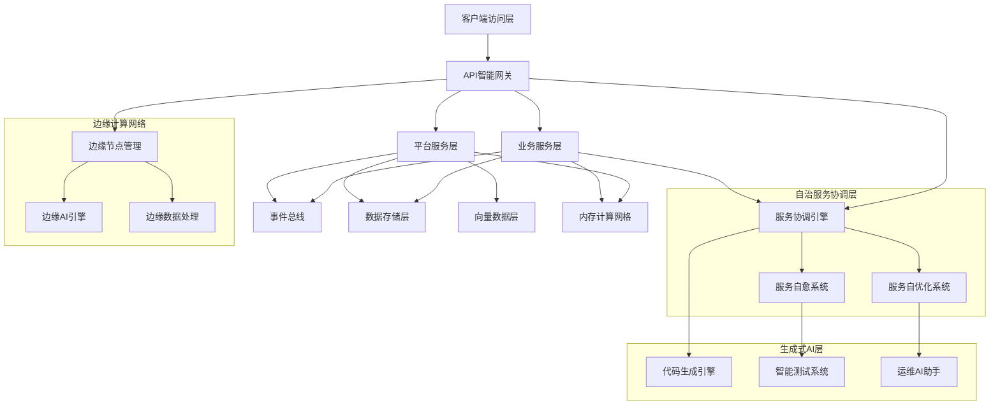

# 现代化微服务平台架构设计文档汇总 v5.0

**版本**: 5.0.0  
**日期**: 2025-04-28  
**作者**: 架构团队

## 文档结构

本文档是微服务平台架构设计v5.0版本的主要汇总文档，提供架构设计的整体视图。具体详细内容请参考以下文档：

1. [架构概述](01-architecture-overview.md)：介绍架构设计背景、目标和整体架构。
2. [系统设计](02-system-design.md)：详细说明系统架构设计和核心子系统设计。
3. [高级服务设计](03-advanced-services.md)：描述平台高级服务的功能和设计。
4. [边缘计算架构](04-edge-computing.md)：边缘计算组件设计与实现方案。
5. [安全架构设计](05-security-architecture.md)：详述零信任安全模型架构与实现。
6. [AI驱动的智能运维](06-ai-ops.md)：AI驱动的系统自优化与智能运维。
7. [开发规范与项目结构](07-development-guidelines.md)：规定开发规范和项目结构。
8. [实施路线图与升级策略](08-implementation-roadmap.md)：提供实施计划和升级策略。
9. [可持续与绿色计算](09-sustainable-computing.md)：可持续软件设计与绿色计算实践。
10. [多云架构与混合云部署](10-multi-cloud-architecture.md)：多云环境支持与混合云部署策略。

## 架构设计摘要

### 版本演进历程

#### v0-v4 版本主要特点

- **v0**：初始架构设计，奠定微服务基础架构，采用Spring Boot 3.x和Cloud框架，引入了领域驱动设计和响应式编程概念。
- **v1**：针对初始架构进行优化，提出技术栈升级计划，包括Java 21升级和框架优化，改进了架构以减少模块间耦合。
- **v2**：形成了系统化的架构文档体系，明确了技术选型和开发规范，实现了基于JDK 21的微服务平台基础架构。
- **v3**：增强了API管理和多平台集成能力，提供了更丰富的第三方系统对接方案，完善了缓存策略与异常处理机制。
- **v4**：引入边缘计算架构和零信任安全模型，增强AI驱动的智能运维能力，实现技术栈全面升级，融合多种编码规范。

#### v5.0 版本创新点

v5.0在前几个版本基础上进行了全面创新，主要特点包括：

1. **生成式AI全面集成**：深度整合大语言模型能力，实现代码生成、测试自动化与业务逻辑优化。
2. **内存计算架构**：引入分布式内存计算框架，显著提升数据密集型应用性能。
3. **弹性量子就绪型设计**：为未来量子计算接入预留接口，开发量子安全的加密机制。
4. **完全自治微服务**：基于Actor模型的全自治微服务架构，具备自愈、自优化能力。
5. **碳足迹感知计算**：实时监控和优化系统碳排放，实现绿色计算。
6. **全球分布式架构**：优化多区域部署架构，提供透明的全球数据访问与一致性保证。

### 关键设计决策

本架构采用以下关键设计决策：

1. **全自治微服务架构**：基于Actor模型与DDD相结合的服务设计，实现服务完全自治。

2. **六边形架构终极实践**：彻底实现核心业务逻辑与任何技术实现的解耦，实现真正的"可插拔"架构。

3. **分布式内存计算**：大规模分布式内存计算框架，实现亚毫秒级数据处理。

4. **生成式AI引擎**：从代码生成到运维的全生命周期生成式AI支持，提升开发效率和系统质量。

5. **弹性量子就绪架构**：可扩展至量子计算模型的架构设计与量子安全加密基础设施。

6. **碳足迹感知系统**：实时监控和优化系统资源使用，降低碳排放。

7. **全球数据一致性服务**：支持多区域部署与全球数据一致性。

8. **静态代码质量保障**：融合多种顶级编码规范，并增加特殊场景规则，确保极高代码质量。

9. **实时协作开发框架**：支持分布式团队的实时协作开发能力。

### 技术栈选择

**基础框架**：

- Java 21 LTS/Java 24，Kotlin 2.0
- Spring Boot 3.4.x，Spring Cloud 2025.x
- Project Reactor 4.0.x，Spring WebFlux
- Akka 2.9.x (Actor模型实现)

**数据存储**：

- PostgreSQL 16.x/17.x，MySQL 8.x
- Redis 8.x (内存数据库)
- Apache Ignite 3.x (分布式内存计算)
- Milvus 3.0 (向量数据库)
- TigerGraph 4.x (图数据库)

**AI与机器学习**：

- 生成式AI服务与引擎
- 大语言模型集成框架
- 自适应智能监控系统
- 代码质量分析与增强引擎

**消息与事件处理**：

- Kafka 4.0.x，Pulsar 3.x
- 高级事件流处理与编排框架
- 全球分布式事件总线

**安全框架**：

- 零信任安全框架 2.0
- 量子安全加密库
- 多因素认证与授权体系
- 实时安全威胁分析与响应

**DevOps与云原生**：

- Kubernetes 2.0
- Istio 2.x (服务网格)
- OpenTelemetry 2.x
- 碳足迹监控与优化工具
- AI驱动的GitOps 2.0

## 系统架构概览

### 整体架构图

### 主要创新点详述

#### 1. 生成式AI全面集成

v5.0架构深度整合了生成式AI能力，从开发、测试到运维的全生命周期提供AI支持：

- **代码生成引擎**：基于业务需求自动生成符合架构规范的代码
- **智能测试系统**：自动生成测试用例，识别潜在问题
- **运维AI助手**：预测系统异常，提供解决方案
- **智能文档生成**：自动维护系统文档与API文档
- **业务逻辑优化**：分析现有业务逻辑，提供优化建议

#### 2. 内存计算架构

引入分布式内存计算框架，显著提升数据密集型应用性能：

- **分布式内存数据网格**：亚毫秒级数据访问
- **内存计算引擎**：复杂计算在内存中完成
- **数据一致性保障**：ACID事务支持
- **弹性扩展能力**：动态扩缩容
- **持久化策略**：多级持久化确保数据安全

#### 3. 弹性量子就绪型设计

为未来量子计算接入预留接口，开发量子安全的加密机制：

- **量子安全密码学**：抵御量子计算攻击的加密算法
- **量子算法接口**：为未来量子算法提供标准接口
- **混合计算模型**：经典计算与量子计算混合架构
- **量子随机数生成器**：提供真随机数

#### 4. 完全自治微服务

基于Actor模型的全自治微服务架构，具备自愈、自优化能力：

- **Actor模型实现**：每个服务为独立Actor
- **自愈机制**：服务失败自动恢复
- **自适应负载均衡**：动态调整资源分配
- **自组织服务网络**：服务自动发现与组织
- **自优化执行**：优化服务执行路径

#### 5. 碳足迹感知计算

实时监控和优化系统碳排放，实现绿色计算：

- **资源使用优化**：降低能耗的资源分配策略
- **碳排放监控**：实时监控系统碳排放
- **绿色算法选择**：优先选择能效高的算法
- **低碳部署策略**：基于碳强度的部署决策
- **能源使用报告**：提供详细的能源使用分析

#### 6. 全球分布式架构

优化多区域部署架构，提供透明的全球数据访问与一致性保证：

- **全球数据同步**：跨区域数据同步机制
- **本地优先策略**：优先访问本地数据
- **冲突解决机制**：自动解决数据冲突
- **地理感知路由**：根据地理位置优化请求路由
- **全球事件总线**：跨区域事件传播 