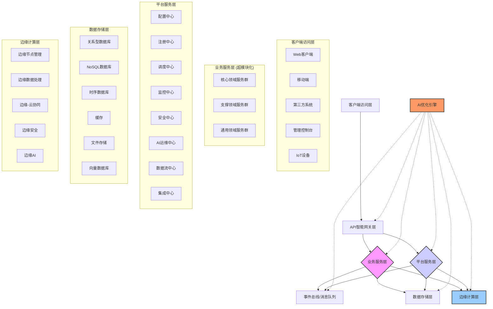
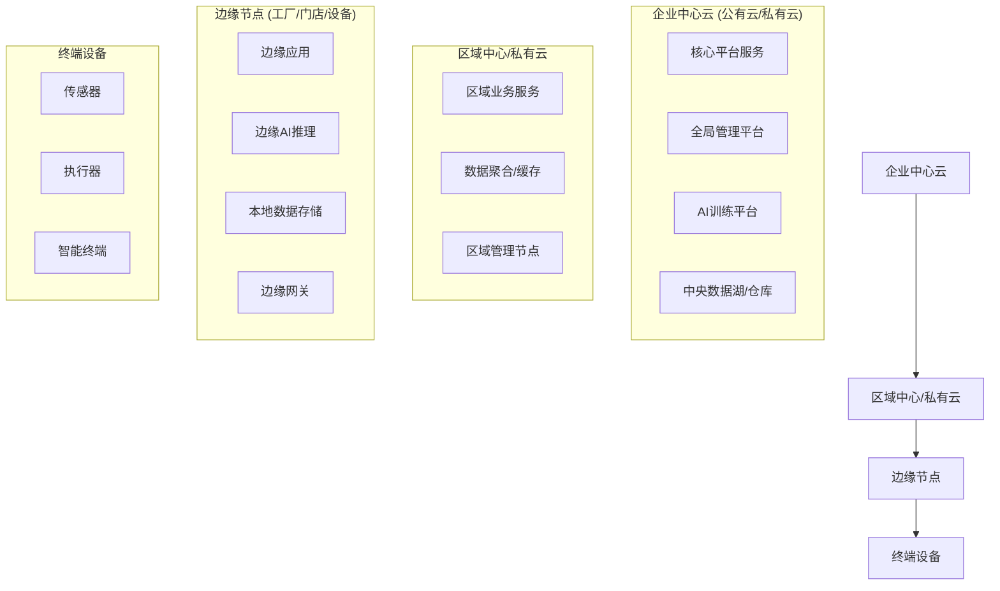

# V6 - 系统架构

## 1. 整体架构图

V6平台采用分层、模块化的微服务架构，并融入了边缘计算和AI优化能力。整体架构如下图所示：

## 2. 系统层次结构与职责

系统主要分为以下几个逻辑层次：

1.  **客户端访问层**: 提供多样化的终端接入方式，负责用户交互和基础验证，通过API网关与后端通信。
2.  **API智能网关层**: 系统的统一入口，负责请求路由、负载均衡、认证授权、流量控制、API聚合与编排，并集成AI驱动的智能路由和流量分析。
3.  **业务服务层**: 基于DDD和超模块化思想划分的微服务集群，每个服务聚焦特定业务能力，采用六边形架构实现内外隔离，通过事件和消息进行松耦合通信。
4.  **平台服务层**: 提供业务无关的通用基础能力和高级平台功能，如配置、注册、调度、监控、安全、AI运维、数据流处理、系统集成等。
5.  **事件总线/消息队列**: 实现服务间的异步通信和解耦，支持事件驱动架构、消息传递、事件溯源和复杂事件处理。
6.  **数据存储层**: 提供多模式的数据持久化能力，包括关系型、NoSQL、时序、向量数据库，以及缓存和文件存储，满足不同场景需求。
7.  **边缘计算层**: 管理地理分布的边缘节点，提供边缘数据处理、AI推理、边缘-云协同和离线工作能力。
8.  **AI优化引擎**: 横跨各层的智能组件，负责监控系统状态、进行智能调整、异常检测、预测性维护，并持续学习优化。

## 3. 核心模块划分

平台的核心功能通过一系列标准化模块提供：

1.  **平台基础模块 (Foundation)**
    *   `platform-common`: 通用工具类、常量、基础DTO等。
    *   `platform-dependencies`: 统一管理项目所有依赖及其版本。
    *   `platform-framework`: 框架核心抽象，提供可扩展的基础能力。

2.  **平台基础设施 (Infrastructure)**
    *   `platform-gateway`: API智能网关实现。
    *   `platform-registry`: 服务注册与发现中心 (基于Nacos)。
    *   `platform-config`: 分布式配置中心 (基于Nacos)。
    *   `platform-security`: 安全中心，负责认证、授权和安全策略执行。

3.  **平台核心服务 (Core Services)**
    *   `platform-dataflow`: 数据流处理中心，负责数据的加工、转换和聚合。
    *   `platform-collect`: 数据采集中心，负责从异构数据源采集数据。
    *   `platform-integration`: 系统集成中心，处理与外部系统的对接。
    *   `platform-scheduler`: 分布式调度中心，管理定时任务和异步作业。

4.  **平台增强服务 (Enhanced Services)**
    *   `platform-monitor`: 统一监控中心，提供指标、日志、追踪的可观测性。
    *   `platform-vector`: 向量服务体系，提供向量嵌入、存储、检索和分析能力。
    *   `platform-edge`: 边缘计算管理与协同中心。
    *   `platform-ai-ops`: AI运维中心，提供智能优化和自动化运维能力。

## 4. 物理部署架构

V6平台支持灵活的物理部署模式，以适应不同的业务需求和环境，包括多云部署、混合云部署以及边缘-云协同部署。核心部署策略是基于Kubernetes的容器化部署，利用服务网格进行流量管理和策略执行。

