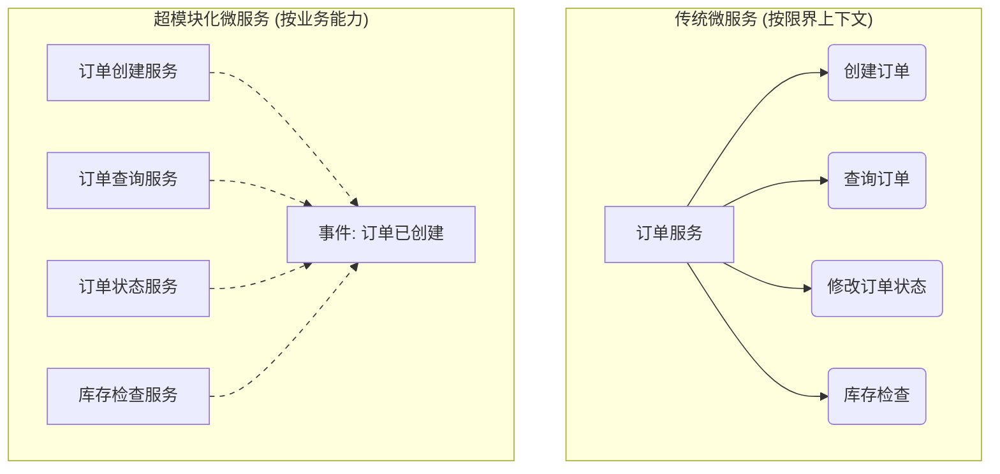
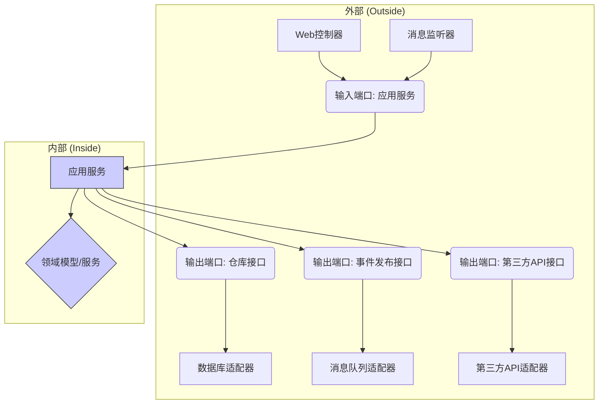

# V6 - 核心架构模式

平台V6架构融合了多种先进的架构模式和设计原则，以实现其设计目标。本篇将深入探讨其中最核心的几种模式。

## 1. 超模块化微服务架构 (Hyper-modular Microservices)

超模块化是对传统微服务架构的进一步演进，旨在创建更小、更专注、更自治的服务单元。

**核心理念**: 将单个业务领域或限界上下文(Bounded Context)内部的业务能力(Business Capability)进一步拆分为独立的微服务。

**设计原则**: 
- **单一业务能力**: 每个服务严格聚焦于一个明确、独立的业务能力。
- **高内聚、低耦合**: 服务内部高度内聚，服务间通过异步事件或定义良好的API进行极低耦合的交互。
- **独立演进**: 每个服务可以独立开发、测试、部署和扩展。
- **技术异构性**: 允许不同服务根据其特定需求选择最合适的技术栈。

**对比传统微服务**: 


**优势**: 
- 极致的灵活性和可维护性。
- 更快的开发和部署速度。
- 更精细化的资源伸缩和故障隔离。
- 更高的团队自主性和并行开发效率。

**挑战**: 
- 服务数量可能大幅增加，带来管理复杂性。
- 分布式事务处理更复杂。
- 需要更强大的基础设施支持（服务发现、监控、部署）。

## 2. 六边形架构 (Hexagonal Architecture / Ports and Adapters)

六边形架构是一种旨在将应用核心业务逻辑与外部依赖（如UI、数据库、第三方API）隔离的架构模式。

**核心理念**: 
- **内部 (Inside)**: 包含应用的领域模型和业务逻辑 (Domain Layer, Application Layer)。这部分不依赖任何外部技术。
- **外部 (Outside)**: 包含与外部世界交互的技术细节，如数据库访问、消息队列、Web控制器等 (Infrastructure Layer, Interfaces Layer)。
- **端口 (Ports)**: 定义了内部逻辑如何与外部交互的接口（由内部定义）。分为输入端口（Driving Ports，如应用服务接口）和输出端口（Driven Ports，如仓库接口、事件发布接口）。
- **适配器 (Adapters)**: 实现了端口接口，连接内部逻辑和外部技术。分为输入适配器（Driving Adapters，如Web控制器、消息监听器）和输出适配器（Driven Adapters，如数据库仓库实现、消息队列发布器）。

**依赖关系**: 外部依赖内部，所有依赖箭头都指向核心业务逻辑。



**优势**: 
- **高可测试性**: 核心业务逻辑可以独立于外部依赖进行单元测试。
- **技术可替换性**: 更换数据库、UI框架或消息队列等技术实现变得更容易。
- **业务逻辑清晰**: 核心领域模型保持纯粹，不受技术细节干扰。
- **适应性强**: 易于添加新的交互方式（如新的API、CLI）。

## 3. CQRS (Command Query Responsibility Segregation)

CQRS是一种将数据读取（查询）操作与数据写入（命令）操作分离的模式。

**核心理念**: 
- **命令 (Command)**: 表示执行一个操作的意图，可能会改变系统状态，通常不返回值或只返回执行状态。
- **查询 (Query)**: 表示获取数据的请求，不会改变系统状态，返回数据传输对象（DTO）。
- **分离的模型**: 命令模型（写模型）和查询模型（读模型）可以独立设计和优化。写模型关注数据一致性和业务规则，读模型关注查询效率和展现需求。
- **分离的数据存储**: （可选）写模型和读模型可以使用不同的数据库或存储技术。例如，写模型使用关系数据库保证事务，读模型使用文档数据库或搜索引擎优化查询。
- **数据同步**: 需要机制（通常是事件驱动）将写模型的状态变更同步到读模型。

```mermaid
graph TD
    A[客户端] -- 发送命令 --> B(API网关)
    A -- 发送查询 --> B
    B --> C[命令处理服务]
    B --> D[查询处理服务]
    C -- 操作 --> E{写模型 (领域模型)}
    E -- 发布事件 --> F[事件总线]
    F --> G[事件处理器]
    G -- 更新 --> H[读模型 (优化查询)]
    D -- 查询 --> H
```

**优势**: 
- **性能优化**: 可以针对读写操作分别优化模型和存储。
- **扩展性**: 读写负载可以独立扩展。
- **模型简化**: 单个模型只需关注命令或查询，降低复杂性。
- **灵活性**: 可以为不同的查询场景创建不同的读模型。

**挑战**: 
- **复杂性增加**: 需要处理数据同步和最终一致性问题。
- **开发成本**: 需要维护两套模型。

## 4. 事件驱动架构 (Event-Driven Architecture - EDA)

EDA是一种使用事件作为主要通信和驱动机制的架构风格。

**核心理念**: 
- **事件 (Event)**: 表示系统中发生的有意义的事情（如订单已创建、用户已登录）。事件是不可变的，记录了过去发生的事实。
- **事件生产者 (Producer)**: 发布事件到事件通道。
- **事件消费者 (Consumer)**: 订阅并处理事件。
- **事件通道 (Channel/Broker)**: 负责传递事件，如消息队列（Kafka, RocketMQ）或事件总线。

**模式**: 
- **事件通知 (Event Notification)**: 生产者仅通知消费者发生了某事，消费者需要回查获取详细信息。
- **事件携带状态转移 (Event-Carried State Transfer)**: 事件本身携带了状态变更所需的所有数据，消费者无需回查。
- **事件溯源 (Event Sourcing)**: 将应用状态的所有变更表示为一系列事件，并将这些事件作为唯一数据源存储。当前状态可以通过重放事件来重建。

```mermaid
graph LR
    A[服务A (生产者)] -- 发布事件 --> B(事件总线/消息队列)
    B -- 订阅事件 --> C[服务B (消费者)]
    B -- 订阅事件 --> D[服务C (消费者)]
    B -- 订阅事件 --> E[服务D (消费者)]
```

**优势**: 
- **松耦合**: 生产者和消费者之间没有直接依赖。
- **高伸缩性**: 可以独立扩展生产者和消费者。
- **高弹性**: 一个服务的失败不会直接影响其他服务。
- **实时响应**: 事件可以近乎实时地触发下游处理。
- **可扩展性**: 易于添加新的事件消费者来响应现有事件。

**挑战**: 
- **复杂性**: 需要处理分布式系统中的一致性、顺序性、重复消息等问题。
- **可观测性**: 追踪跨多个服务的事件流可能比较困难。
- **最终一致性**: 系统状态在事件处理完成前可能不一致。

## 5. 响应式系统设计 (Reactive Systems)

响应式系统是一种旨在构建更具弹性、伸缩性和响应性的系统的架构风格。

**核心原则 (响应式宣言)**: 
- **响应性 (Responsive)**: 系统在可预期的时间内响应请求。
- **弹性 (Resilient)**: 系统在出现故障时仍能保持响应性。
- **伸缩性 (Elastic)**: 系统在不同负载下仍能保持响应性，能够自动增减资源。
- **消息驱动 (Message Driven)**: 系统组件之间通过异步消息传递进行交互，实现松耦合、隔离和位置透明性。

**关键技术**: 
- **异步非阻塞I/O**: 避免线程阻塞，提高资源利用率。
- **背压 (Backpressure)**: 消费者能够控制生产者发送数据的速率，防止自身被压垮。
- **函数式编程**: 使用不可变数据结构和无副作用的函数，简化并发和状态管理。
- **响应式流规范 (Reactive Streams)**: 定义了带背压的异步流处理的标准接口 (Publisher, Subscriber, Subscription, Processor)。
- **响应式框架**: 如Project Reactor (Spring WebFlux), RxJava, Akka Streams。

**优势**: 
- **高性能**: 高吞吐量和低延迟。
- **资源高效**: 用更少的线程处理更多的并发请求。
- **更好的用户体验**: 系统始终保持响应。
- **更强的容错能力**: 通过隔离和异步通信提高系统韧性。

**挑战**: 
- **编程模型复杂**: 异步和事件驱动的思维方式与传统同步阻塞模型不同。
- **调试困难**: 异步代码的调用栈和调试可能更复杂。
- **需要生态系统支持**: 需要数据库驱动、消息队列客户端等支持响应式。 