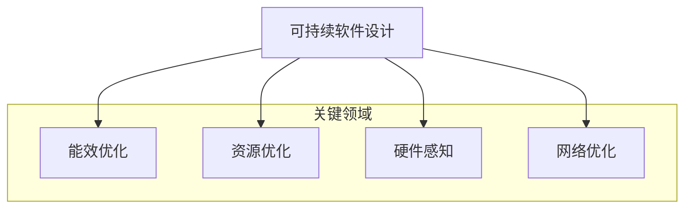

# V6 - 高级架构理念

平台V6架构不仅关注基础的微服务能力，还融入了多项前瞻性的高级架构理念，以构建更智能、更适应未来需求的系统。

## 1. 全链路AI优化 (AI-Driven Full-Lifecycle Optimization)

V6平台将AI能力深度融入软件开发与运维的全生命周期，旨在提升效率、质量和系统的自适应能力。

### 1.1 优化架构

AI优化引擎作为一个横跨各阶段的智能组件，持续收集数据、学习模式并提供优化建议或自动执行优化。

```mermaid
graph LR
    A[开发阶段] --> B[测试阶段]
    B --> C[部署阶段]
    C --> D[运行阶段]
    D --> E[优化阶段]
    E -.-> A(持续反馈)

    F[AI优化引擎] --> A
    F --> B
    F --> C
    F --> D
    F --> E

    subgraph "开发阶段"
        A1[智能代码助手]
        A2[代码质量预测]
        A3[架构合规检查]
        A4[性能风险预警]
    end

    subgraph "测试阶段"
        B1[智能测试用例生成]
        B2[测试优先级排序]
        B3[缺陷模式分析]
        B4[自动化测试优化]
    end

    subgraph "部署阶段"
        C1[部署风险评估]
        C2[资源需求预测]
        C3[最优部署策略推荐]
        C4[智能灰度控制]
    end

    subgraph "运行阶段 (AIOps)"
        D1[实时异常检测]
        D2[根因分析(RCA)]
        D3[智能告警降噪]
        D4[自动扩缩容决策]
    end

    subgraph "优化阶段"
        E1[性能瓶颈智能识别]
        E2[架构演进建议]
        E3[预测性维护]
        E4[资源配置优化]
    end
```

### 1.2 各阶段应用

- **开发阶段**: AI辅助编码、实时代码质量反馈、潜在性能问题预警、架构合规性检查。
- **测试阶段**: 自动生成测试用例、优化测试覆盖率、预测缺陷高发区域、智能分析测试失败原因。
- **部署阶段**: 评估发布风险、预测资源需求、推荐最佳部署策略（蓝绿、金丝雀）、智能控制灰度发布节奏。
- **运行阶段 (AIOps)**: 智能监控、异常检测与根因分析、告警降噪与关联、自适应资源调度与扩缩容、预测性故障处理。
- **优化阶段**: 自动识别性能瓶颈、提供架构重构建议、预测硬件故障、优化资源配置以降低成本和能耗。

## 2. 智能边缘计算框架 (Intelligent Edge Computing)

V6平台增强了边缘计算能力，实现了更强大的边缘智能和更高效的云边协同。

### 2.1 边缘-云协同架构

采用分层架构，将计算和数据处理能力下沉到靠近数据源的边缘节点，同时与中心云保持协同。

```mermaid
graph TD
    A[中心云] <--> B[边缘层]
    B <--> C[设备层]

    subgraph "中心云"
        A1[全局控制平面]
        A2[模型训练与管理]
        A3[中央数据存储与分析]
        A4[核心平台服务]
    end

    subgraph "边缘层 (边缘节点/网关)"
        B1[边缘运行时(K3s/自定义)]
        B2[本地AI推理引擎]
        B3[边缘数据处理与存储]
        B4[边缘应用/服务]
        B5[边缘安全组件]
        B6[云边协同代理]
    end

    subgraph "设备层"
        C1[传感器/执行器]
        C2[智能设备(PLC/摄像头等)]
        C3[终端用户设备]
    end
```

### 2.2 核心能力

- **边缘智能处理**: 在边缘节点执行实时数据处理、复杂事件处理和AI模型推理，降低延迟，减少对云端带宽的依赖。
- **边缘自治与离线工作**: 边缘节点在与云端断开连接时，仍能保持部分核心功能的运行和自主决策能力。
- **高效云边协同**: 
    - **智能数据同步**: 基于CRDTs等机制，实现边缘和云端数据的增量、可靠同步，保证最终一致性。
    - **模型/应用分发**: 中心云统一管理AI模型和边缘应用，按需将其安全地分发和部署到边缘节点。
    - **策略与配置下发**: 中心云向下推送控制策略、安全规则和应用配置。
    - **资源协同调度**: 根据任务需求和资源状况，智能地将计算任务分配到云端或边缘执行。
- **边缘安全**: 提供设备认证、安全通信、本地数据加密、边缘访问控制等安全机制。
- **边缘AI优化**: 支持模型量化、剪枝等技术，部署轻量化、高效的AI模型到资源受限的边缘设备。

## 3. 可持续软件设计 (Sustainable Software Design)

V6架构将可持续性作为重要的非功能性需求，旨在构建环境友好、资源高效的软件系统。

### 3.1 设计原则

遵循绿色软件基金会(Green Software Foundation)等倡导的原则，关注软件生命周期中的环境影响。



### 3.2 实践策略

- **能效优化 (Energy Efficiency)**: 
    - 编写低功耗代码：避免不必要的计算、轮询和资源占用。
    - 采用更节能的算法和数据结构。
    - 利用CPU/GPU的节能特性。
    - 实现能源感知的任务调度，在电价较低或可再生能源可用时执行高耗能任务。
    - 监控应用和基础设施的碳排放强度。
- **资源优化 (Resource Optimization)**: 
    - 提高硬件资源利用率，避免过度配置。
    - 实施精细化的自动扩缩容策略。
    - 采用无服务器(Serverless)架构减少闲置资源。
    - 优化缓存策略，减少重复计算和数据获取。
    - 及时回收和释放不再使用的资源。
- **硬件感知 (Hardware Awareness)**: 
    - 延长硬件使用寿命，减少电子垃圾。
    - 设计软件以适应多种硬件配置，避免强制硬件升级。
    - 考虑使用翻新或低功耗硬件。
- **网络优化 (Network Optimization)**: 
    - 减少数据传输量：使用高效的数据格式（如Protobuf）、压缩算法。
    - 利用CDN和边缘计算将数据缓存在靠近用户的地方。
    - 优化API设计，避免传输不必要的数据。
    - 采用增量同步和更新策略。 