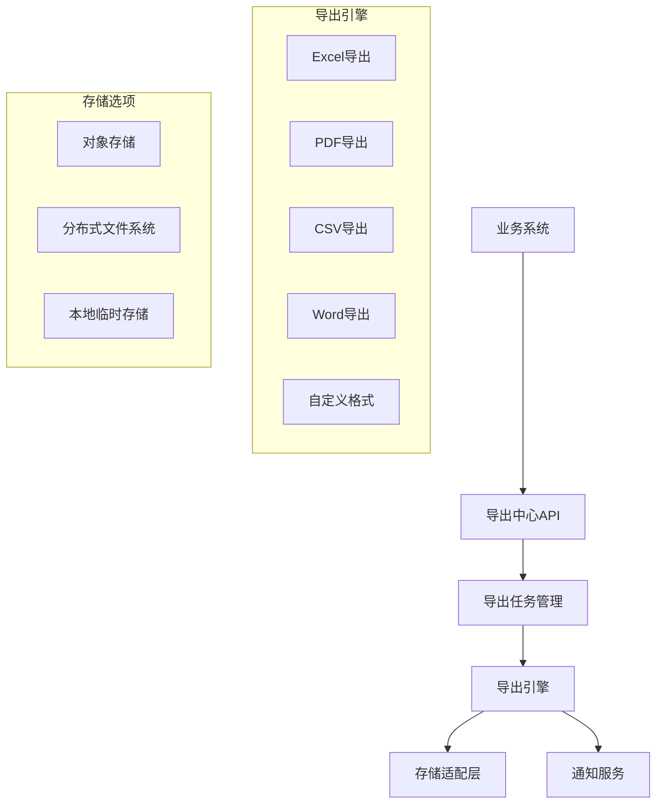
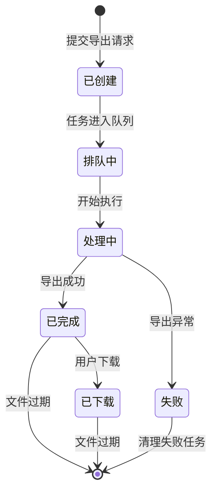

# V6 - 统一导出中心

平台V6架构提供统一的导出中心，用于集中管理和处理各类数据文件的导出需求，确保高性能、可靠性和一致的用户体验。

## 1. 设计目标

统一导出中心的设计遵循以下目标：

- **统一化**: 提供统一的导出服务和接口，避免重复造轮子。
- **可扩展性**: 支持多种格式和不同业务场景的数据导出。
- **异步处理**: 支持大数据量导出的异步执行和状态跟踪。
- **高性能**: 针对大数据量导出进行性能优化。
- **安全可控**: 数据访问权限管理和敏感数据保护。
- **可观测性**: 提供导出任务的状态监控和问题追踪能力。

## 2. 整体架构

导出中心采用分层架构和微服务设计，提供统一的API和多样化的导出实现。



### 2.1 核心组件

- **导出中心API**: 提供统一的REST API，供业务系统集成使用。
- **导出任务管理**: 负责导出任务的创建、调度、状态管理和生命周期控制。
- **导出引擎**: 包含各种导出格式的实现引擎，如Excel、PDF、CSV等。
- **存储适配层**: 管理导出文件的存储，支持多种存储后端。
- **通知服务**: 当导出任务完成时，通过消息、邮件等方式通知用户。

## 3. 关键能力

### 3.1 支持的导出格式

- **表格数据**: Excel(XLS/XLSX)、CSV、HTML表格
- **文档类**: PDF、Word(DOC/DOCX)、Markdown、纯文本
- **报表类**: 自定义报表模板（融合数据和样式）
- **原始数据**: JSON、XML、自定义二进制格式
- **多媒体**: 图表、图像集合

### 3.2 导出任务生命周期



- **任务优先级**: 支持设置导出任务优先级，合理分配资源。
- **超时控制**: 对长时间运行的导出任务进行超时控制。
- **失败重试**: 针对临时性故障提供自动重试机制。
- **文件生命周期**: 导出文件的自动过期和清理策略。

### 3.3 大数据量处理策略

- **流式处理**: 使用流处理技术避免内存溢出，支持GB级数据导出。
- **分片导出**: 大数据集自动分片处理，多文件打包。
- **增量构建**: 对超大报表采用增量构建方式。
- **后台任务**: 长时间运行的导出任务转为后台异步处理。
- **进度反馈**: 提供实时进度反馈，特别是对大数据量导出任务。

### 3.4 模板管理

- **模板库**: 集中管理各类导出模板。
- **模板设计器**: 提供可视化的模板设计工具。
- **版本控制**: 模板的版本管理和历史追溯。
- **模板复用**: 支持跨业务系统的模板共享和复用。

## 4. 技术实现

### 4.1 核心框架选型

- **数据导出库**: 
  - Excel: Apache POI, EasyExcel, JXL
  - PDF: iText, Apache PDFBox
  - CSV: Apache Commons CSV, OpenCSV
  - 报表: JasperReports, Birt
- **任务管理**: Spring Batch, XXL-Job, PowerJob
- **存储集成**: Amazon S3兼容接口, HDFS, 分布式文件系统
- **缓存层**: Redis用于任务状态和临时数据存储

### 4.2 架构设计考量

- **可伸缩性**: 导出引擎支持水平扩展，以应对高并发导出需求。
- **资源隔离**: 大型导出任务在独立的资源池中执行，避免影响其他服务。
- **失败隔离**: 单个导出任务的失败不应影响其他任务。
- **限流控制**: 针对API和资源使用的限流策略。

## 5. 集成方式

### 5.1 API集成

提供RESTful API供业务系统集成：

```
# 创建导出任务
POST /api/v1/exports
{
    "businessType": "order",  // 业务类型
    "exportType": "excel",    // 导出类型
    "templateId": "tpl_123",  // 模板ID
    "parameters": {           // 导出参数
        "startDate": "2023-01-01",
        "endDate": "2023-12-31",
        "filters": {...}
    },
    "callbackUrl": "https://..." // 可选回调URL
}

# 查询导出任务状态
GET /api/v1/exports/{taskId}

# 获取导出文件
GET /api/v1/exports/{taskId}/file

# 取消导出任务
DELETE /api/v1/exports/{taskId}
```

### 5.2 事件集成

基于事件驱动架构提供松耦合集成：

- 通过消息队列接收导出请求事件
- 发布导出状态变更事件
- 支持业务系统订阅特定导出任务的状态变更

### 5.3 SDK集成

为主要编程语言提供SDK：

- Java SDK 
- JavaScript/TypeScript SDK (Web前端)
- Python SDK
- Go SDK

## 6. 安全与合规

- **权限控制**: 基于RBAC的导出权限管理
- **数据脱敏**: 导出敏感数据时自动脱敏
- **数据水印**: 支持在导出文件中添加可追踪水印
- **访问审计**: 记录所有导出操作的审计日志
- **合规检查**: 导出前进行数据合规性检查

## 7. 可观测性

- **监控指标**: 
  - 导出任务数量、成功率、平均执行时间
  - 队列深度、资源利用率
  - 异常类型统计
- **链路追踪**: 通过调用链跟踪定位导出性能瓶颈
- **日志管理**: 结构化日志输出，支持ELK/Loki等日志分析平台
- **告警规则**: 针对导出服务的健康状况设置告警

## 8. 与其他系统集成

- **身份认证系统**: 对接SSO/IAM系统实现用户认证
- **调度系统**: 与`platform-scheduler`集成实现定时导出
- **通知中心**: 与`platform-notification`集成实现导出完成通知
- **存储服务**: 与对象存储、文件服务集成
- **业务系统**: 支持从多个业务系统收集导出数据 