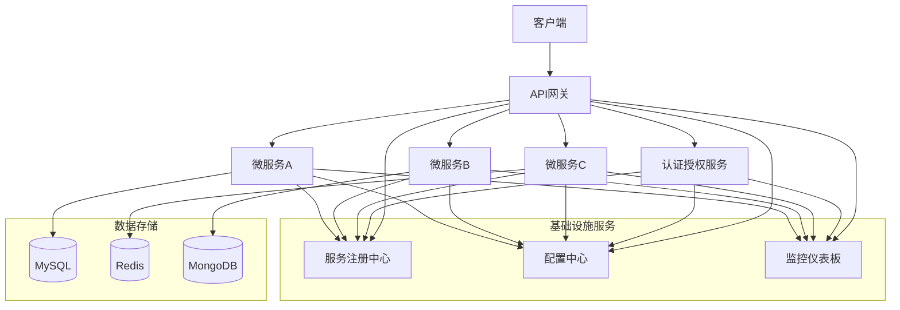
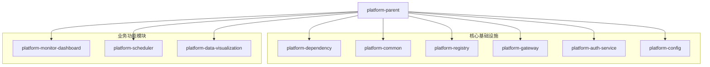
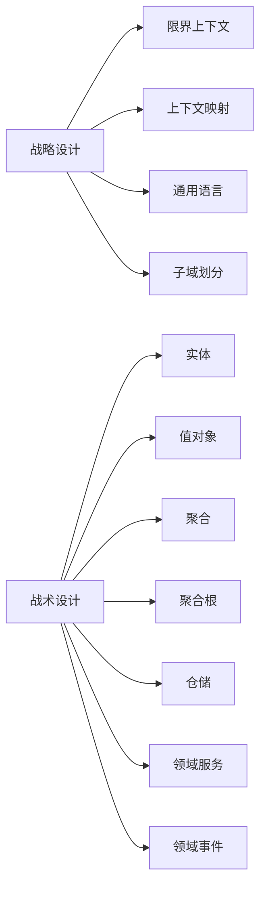
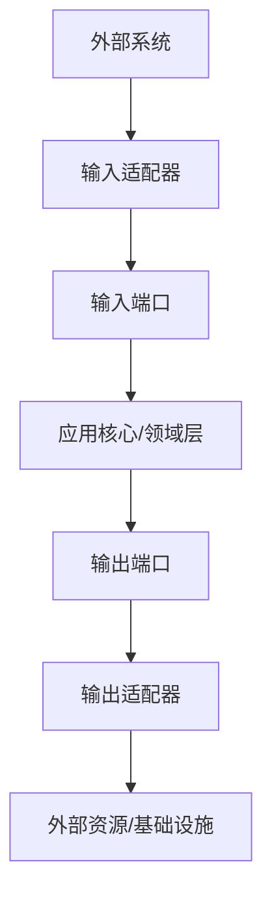
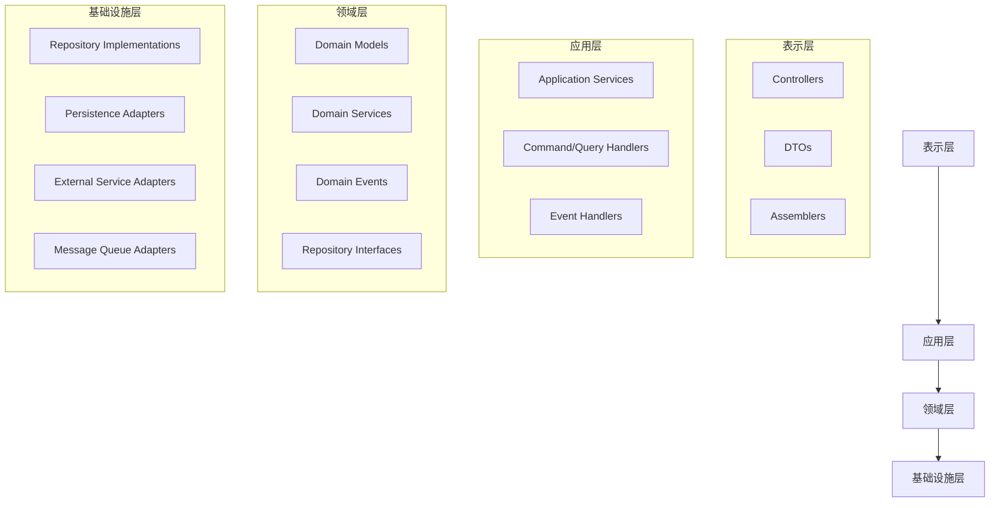

# 项目概述与架构设计

## 1. 项目背景

本项目是一个基于SpringBoot 3.x和Vue 3.x的全栈微服务平台，采用DDD（领域驱动设计）和六边形架构（端口与适配器）设计原则。该平台提供了一套完整的微服务基础架构，包括服务注册与发现、配置中心、API网关、统一认证授权等核心功能。

## 2. 技术栈

### 2.1 后端技术栈
- **核心框架**: Java 21, SpringBoot 3.2.1
- **微服务框架**: Spring Cloud 2023.0.0, Spring Cloud Alibaba 2022.0.0.0
- **持久层**: MyBatis 3.0.2 + XML, MongoDB 4.11.1
- **数据库**: MySQL 8.0.33, Redis 7.x
- **消息队列**: Kafka 3.5.1, RabbitMQ 2.4.2
- **服务治理**: Nacos (服务注册/发现/配置中心)

### 2.2 前端技术栈
- **核心框架**: Vue 3.x
- **UI组件库**: 待定
- **状态管理**: 待定
- **路由**: 待定

### 2.3 DevOps工具链
- **构建工具**: Maven 3.8+
- **CI/CD**: 待实现
- **代码质量**: 计划使用SonarQube
- **监控**: 自研监控仪表板

## 3. 总体架构

## 4. 项目模块结构

当前项目由以下核心模块组成：

## 5. 设计原则

### 5.1 框架与业务隔离

- **领域模型与框架无关**: 领域实体、值对象等不应继承或依赖任何框架类
- **接口隔离**: 使用抽象接口隔离基础设施实现细节
- **核心业务独立性**: 核心业务逻辑不包含框架API调用
- **防腐层**: 创建防腐层保护领域模型免受外部影响

### 5.2 领域驱动设计(DDD)实践

- **战略设计与战术设计分离**: 明确区分业务建模和技术实现
- **限界上下文**: 明确划分业务边界
- **上下文映射**: 定义子域间关系
- **统一语言**: 确保业务术语一致性

### 5.3 六边形架构(端口与适配器)

- **核心领域集中**: 核心领域逻辑位于中心，与外部技术实现隔离
- **端口定义交互**: 通过端口定义领域与外部世界的交互契约
- **适配器实现集成**: 使用适配器实现与外部系统的集成
- **输入/输出适配器区分**: 明确区分面向用户的输入适配器和面向基础设施的输出适配器

## 6. 代码分层

## 7. 当前状态与挑战

系统目前正处于初期开发阶段，已完成的模块包括：
- 服务注册中心
- 配置中心
- 监控仪表板
- 调度系统的部分功能

面临的主要挑战：
1. 需要完善分布式链路追踪
2. 需要集成ELK日志系统
3. 需要实现分布式事务支持
4. 需要添加全局数据加密解密方案
5. CI/CD流程尚未建立

## 8. 重构目标

本次重构的主要目标是：
1. 统一架构风格，确保所有模块遵循DDD和六边形架构
2. 改进代码组织结构，提高可维护性
3. 完善基础设施服务
4. 优化性能瓶颈
5. 提高系统弹性和可靠性 