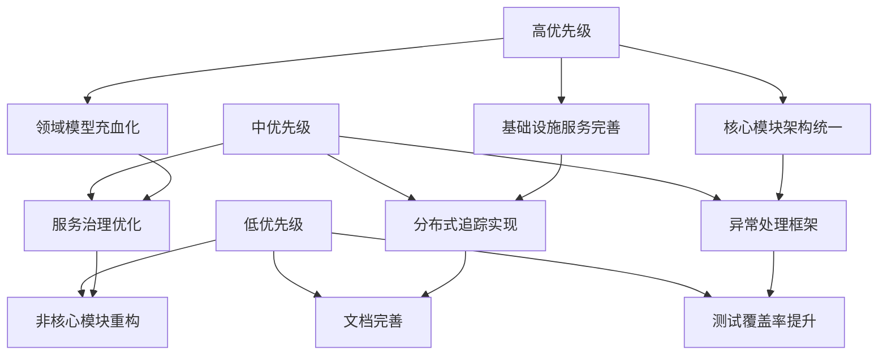
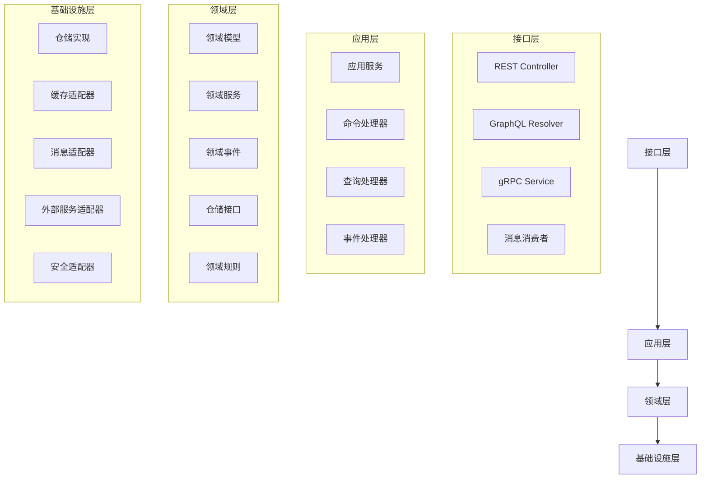
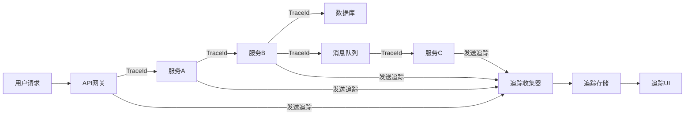
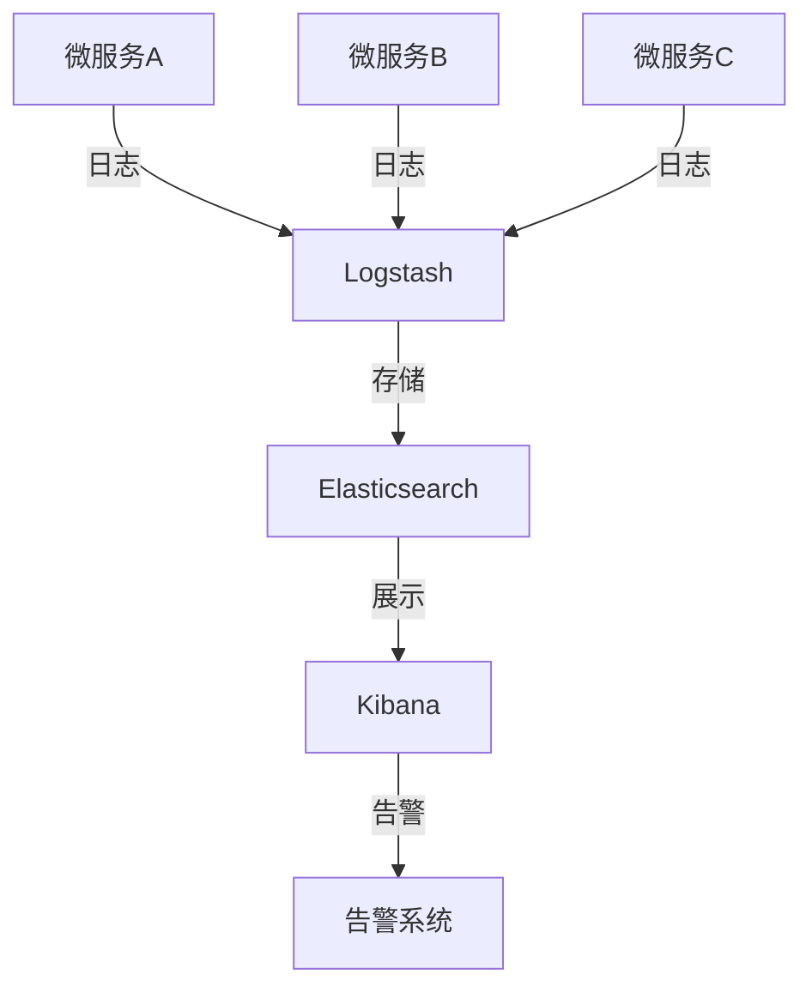
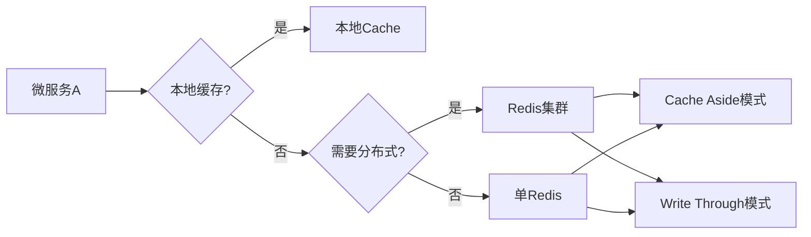
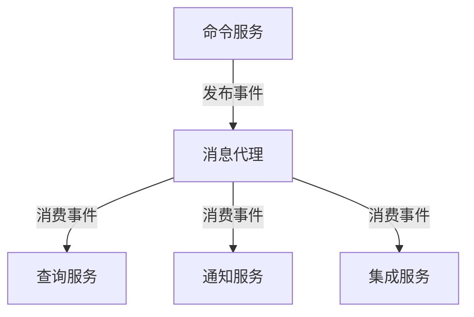

# 重构计划与建议

## 1. 重构概述

本重构计划基于对现有系统的全面分析，旨在提高系统的可维护性、可扩展性和健壮性。重构将围绕以下几个核心目标展开：

1. 统一架构风格，确保所有模块遵循DDD和六边形架构
2. 充实领域模型，解决贫血模型问题
3. 优化服务治理，增强系统可靠性
4. 提高代码质量，减少重复代码和技术债务
5. 完善基础设施服务

## 2. 重构优先级

根据系统当前状态和业务需求，我们将重构工作按以下优先级进行：



## 3. 领域模型重构

### 3.1 贫血模型问题分析

当前系统中存在较多贫血模型，主要表现为：

1. 领域对象只包含数据字段和简单的getter/setter
2. 业务逻辑主要集中在服务层
3. 领域规则分散且难以追踪

示例问题代码：

```java
// 贫血模型示例
public class User {
    private Long id;
    private String username;
    private String password;
    private String email;
    private Boolean enabled;
    private Set<Role> roles;
    
    // 只有getter/setter，没有业务行为
    public Long getId() { return id; }
    public void setId(Long id) { this.id = id; }
    public String getUsername() { return username; }
    public void setUsername(String username) { this.username = username; }
    // ...其他getter/setter
}

// 业务逻辑集中在服务层
@Service
public class UserService {
    // 业务逻辑在服务层实现
    public void changePassword(User user, String oldPassword, String newPassword) {
        if (!passwordEncoder.matches(oldPassword, user.getPassword())) {
            throw new InvalidPasswordException();
        }
        
        validatePasswordStrength(newPassword);
        user.setPassword(passwordEncoder.encode(newPassword));
        userRepository.save(user);
    }
    
    public void assignRole(User user, Role role) {
        if (user.getRoles() == null) {
            user.setRoles(new HashSet<>());
        }
        user.getRoles().add(role);
        userRepository.save(user);
    }
}
```

### 3.2 充血模型改造方案

将业务逻辑从服务层迁移到领域模型中：

```java
// 充血模型示例
public class User {
    private final UserId id;  // 使用值对象作为ID
    private Username username;  // 使用值对象表示用户名
    private Password password;  // 密码封装
    private Email email;  // 邮箱封装
    private boolean enabled;
    private Set<Role> roles;
    
    // 构造函数确保对象完整性
    public User(UserId id, Username username, Password password, Email email) {
        this.id = id;
        this.username = username;
        this.password = password;
        this.email = email;
        this.enabled = false;
        this.roles = new HashSet<>();
    }
    
    // 业务方法
    public void changePassword(Password oldPassword, Password newPassword, PasswordEncoder encoder) {
        if (!password.matches(oldPassword, encoder)) {
            throw new InvalidPasswordException();
        }
        
        this.password = newPassword;
    }
    
    public void assignRole(Role role) {
        this.roles.add(role);
    }
    
    public void enable() {
        this.enabled = true;
    }
    
    public void disable() {
        this.enabled = false;
    }
    
    // 不可变ID的getter
    public UserId getId() {
        return id;
    }
    
    // 其他必要的getter（不提供setter以保护不变性）
}
```

### 3.3 值对象实现

为关键领域概念创建值对象：

```java
// 用户ID值对象
public final class UserId {
    private final String value;
    
    private UserId(String value) {
        this.value = value;
    }
    
    public static UserId of(String value) {
        if (value == null || value.trim().isEmpty()) {
            throw new IllegalArgumentException("用户ID不能为空");
        }
        return new UserId(value);
    }
    
    public static UserId generate() {
        return new UserId(UUID.randomUUID().toString());
    }
    
    public String getValue() {
        return value;
    }
    
    @Override
    public boolean equals(Object o) {
        if (this == o) return true;
        if (o == null || getClass() != o.getClass()) return false;
        UserId userId = (UserId) o;
        return Objects.equals(value, userId.value);
    }
    
    @Override
    public int hashCode() {
        return Objects.hash(value);
    }
}
```

## 4. 架构统一重构

### 4.1 当前架构差异

当前不同模块间的架构存在差异：

1. 部分模块遵循传统三层架构
2. 部分模块尝试实现DDD但不完整
3. 分层职责和包结构不一致

### 4.2 架构统一方案

为所有模块建立统一的架构模式：



### 4.3 包结构标准化

建立统一的包结构标准：

```
src/main/java/com/platform/{module-name}
├── application           # 应用层
│   ├── command           # 命令对象和处理器
│   ├── event             # 应用事件处理
│   ├── query             # 查询对象和处理器
│   └── service           # 应用服务
├── domain                # 领域层
│   ├── model             # 领域模型
│   │   ├── aggregate     # 聚合
│   │   ├── entity        # 实体
│   │   └── valueobject   # 值对象
│   ├── event             # 领域事件
│   ├── repository        # 仓储接口
│   └── service           # 领域服务
├── infrastructure        # 基础设施层
│   ├── config            # 配置
│   ├── messaging         # 消息队列适配
│   ├── persistence       # 持久化适配器
│   │   ├── jpa           # JPA实现
│   │   ├── mybatis       # MyBatis实现
│   │   └── mongo         # MongoDB实现
│   └── external          # 外部服务适配器
└── interfaces            # 接口层
    ├── rest              # REST API
    ├── graphql           # GraphQL API
    ├── grpc              # gRPC API
    └── message           # 消息接收器
```

## 5. 服务治理优化

### 5.1 分布式追踪实现

引入分布式追踪以提高系统可观察性：



实现步骤：

1. 集成Spring Cloud Sleuth和Zipkin
2. 为关键业务流程添加自定义追踪点
3. 配置抽样率和追踪数据存储

### 5.2 熔断和降级机制

实现服务熔断和降级机制：

```java
// 使用Resilience4j实现熔断
@Component
public class ResilientUserService {
    private final CircuitBreaker circuitBreaker;
    private final UserRepository userRepository;
    
    public ResilientUserService(CircuitBreakerRegistry registry, UserRepository userRepository) {
        this.circuitBreaker = registry.circuitBreaker("userService");
        this.userRepository = userRepository;
    }
    
    public User findUserById(String userId) {
        return circuitBreaker.executeSupplier(() -> userRepository.findById(userId))
                .orElse(getFallbackUser(userId));
    }
    
    private User getFallbackUser(String userId) {
        // 返回缓存中的用户或默认用户
        return new User.Builder()
                .withId(userId)
                .withUsername("未知用户")
                .build();
    }
}
```

### 5.3 统一异常处理

实现全局异常处理机制：

```java
@RestControllerAdvice
public class GlobalExceptionHandler {
    private static final Logger log = LoggerFactory.getLogger(GlobalExceptionHandler.class);
    
    @ExceptionHandler(DomainException.class)
    public ResponseEntity<ErrorResponse> handleDomainException(DomainException ex) {
        log.error("Domain error: {}", ex.getMessage(), ex);
        
        ErrorResponse error = new ErrorResponse(
            "DOMAIN_ERROR",
            ex.getMessage(),
            HttpStatus.BAD_REQUEST.value()
        );
        
        return new ResponseEntity<>(error, HttpStatus.BAD_REQUEST);
    }
    
    @ExceptionHandler(ApplicationException.class)
    public ResponseEntity<ErrorResponse> handleApplicationException(ApplicationException ex) {
        log.error("Application error: {}", ex.getMessage(), ex);
        
        ErrorResponse error = new ErrorResponse(
            "APPLICATION_ERROR",
            ex.getMessage(),
            HttpStatus.INTERNAL_SERVER_ERROR.value()
        );
        
        return new ResponseEntity<>(error, HttpStatus.INTERNAL_SERVER_ERROR);
    }
    
    // 其他异常处理方法...
}
```

## 6. 代码质量提升

### 6.1 代码重复消除

识别并提取通用组件：

```java
// 通用分页查询组件
public class PageQuery<T> {
    private final int pageNumber;
    private final int pageSize;
    private final Map<String, String> filters;
    private final List<String> sorts;
    
    // 构造函数和builder模式
    
    public static class Builder<T> {
        private int pageNumber = 0;
        private int pageSize = 20;
        private Map<String, String> filters = new HashMap<>();
        private List<String> sorts = new ArrayList<>();
        
        public Builder<T> page(int pageNumber) {
            this.pageNumber = pageNumber;
            return this;
        }
        
        public Builder<T> size(int pageSize) {
            this.pageSize = pageSize;
            return this;
        }
        
        public Builder<T> filter(String key, String value) {
            this.filters.put(key, value);
            return this;
        }
        
        public Builder<T> sort(String property) {
            this.sorts.add(property);
            return this;
        }
        
        public PageQuery<T> build() {
            return new PageQuery<>(pageNumber, pageSize, filters, sorts);
        }
    }
    
    // 其他方法...
}
```

### 6.2 长方法重构

重构复杂方法，提高可读性和可维护性：

```java
// 重构前
public List<TaskDTO> findTasks(String status, Date startDate, Date endDate, String owner) {
    List<Task> tasks = new ArrayList<>();
    
    if (status != null && !status.isEmpty()) {
        if (startDate != null && endDate != null) {
            if (owner != null && !owner.isEmpty()) {
                tasks = taskRepository.findByStatusAndDateRangeAndOwner(status, startDate, endDate, owner);
            } else {
                tasks = taskRepository.findByStatusAndDateRange(status, startDate, endDate);
            }
        } else {
            if (owner != null && !owner.isEmpty()) {
                tasks = taskRepository.findByStatusAndOwner(status, owner);
            } else {
                tasks = taskRepository.findByStatus(status);
            }
        }
    } else {
        if (startDate != null && endDate != null) {
            if (owner != null && !owner.isEmpty()) {
                tasks = taskRepository.findByDateRangeAndOwner(startDate, endDate, owner);
            } else {
                tasks = taskRepository.findByDateRange(startDate, endDate);
            }
        } else {
            if (owner != null && !owner.isEmpty()) {
                tasks = taskRepository.findByOwner(owner);
            } else {
                tasks = taskRepository.findAll();
            }
        }
    }
    
    return tasks.stream()
            .map(taskMapper::toDTO)
            .collect(Collectors.toList());
}

// 重构后 - 使用规格模式
public List<TaskDTO> findTasks(TaskSearchCriteria criteria) {
    Specification<Task> spec = Specification.where(null);
    
    if (criteria.hasStatus()) {
        spec = spec.and(TaskSpecifications.hasStatus(criteria.getStatus()));
    }
    
    if (criteria.hasDateRange()) {
        spec = spec.and(TaskSpecifications.inDateRange(
            criteria.getStartDate(), 
            criteria.getEndDate()
        ));
    }
    
    if (criteria.hasOwner()) {
        spec = spec.and(TaskSpecifications.ownedBy(criteria.getOwner()));
    }
    
    List<Task> tasks = taskRepository.findAll(spec);
    
    return tasks.stream()
            .map(taskMapper::toDTO)
            .collect(Collectors.toList());
}
```

### 6.3 引入不变性

增加值对象和不可变设计：

```java
// 不可变的金额值对象
public final class Money {
    private final BigDecimal amount;
    private final Currency currency;
    
    private Money(BigDecimal amount, Currency currency) {
        this.amount = amount;
        this.currency = currency;
    }
    
    public static Money of(BigDecimal amount, Currency currency) {
        if (amount == null) {
            throw new IllegalArgumentException("金额不能为空");
        }
        if (currency == null) {
            throw new IllegalArgumentException("货币不能为空");
        }
        return new Money(amount, currency);
    }
    
    public static Money zero(Currency currency) {
        return new Money(BigDecimal.ZERO, currency);
    }
    
    public Money add(Money other) {
        if (!this.currency.equals(other.currency)) {
            throw new CurrencyMismatchException();
        }
        return new Money(this.amount.add(other.amount), this.currency);
    }
    
    public Money subtract(Money other) {
        if (!this.currency.equals(other.currency)) {
            throw new CurrencyMismatchException();
        }
        return new Money(this.amount.subtract(other.amount), this.currency);
    }
    
    public Money multiply(int multiplier) {
        return new Money(this.amount.multiply(BigDecimal.valueOf(multiplier)), this.currency);
    }
    
    // getter方法，无setter
    public BigDecimal getAmount() {
        return amount;
    }
    
    public Currency getCurrency() {
        return currency;
    }
    
    // equals, hashCode, toString
}
```

## 7. 基础设施服务完善

### 7.1 分布式日志系统

引入集中式日志系统：



实现步骤：

1. 集成ELK栈或Graylog
2. 统一日志格式和级别
3. 开发关键事件告警规则

### 7.2 分布式缓存

优化缓存策略：



Redis缓存适配器实现：

```java
@Component
public class RedisUserCache implements UserCache {
    private final StringRedisTemplate redisTemplate;
    private final ObjectMapper objectMapper;
    private final String KEY_PREFIX = "users:";
    private final Duration DEFAULT_TTL = Duration.ofHours(24);
    
    @Override
    public Optional<User> findById(UserId userId) {
        String key = KEY_PREFIX + userId.getValue();
        String json = redisTemplate.opsForValue().get(key);
        
        if (json == null) {
            return Optional.empty();
        }
        
        try {
            User user = objectMapper.readValue(json, User.class);
            return Optional.of(user);
        } catch (JsonProcessingException e) {
            // 记录异常并返回空
            return Optional.empty();
        }
    }
    
    @Override
    public void save(User user) {
        String key = KEY_PREFIX + user.getId().getValue();
        try {
            String json = objectMapper.writeValueAsString(user);
            redisTemplate.opsForValue().set(key, json, DEFAULT_TTL);
        } catch (JsonProcessingException e) {
            // 记录异常
        }
    }
    
    @Override
    public void remove(UserId userId) {
        String key = KEY_PREFIX + userId.getValue();
        redisTemplate.delete(key);
    }
}
```

### 7.3 消息驱动架构

增强事件驱动能力：



Kafka消息适配器实现：

```java
@Component
public class KafkaDomainEventPublisher implements DomainEventPublisher {
    private final KafkaTemplate<String, String> kafkaTemplate;
    private final ObjectMapper objectMapper;
    
    @Override
    public void publish(DomainEvent event) {
        String topic = determineTopicForEvent(event);
        String key = extractKeyFromEvent(event);
        
        try {
            String payload = objectMapper.writeValueAsString(event);
            kafkaTemplate.send(topic, key, payload)
                         .addCallback(this::onSuccess, this::onFailure);
        } catch (JsonProcessingException e) {
            // 处理异常
        }
    }
    
    private String determineTopicForEvent(DomainEvent event) {
        return "events." + event.getClass().getSimpleName().toLowerCase()
                                         .replace("event", "");
    }
    
    private String extractKeyFromEvent(DomainEvent event) {
        // 从事件中提取关键字，用于分区
        return event.getAggregateId().toString();
    }
    
    private void onSuccess(SendResult<String, String> result) {
        // 成功回调处理
    }
    
    private void onFailure(Throwable ex) {
        // 失败处理和重试策略
    }
}
```

## 8. 重构实施计划

### 8.1 分阶段实施计划

重构将分为以下几个阶段进行：

1. **第一阶段（1-2个月）**：
   - 建立统一的架构标准
   - 实现关键领域模型的充血化
   - 完善基础设施服务

2. **第二阶段（2-3个月）**：
   - 服务治理优化
   - 异常处理框架实现
   - 分布式追踪系统集成

3. **第三阶段（1-2个月）**：
   - 非核心模块改造
   - 测试覆盖率提升
   - 文档完善

### 8.2 风险评估与缓解

| 风险 | 可能性 | 影响 | 缓解措施 |
|------|--------|------|----------|
| 重构引入新缺陷 | 中 | 高 | 增加测试覆盖率，小步迭代 |
| 重构延迟项目进度 | 高 | 中 | 与功能开发并行，拆分重构任务 |
| 重构后性能下降 | 低 | 高 | 性能测试驱动重构，关注性能指标 |
| 团队不适应新架构 | 中 | 中 | 提供培训，制定编码规范 |

### 8.3 回滚策略

为每个重构步骤制定回滚策略：

1. 保留重构前的代码分支
2. 重构后全面回归测试
3. 监控关键性能指标
4. 建立快速回滚机制
5. 实施蓝绿部署策略 