# 分布式定时任务系统流程设计

## 1. 系统整体架构

```
+---------------------+        +---------------------+
|                     |        |                     |
|   调度节点1          |        |   调度节点2          |
|                     |        |                     |
+----------+----------+        +----------+----------+
           |                              |
           |      +----------------+      |
           |      |                |      |
           +----->|  Redis 集群     |<-----+
           |      |                |      |
           |      +----------------+      |
           |                              |
           |      +----------------+      |
           |      |                |      |
           +----->|  MySQL 数据库   |<-----+
           |      |                |      |
           |      +----------------+      |
           |                              |
           v                              v
    +----------------+           +----------------+
    |                |           |                |
    |  HTTP 任务目标  |           |  HTTP 任务目标  |
    |                |           |                |
    +----------------+           +----------------+
```

## 2. 核心流程图

### 2.1 任务调度流程

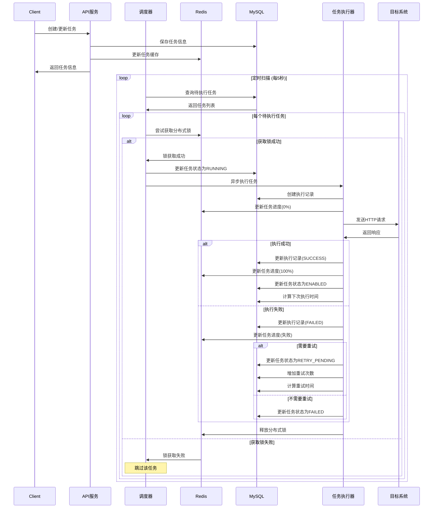

### 2.2 任务手动触发流程

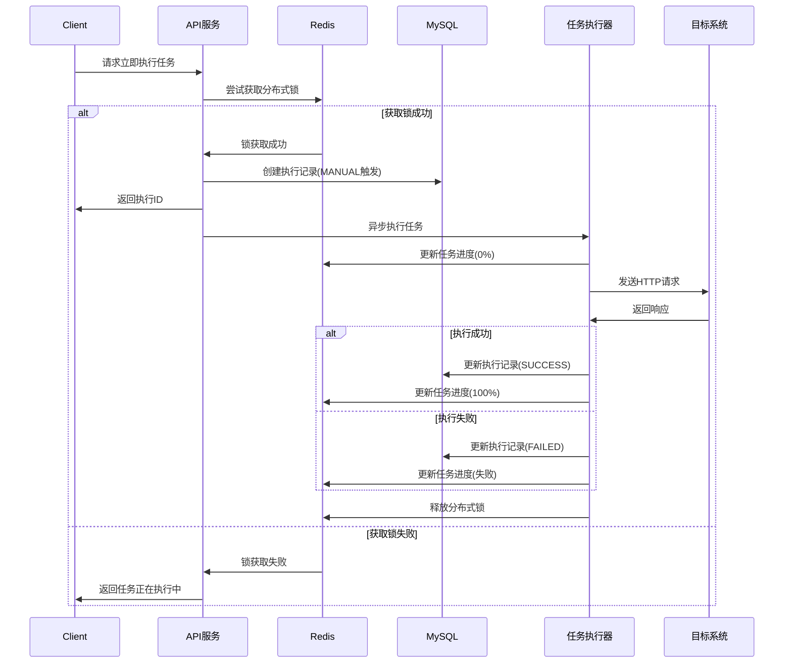

### 2.3 任务状态查询流程

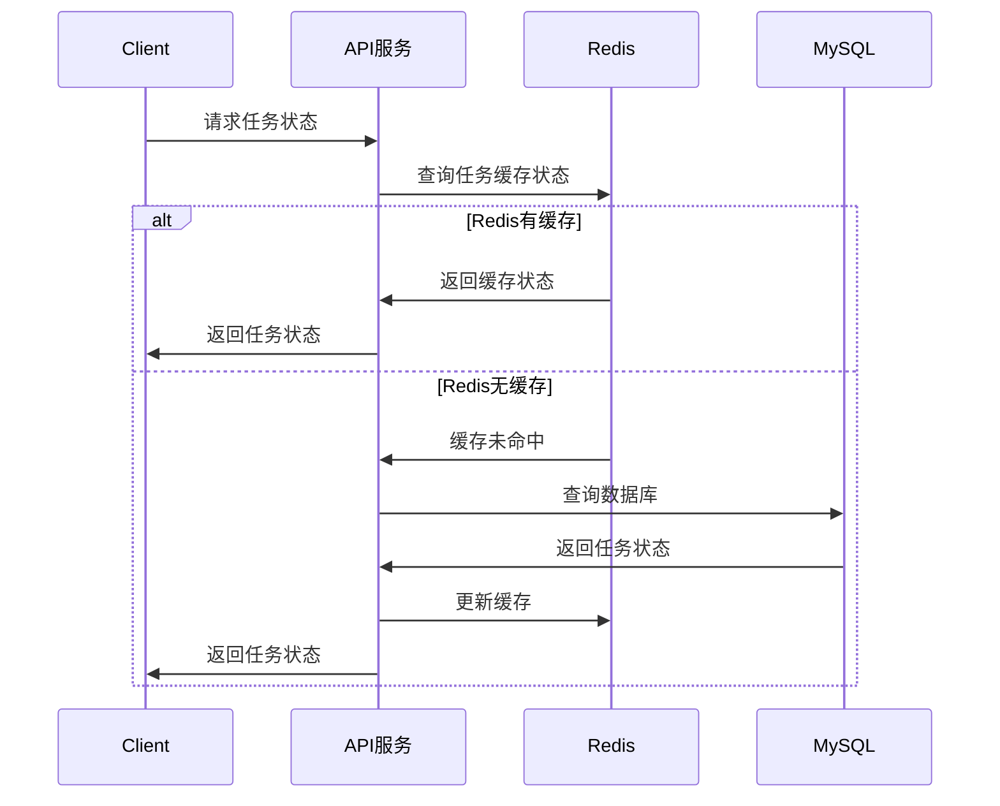

### 2.4 节点注册与心跳流程

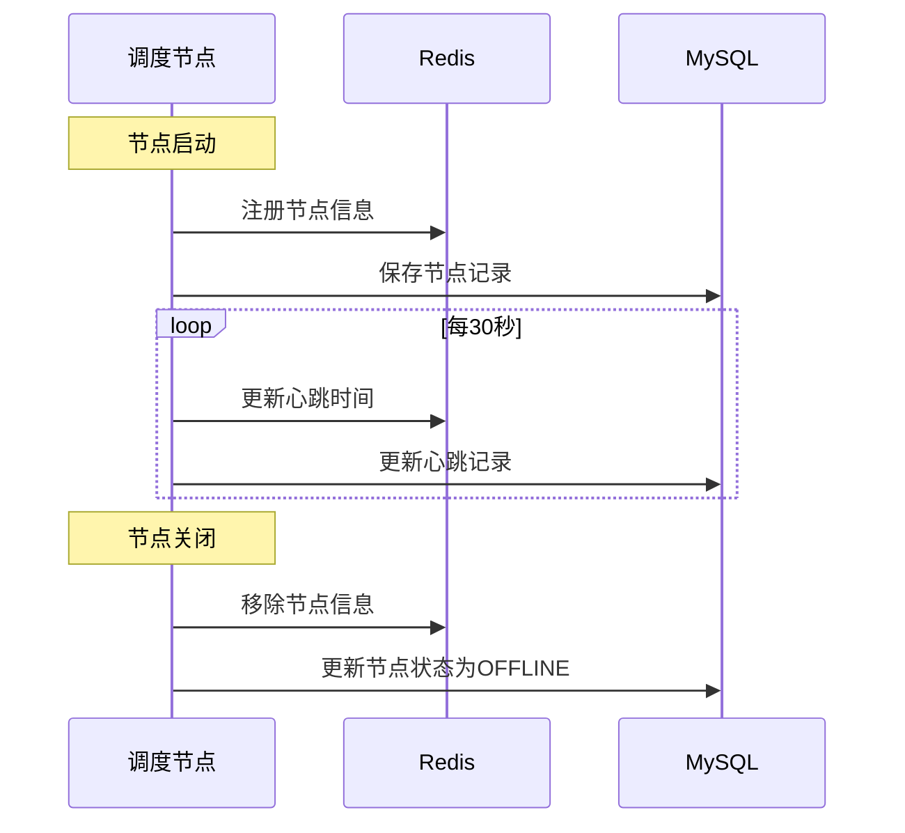

### 2.5 任务失败重试流程

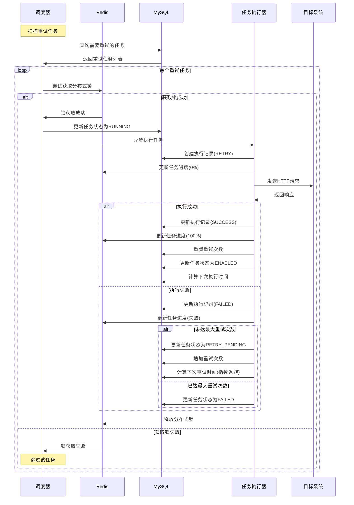

## 3. 状态转换图

### 3.1 任务状态转换

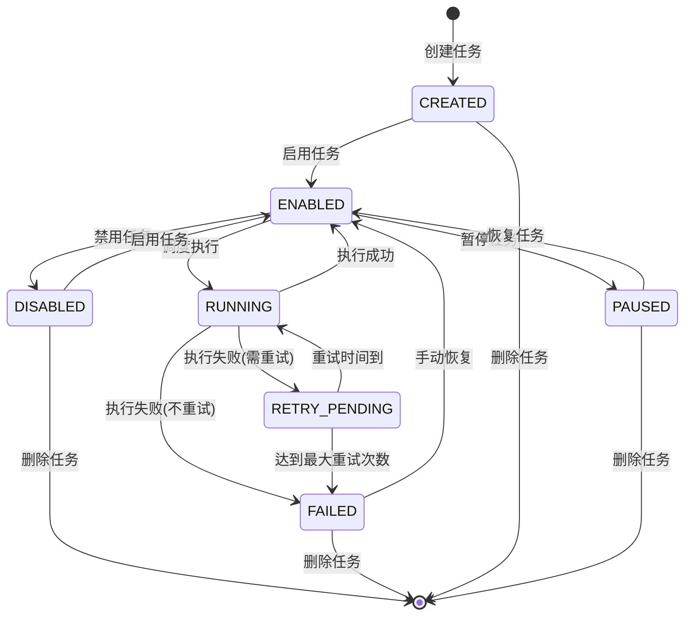

### 3.2 执行状态转换

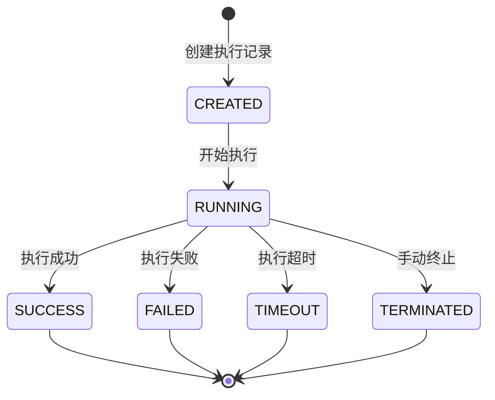

## 4. 数据流图

### 4.1 任务创建与执行数据流

```
+-------------+     +--------------+     +----------------+
| 任务创建请求 | --> | 任务元数据处理 | --> | 任务持久化存储  |
+-------------+     +--------------+     +----------------+
                                             |
                                             v
+----------------+     +----------------+     +----------------+
| 任务执行结果处理 | <-- | 任务执行过程   | <-- | 任务调度触发   |
+----------------+     +----------------+     +----------------+
       |
       v
+----------------+     +----------------+
| 执行记录持久化  | --> | 任务状态更新   |
+----------------+     +----------------+
                            |
                            v
                     +----------------+
                     | 下次执行时间计算 |
                     +----------------+
```

### 4.2 日志处理数据流

```
+----------------+     +----------------+     +----------------+
| 任务执行事件   | --> | 日志消息生成   | --> | 日志分类处理   |
+----------------+     +----------------+     +----------------+
                                                    |
                                                    v
+----------------+     +----------------+     +----------------+
| 日志查询接口   | <-- | 日志检索索引   | <-- | 日志分表存储   |
+----------------+     +----------------+     +----------------+
```

## 5. 高可用设计

### 5.1 节点故障处理流程

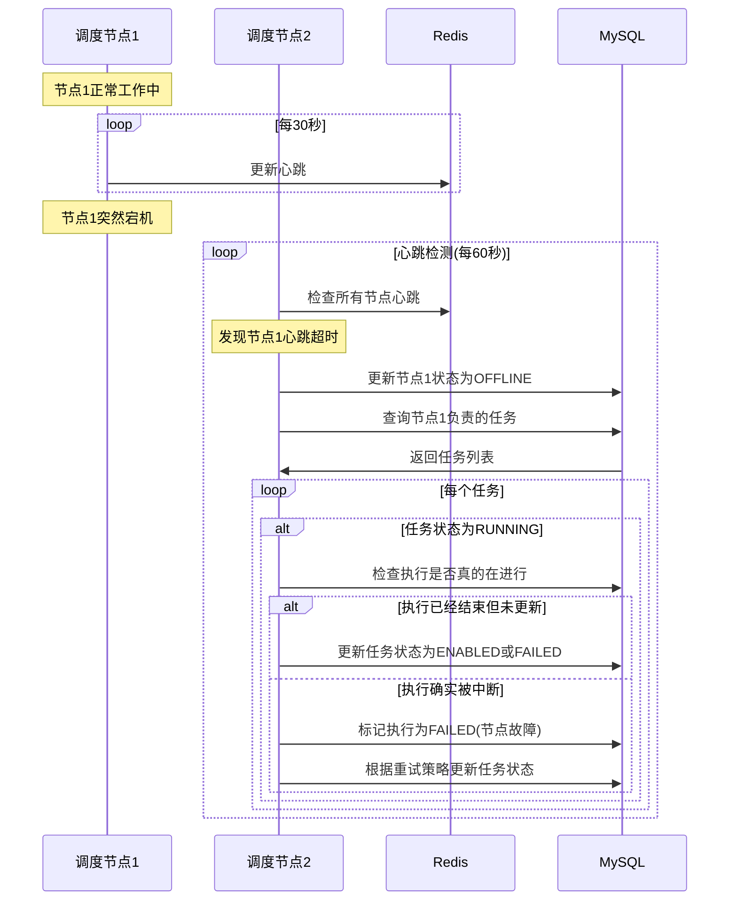

### 5.2 数据一致性保障流程

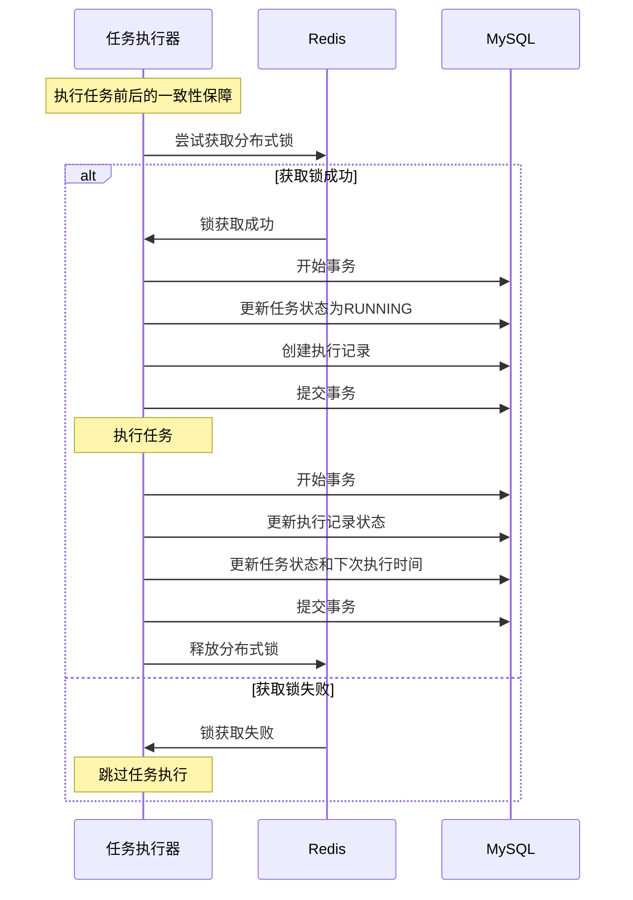

## 6. 扩展与集成流程

### 6.1 多数据源集成流程

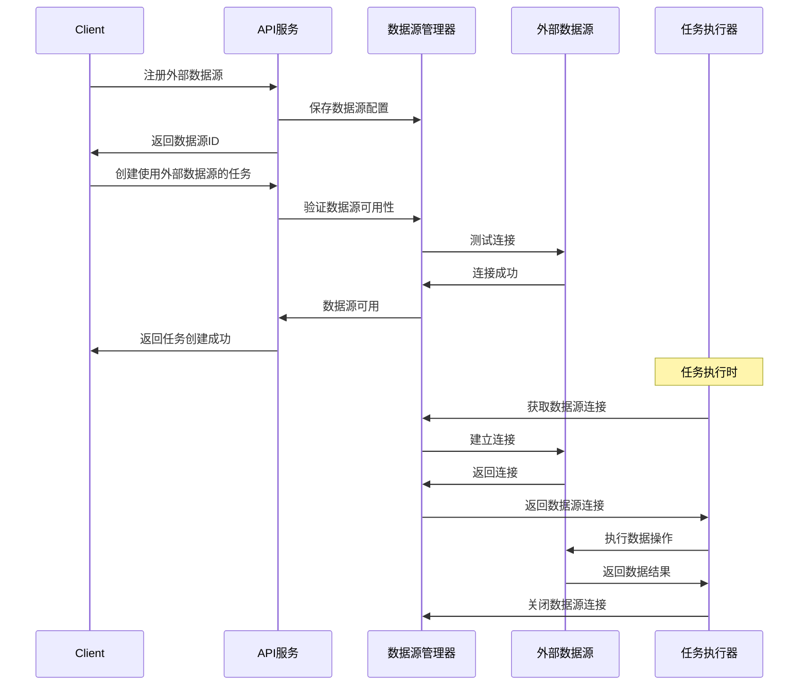

### 6.2 Redis集群状态同步流程

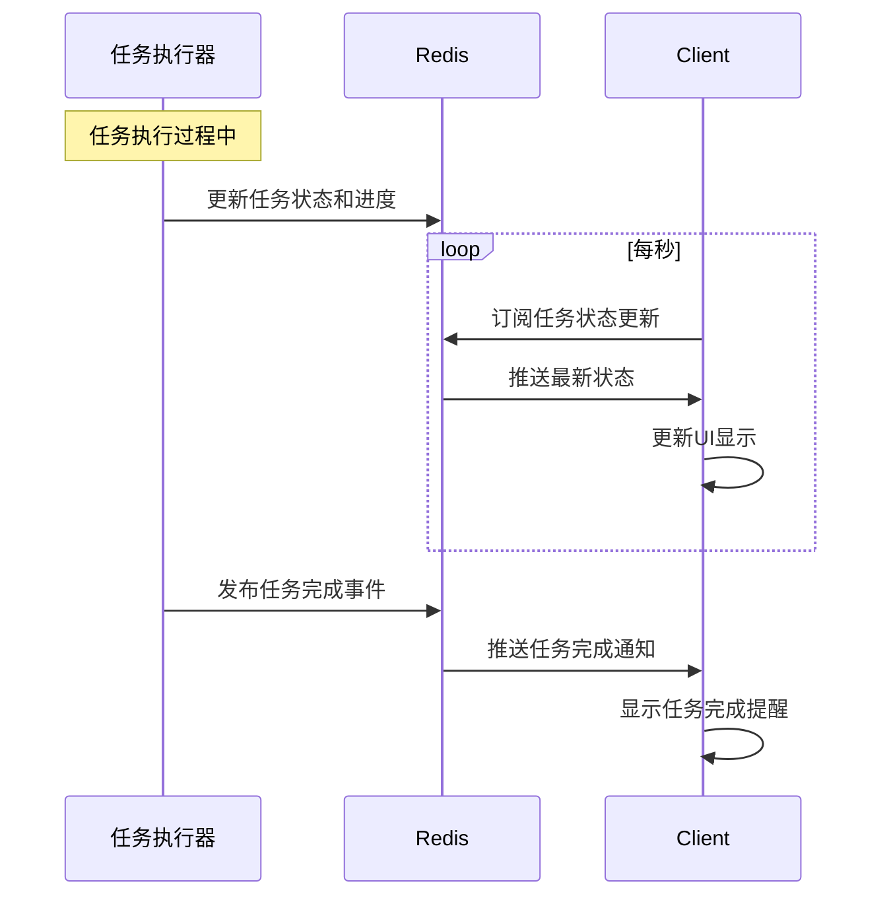
