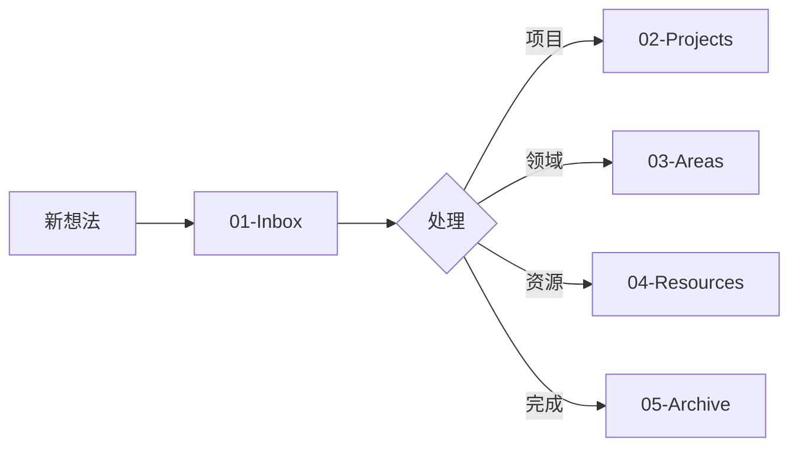

# 🚀 Obsidian 知识管理系统使用指南

欢迎使用这个精心设计的 Obsidian 知识管理系统！本指南将帮助你快速上手。

## 📋 快速开始

### 第一步：安装必要插件
打开 Obsidian 设置 → 社区插件，搜索并安装以下插件：

**必装插件**：
1. **Calendar** - 日历视图
2. **Periodic Notes** - 周期性笔记
3. **Templater** - 高级模板
4. **Dataview** - 数据查询
5. **Tasks** - 任务管理

**推荐插件**：
- Tag Wrangler - 标签管理
- Recent Files - 最近文件
- Excalidraw - 手绘图表
- Commander - 自定义命令

### 第二步：配置模板
1. 打开 Templater 设置
2. 设置模板文件夹为 `06-Templates`
3. 启用「启动时触发 Templater」

### 第三步：开始使用
1. 按 `Ctrl/Cmd + N` 创建新笔记
2. 使用 `Alt/Opt + N` 插入模板
3. 开始记录你的想法！

## 🗂️ 文件组织原则

### 工作流程


### 命名规范
- **日记**：自动生成（YYYY-MM-DD）
- **项目**：`项目名称-开始日期`
- **会议**：`YYYY-MM-DD-会议主题`
- **书籍**：`《书名》-作者`

## 🏷️ 标签使用规范

### 标签层级结构
```
#project/
  ├── #project/work/
  ├── #project/personal/
  └── #project/learning/

#area/
  ├── #area/health/
  ├── #area/finance/
  └── #area/relationship/

#status/
  ├── #status/active
  ├── #status/pending
  └── #status/completed

#priority/
  ├── #priority/high
  ├── #priority/medium
  └── #priority/low
```

## 🔗 链接最佳实践

### 创建有意义的链接
不要只是：`参见 [[其他笔记]]`

而应该：`这个观点与 [[其他笔记]] 中提到的XX理论相呼应，特别是在YY方面`

### 使用双向链接
- 创建新笔记时，思考它与哪些已有笔记相关
- 定期查看反向链接面板
- 使用未链接提及功能发现潜在关联

## 📅 日常使用流程

### 每日流程
1. **早晨（5分钟）**
   - 创建今日笔记
   - 回顾昨日未完成任务
   - 规划今日重点

2. **工作中**
   - 新想法 → 01-Inbox
   - 会议 → 使用会议模板
   - 任务 → 添加到项目或日记

3. **晚间（10分钟）**
   - 清空 Inbox
   - 完成日记反思部分
   - 准备明日

### 每周流程
- **周日晚**：创建周回顾，规划下周
- **周中**：检查项目进度
- **周五**：整理本周笔记，归档完成项目

### 每月流程
- **月末**：创建月度回顾
- **月初**：设定月度目标
- 清理和归档旧文件

## 💡 高级技巧

### Dataview 查询示例

**查看所有未完成任务**：
```dataview
TASK
WHERE !completed
SORT priority DESC, due ASC
```

**本周创建的笔记**：
```dataview
LIST
WHERE created >= date(today) - dur(7 days)
SORT created DESC
```

**按标签分组的项目**：
```dataview
TABLE status, priority
FROM #project
GROUP BY status
```

### Templater 进阶用法
- 使用 `<% tp.date.now() %>` 插入当前时间
- 使用 `<% tp.file.cursor() %>` 设置光标位置
- 创建自定义 JavaScript 函数

## 🛠️ 维护建议

### 定期维护
- **每周**：归档完成的项目
- **每月**：整理标签系统
- **每季度**：回顾和优化工作流程

### 备份策略
1. 使用 Git 进行版本控制
2. 定期导出重要笔记
3. 使用云同步服务

## 📚 学习资源

### 官方资源
- [Obsidian 官方文档](https://help.obsidian.md/)
- [Obsidian 论坛](https://forum.obsidian.md/)

### 社区资源
- [Obsidian Hub](https://publish.obsidian.md/hub)
- YouTube: Nick Milo, Bryan Jenks
- Reddit: r/ObsidianMD

## 🎯 下一步

1. **本周目标**：掌握基本操作，建立日记习惯
2. **本月目标**：熟悉所有模板，形成工作流程
3. **长期目标**：构建个人知识网络

---

记住：最好的系统是你实际会使用的系统。从简单开始，逐步完善！

如有问题，可以查看各文件夹中的 README 文件，或参考模板中的示例。

祝你在知识管理之旅中收获满满！🌟
